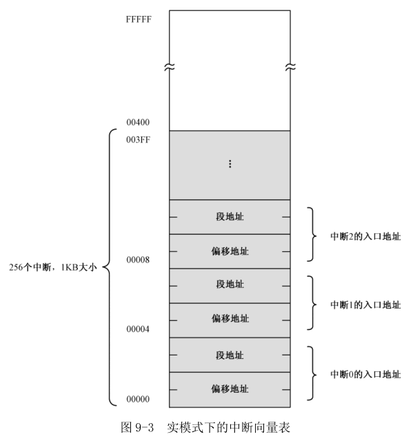
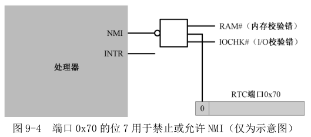

中断就是打断处理器当前的执行流程, 去执行另外一些和当前工作不相干的指令, 执行完之后, 还可以返回到原来的程序流程继续执行.

外部硬件中断, 就是从**处理器外面来的中断信号**. 当外部设备发生错误, 或者有数据要传送(比如, 从**网络**中接收到一个针对当前主机的**数据包**), 或者处理器交给它的事情处理完了(比如, **打印已经完成**), 它们都会拍一下处理器的肩膀, 告诉它应当先把手头上的事情放一放, 来临时处理一下.

外部硬件中断是通过两个信号线引入处理器内部的. 从 8086 处理器的时代起, 这两根线的名字就叫 NMI 和 INTR.


## 1. 非屏蔽中断

首先, 所有的严重事件都**必须无条件地加以处理**, 这种类型的中断是不会被阻断和屏蔽的, 称为非屏蔽中断(Non Maskable Interrupt, NMI).

中断信号的来源, 或者说, 产生中断的设备, 称为中断源. 如图 9-1 所示, 在传统的兼容模式下, NMI 的中断源通过一个与非门连接到处理器. **处理器的 NMI 引脚(该引脚不和中断控制器连接！！！)**是高电平有效的, 而中断信号是低电平有效的. 当不存在中断的时候, 与非门的所有输入都为高, 因此处理器的 NMI 引脚为低电平, 这意味着没有中断发生.

当有任何一个非屏蔽的中断产生时, 与非门的输出为高. Intel 处理器规定, **NMI 中断信号由 0 跳变到 1 后, 至少要维持 4 个以上的时钟周期才算是有效的**, 才能被识别.

这是一个简化的示意图, 不是真正的设备连接图.

当一个中断发生时, **处理器将会通过中断引脚 NMI 和 INTR 得到通知(这两个引脚只是告诉 CPU 有中断)**. 除此之外, 它还应当知道发生了什么事, 以便采取适当的处理措施. **每种类型的中断都被统一编号**, 这称为中断类型号、中断向量或者中断号. 但是, 由于不可屏蔽中断的特殊性——几乎所有触发 NMI 的事件对处理器来说都是致命的, 甚至是不可纠正的. 在这种情况下, 努力去搞清楚发生了什么, 通常没有太大的意义.

所以, **在实模式下**, **NMI 被赋予了统一的中断号 2**, 不再进行细分. 一旦发生 2 号中断, 处理器和软件系统通常会放弃继续正常工作的"念头", 也不会试图纠正已经发生的问题和错误, 很可能只是由软件系统给出一个提示信息.

## 2. 可屏蔽中断

更多的时候, 发往处理器的中断信号通常不会意味着灾难. 有时候会比较着急处理.

这类中断有两个特点, 第一是数量很多, 毕竟有很多外部设备; 第二是它们可以被屏蔽, 这样处理器可以不处理. 所以, 这类硬件中断称为可屏蔽中断.

可屏蔽中断是通过**INTR 引脚(CPU 上的引脚, 中断控制器的 INT 与该引脚相连！！！)**进入处理器内部的, 像 NMI 一样, 不可能为每一个中断源都提供一个引脚. 而且, **处理器每次只能处理一个中断**. 在这种情况下, 需要一个代理, 来接受外部设备发出的中断信号. 还有, 多个设备同时发出中断请求的机率也是很高的, 所以该代理的任务还包括对它们进行**仲裁**, 以决定让它们中的哪一个优先向处理器提出服务请求.

如图 9-2 所示, 在个人计算机中, 用得最多的中断代理就是**8259 芯片**, 它就是通常所说的**中断控制器**, 从 8086 处理器开始, 它就一直提供着这种服务. 即使是现在, 在绝大多数单处理器的计算机中, 也依然有它的存在.

Intel**处理器允许 256 个中断**, 中断号的范围是 0~255, **8259 负责提供其中的 15 个**, 但**中断号并不固定**. 之所以不固定, 是因为当初设计的时候, 允许软件根据自己的需要灵活设置中断号, 以防止发生冲突. **该中断控制器芯片有自己的端口号**, 可以像访问其他外部设备一样用**in 和 out 指令**来改变它的状态, 包括**各引脚的中断号**. 正是因为这样, 它又叫可编程中断控制器(Programmable Interrupt Controller, PIC).


反正每片 8259 只有 8 个中断输入引脚, 而在个人计算机上使用它, 需要两块. 如图 9-2 所示, 第一块 8259 芯片的代理输出 INT 直接送到处理器的 INTR 引脚, 这是主片(Master); 第二块 8259 芯片的 INT 输出送到第一块的引脚 2 上, 是从片(Slave), 两块芯片之间形成级联(Cascade)关系.

两块 8259 芯片可以向处理器提供 15 个中断信号. 当时, 接在 8259 上的 15 个设备都是相当重要的, 如 PS/2 键盘和鼠标、串行口、并行口、软磁盘驱动器、IDE 硬盘等. 现在, 这些设备很多都已淘汰或者正在淘汰中, 根据需要, 这些中断引脚可以被其他设备使用.

如图 9-2 所示, 8259 的**主片引脚 0**(IR0)接的是**系统定时器/计数器芯片**; **从片的引脚 0**(IR0)接的是**实时时钟芯片 RTC(提供闹钟和周期性的中断功能)**. 这两块芯片的固定连接到现在也没变.

在 8259 芯片内部, 有**中断屏蔽寄存器**(Interrupt Mask Register, IMR), 这是个**8 位寄存器**, 对应着该芯片的**8 个中断输入引脚**, 对应的位是 0 还是 1, 决定了从该引脚来的中断信号是否能够通过 8259 送往处理器(0 表示允许, 1 表示阻断). 当外部设备通过某个引脚送来一个中断请求信号时, 如果它没有被 IMR 阻断, 那么, 它可以被送往处理器. 注意, 8259 芯片是可编程的, **主片的端口号是 0x20 和 0x21**, 从片的端口号是 0xa0 和 0xa1(下面是命令), 可以通过这些端口访问 8259 芯片, 设置它的工作方式, 包括 IMR 的内容.

```
[root@CentOS7 ~]# cat /proc/ioports | grep pic
  0020-0021 : pic1
  00a0-00a1 : pic2
```

中断能否被处理, 除了 8259 芯片外, 最终的决定权在处理器手中. 图 6-2, 你会发现, 在处理器内部, 标志寄存器有一个**标志位 IF**, 这就是中断标志(Interrupt Flag). 当 IF 为 0 时, 所有从处理器**INTR 引脚**(可屏蔽中断, 不是 NMI)来的中断信号都被忽略掉; 当其为 1 时, 处理器可以接受和响应中断.

IF 标志位可以通过两条指令 cli 和 sti 来改变. 这两条指令都没有操作数, cli (CLear Interrupt flag)用于清除 IF 标志位, sti(SeT Interrupt flag)用于置位 IF 标志.

计算机中, 中断发生得非常频繁, 当一个中断正在处理时, 其他中断也会陆续到来, 甚至会有多个中断同时发生的情况, 这都无法预料. 8259 芯片会记住它们, 并按一定的策略决定先为谁服务. 总体上来说, 中断的优先级和引脚是相关的, **主片的 IR0 引脚优先级最高**, IR7 引脚最低, 从片也是如此. 当然, 还要考虑到从片是级联在主片的 IR2 引脚上.

最后, 当一个中断事件正在处理时, 如果来了一个优先级更高的中断事件时, 允许暂时中止当前的中断处理, 先为优先级较高的中断事件服务, 这称为中断嵌套.

## 2. 实模式下的中断向量表

中断处理, 归根结底就是处理器要执行一段与该中断有关的程序(指令). 处理器可以识别 256 个中断(8259 只提供其中的 15 个), 那么理论上就需要 256 段程序.

**在实模式下**, 处理器要求将它们的入口点集中存放到内存中**从物理地址 0x00000 开始**, 到 0x003ff 结束, **共 1KB(256*4=2\^8*2\^2)的空间**内, 这就是所谓的**中断向量表(Interrupt Vector Table, IVT)**.

如图 9-3 所示, **每个中断在中断向量表中占 2 个字(1KB/2 字=256)**, 分别是中断处理程序的**偏移地址和段地址**. 中断 0 的入口点位于物理地址 0x00000 处, 也就是逻辑地址 0x0000:0x0000; 中断 1 的入口点位于物理地址 0x00004 处, 即逻辑地址 0x0000:0x0004; 其他中断依次类推, 总之是按顺序的.

当中断发生时, 如果从外部硬件到处理器之间的道路都是畅通的, 那么, 处理器在执行完当前的指令后, 会立即着手为硬件服务. 它**首先**会响应中断(**中断控制器通过 INTR 引脚告诉 CPU 有中断, 仅仅通知**), 告诉 8259 芯片准备着手处理该中断. **接着**, 它还会**要求 8259 芯片把中断号送过来(CPU 和中断控制器之间有总线<注意看图>, 实际上是南桥芯片??)**.

在 8259 芯片那里, **每个引脚都赋予了一个中断号**. 而且, 这些**中断号是可以改变的(引脚号和中断号没有必然联系)**, 可以对 8259 编程来灵活设置, 但不能单独进行, 只能**以芯片为单位进行**. 比如, 可以指定主片的中断号从 0x08 开始, 那么它每个引脚 IR0~IR7 所对应的中断号分别是 0x08~0x0e.

中断信号来自哪个引脚, 8259 芯片是最清楚的, 所以**它会把对应的中断号告诉处理器, 处理器拿着这个中断号(下面是处理器行为)**, 要顺序做以下几件事.

① 保护断点的现场. 首先要**将标志寄存器 FLAGS 压栈(没有那些通用寄存器和 es, 所以需要手动处理！)**, 然后清除它的 IF 位和 TF 位. TF 是陷阱标志, 这个以后再讲. 接着, 再将当前的代码段寄存器 CS 和指令指针寄存器 IP 压栈.

② 执行中断处理程序. 由于处理器已经拿到了中断号, **它将该号码乘以 4**(毕竟每个中断在中断向量表中占 4 字节), 就得到了该中断入口点在中断向量表中的**偏移地址**. 接着, 从表中依次取出中断程序的偏移地址和段地址, 并分别传送到 IP 和 CS, 自然地, 处理器就开始执行中断处理程序了.



注意, 由于 IF 标志被清除, 在中断处理过程中, 处理器将不再响应硬件中断. 如果希望更高优先级的中断嵌套, 可以在编写中断处理程序时, 适时用 sti 指令开放中断.

③ 返回到断点接着执行. 所有中断处理程序的最后一条指令必须是中断返回指令 iret. 这将导致处理器依次从堆栈中弹出(恢复)IP、CS 和 FLAGS 的原始内容, 于是转到主程序接着执行.

**iret 同样没有操作数, 执行这条指令时, 处理器依次从堆栈中弹出数值到 IP、CS 和标志寄存器. **

由于中断处理过程返回时, 已经恢复了 FLAGS 的原始内容, 所以 IF 标志位也自动恢复. 也就是说, 可以接受新的中断.

和可屏蔽中断不同, NMI 发生时, 处理器**不会从外部获得中断号**, 它自动生成**中断号码 2**, 其他处理过程和可屏蔽中断相同.

中断随时可能发生, 中断向量表的建立和初始化工作是由 BIOS 在计算机启动时负责完成的. BIOS 为每个中断号填写入口地址, 因为它不知道多数中断处理程序的位置, 所以, 一律将它们指向一个相同的入口地址, 在那里, 只有一条指令: iret. 也就是说, 当这些中断发生时, 只做一件事, 那就是立即返回. 当计算机启动后, 操作系统和用户程序再根据自己的需要, 来修改某些中断的入口地址, 使它指向自己的代码.

## 4. 实时时钟、CMOS RAM 和 BCD 编码

为什么计算机能够准确地显示日期和时间?原因很简单, 如图 9-2 所示, 在外围设备控制器芯片 ICH 内部, 集成了**实时时钟电路**(Real Time Clock, RTC)和两小块由互补金属氧化物(CMOS)材料组成的**静态存储器**(CMOS RAM). **实时时钟电路负责计时**, 而日期和时间的数值则存储在这块存储器中.

实时时钟是全天候跳动的, 即使是在你关闭了计算机的电源之后, 原因在于它由主板上的一个小电池提供能量. 它为整台计算机提供一个基准时间, 为所有需要时间的软件和硬件服务.

除了日期和时间的保存功能外, **RTC 芯片也可以提供闹钟和周期性的中断功能**.

日期和时间信息是保存在 CMOS RAM 中的, 通常有 128 字节, 而日期和时间信息只占了一小部分容量, 其他空间则用于保存整机的配置信息, 比如各种硬件的类型和工作参数、开机密码和辅助存储设备的启动顺序等. **这些参数的修改通常在 BIOS SETUP 开机程序中进行**. 要进入该程序, 一般需要在开机时按 DEL、ESC、F1、F2 或者 F10 键. 具体按哪个键, 视计算机的厂家和品牌而定.

RTC 芯片由一个振荡频率为 32.768kHz 的石英晶体振荡器(晶振)驱动, 经分频后, 用于对 CMOS RAM 进行**每秒一次**的时间刷新.

如表 9-1 所示, 常规的日期和时间信息占据了 CMOS RAM 开始部分的 10 字节, 有年、月、日和时、分、秒, 报警的时、分、秒用于产生到时间报警中断, 如果它们的内容为 0xC0~0xFF, 则表示不使用报警功能.


CMOS RAM 的访问, 需要通过两个端口来进行. **0x70 或者 0x74 是索引端口**, 用来指定 CMOS
RAM 内的单元; **0x71 或者 0x75 是数据端口**, 用来读写相应单元里的内容. 举个例子, 以下代码用于读取今天是星期几:

```
mov al,0x06
out 0x70,al
in al,0x71
```

```
[root@CentOS7 ~]# cat /proc/ioports | grep rtc
  0070-0071 : rtc0
```

从很早的时候开始, 端口 0x70 的最高位(bit 7)是**控制 NMI 中断的开关(！！！NMI, 不可屏蔽中断有关闭的位置)**. 当它为 0 时, 允许 NMI 中断到达处理器, 为 1 时, 则阻断所有的 NMI 信号, 其他 7 个比特, **即 0~6 位, 则实际上用于指定 CMOS RAM 单元的索引号**, 这种规定直到现在也没有改变.

如图 9-4 所示, 尽管端口 0x70 的位 7 不是中断信号, 但它能控制与非门的输出, 决定真正的 NMI 中断信号是否能到达处理器.



通常来说, 在往端口 0x70 写入索引时, 应当先读取 0x70 原先的内容, 然后将它用于随后的写索引操作中. 但是, 该端口是只写的, 不能用于读出. 早期为了最大使用资源做出的规定.

为了解决这个问题, 也为了兼容, ICH 芯片允许通过切换访问模式来临时取得那些只写寄存器的内容, 但这涉及更高层次的知识, 已经超出了当前的话题范畴. 现在, 我们只想把问题搞得简单些, 这么说吧, **NMI 中断应当始终是允许的, 在访问 RTC 时, 我们直接关闭 NMI, 访问结束后, 再打开 NMI**, 而不管它以前到底是什么样子.

在早期, CMOS RAM 只有 64 字节, 而最新的 ICH 芯片内则可能集成了 256 字节, 新增的 128 字节称为扩展的 CMOS RAM. 当然, 在此之前, 要先确保 ICH 内确实存在扩展的 CMOS RAM.

CMOS RAM 中保存的日期和时间, 通常是以二进制编码的十进制数(Binary Coded Decimal, BCD), 这是默认状态, 如果需要, 也可以设置成按正常的二进制数来表示.

比如十进制数 25, 其二进制形式是 00011001. 但是, 如果采用 BCD 编码的话, 则一个字节的高 4 位和低 4 位分别独立地表示一个 0 到 9 之间的数字. 因此, 十进制数 25 对应的 BCD 编码是 00100101.

单元 0x0A~0x0D 不是普通的存储单元, 而被定义成 4 个寄存器的索引号, 也是通过 0x70 和 0x71 这两个端口访问的. 这 4 个寄存器用于设置实时时钟电路的参数和工作状态.

寄存器 A 和 B 用于对 RTC 的功能进行整体性的设置, 它们都是 8 位的寄存器, 可读可写, 其各位的用途如表 9-2 和表 9-3 所示.


寄存器 C 和 D 是标志寄存器, 这些标志反映了 RTC 的工作状态, 寄存器 C 是只读的, 寄存器 D 则可读可写, 它们也都是 8 位寄存器, 其各位的含义如表 9-4 和表 9-5 所示. 特别是寄存器 C, 因为 RTC 可以产生中断, 当中断产生时, 可以通过该寄存器来识别中断的原因, 比如, 是**周期性的中断, 还是闹钟中断**.

现在, 我们想让 RTC 芯片定期发出一个中断, 当这个中断发生的时候, 还能执行我们自己编写的代码, 来访问 CMOS RAM, 在屏幕上显示一个动态走动的时钟.

## 5. 代码清单

源程序文件: c09_1.asm

## 6. 初始化 8259、RTC 和中断向量表

本章代码清单, 没有加载器程序. 因为可以利用上一章的加载器, 只要符合规则.

用户程序的入口点在第 119 行, 到第 124 行, 用于初始化各个段寄存器的内容. 下面开始在中断向量表中安装实时时钟中断的入口点.

既然本章的主题是中断, 那么就很有必要强调一件事. 当处理器执行任何一条改变堆栈段寄存器 SS 的指令时, 它会在下一条指令执行完期间禁止中断.

堆栈无疑是很重要的, 不能被破坏. 要想改变代码段和数据段, 只需要改变段寄存器就可以了. 但堆栈段不同, 因为它除了有段寄存器, 还有堆栈指针. 因此, 绝大多数时候, 对堆栈的改变是分两步进行的: 先改变段寄存器 SS 的内容, 接着又修改堆栈指针寄存器 SP 的内容.

如果刚刚修改了段寄存器 SS, 在还没来得及修改 SP 的情况下, 就发生了中断, 会出现什么后果, 而且要知道, 中断是需要依靠堆栈来工作的.

因此, 处理器在设计的时候就规定, **当遇到修改段寄存器 SS 的指令时, 在这条指令和下一条指令执行完毕期间, 禁止中断, 以此来保护堆栈(处理器行为, 不需要代码保证)**. 换句话说, 在修改段寄存器 SS 的指令之后, 紧跟着一条修改堆栈指针 SP 的指令.

第 121、122 行执行期间, 处理器禁止中断.

RTC 芯片的中断信号, 通向中断控制器 8259 从片的第 1 个中断引脚 IR0. 在计算机启动期间, BIOS 会初始化中断控制器, 将主片的中断号设为从 0x08 开始, 将从片的中断号设为从 0x70 开始. 所以, 计算机启动后, RTC 芯片的中断号默认是 0x70. 尽管我们可以通过对 8259 编程来改变它, 但是没有必要.

要设置 RTC 的工作状态, 使它能够产生中断信号给 8259 中断控制器.

RTC 到 8259 的中断线只有一根, 而**RTC 可以产生多种中断**. 比如闹钟中断、更新结束中断和周期性中断(参见表 9-3 和表 9-4). RTC 的计时(更新周期)是独立的, 产生中断信号只是它的一个赠品. 所以, 如果希望它能产生中断信号, 需要额外设置.

以上所说的三种中断, 我们只要设置一种就可以了. 其实, 最简单的就是设置更新周期结束中断. 每当 RTC 更新了 CMOS RAM 中的日期和时间后, 将发出此中断. **更新周期每秒进行一次**, 因此该中断也每秒发生一次.

每次当中断实际发生时, 可以在程序(中断处理过程)中读寄存器 C 的内容来检查中断的原因.

RTC 芯片设置完毕后, 再来打通它到 8259 的最后一道屏障. 正常情况下, **8259 是不会允许 RTC 中断的**, 所以, 需要修改它内部的中断屏蔽寄存器 IMR. IMR 是一个 8 位寄存器, 位 0 对应着中断输入引脚 IR0, 位 7 对应着引脚 IR7, 相应的位是 0 时, 允许中断, 为 1 时, 关掉中断.

8259 芯片是芯片中访问起来很麻烦的一个.

## 7. 使处理器进入低功耗状态

## 8. 实时时钟中断的处理过程

从 27 行开始.

28~32 行, 保护现场(**见上面, 处理器只会处理 FLAGS 寄存器, 通用寄存器和 es 需要手动处理**！！), 有一点很重要, 中断处理过程必须无痕执行, 不知道中断什么时候发生, 也不知道中断发生时, 哪个程序正在执行, 所以, 必须保证中断返回时, 还能还原中断前的状态.

在 8259 芯片内部, 有一个中断服务寄存器(Interrupt Service Register, ISR), 这是一个 8 位寄存器, **每一位都对应着一个中断输入引脚**. 当中断处理过程开始时, 8259 芯片会将相应的位置 1, 表明正在服务从该引脚来的中断.

一旦响应了中断, 8259 中断控制器无法知道该中断什么时候才能处理结束. 同时, 如果不清除相应的位, 下次从同一个引脚出现的中断将得不到处理. 在这种情况下, 需要程序在中断处理过程的结尾, 显式地对 8259 芯片编程来清除该标志, 方法是向 8259 芯片发送中断结束命令(End Of Interrupt, EOI).

中断结束命令的代码是 0x20. 代码清单 9-1 第 92~94 行就用来做这件事. 需要注意的是, 如果外部中断是 8259 主片处理的, 那么, EOI 命令仅发送给主片即可, 端口号是 0x20; 如果外部中断是由从片处理的, 就像本章的例子, 那么, EOI 命令既要发往从片(端口号 0xa0), 也要发往主片.

最后, 第 96~102 行, 从堆栈中恢复被中断程序的现场, 并用中断返回指令 iret 回到中断之前的地方继续执行. **iret 的意思是 Interrupt Return**.