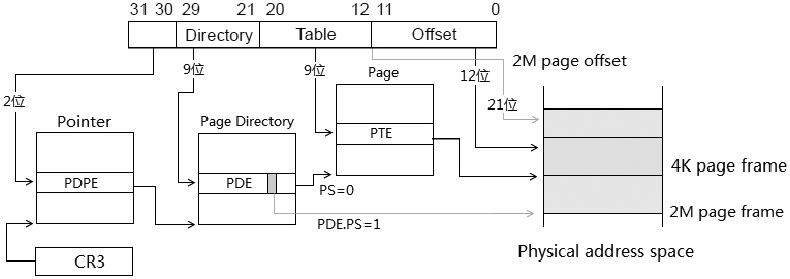
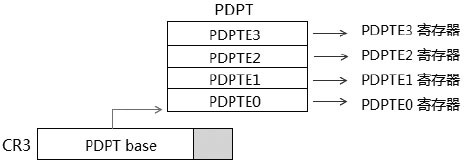
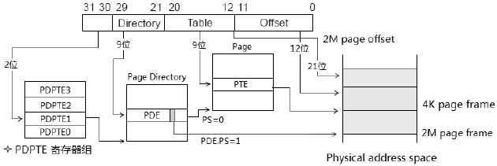
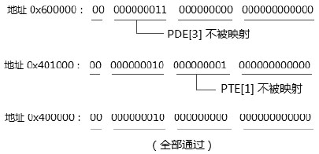

<!-- @import "[TOC]" {cmd="toc" depthFrom=1 depthTo=6 orderedList=false} -->

<!-- code_chunk_output -->

- [1. 基本原理](#1-基本原理)
  - [1.1. 开启 PAE 标志](#11-开启-pae-标志)
  - [1.2. 支持最高 52 位的物理地址](#12-支持最高-52-位的物理地址)
  - [1.3. Table Entry(表项)的大小](#13-table-entry表项的大小)
  - [1.4. 页表的大小](#14-页表的大小)
- [2. 在 Intel64 下的 CR3 与 PDPTE 寄存器](#2-在-intel64-下的-cr3-与-pdpte-寄存器)
  - [2.1. CR3](#21-cr3)
  - [2.2. PDPTE 寄存器](#22-pdpte-寄存器)
    - [2.2.1. PDPTE 寄存器的加载](#221-pdpte-寄存器的加载)
    - [2.2.2. PDPTE 寄存器的重新加载](#222-pdpte-寄存器的重新加载)
    - [2.2.3. Intel64 下的新 PAE paging 模式](#223-intel64-下的新-pae-paging-模式)
- [3. 3 在 AMD64 下的 CR3](#3-3-在-amd64-下的-cr3)
- [4. 4 PAE paging 模式里的 PDPTE 结构](#4-4-pae-paging-模式里的-pdpte-结构)
- [5. 5 PAE paging 模式里的 PDE 结构](#5-5-pae-paging-模式里的-pde-结构)
  - [5.1. 5.1 2M 页面下的 PDE 结构](#51-51-2m-页面下的-pde-结构)
    - [5.1.1. 5.1.1 XD(Execution Disable)标志位](#511-511-xdexecution-disable标志位)
    - [5.1.2. 5.1.2 Code 页与 Data 页](#512-512-code-页与-data-页)
  - [5.2. 5.2 4K 页面下的 PDE 结构](#52-52-4k-页面下的-pde-结构)
- [6. 6 PAE paging 模式里的 PTE 结构](#6-6-pae-paging-模式里的-pte-结构)
- [7. 7 使用和测试 PAE paging 模式](#7-7-使用和测试-pae-paging-模式)
  - [7.1. 7.1 设置 PAE paging 的页表结构](#71-71-设置-pae-paging-的页表结构)
  - [7.2. 7.2 一个非常难查找的 bug](#72-72-一个非常难查找的-bug)
  - [7.3. 7.3 开启 PAE paging 模式](#73-73-开启-pae-paging-模式)
  - [7.4. 7.4 开启 paging 机制](#74-74-开启-paging-机制)
- [8. 8 使用和测试 Execution Disable 功能](#8-8-使用和测试-execution-disable-功能)
  - [8.1. 8.1 测试一: 尝试在 XD 页里执行代码](#81-81-测试一-尝试在-xd-页里执行代码)
  - [8.2. 8.2 测试二: 在 PTE.XD=0 的页里执行代码](#82-82-测试二-在-ptexd0-的页里执行代码)
  - [8.3. 8.3 测试三: 在\#PF handler 里修复错误](#83-83-测试三-在pf-handler-里修复错误)

<!-- /code_chunk_output -->

# 1. 基本原理

在处理器支持 PAE 页转换机制的情况下, 置**CR4.PAE=1 开启 PAE paging 模式**, 在**PAE paging 模式**下 virtual address(linear address)**依然使用 32 位宽(！！！**), 如下图所示.



线性地址分为: 2 \+ 9 \+ 9 \+ 12

与 32 位 paging 模式下不同, 在 PAE paging 模式下使用了**3 种页表结构**.

① **Page Directory Pointer Table(页目录指针表, PDPT**)及 PDPT**内的 PDPE 结构**. **线性地址的[31: 30]域共 2 位**是 PDPT 的**索引值**, 用来在 PDPT 内查找 PDPE 结构. **PDPE 索引值是 2 位**, 只能索引**4 个 PDPE 表项**.

② **Page Directory Table(页目录表**)及 PDT**内的 PDE 结构**. 线性地址的[29: 21]域共 9 位是**PDT 的索引值**. 注意, 这个 PDT 索引值在 PAE paging 模式下变成了 9 位, 因此可以索引**512 个 PDE 表项**.

③ **Page Table(页表**)及 PT**内的 PTE 结构**. 线性地址的[20: 12]域 9 位是**PT 的索引值**. 注意, 在 PAE paging 模式下, 这个 PT 的索引值也变成了 9 位, 因此可以索引**512 个 PDE 表项**.

**2MB 页面线性地址构成: 2(PDPT 索引, 4 个项) \+ 9(PDT 索引, 512 个项) \+ 21(Page offset, 2MB 页**)

图中的**灰色线路**是**2M 页面**的映射方式, 设置**PDE.PS=1**, 那么 PDE 将指向 2M page frame 的物理地址, 线性地址的[20: 0]域**21 位**将是 2M page frame 内的**offset**值.

**4KB 页面线性地址构成: 2(PDPT 索引, 4 个项) \+ 9(PDT 索引, 512 个项) \+ 9(PT 索引, 512 个项) \+ 12(Page offset, 4KB 页**)

**黑色线路**是**4K 页面**映射方式, **PDE.PS 清 0**, PDE 指向 PT, 再由线性地址的`[20: 12]`域共 9 位来获得 PTE 表项, 得出最终的 4K page frame 物理地址. 线性地址的`[11: 0]`域 12 位将是 4K page frame 内的 offset 值.

## 1.1. 开启 PAE 标志

在`CPUID.01H: EDX[6].PAE`位里查询 PAE paging 模式支持后置 CR4.PAE 为 1 值, 这个 PAE paing 模式将**忽略 PSE 机制**(忽略`CPUID.01H: EDX[3].PSE`位和 CR4.PSE 控制位的作用), 也不需要 PSE\-36 机制的支持.

## 1.2. 支持最高 52 位的物理地址

在 PAE paging 模式里支持**最高 52 位的物理地址**, 依赖于**MAXPHYADDR 值**. 当 MAXPHYADDR 为 36 时只能映射到 36 位的物理地址, 以此类推.

## 1.3. Table Entry(表项)的大小

为了能够支持**52 位的物理地址甚至更多**, 每个**Table Entry 结构**被扩展为**8 个字节 64 位宽(！！！**), 可是**CR3 依然只能使用低 32 位**.

## 1.4. 页表的大小

**PDPT 的索引值为 2 位**, 索引**4 个 PDPE 表项**, 因此**PDPT 的大小可以为 4×8=32 字节**. PDT 和 PT 仍然是 4K 大小, 512×8=4K 字节.

# 2. 在 Intel64 下的 CR3 与 PDPTE 寄存器

不知从何时起, Intel 实现了一种在 PAE paging 模式下的**全新 CR3 结构**, 引入了**PDPTE 寄存器**, 或者从 Sandy Bridge 微架构, 或者从上一代的 Nehalem 微架构起.

## 2.1. CR3

在这种**新实现**下, CR3 的 Bit 3 和 Bit 4 位被忽略(不再是 PWT 和 PCD 标志位), 如下所示.


这个**新实现的 CR3 低 5 位被忽略**, 提供**27 位的 PDPT 基地址**, **32 位的 PDPT 物理地址**形成如下.

① base of PDPT[31: 5]=CR3[31: 5], **高 27 位由 CR3**提供.

② base of PDPT[4: 0]=0 值, **低 5 位补 0**.

如果是**36 位或更大物理地址**, 则进行**高位补 0**.

因此, PDPT 的基地址是**32 字节边界对齐(2\^5！！！**)的.

## 2.2. PDPTE 寄存器

**Intel64**实现了一组共**4 个 PDPTE 寄存器**, 如下图所示.



**PAE paging 模式**下的**PDPT 只有 4 个表项**: PDPTE0 到 PDPTE3. 在**Intel64 处理器内部**实现了**一组 PDPTE 寄存器**来优化 PAE paging 模式, 它们分别是 PDPTE0、PDPTE1、PDPTE2, 以及 PDPTE3 寄存器. 这些寄存器是**处理器内部使用的**, **外部不可见**. PDPT 里的表项(PDPTE)会被加载到相应的 PDPTE 寄存器, **每个 PDPTE 寄存器**控制**1G 的物理地址区域**.

### 2.2.1. PDPTE 寄存器的加载

在下列情况下, 会引发**加载 PDPTE 表项**到****PDPTE 寄存器组****.

① 使用 mov cr3, reg 指令**更新 CR3**时.

② 在 PAE paging 模式下, CR0 和 CR3 中与 paging 机制相关的控制位被修改时, 它们包括: `CR0.PG`、`CR0.CD`和`CR0.NW`控制位; `CR4.PAE`、`CR4.PGE`、`CR4.PSE`和`CR4.SMEP`控制位.

③ 在执行**任务切换加载 CR3**时.

在**加载 PDPTE 寄存器**时, 处理器会**一次性**从 PDPT 里**加载 4 个 PDPTE**到**对应的 PDPTE 寄存器**里. 如上图所示, PDPTE0 加载到 PDPTE0 寄存器, PDPTE1 加载到 PDPTE1 寄存器, PDPTE2 加载到 PDPTE2 寄存器, PDPTE3 加载到 PDPTE3 寄存器. 留意下面 2 点.

① 在加载时, PDPTE 的 P 标志为 0 时不会产生异常. 而在使用相应的 PDPTE 寄存器访问地址时会产生\#PF 异常.

② 在加载时, 当 P=1, 处理器检查到 PDPTE 的保留位不为 0 时, 会产生\#GP 异常(注意不是\#PF 异常).

不像其他的 table entry: 当被加载到 TLB 或 Paging-Structure Cache 中, 处理器会检查 table entry 的 P 标志, P 标志为 0 时将产生#PF 异常.

然而 PDPTE 表项被加载到 PDPTE 寄存器时: P 标志为 0 并不会产生#PF 异常(在访问时检查). 在上面的②里描述了另一个情形: 当加载 PDPTE 寄存器时 P 标志为 1 会引起对 PDPTE 寄存器的检查(保留位必须为 0 值).

在 Intel64 手册里有下面一段关于 PDPTE 寄存器加载时的话.

If any of the PDPTEs sets both the P flag(bit 0) and any reserved bit, the MOV to CR instruction causes a general-protection exception(#GP(0))and the PDPTEs are not loaded.

它表达的意思是, 当 PDPTE 的 P 标志为 1, 并且保留位被置位时, 使用 MOV 指令对 CR 进行赋值会产生#GP 异常, PDPTE 寄存器不会被成功加载.

因此, 在加载 PDPTE 寄存器时: ① 当 P=0 时可以通过; ② 当 P=1 时, 保留位必须为 0, 否则将产生#GP 异常.

在当前的 AMD64 实现中, AMD64 处理器实现这 4 个 PDPTE 一次性加载到 Cache 中, 与 Intel64 实现额外的 PDPTE 寄存器有些区别, 但目的和意义是一致的.

### 2.2.2. PDPTE 寄存器的重新加载

当**OS 的内存管理模块对 PDPTE 进行修改时**, 需要**对 PDPTE 寄存器进行重新加载**, 否则 PDPTE 寄存器只能维持原有的内容.

同样, 可以使用上面所说的加载 PDPTE 寄存器的**方法**.

### 2.2.3. Intel64 下的新 PAE paging 模式

引入 PDPTE 寄存器后, Page Directory Table 的**物理基地址**由 PDPTE 寄存器提供, 如下图所示.



与 11.4 节开头的图所不同的是, PDT 物理基地址不再由 CR3 提供, 如上图的星标所示.

# 3. 3 在 AMD64 下的 CR3

在 AMD64 和 Intel64 之前的处理器上, 在 PAE paging 模式下的结构如下.


除了 Bit 4 和 Bit 3 位分别为 PCD 和 PWT 标志位外, 其余与 11.4.1.1 节所描述的是一致的.

# 4. 4 PAE paging 模式里的 PDPTE 结构

在 PAE paging 模式下**PDPTE 结构**是**64 位宽(8 字节**)的, 下面是 PDPT 表项(PDPTE)的结构图.


它对新的 Intel64 处理器来说, 也就是 PDPTE 寄存器的结构. 在**PDT(page directory table)物理基地址**上, 它的地址为**52 位(最高支持**)、**40 位或是 36 位**, 它的形成如下.

① 当 MAXPHYADDR 为**52 位**时, base of PDT\[51: 12\]=PDPTE\[51: 12\], 由 PDPTE 结构的\[51: 12\]提供 PDT 的**高 40 位**.

② 当 MAXPHYADDR 为**40 位**时, base of PDT\[39: 12\]=PDPTE\[39: 12\], 由 PDPTE 结构的\[39: 12\]提供**PDT 的高 28 位**. 此时 PDPTE[51: 40]是保留位, 必须为 0 值.

③ 当 MAXPHYADDR 为**36 位**时, base of PDT[35: 12]=PDPTE[35: 12], 由 PDPTE 结构的[35: 12]提供 PDT 的**高 24 位**. 此时 PDPTE[51: 36]是保留位, 必须为 0 值.

**PDT 的低 12 位(！！！)将补 0 值**, 因此**PDT 物理基地址**将在**4K 边界上对齐(！！！**).

# 5. 5 PAE paging 模式里的 PDE 结构

与**32 位 paging 模式**中的 PDE 结构情形一样, PAE paging 模式里的**PDE 会分为两种格式**.

① **4K 页面**下的 PDE 结构.

② **2M 页面**下的 PDE 结构.


根据 PDE.PS 标志位来解析两种格式, 在 PAE paging 模式下 PS=1 时使用 2M 页面的 PDE 结构, 否则使用 4K 页面的 PDE 结构.

## 5.1. 5.1 2M 页面下的 PDE 结构

下图是 PAE paging 模式下 64 位宽的 2M 页面 PDE 结构.


这个 PDE 的 PS 值为 1, 指示 PDE 结构将指向 2M 页面的物理基地址, 这个**2M page frame 的地址形成(！！！**)如下.

① MAXPHYADDR 为**52 位**时, 2M page frame 地址的\[51: 21\](**高 31 位**)由 PDE[51: 21]提供.

② MAXPHYADDR 为**40 位**时, 2M page frame 地址的\[39: 21\](**高 19 位**)由 PDE[39: 21]提供, 此时 PDE[51: 22]为保留位, 必须为 0.

③ MAXPHYADDR 为**36 位**时, 2M page frame 地址的\[35: 21\](**高 15 位**)由 PDE[35: 21]提供, 此时 PDE[51: 36]为保留位, 必须为 0

2M page frame 地址的\[20: 0\](**低 21 位！！！)补 0**, 因此**2M 页面**的地址**在 2M 边界上对齐**.

### 5.1.1. 5.1.1 XD(Execution Disable)标志位

在 PAE paging 模式下, 引入了 XD 标志位(在 AMD64 中被称为 NX 位, 即 No Execution). Execution Disable 功能需要处理器支持, 使用 CPUID.80000001H: EDX[20].XD 查询是否支持该功能. 最后需要在 IA32_EFER.NXE 置位, 开启 XD 功能.

在 PDE 和 PTE 结构的 Bit 63 位是 XD 标志位, 当 IA32\_EFER.NXE=0 时, XD 标志位是保留位, 必须为 0 值. 当**PDE.XD=1**或**PTE.XD=1**时, page 的属性是**Data 页(数据页, 不可执行**).

### 5.1.2. 5.1.2 Code 页与 Data 页

在处理器未实现 Execution Disable(或 No Execution)功能时, 所有的 page 都是可执行的. OS 无法在 paging 管理阶段去阻止对 page 执行访问. 典型地, 在 stack 中数据可以被作为代码执行.

在引入 Execution Disable 功能后, 使得 paging 阶段向 segmentation 阶段看齐(在 segmentation 中有 Code 段和 Data 段). 开启 XD 标志的页面不可执行, 属于 Data 页. 未开启 XD 标志的页面是可执行的, 属于 Code 页.

## 5.2. 5.2 4K 页面下的 PDE 结构

当 PDE.PS=0 时, PDE 使用 4K 页面的 PDE 格式, 如下.


PDE\[51: 12\](**最多 30 位, 加上 12 位 0, 最大 52 位物理地址**)提供**PT 的物理基地址高位**,  **低 12 位全部补 0**, PT 地址的形成同 11.4.3 节所描述的**PDPTE 结构中的 PDT 基地址一致**, PT 地址为**4K 边界对齐**.

如果物理地址比较小, **bit 51 往下减少**.

在 4K 页面的 PDE 结构中不存在 D 标志、G 标志及 PAT 标志. 因为这 3 个属性仅用于对 page 的描述上.

# 6. 6 PAE paging 模式里的 PTE 结构

PTE 结构使用在 4K 页面上, 由上面所描述的 PDE 指出, 下面是 PTE 结构.


PTE\[51: 12\]提供**4K 页面的物理地址高位(最多 40 位**),  **低 12 位全部补 0**, 4K page frame 的物理地址形成同第 4 节所描述的**PDPTE 地址形成一致(！！！**). PTE 的 Bit 7 位由 PS 标志位变为 PAT 标志位. **页面地址 4K 边界对齐**.

如果物理地址比较小, **bit 51 往下减少**.

# 7. 7 使用和测试 PAE paging 模式

在这个小节里, 我们将作为实验 11-3 来使用 PAE paging 模式, 进行一些测试.

>实验 11-3: 使用与测试 PAE paging

在 topic11\ex11-3\protected.asm 代码里, 我们将使用 PAE paging 模式, 同样在 lib\page32.asm 里准备了 PAE paging 模式的 dump_pae_paging()函数用来输出 table entry 信息.

## 7.1. 7.1 设置 PAE paging 的页表结构

这个功能由 init\_pae\_paging()函数来执行, 如下.

代码清单 11-8(topic11\ex11-03\protected.asm):

```x86asm
; -------------------------------------------------------------
;  init_page32_paging(): 初始化 32 位环境的 PAE paging 模式
; -------------------------------------------------------------
init_pae32_paging:
;  ① 0x000000-0x3fffff 映射到 0x0 page frame, 使用 2 个 2M 页面
;  ② 0x400000-0x400fff 映射到 0x400000 page frame, 使用 4K 页面
; ;  清内存页面(解决一个很难查的 bug)
      mov esi, PDPT_BASE
      call clear_4k_page
      mov esi, 201000h
      call clear_4k_page
      mov esi, 202000h
      call clear_4k_page
; *** PDPT_BASE 定义在 page.inc ***
; ;  ① 设置 PDPTE[0]
      mov DWORD [PDPT_BASE + 0 * 8], 201000h | P        ;  base=0x201000, P=1
      mov DWORD [PDPT_BASE + 0 * 8 + 4], 0
; ;  ② 设置 PDE[0], PDE[1] 以及 PDE[2]
      ; * PDE[0] 对应 virtual address: 0 到 1FFFFFh (2M 页)
      ; * 使用 PS=1, R/W=1, U/S=1, P=1 属性
      ; ** PDE[1] 对应 virtual address: 200000h 到 3FFFFFh (2M 页)
      ; ** 使用 PS=1, R/W=1, U/S=1, P=1 属性
      ; *** PDE[2] 对应 virtual address: 400000h 到 400FFFh (4K 页)
      ; *** 使用 R/W=1, U/S=1, P=1
      mov DWORD [201000h + 0 * 8], 0000h | PS | RW | US | P
      mov DWORD [201000h + 0 * 8 + 4], 0
      mov DWORD [201000h + 1 * 8], 200000h | PS | RW | US | P
      mov DWORD [201000h + 1 * 8 + 4], 0
      mov DWORD [201000h + 2 * 8], 202000h | RW | US | P
      mov DWORD [201000h + 2 * 8 + 4], 0
; ;  ③ 设置 PTE[0]
      ; ** PTE[0] 对应 virtual address: 0x400000 到 0x400fff (4K 页)
      ; ** base=400000h, R/W=U/S=0, P=1
      mov DWORD [202000h + 0 * 8], 400000h | P
      mov eax, [xd_bit]
      mov DWORD [202000h + 0 * 8 + 4], eax                      ;  设置 XD 位
      ret
```

作为实验, 这里也仅映射两块区域.

① virtual address 的 0x000000 到 0x3FFFFF 的区域: 这块共 4M 的区域需使用 2 个 2M 页面来映射, 一个映射 0x000000 到 0x1FFFFF, 另一个映射 0x200000 到 0x3FFFFF. 它们都是一对一映射(virtual address 和 physical address 相同).

② virtual address 的 0x400000 到 0x400FFF 的区域: 使用 1 个 4K 页面来映射, 也是一对一映射.

由于 PAE paging 模式下使用 3 种 table entry 结构, 需要分别设置 PDPTE、PDE 和 PTE. 每个 table entry 是 8 个字节宽, 因此需要分别写低 4 字节和高 4 字节.

## 7.2. 7.2 一个非常难查找的 bug

在 init\_pae32\_page()里存在一个对于极少接触底层系统设计的开发人员来说非常难觉察到的 bug: 在设置各级页表结构之前, 必须先对这些页表结构的物理地址进行清 0 操作, 防止里面的"脏"数据影响到 table 及 table entry 数据.

这些"脏"数据是 BIOS 运行期间遗留下来的. 对比一下实验 11-2 的代码, 在这里增加了使用 clear\_4k\_page()函数来进行清 0 操作. clear\_4k\_page()函数实现在 lib\page32.asm 模块里.

如果不是使用真实的机器进行测试, 几乎很难觉察问题的所在, 在 Bochs 和 VMware 上即使不进行清 0 工作也不影响代码的执行.

## 7.3. 7.3 开启 PAE paging 模式

同样在 protected.asm 模块里, 设置了一个 pae_enable()函数用来打开 CR4.PAE 控制位.

代码清单 11-9(topic11\ex11-03\protected.asm):

```x86asm
pae_enable:
      mov eax, 1
      cpuid
      bt edx, 6                        ;  PAE support?
      jnc pae_enable_done
      mov eax, cr4
      bts eax, PAE_BIT                ;  CR4.PAE=1
      mov cr4, eax
pae_enable_done:
      ret
```

其原理和实验 11-2 中的 pse\_enable()函数是一样的, 通过检测是否支持 PAE 功能, 然后对 CR4.PAE 置位来开启 PAE paging 模式.

## 7.4. 7.4 开启 paging 机制

下面的代码流程和实验 11-2 是一致的.

代码清单 11-10(topic11\ex11-03\protected.asm):

```x86asm
;  初始化 paging 环境
      call init_pae32_paging
; 设置 PDPT 地址
      mov eax, PDPT_BASE
      mov cr3, eax
; 设置 CR4.PAE
      call pae_enable
;  打开 paging
      mov eax, cr0
      bts eax, 31
      mov cr0, eax
```

在这里 CR3 装入的是 PDPT 的物理基地址. 这个 PDPT\_BASE 同样被设为 0x200000 值.

最后在用户代码里进行测试.

代码清单 11-11(topic11\ex11-03\protected.asm):

```x86asm
mov esi, msg1
call puts
mov esi, 0x200000                ;  dump virtual address 0x200000
call dump_pae_page
mov esi, msg3
call puts
mov esi, 0x400000                ;  dump virtual address 0x400000
call dump_pae_page
mov esi, msg4
call puts
mov esi, 0x401000                ;  dump virtual address 0x401000
call dump_pae_page
mov esi, msg5
call puts
mov esi, 0x600000                ;  dump virtual address 0x600000
call dump_pae_page
```

在这段代码里输出了 4 个 virtual address 的 table entry 信息: 0x200000, 0x400000, 0x401000 及 0x600000. 下面是输出的结果.

 

这里 table entry 信息的输出是由 dump\_pae\_page()函数完成的(在 lib\page32.asm 模块里), 仔细观察上面输出的几个地方.

① virtual address 0x200000 和 0x400000 都是正常被映射的, 对比一下在 init\_pae32\_paging()函数里设置的代码.

② virutal address 0x401000 在 init\_pae\_paging()函数里是不被映射的, 因此 PDPTE 和 PDE 里都正常, 在 PTE 里出现问题.

③ virtual address 0x600000 也是不被映射的地址, 它从 PDE 开始就出现问题了.



用上面这个示意图来解释输出的结果信息, 它们的 PDPTE 是相同的, 0x600000 地址问题出在 PDE 里, 而 0x401000 地址问题出现在 PTE 里. 0x400000 地址是被映射的, 所以它的各级 table entry 都通过了.

如果我们 dump 地址 0x40000000 的信息, 下面是结果.


它将在 PDPTE 这一级也不能获得通过, 因为它的 PDPT[1]是不被映射的.

地址 0x400000 在 PDE 一级里还是 User/Writable(用户可访问及可写属性), 在 PTE 里则控制为 Supervisor/Read-only(supervisor 可访问及只读属性), 对比一下 init\_pae32\_paing()代码里关于属性的设置.

# 8. 8 使用和测试 Execution Disable 功能

下面将 lib\page32.asm 文件的 dump\_pae\_page()函数修改一下, 使它能显示 XD 标志位, 并且在 lib\page32.asm 文件里增加一个 execution\_disalbe\_enable()函数来开启 XD 功能.

代码清单 11-12(topic11\ex11-03\protected.asm):

```x86asm
execution_disable_enable:
      mov eax, 0x80000001
      cpuid
      bt edx, 20                                  ;  XD support ?
      mov eax, 0        ;  如果不支持就置 0
      jnc execution_disalbe_enable_done
      mov ecx, IA32_EFER
      rdmsr
      bts eax, 11                                 ;  EFER.NXE=1
      wrmsr
      mov eax, 8000000h
execution_disalbe_enable_done:
      mov DWORD [xd_bit], eax                  ;  写 XD 标志位
      ret
```
注意这里在开启 NXE 后, 写入一个值到 xd\_bit 变量作为 XD 标志位, 下面是摘自代码清单 11-8 里的 init\_pae32\_paging()函数关于 XD 标志设置的代码片段.

代码清单 11-13(topic11\ex11-03\protected.asm):

```x86asm
; ;  3) 设置 PTE[0]
      ; ** PTE[0] 对应 virtual address: 0x400000 到 0x400fff (4K 页)
      ;  400000h 使用 Execution disable 位
      mov DWORD [202000h + 0 * 8], 400000h | P
      mov eax, [xd_bit]
      mov DWORD [202000h + 0 * 8 + 4], eax                          ;  设置 XD 位
      ret
```
上面的代码重点是后面的 PTE 设置: 我们将 0x400000 到 0x400fff 区域设为 Data 区域(即 Execution Disable, 不可执行区域), 这个 XD 值来自 int\_pae32\_paging()函数里设置的 xd\_bit 标志值(80000000h 值), 这个 xd\_bit 值就是由 execution\_disable\_enable()函数开启 PAE 时设置的.

下面是新的运行结果.


如上所示, dump\_pae\_page()新增加了显示 XD 标志位, 在 0x400000 地址所对应的 PDE 的 XD 为 0 值, 而 PTE 的 XD 为 1 值, 表明已经设置了 XD 标志.

注意: 当 IA32\_EFER.NXE 标志位为 0 时, 如果对 PDE.XD 或 PTE.XD 标志进行置位, 当处理器对该 page 进行 fetch 时, 会产生#PF 异常.

没错！这个异常发生在处理器 fetch 指令阶段. 实质上, 在页被 load 进 Instruction TLB 时处理器会检查是否可执行. 如果一直不对该页访问(即从不发生装载到 Instruction TLB), 那么在上面的情景下设置 XD 标志位不会产生#PF 异常.

## 8.1. 8.1 测试一: 尝试在 XD 页里执行代码

下面, 我们将测试在一个 XD 页里执行代码, 这种行为将会产生#PF 异常.

代码清单 11-14(topic11\ex11-03\protected.asm):

```x86asm
;  测试一: 在 XD 页里执行代码
      mov esi, user_start
      mov edi, 0x400000                                ;  将 user 代码复制到 0x400000 位置上
      mov ecx, user_end - user_start
      rep movsb
      jmp DWORD 0x400000                                ;  跳转到 0x400000 上
```

上面代码里, 我们将 user\_start 开始的代码复制到 0x400000 地址上, 然后使用 jmp 指令跳转到 0x400000 上去执行.

下面我们看看结果.


执行的结果是发生了异常, 灰色圈着发生位置在 0x400000 位置上, 这就是我们设置的 XD 页面.

在\#PF handler 里, 我们使用 CR2 来获得发生异常的位置.

代码清单 11-15(topic11\ex11-03\protected.asm):

```x86asm
Page_fault_handler:
      jmp do_page_fault_handler
pfmsg  db '---> now, enter #PF handler', 10
      db 'occur at: 0x', 0
do_page_fault_handler:
      mov esi, pfmsg
      call puts
      mov esi, cr2                                ;  发生#PF 异常的 virtual address
      call print_dword_value
      jmp $
      iret
```
在\#PF handler 里只是简单地通过 CR2 来输出发生异常的位置, 并没有去修复这个错误, #PF 异常是 fault 类型的异常, 需要我们去修复.

## 8.2. 8.2 测试二: 在 PTE.XD=0 的页里执行代码

我们把 PTE.XD 重新置为 0 值, 再测试上面的代码, 由于复制到 0x400000 位置上, 出现地址重定位的问题, 为了顺利完成测试, 我们修改一下 user\_start 里的代码, 如下.

代码清单 11-16(topic11\ex11-03\protected.asm):

```x86asm
user_start:
; ;  使用 puts()和 dump_pae_page() 的绝对地址形式
      mov edx, puts
      mov ebx, dump_pae_page
      mov esi, msg1
      call edx
      mov esi, 0x200000                ;  dump virtual address 0x200000
      call ebx
      mov esi, msg3
      call edx
      mov esi, 0x400000                ;  dump virtual address 0x400000
      call ebx
      mov esi, msg4
      call edx
      mov esi, 0x401000                ;  dump virtual address 0x401000
      call ebx
      mov esi, msg5
      call edx
      mov esi, 0x600000                ;  dump virtual address 0x600000
      call ebx
```

我们使用 puts()和 dump\_pae\_page()的绝对地址形式, 避免产生相对跳转指令(避开地址重定位问题), 结果如下.


如图所示, 0x400000 页面的 PTE.XD 标志已经修改为 0 值, 我们的代码可以顺利在 0x400000 里执行.

## 8.3. 8.3 测试三: 在\#PF handler 里修复错误

现在, 我们回到测试一里发生的#PF 异常错误, 我们需要在#PF handler 里修复这个错误. 能够引发#PF 异常的有四大类错误.

① 尝试访问的 page 属于 P=0.

② 没有足够的权限访问 page, 包括:

只有 3 级权限的代码访问属于 Supervisor 权限的 page.

只有 3 级权限的代码对 Read-only 的 page 进行写操作.

在 CR0.WP=1 时, Supervisor 权限的代码尝试对 Read-Only 的 page 进行写操作.

③ 在处理器进行 fetch 指令时产生的错误, 包括:

对一个 Data(即 XD=1 时, 为不可执行)的 page 进行执行.

当 CR4.SMEP=1 时, Supervisor 权限的代码尝试去执行属于 User 权限(即 3 级权限)的 page, 这表明在 0、1 和 2 级权限下不能执行 U/S 标志为 1(属于 User 权限)的 page.

④ 在各级 table entry 中的保留位被置为 1 的情况下访问 page 或 table entry.

基于上面的四大类原因, #PF handler 需要判断属于哪种情况产生的异常, 对于 OS 来说, 下面的情况应该是坚决不能执行的.

① 由权限不足引起的#PF 异常是坚决不能执行的(没有哪个 OS 允许这个情况发生).

② 由不可执行 page 产生的#PF 异常, 这种情况下 OS 也是坚决不允许的.

排除上面两种情况下:

① 当 P=0 时, 我们可以修正这个错误, 分配可用的物理地址区域, 然后映射到发生异常的地址上.

② 当保留位被置 1 时, OS 可以考虑接受, 将 table entry 里面的保留位强制清 0.

>实验 11-4: 在#PF handler 里修复由 XD 引起的错误

需要注意, 在这里作为一个实验, 对上面执行 Execution Disable 页面产生的异常, 在#PF handler 里强行将其修正为可执行的(仅作为实验, 真实 OS 里不允许).

代码清单 11-17(topic11\ex11-04\protected.asm):

```x86asm
Page_fault_handler:
      jmp do_page_fault_handler
pfmsg  db '---> now, enter #PF handler', 10
      db 'occur at: 0x', 0
pfmsg2 db 10, 'fixed the error', 10, 0
do_page_fault_handler:
      add esp, 4                                ;  忽略 Error code
      push ecx
      push edx
      mov esi, pfmsg
      call puts
      mov ecx, cr2                              ;  发生#PF 异常的 virtual address
      mov esi, ecx
      call print_dword_value
      mov esi, pfmsg2
      call puts
; ;  下面修正错误
      mov eax, ecx
      shr eax, 30
      and eax, 0x3                          ;  PDPTE index
      mov eax, [PDPT_BASE + eax * 8]
      and eax, 0xfffff000
      mov esi, ecx
      shr esi, 21
      and esi, 0x1ff                             ;  PDE index
      mov eax, [eax + esi * 8]
      btr DWORD [eax + esi * 8 + 4], 31               ;  清 PDE.XD
      bt eax, 7                                     ;  PDE.PS=1 ?
      jc do_page_fault_handler_done
      mov esi, ecx
      shr esi, 12
      and esi, 0x1ff                             ;  PTE index
      and eax, 0xfffff000
      btr DWORD [eax + esi * 8 + 4], 31               ;  清 PTE.XD
do_page_fault_handler_done:
      pop edx
      pop ecx
      iret
```
这个\#PF handler 里重点是在后面的错误修正里, 写得比较随意, 作为实验不过突出了原理: 通过对发生异常的 virtual address 查找它的 PDPTE、PDE 和 PTE, 直接对 XD 标志位进行清 0 工作, 在异常返回后, 回到 0x400000 位置继续执行, 下面是结果.


上面的结果显示, 在跳转到 0x400000 位置执行之前, PTE.XD=1, 是不可执行的页, 因此跳到 0x400000 处执行将产生#PF 异常. 然而, 在上面代码清单 11-17 中的#PF handler 里强行将 XD 标志清 0 达到了修复错误的效果, 使得 0x400000 地址上的代码重新获得运行.

关于例子中的映射方式, 作为例子在这里的 page 映射采用一对一的映射(virtual address 和 physical address 相同), 因此在获取 PDPTE、PDE 和 PTE 里直接使用了 table entry 里的 base 值.

实际上, OS 不可能采用这种方式映射, 由于在 table entry 里保存的是 physical address, 因此只能通过 virtual address 来设置 table entry. 在 virtual address 和 physical address 间的获取需要经过设计上的仔细考虑, 需要费点周折才能通过 virtual address 来写 physical address 上的 PDPTE、PDE 和 PTE 数据.