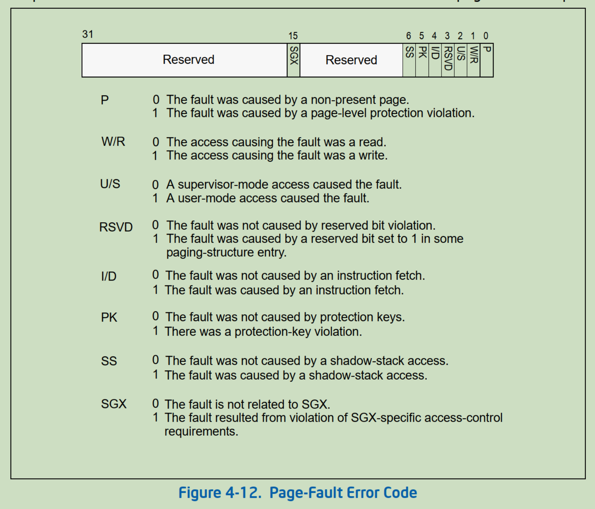

<!-- @import "[TOC]" {cmd="toc" depthFrom=1 depthTo=6 orderedList=false} -->

<!-- code_chunk_output -->

- [1. 访问权限位 U/S 的检查](#1-访问权限位-us-的检查)
  - [1.1. U/S 权限位的判定](#11-us-权限位的判定)
- [2. 读/写权限位 R/W 的检查](#2-读写权限位-rw-的检查)
  - [2.1. R/W 权限位的判定](#21-rw-权限位的判定)
- [3. 执行权限位 XD 的检查](#3-执行权限位-xd-的检查)
  - [3.1. XD 权限位的判定](#31-xd-权限位的判定)
- [4. 缺页保护 P 标志位的检查](#4-缺页保护-p-标志位的检查)
  - [4.1. P 标志位的判定](#41-p-标志位的判定)
- [5. 保留位的检查](#5-保留位的检查)

<!-- /code_chunk_output -->


在 paging 里, 处理器会对访问各级 table entry 及最终的 page frame 进行以下的检查.



① 访问权限位 U/S 的检查.

② 读/写权限位 R/W 的检查.

③ 执行权限位 XD 的检查.

④ 缺页保护位 P 的检查.

⑤ 保留位的检查.

# 1. 访问权限位 U/S 的检查

各级 table entry 的 U/S 标志组合起来最终决定了 page frame 的访问权限.

① U/S=0 时, 属于 Supervisor 访问权限.

② U/S=1 时, 属于 User 访问权限.

对于一个 page frame 进行读/写访问时, `U/S=0` 时, 只能在 CPL=0、1 或 2 级权限下访问. `U/S=1` 时 CPL 可以在任何权限级别下进行访问.

对于一个 page frame 进行执行访问时, U/S=0 时, 只能在 CPL=0、1 或 2 级权限下执行. `U/S=1` 时依赖于 SMEP 功能(详见 11.5.6 节描述)是否开启, 当 `CR4.SMEP=1` 时, 只能在 CPL=3 级权限下执行. `CR4.SMEP=0` 时(或不支持 SMEP 时), CPL 可以在任何权限级别下执行.

## 1.1. U/S 权限位的判定

一个 page frame 的最终 U/S 由各级 table entry 的 U/S 进行组合, 另见 11.6.1.2 节所描述的 page frame 的访问权限.

① 在 IA-32e paging 模式下的 4K 页面映射中.

```x86asm
Page_frame.U/S=PML4E.U/S & PDPTE.U/S & PDE.U/S & PTE.U/S   ; 进行 AND 操作
```

由 PML4E、PDPTE、PDE, 以及 PTE 的 U/S 进行 AND 操作, 得出最终 4K page frame 的 U/S 标志位值.

② 在 IA-32e paging 模式下的 2M 页面映射中.

```x86asm
Page_frame.U/S=PML4E.U/S & PDPTE.U/S & PDE.U/S  ; 进行 AND 操作
```

由 PML4E、PDPTE, 以及 PDE 的 U/S 进行 AND 操作, 得出最终 2M page frame 的 U/S 值.

③ 在 IA-32e paging 模式下的 1G 页面映射中.

```x86asm
Page_frame.U/S=PML4E.U/S & PDPTE.U/S    ; 进行 AND 操作
```

由 PML4E 和 PDPTE 的 U/S 标志进行 AND 操作, 得出最终的 1G page frame 的 U/S 值.

④ 在 PAE paging 和 32 位 paging 模式下的 4K 页面映射中.

```x86asm
Page_frame.U/S=PDE.U/S & PTE.U/S    ; 进行 AND 操作
```

由 PDE 和 PTE 的 U/S 标志进行 AND 操作, PAE 模式下 PDPTE 不存在 U/S 标志位.

⑤ 在 PAE paging 模式和 32 位 paging 下的 2M 和 4M 页面映射中.

```x86asm
Page_frame.U/S=PDE.U/S                                         ;  2M/4M page frame 的 U/S
```

2M 和 4M 页面 page frame 的 U/S 来自于 PDE 里的 U/S 值.

# 2. 读/写权限位 R/W 的检查

各级 table entry 的 R/W 标志位组合起来决定了最终 page frame 的读/写权限.

① R/W=0 时, page frame 是 Read-Only(只读的).

② R/W=1 时, page frame 是 Read/Write(可读写的).

在任何权限下可以对读/写的页进行写操作. 当 R/W=0 时, 在 CPL=3 级权限下, 不能对 page frame 进行写操作. 在 CPL=0、1 或 2 级权限下, 依赖于是否开启 `CR0.WP`(Write Protection) 功能. 当 `CR0.WP=1` 时, Supervisor 权限也不能对 Read-Only 页进行写操作. 当 `CR0.WP=0` 时, Supervisor 可以对 Read-Only 页进行写操作.

## 2.1. R/W 权限位的判定

R/W 标志位与 U/S 标志位所遭遇的情形一致. 上面 11.8.1 节里所描述符的 U/S 权限位的判定方式适合于 R/W 标志位(上面的计算式子中将 U/S 标志改为 R/W 标志位).

# 3. 执行权限位 XD 的检查

在 PAE paging 模式和 IA-32e paging 模式下, 可以使用 XD 标志位来限制对 page frame 的执行. 在 32 位 paging 模式下 page frame 总是被允许执行的.

① XD=1 时, page frame 不能被执行.

② XD=0 时, page frame 允许执行.

`IA32_EFER.NXE` 控制 Execution Disable 功能的开启, `IA32_EFER.NXE=1` 时, XD 标志位有效. 否则为保留位, 必须为 0 值.

当 `IA32_EFER.NXE=1` 并且 `XD=1` 时的 page frame 不能执行, 否则 page frame 被允许执行. page frame 的执行检查, 还依赖于前面所述的 CR4.SMEP 控制位.

在 XD=0 的前提下, CR4.SMEP=1 时, 在 CPL=0、1 或 2 级权限下不能执行 User 权限的 page frame, 当 CR4.SMEP=0 时, 允许 Supervisor 对 User 的 page frame 执行.

## 3.1. XD 权限位的判定

同样, page frame 的 XD 值由各级 table entry 的 XD 标志组合起来决定.

① 在 IA-32e paging 模式下的 4K 页面映射中.

```x86asm
Page_frame.XD=PML4E.XD | PDPTE.XD | PDE.XD | PTE.XD   ; 进行 OR 操作
```

由 PML4E、PDPTE、PDE, 以及 PTE 的 XD 进行 OR 操作, 得出最终 4K page frame 的 XD 标志位值.

② 在 IA-32e paging 模式下的 2M 页面映射中.

```x86asm
Page_frame.XD=PML4E.XD | PDPTE.XD | PDE.XD             ; 进行 OR 操作
```

由 PML4E、PDPTE, 以及 PDE 的 XD 进行 OR 操作, 得出最终 2M page frame 的 XD 值.

③ 在 IA-32e paging 模式下的 1G 页面映射中.

```x86asm
Page_frame.XD=PML4E.XD | PDPTE.XD                           ; 进行 OR 操作
```

由 PML4E 和 PDPTE 的 XD 标志进行 OR 操作, 得出最终的 1G page frame 的 XD 值.

④ 在 PAE paging 模式下的 4K 页面映射中.

```x86asm
Page_frame.XD=PDE.XD | PTE.XD                                ; 进行 OR 操作
```
由 PDE 和 PTE 的 XD 标志进行 OR 操作.

⑤ 在 PAE paging 模式的 2M 页面映射中.

```x86asm
Page_frame.XD=PDE.XD                         ;  2M page frame 的 XD
```

2M page frame 的 XD 来自于 PDE 里的 XD 值.

由上面的 page frame XD 值来看, 只要有任何一级 table entry 的 XD 为 1 时, 所对应的 page frame 就是不可执行的.

# 4. 缺页保护 P 标志位的检查

同样, 各级 table entry 的 P 标志位组合起来决定了最终 page 是否被提交到物理地址空间中.

① P=0 时, 不存在内存中.

② P=1 时, 已在内存中.

处理器对访问 P=0 的 page frame 会产生 `#PF` 异常.

## 4.1. P 标志位的判定

在线性地址的访问中, 仅当在转换物理地址过程中所有 table entry 的 P=1 时, 页的转换才是成功的. 这与 U/S 标志及 R/W 标志位所遭遇的情形是一致的(在 11.8.1 节的计算式子中 U/S 标志位换为 P 标志位), 也就是所有 table entry 的 P 标志位进行与操作.

# 5. 保留位的检查

当各级 table entry 的保留位不为 0 时, table entry 是无效的, 会产生#PF 异常.

关注下列 table entry 中的保留位.

① 11.3.2.2 节中的 32 位 paging 模式下的 4M 页面的 PDE 结构保留位.

② 11.4.4.1 节中的 PAE paging 模式下的 2M 页面的 PDE 结构保留位.

③ 11.4.4.2 节中的 PAE paging 模式下的 4K 页面的 PDE 结构保留位.

④ 11.4.5 节中的 PAE paging 模式下的 PTE 结构保留位.

⑤ 11.5.2 节中的 IA-32e paging 模式下 PML4E 结构保留位.

⑥ 11.5.3.1 节中的 IA-32e paging 模式下 1G 页面 PDPTE 结构保留位.

⑦ 11.5.3.2 节中的 IA-32e paging 模式下 4K/2M 页面 PDPTE 结构保留位.

⑧ 11.5.4 节中的 IA-32e paging 模式下 2M 页面 PDE 结构保留位.

⑨ 11.5.4 节中的 IA-32e paging 模式下 4K 页面 PDE 结构保留位.

⑩ 11.5.5 节中的 IA-32e paging 模式下的 PTE 结构保留位.

在这些保留位检查中, 许多 table entry 的保留位依赖于 MAXPHYADDR 值.

① 当 MAXPHYADDR 为 36 时, table entry 的 [51: 36] 为保留位.

② 当 MAXPHYADDR 为 40 时, table entry 的 [51: 40] 为保留位.

③ 当 MAXPHYADDR 为 52 时, table entry 的 [51: 12] 为有效位.

当 IA32_EFER.NXE=1 时, bit63 是 XD 标志位, 否则为保留位, 须为 0 值.

下面的保留位检查将产生 `#GP` 异常.

① 11.4.3 节的 PAE paging 模式下的 PDPTE 结构保留位.

② 11.5.1.1 节的 CR3 结构中的保留位.