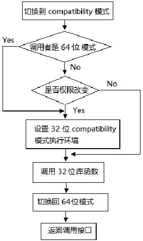

<!-- @import "[TOC]" {cmd="toc" depthFrom=1 depthTo=6 orderedList=false} -->

<!-- code_chunk_output -->

- [1 64 位模式切换到 compatibility 模式](#1-64-位模式切换到-compatibility-模式)
  - [1.1 照顾通用性](#11-照顾通用性)
- [2 compatibility 模式切换到 64 位模式](#2-compatibility-模式切换到-64-位模式)
- [3 利用 compatibility 模式执行 legacy 的库函数](#3-利用-compatibility-模式执行-legacy-的库函数)
  - [3.1 提供调用的接口](#31-提供调用的接口)
  - [3.2 实现调用 stub 函数](#32-实现调用-stub-函数)
  - [3.3 定义调用宏](#33-定义调用宏)

<!-- /code_chunk_output -->

在 long\-mode 里, 出于某些考虑, 可能需要从 64 位模式切换到 compatiblity 模式进行相关的处理. 除了兼容执行 legacy 模式代码外, 切换到 compatibiltiy 模式有时是很有用途的.

# 1 64 位模式切换到 compatibility 模式

在前面已提及, 要退出 long-mode 必须先换到 compatibility 模式. 要切换到 compatibility 模式, 我们需要提供一个 far pointer 来加载 comaptibility 模式的 Code segment 描述符. 这个 far pointer 必须以间接形式给出, 在 64 位模式下不允许使用直接的 far pointer(即 jmp 16: 32 直接在指令里给出 far pointer 值).

```assembly
       jmp far [compatibility_pointer]
compatibility_pointer:
       dq compatibility_entry   ;  compatibility 代码入口点
       dw compatibility_selector  ;  compatibility 模式的 CS selector
```

上面代码使用远程的 jmp 指令提供 compatibility 模式的 far pointer 切换到 compatibility 模式, 这是一个典型的示例.

## 1.1 照顾通用性

在 nasm 编译器里, 会将 jmp far [compatibility_pointer]这条指令编译为 64 位的操作数. 实际上 nasm 是不合理的, 因为远程的 jmp 指令默认操作数是 32 位！如果需要明确使用 64 位操作数, 应该需要如下这样.

```assembly
jmp QWORD far [compatibility_pointer]  ;  提供显式的 QWORD 指示字
```

在 Intel64 平台上支持 80 位(16: 64)的 far pointer 形式. 因此, 这个 compatibility_entry 值是 64 位的.

然而, 在 AMD64 平台的 64 位模式里最大只能支持 48 位(16: 32)的 far pointer 形式, 因此, 在 AMD64 平台上这个 compatibiltiy_entry 值须设置为 32 位的.

为了照顾通用性, 我们应该明确地使用 32 位的操作数, 上面的示例代码将修改为

```assembly
       jmp DWORD far [compatibility_pointer]  ;  强制使用 32 位的操作数
compatibility_pointer:
       dd compatibility_entry     ;  32 位的入口地址值
       dw compatibility_selector    ;  compatibility 模式的 CS selector
```

将 jmp 指令的操作数强制定为 32 位, 那么在 Intel64 和 AMD64 平台都能够使用.

# 2 compatibility 模式切换到 64 位模式

相比之下, 从 compatibility 模式切换 64 位模式则会简单些, 在 compatibility 模式下, 我们可以使用 direct far jmp(直接远程跳转)指令形式, 代码如下.

```assembly
jmp DWORD far 0x28: entry64    ;  提供直接的 far pointer 指针.
```
这个直接 far pointer 在 64 位模式是不支持的, 而我们则正好是利用 compatibility 模式下支持的特性, 提供目标 64 位代码的 far pointer. 值得注意的是, 这个 entry64 是 32 位值, 会被零扩展后加载到 RIP 指针里.

# 3 利用 compatibility 模式执行 legacy 的库函数

如果当需要实现某个功能时, 原来 32 位代码库已经实现了. 那么在 64 位模式下, 我们有两个选择.

① 编写相应的 64 位版本.

② 在允许的情况下, 重复利用 32 位的库.


假如选择调用 32 位的库, 那么我们需要切换到 compatibility 模式执行, 执行完 32 位库后, 切换回 64 位模式. 在这个调用函数的模式切换过程中, 最好的办法是实现一个 stub 函数.

## 3.1 提供调用的接口

我们需要保证任何权限下, 典型地如 0 级 kernel 代码和 3 级的 user 代码都能够使用这个机制来调用 32 位库. 我们可以实现一个调用接口提供给任何权限下使用.

```assembly
mov esi, msg1      ;  puts() 函数参数
mov eax, LIB32_PUTS     ;  32 位库的函数号, 调用 puts() 函数
call lib32_service     ;  调用接口函数
```

这段代码在 64 位模式的 0 级权限或者 3 级权限下都能够运行. 这个 lib32_service()函数就是系统提供的调用接口函数, 它的内部是调用 stub 函数.

代码清单 12-4(lib\lib64.asm):

```assembly
; -------------------------------------------------------
;  lib32_service(): 对外接口
;  input:
;   rax: 库函数编号
;  描述:
;   通过 call-gate 调用实际工作的 lib32_service()
; -------------------------------------------------------
lib32_service:
jmp lib32_service_next
CALL_GATE_POINTER: dq 0 dw call_gate_sel   ;  Call-gate 的 selector
lib32_service_next:
       call QWORD far [CALL_GATE_POINTER]   ;  从 64 位模式里调用 call gate
       ret
```

接口函数 lib32\_service()实现在 lib\lib64.asm 库里, 为 64 位代码而实现. 这个函数的核心是使用 Call\-gate 切换到 0 级的 64 位 stub 函数. 使用了 call\-gate, 所以无论在 0 级还是 3 级下最终都会来到 0 级的 64 位代码.

## 3.2 实现调用 stub 函数

stub 函数是运行在 0 级的 64 位模式下的, 它将负责:

① 从 64 位模式切换到 compatibility 模式.

② 调用 32 位库的具体函数.

③ 从 32 位库返回后, 切换回 64 位模式.

代码清单 12-5(lib\lib64.asm):

```assembly
       bits 64
; -------------------------------------------------------
;  __lib32_service(): 在 64 位的代码下使用 32 位的库函数
;  input:
;   rax: 库函数编号, rsi...相应的函数参数
;  描述:
;   (1) rax 是 32 位库函数号, 类似于系统服务例程的功能号
;   (2) 代码会先切换到 compatibility 模式调用 32 位模式的函数
;   (3) 32 位例程执行完毕, 切换回 64 位模式
;   (4) 从 64 位模式中返回调用者
;   (5) lib32_service() 函数使用 call-gate 进行调用
; -------------------------------------------------------
__lib32_service:
      push rbp
      mov rbp, rsp
      push rbx
      push rsi
      push rdi
      mov rbx, rax       ;  功能号
      mov rsi, [rbp + 16]      ;  读 CS selector
      call read_segment_descriptor
      shr rax, 32
      pop rdi         ;  恢复函数参数
      pop rsi
      jmp QWORD far [lib32_service_compatiblity_pointer] ;  切换到 compatibility 模式
; ;  定义 far pointer(为切换到 compatibility 模式而准备)
lib32_service_compatiblity_pointer: dq lib32_service_compatibility
                                       dw  code32_sel
; ;  下面为切换回 64 位模式而定义(32 位的入口地址)
lib32_service_64_pointer:    dd lib32_service_done
                                dw KERNEL_CS
lib32_service_compatibility:
      bits 32           ;  使用 32 位编译
      bt eax, 21          ;  测试 CS.L
      jc reload_sreg         ;  调用者是 64 位代码
      shr eax, 13
      and eax, 0x03         ;  取 RPL
      cmp eax, 0
      je call_lib32         ;  权限不变
reload_sreg:
      ; ;  重新设置 32 位 compatibility 模式环境
      mov ax, data32_sel
      mov ds, ax
      mov es, ax
      mov ss, ax
      mov esp, LIB32_ESP
call_lib32:
      ; ; ;  计数目标函数的位置: ebx * 5 + LIB32_SEG 得到 lib32 库函数地址
      lea eax, [LIB32_SEG + ebx * 4 + ebx]
      call eax          ; ;  执行 32 位例程
      jmp DWORD far [lib32_service_64_pointer]  ; ;  切换回 64 位模式
      bits 64           ;  使用 64 位编译
lib32_service_done:
      lea rsp, [rbp - 8]
      pop rbx
      pop rbp
      db 0x48
      retf           ;  返回到接口函数
```

\_\_lib32\_service()是 Call\-gate 的服务例程, 经 lib32\_service()接口函数调用进入. 它将接纳从 64 位模式的 0 级或 3 级调用, 以及从 compatibility 模式里调用.

值得注意的是, 它只能在 Intel64 平台上执行, 因为使用了 80 位(16: 64)的 far pointer 形式, 当然我们可以将它改为 32 位操作数做到通用. 它的工作流程如下所示.



如果是从 compatibility 模式下的 0 级权限进行调用, 那么就不需要设置目标代码运行的 32 位 compatibility 模式环境, 否则必须设置 compatibility 模式的环境.

## 3.3 定义调用宏

为了做得更好, 我们可以定义一些宏函数, 用来包装 32 库函数的调用, 下面是典型的定义.

```assembly
;  定义 32 位库 puts() 函数的调用宏
%macro LIB32_PUTS_CALL 0
       mov eax, LIB32_PUTS     ;  32 位库函数号
       call lib32_service     ;  接口函数
%endmacro
```

那么, 在我们的 64 位或者 compatibility 模式代码里, 可以使用下面的方式进行调用.

```assembly
mov esi, msg      ;  puts() 函数的参数
LIB32_PUTS_CALL      ;  调用 32 位库函数 puts()
```

当然还可以定义得更像宏一样, 如下:

```assembly
%macro LIB32_PUTS_CALL 1
       mov esi, %1       ;  puts() 的参数
       mov eax, LIB32_PUTS     ;  32 位库函数号
       call lib32_service     ;  接口函数
%endmacro
```

那么, 我们就可以这样调用(宏的使用):

```assembly
LIB32_PUTS_CALL msg     ;  调用 32 位库函数 puts()
```
通过这种机制, 就重复利用了 legacy 的 32 位库代码. 上面的代码看起来和在 32 位保护模式下调用 puts()没多大区别.