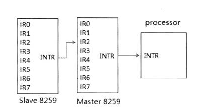
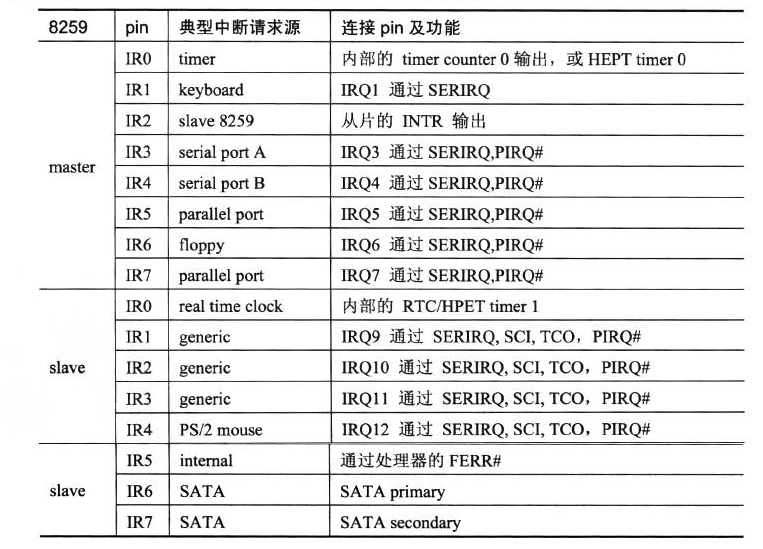
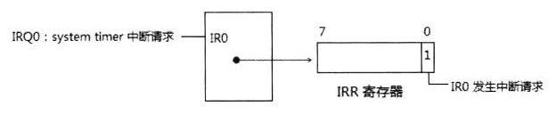
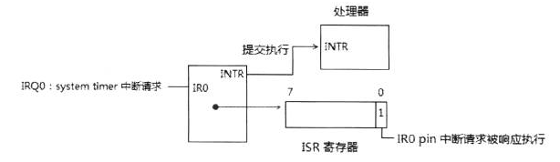
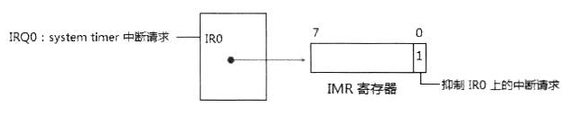
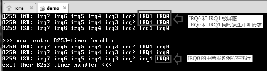
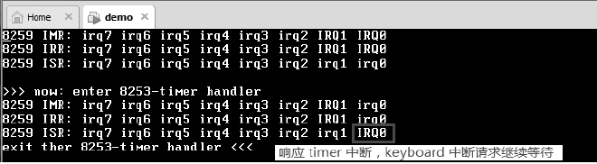

<!-- @import "[TOC]" {cmd="toc" depthFrom=1 depthTo=6 orderedList=false} -->

<!-- code_chunk_output -->

- [1. 8259 中断控制器](#1-8259-中断控制器)
- [2. IRQ 的优先级](#2-irq-的优先级)
- [3. 中断请求状态](#3-中断请求状态)
  - [3.1. IRR](#31-irr)
- [4. 中断服务状态](#4-中断服务状态)
  - [4.1. ISR](#41-isr)
- [5. 中断屏蔽状态](#5-中断屏蔽状态)
  - [5.1. IMR](#51-imr)
- [6. 中断响应过程](#6-中断响应过程)
  - [6.1. edge 触发](#61-edge-触发)
  - [6.2. level 触发](#62-level-触发)
  - [6.3. 发送 EOI 命令](#63-发送-eoi-命令)

<!-- /code_chunk_output -->

# 1. 8259 中断控制器

实际应用中, 由两块 8259 PIC 串联在一起使用, 分为 master 片和 slave 片, 如下

每个 8259A PIC 的**IR 口**都接一条**IRQ 线(IRQ 线是唯一的！！！**).

**主片**的**IR0 到 IR7**对应着**IRQ0 到 IRQ7 线**.

除了 **IR2 pin 被接上从片的 INTR pin**外, **从片**的**IR0 到 IR7**对应着**IRQ8 到 IRQ15**线. 由于**从片**串接到**主片**的**IR2 pin**上, **从片**的**IR1 pin**同时接到**IRQ2**和**IRQ9 线**.

8259 经历多次数代 bus 和芯片组变革, 保持绝大部分的兼容性. pin 用途如下表

# 2. IRQ 的优先级

8259 中断控制器中, IR0 pin 接收的中断请求优先级最高, IR7 pin 能接收的中断请求优先级最低. 从片 8259 接在主片 IR2pin 时, 从片所有中断请求优先级相当于 IRQ2. IRQ 优先级由高到低次序: IRQ0, IRQ1, IRQ8\~IRQ15, IRQ3\~IRQ7.

# 3. 中断请求状态

当**每条 IRQ 线产生中断请求**时, 8259 内部的**IRR(Interrupt Request Register**)将记录对应的 IR **pin 发生中断请求**. 若**IRQ10 线**发生中断请求, 则**记录在**对应**从片**的**IRR 寄存器中**(IR2 pin 的状态). 这时使用**in 指令读从片的 IRR 寄存器**可知道 IRQ10 发生了中断请求.

如上, 当 IRQ0 发生中断请求, **IRR 寄存器的 bit 0 置位**, 指示**IR0 发生了中断请求**.

## 3.1. IRR

**8259 控制器**内的**IRR 是一个 8 位的寄存器**, 每一位对应一个 IR pin 引脚. 置位指示发生了中断请求. IRR 寄存器中**各位可同时被置位**, 指示有**多个中断请求发生**.

# 4. 中断服务状态

**IRQ 线上的中断请求**, 并**不意味着会得到 8259 控制器的响应**, **允许被处理器响应的中断请求**会在 8259 内部的**ISR(In\-Service Register 或 Interrupt service register)里记录下来**. ISR 记录着 8259 各个 IR pin 的中断服务状态.

如上, IR0 口上的中断请求被允许执行, 8259 提交到处理器 core 执行. ISR 对应的 bit 0 置位记录着这个 pin 所接的 IRQ0 中断请求正在执行.

## 4.1. ISR

和 IRR 一样, ISR 也是一个 8 位的寄存器, 每一位对应一个 IR pin 引脚. 置位指示**该 pin 的中断请求得到响应执行**. ISR 上**多个位被同时置位**时, 表明当前存在"**低优先级服务例程被高优先级服务例程中断**". 处理器**某一个时刻只能服务一个中断请求(！！！**).

# 5. 中断屏蔽状态

只有当 IR pin 上中断请求被允许响应, 并没有更高优先级的中断请求发生, IRQ 线上的中断请求才可能被执行.

8259 内部的**IMR(Interrupt Mask Register**)控制着 IR pin 上的中断请求许可.

如上, 当 IMR 的 bit 0 置位, 则 IRQ0 上的中断请求被抑制; 当 IR2 被屏蔽, 整个 Slave 8259 上所有中断请求被屏蔽

## 5.1. IMR

IMR 也是一个 8 位寄存器, IMR 的位可以同时被置位, 当 IMR 值为 0FFh 时, 指示所有 IR pin 上的中断请求被屏蔽. 对某个 IR pin 的屏蔽不会影响到其他 IR pin 上的中断请求.

实验: 观察 IMR, IRR 和 ISR

实验的主体代码在 topic17\ex17-1\protected.asm 里, 下面是输出结果.

结果显示, 在**进入 timer handler 之前**打印出**master 片的 IMR、IRR 和 ISR 信息**, IRQ0 和 IRQ1 都被屏蔽, 同时发生了中断请求, 因此在 IMR 和 IRR 里显示它们都被置位.

在进入 timer handler 后又打印了一次, 这时候 IRQ0 的 mask 已被清 0, 在 ISR 里被置位. IRR 被清 0.

# 6. 中断响应过程

可以从 Intel 提供的 chipset datasheet 找到关于 8259 响应中断的流程

1) 当 IRQ 线上发生中断请求时, 8259 内核的**IRR 对应的位将置位**, 这个中断请求可以是**edge 或 level 模式触发**

2) 如果这个中断请求是允许的(**没被屏蔽, 通过 IMR**), 则提交到处理器 INTR pin 上

3) 处理器将以**interrupt acknowledge cycle(中断响应周期**)作为**回复(走的是系统总线！！！**), 这个**cycle**被**host bridge(CPU 到 PCI 桥**)传送到**PCH(Platform Controller Hub**)上

4) PCH 将这个 cycle**转化**为 8259 可以响应的两个 interrupt acknowledge pulse(**中断响应脉冲**)出现在 master 和 slave 8259**控制器**的**INTA\#pin**上.

5) 在接收到**第 1 个 INTA\#脉冲**后, 8259 进行**优先级的仲裁**, 最高的中断请求得到响应, **ISR 寄存器相应的位置位**, **IRR 寄存器**对应的位被**清 0(控制器接收了请求后就将相应的 IRR\<中断请求状态>寄存器位清 0**).

6) 如果如果**slave 8259**赢了**中断仲裁**(即**slave 上有优先级别高的中断请求**), 则 master 8259 通过一条**3 位宽的内部线**向 slave 8259 传送一个 slave identification code(**从片标识码**), slave 8259 会对这个 code 进行检查, 决定是否在**第 2 个 INTA#脉冲**时**回复一个 interrupt vector**, 当这个 code 与 slave 8259 内的**identification code**相符时(初始化时设置), slave 8259 必须回复一个**interrupt vector**通过**data bus**给 processor.

7) 如果**master 8259**赢了中断仲裁, 则 master 8259 在**第 2 个 INTA\#脉冲**时, 会回复一个**interrupt vector**通过**data bus(数据总线**)给 processor.

8) **中断完成**后, 在**AEOI(Automatic End of Interrupt)模式**里, 8259 在**第 2 个 INTA\#结束后**自动**清 ISR 相应的位**. 否则必须发送一个**EOI 命令给 8259**.

## 6.1. edge 触发

边沿触发

**8259**可以选择**中断请求**使用**edge 模式**还是**level 模式**触发, 当选择**edge 模式**时, IRQ 的中断请求将在一个**low\-to\-high(低电平到高电平**)的**转化过程中触发**.

## 6.2. level 触发

电平触发

当选择 level 模式触发时, 中断请求将在**high\-level(高电平**)时触发, **IRQ 不需要检测从 low 到 high 这个转变过程**.

我们看到了 edge 触发与 level 触发的不同:

- 在**edge 触发模式**里可以**维持一个 high level 而不会触发第二次中断请求**;
- 而在**level 触发模式**里, **IRQ 不能维持在 high level**上, 否则会产生多次中断请求.

## 6.3. 发送 EOI 命令

当**中断服务例程执行完毕**后, 在**非 AEOI 模式**下应发送**EOI(End Of Interrupt)命令到 8259**, 指示这个中断请求已经响应并执行完毕. **8259 收到 EOI 命令**会**清 ISR 的相应位**, 指示没有中断请求被执行.

在使用**special full mode**时, 当 slave 片中断请求响应执行时, 请参考下面 17.2.2.4 节中关于 special full nested mode 的描述.

