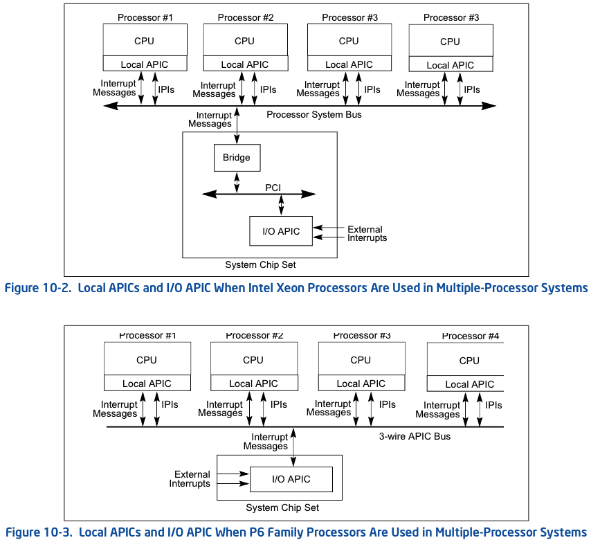
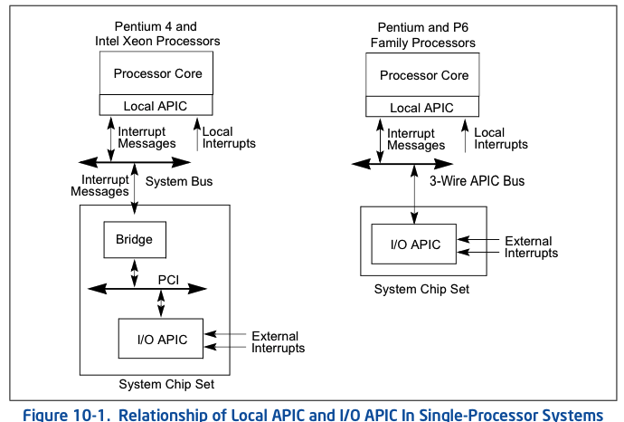
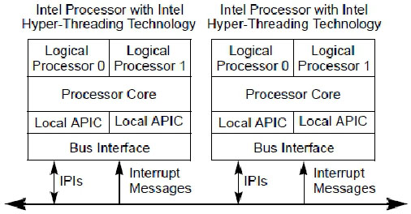
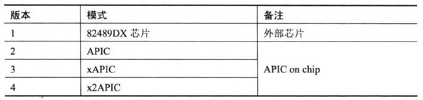

<!-- @import "[TOC]" {cmd="toc" depthFrom=1 depthTo=6 orderedList=false} -->

<!-- code_chunk_output -->

- [1. local 和 I/O APIC 概述](#1-local-和-io-apic-概述)
  - [1.1. Local APIC](#11-local-apic)
  - [1.2. I/O APIC](#12-io-apic)
- [2. local APIC 可接收的中断源](#2-local-apic-可接收的中断源)
  - [2.1. 本地中断源](#21-本地中断源)
    - [2.1.1. 连接到 LINT0 和 LINT1 口的中断源](#211-连接到-lint0-和-lint1-口的中断源)
    - [2.1.2. CMCI 中断](#212-cmci-中断)
    - [2.1.3. APIC timer 中断](#213-apic-timer-中断)
    - [2.1.4. Thermal sensor 中断](#214-thermal-sensor-中断)
    - [2.1.5. Performance monitoring counter 中断](#215-performance-monitoring-counter-中断)
    - [2.1.6. ERROR 内部错误产生中断](#216-error-内部错误产生中断)
  - [2.2. 外部中断](#22-外部中断)
  - [2.3. 处理器间的消息](#23-处理器间的消息)
- [3. APIC 体系的版本](#3-apic-体系的版本)
  - [3.1. APIC 与 xAPIC](#31-apic-与-xapic)
  - [3.2. x2APIC](#32-x2apic)

<!-- /code_chunk_output -->

# 1. local 和 I/O APIC 概述

每个 local APIC 由一组 APIC 寄存器和相关的硬件组成, 这些硬件控制中断到处理器核心的传递和 IPI 消息的生成. APIC 寄存器是内存映射和可以读和写使用 MOV 指令.

**引入 APIC 机制**是为了**适应 multiple processor(MP, 多处理器**)环境.

**整个 APIC 体系**可以分为两大部分: **Local APIC**和**I/O APIC**,

- **Local APIC 是整个 APIC 体系的核心**, 它在**处理器的内部**;

- **I/O APIC 是芯片组的一部分**, 它在`PCI-to-ISA bridge`(或称`PCI-to-LPC bridge`)的**LPC 控制器内**.

Xeon 和 P6 系列的多处理器系统:

单处理器系统:

处理器内部的**Local APIC**通过**system bus**接受来自**处理器间的中断消息(IPI**)和**外部的中断消息(包括 I/O APIC 及外部设备**).

## 1.1. Local APIC

**local APIC**为处理器执行两个主要功能:

* 它从处理器的**中断引脚**, **内部源**以及**外部 I/O APIC**(或其他外部中断控制器)**接收中断**. 它将这些发送到**处理器内核**进行处理.

* 在**多处理器**(MP)系统中, 它向**系统总线**上的**其他**逻辑处理器**发送和接收**处理器间中断(**IPI**)消息.  IPI 消息可用于在系统中的处理器之间分配中断或执行系统范围的功能(例如, **启动处理器**或在一组处理器之间分配工作).

**每个 logical processor(逻辑处理器**)都有自己的**local APIC**, 每个 local APIC 包括了**一组 local APIC 寄存器**, 用来**控制 local 和 external 中断的产生、发送和接收**等, 也**产生和发送 IPI(处理器间的中断消息**).

**local APIC 寄存器**组以**内存映射形式(不是 I/O 映射方式**)映射到**物理地址空间**上, 因此软件可以使用**MOV 指令**进行访问.

然而在**x2APIC 模式**上 local APIC**寄存器映射到 MSR 寄存器组**来**代替映射内存**, 软件使用**RDMSR 和 WRMSR 指令**来**访问 local APIC 寄存器**.

如下所示, 这是在支持**Intel Hyper-Threading Technology 的 MP 系统**上, **两个 logical processor(线程**)共享**一个 processor core**执行单元.

**每个 local APIC**有自己的**local APIC ID**, 这个 ID 决定了**logical processor**在**system bus 上的地址**, 可以用于**处理器间的消息接收和发送**, 也可用于**外部中断消息的接收**.

## 1.2. I/O APIC

外部`I/O APIC`是英特尔系统**芯片组**的一部分. 它的主要功能是从系统及其关联的 I/O 设备接收**外部中断事件**, 并将它们**作为中断消息**中继到**local APIC**. 在**MP 系统**中, I/O APIC 还提供了一种**机制**, 用于将**外部中断**分配给**系统总线**上**选定处理器**或**处理器组**的 local APIC.

典型地, **8259 兼容类**的**legacy 中断控制器**是在**uni\-processor(单处理器**)系统上使用, 已**不能适应于多处理器环境**, 而**I/O APIC**能适用于**multi\-porcessor(多处理器**)环境上. **I/O APIC**可以发送中断消息到**指向的 logical processor**上.

**I/O APIC 属于芯片组的一部分**, 现称为**PCH(Platform controller Hub**), 位于**PCI\-to-ISA bridge(南桥芯片**)的**LPC 控制器上**. I/O APIC 也有自己的**寄存器**, 同样也以**内存映射形式**映射到**物理地址空间**上.

# 2. local APIC 可接收的中断源

local APIC 可以接收的中断源有: **local interrupt(本地中断**), **extern interrupt(外部中断**), 以及**inter-processor interrupt message(IPI, 处理器间的中断消息**).

## 2.1. 本地中断源

local APIC 有**一组 LVT(local vector table)寄存器**用来**产生和接收(！！！)local interrupt source**.

### 2.1.1. 连接到 LINT0 和 LINT1 口的中断源

由**LVT 的 LINT0 和 LINT1 寄存器**对应着**处理器的 LINT0 和 LINT1 pin(Local APIC 在 CPU 内部**), 它们可以**直接接收外部 I/O 设备**或**连接 8259 兼容类的外部中断控制器**.

典型地,

* **LINT0**作为处理器的`INTR pin`接着**外部 8259 类的中断控制器的 INTR 输出端**

* **LINT1**作为处理器的`NMI pin`接着**外部设备的 NMI 请求**.

### 2.1.2. CMCI 中断

**CMCI(corrected machine\-check error interrupt**)是**machine\-check 机制**上的一个增强功能. 从**处理器模型**为`06_1A`的处理器开始支持. 允许在处理器的 corrected machinecheck error(**修正的机器检查错误**)的**count 计数**达到一个**临界值**时, 产生一个**CMCI 中断**来报告信息.

### 2.1.3. APIC timer 中断

local APIC 的**LVT timer 寄存器**可以被编程来产生**APIC timer 中断**.

### 2.1.4. Thermal sensor 中断

LVT **thermal monitor 寄存器**可以被编程来产生由**温度传感器触发的中断**.

### 2.1.5. Performance monitoring counter 中断

**PMI(performance monitoring interrupt**)由 LVT 的**performance monitor 寄存器**编程支持, 在使用**性能监控**时由**counter 溢出而产生中断**.

### 2.1.6. ERROR 内部错误产生中断

LVT **error 寄存器**记录着**APIC 内部发生的错误**, 当检测到 LVT error 错误时**产生中断**.

## 2.2. 外部中断

芯片组上的**I/O APIC**接收来自**连接到它的 IRQ 线**上的**I/O 设备中断请求**后, 产生**中断消息**经过**host bridge**通过**system bus**发送到**目标 processor core 的 local APIC 处理**.

## 2.3. 处理器间的消息

**system bus**上的**logical processor**可以使用**local APIC**的**ICR(interrupt command register**)发送一个**中断**给**自已**或**其他 logical processor**, 也可以发送中断到**一组 logical processor**.

# 3. APIC 体系的版本

APIC 经历了**4 个版本**, 如下表所示.

最初的 APIC 属于**外部设备**, 以外部的 82489DX 芯片形式存在. 在 P6 家族和 Pentium 处理器后, 以**APIC on Chip 形式**存在, 引入了**处理器内部的 local APIC 架构**, 和 82489DX 外部 APIC 相比较功能得到了扩展和增强.

Pentium 4 和 Intel Xeon 处理器在 APIC 的基础上进一步扩展, 形成了 xAPIC 体系, 以及最后在 xAPIC 基础上再一次扩展的 x2APIC 体系.

## 3.1. APIC 与 xAPIC

在 P6 和 Pentium 处理器使用的 APIC 版本里, **处理器之间**以及**local APIC 与 I/O APIC 间**的通信通过**APIC bus**. 而 Peutium 4 后续处理器基于扩展的**xAPIC**版本使用**system bus 代替 APIC bus**, APIC 上的功能在 xAPIC 上得到扩展和修改. 现在常用的是 xAPIC 版本.

## 3.2. x2APIC

x2APIC 是进一步扩展的版本, 并向下**兼容 xAPIC**, 新增了**一组 MSR 寄存器来代替内存映射的寄存器**.

在 x2APIC 中处理器的**ID 地址被扩展为 32 位**, 后面我们将讨论到 x2APIC ID.

1) 保留与 xAPIC 架构兼容的所有关键元素.

* 交付模式

* 中断处理的优先级

* 中断源

* 中断目标类型

2) 提供扩展来扩展逻辑目标模式和物理目标模式的处理器寻址能力

3) 添加新功能以增强中断传递(interrupt delivery)的性能

4) 降低基于链接的平台架构上逻辑目标模式中断传递的复杂性.

5) 使用 MSR 编程接口在 x2APIC 模式下访问 APIC 寄存器, 而不是内存映射接口. 在 xAPIC 模式下运行时仅仅支持内存映射接口.