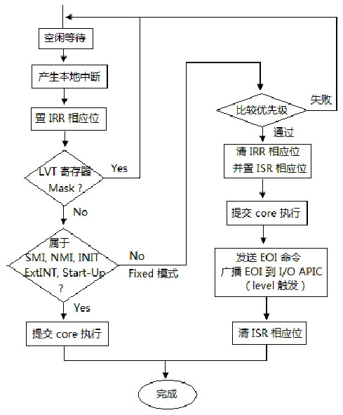
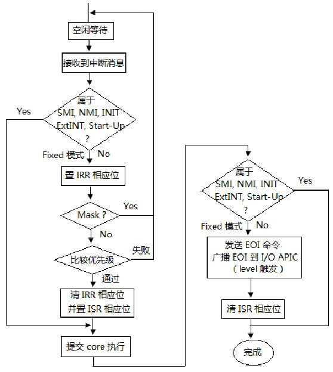
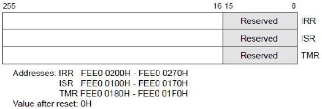
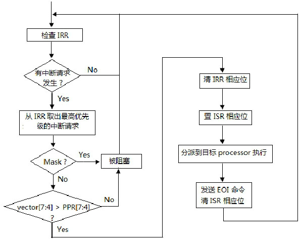

<!-- @import "[TOC]" {cmd="toc" depthFrom=1 depthTo=6 orderedList=false} -->

<!-- code_chunk_output -->

- [1. 两类中断源](#1-两类中断源)
  - [1.1. local interrupt(本地中断源)的处理](#11-local-interrupt本地中断源的处理)
  - [1.2. system bus 上中断消息的处理: IPI 消息或 IO APIC 消息](#12-system-bus-上中断消息的处理-ipi-消息或-io-apic-消息)
- [2. 检查目标](#2-检查目标)
- [3. IRR 和 ISR 仲裁](#3-irr-和-isr-仲裁)
  - [3.1. IRR 寄存器的状态](#31-irr-寄存器的状态)
  - [3.2. 从 IRR 中取出最高优先级的中断请求](#32-从-irr-中取出最高优先级的中断请求)
  - [3.3. ISR 寄存器的状态](#33-isr-寄存器的状态)
  - [3.4. 是否被屏蔽](#34-是否被屏蔽)
  - [3.5. 判断优先级](#35-判断优先级)
  - [3.6. 清 IRR 相应位](#36-清-irr-相应位)
  - [3.7. 置 ISR 相应位](#37-置-isr-相应位)
- [4. 发送 EOI 命令](#4-发送-eoi-命令)

<!-- /code_chunk_output -->

# 1. 两类中断源

在 system bus 上的所有处理器都能接收来自 local APIC 的**本地中断源**, 来自 **system bus** 上的中断消息以及**外部设备**的 I/O 中断源.

## 1.1. local interrupt(本地中断源)的处理

软件设置后, 仅仅在当前 CPU 自己触发中断.

local APIC 的

* **LVT 寄存器能产生中断**;

* **LVT LINT0** 能接收外部 **8259** 中断控制器的中断请求;

* **LVT LINT1** 能接收外部设备的 **NMI** 中断请求.

LVT 寄存器产生的**本地中断源处理**上与 **system bus 上接收的中断消息有些不同**, 下图描述了对**本地中断处理(！！！**)的简要流程.



> 注: 图有些问题, 根据 Intel 手册, 所有具有 **NMI**, **SMI**, **INIT**, **ExtINT**, **start-up** 或 **INIT-deassert** 传送模式的中断都会绕过 IRR 和 ISR 寄存器, 并直接发送到处理器内核进行处理, 像下面 system bus 图一样.

**本地中断源受 LVT 寄存器的 mask(屏蔽)位影响**, 当 LVT 寄存器的 mask 位置位时, 本地中断源将被屏蔽不能被响应.

同时, 本地中断受到 **IRR**(Interrupt Request Register)、**ISR**(In-Service Register)的仲裁影响, 这部分的处理与**system bus**上使用**Fixed 交付模式**的中断消息处理是一致的.

IRR 相应位代表**Local APIC 接收了中断**但**还未提交到 CPU**进行处理.

1. 当 Local APIC 接收到一个中断, 设置其对应的 IRR 相应位.

2. 当 CPU 准备好了处理下一个中断, **Local APIC 清除 IRR 上的最高位**, **设置 ISR 的相应位**, 然后将中断提交到处理器进行处理.

3. 当 CPU 处理最高级别中断, Local APIC 通过设置 IRR 相应位来接收其它 fixed 中断. 当**中断处理程序**发出**写 EOI 寄存器**, **Local APIC 就会清除 ISR 最高位**.

> 对于除 NMI, SMI, INIT, ExtINT, start\-up 或 INIT-Deassert 传送模式之外的所有中断, **中断处理程序**必须包括对**中断结束(EOI)寄存器**的写入. 此写操作必须在**处理程序例程的末尾**, 在**IRET 指令之前**的某个时间发生. 此操作表示**当前中断的服务已完成**, 本地 APIC 可以从 ISR 发出下一个中断.

4. 然后, Local APIC 又清除 IRR 中最高位, 设置 ISR 相应位, 处理器进入下一次的中断处理.

> 收到 EOI 后, Local APIC **清除 ISR 中的最高优先级位**, 并将下一个最高优先级中断发送给处理器. 如果终止的中断是**电平触发的中断！！！**, 则**Local APIC**还向**所有 I/O APIC**发送**中断结束消息(end-of-interrupt message！！！**).

注意: EOI 寄存器和 EOI 消息是两回事！！！.

## 1.2. system bus 上中断消息的处理: IPI 消息或 IO APIC 消息

**system bus 属于广播总线**, 也就是说**所有的 system bus**上的消息**每个 CPU 都可以看得到**, 也都**可以处理**.

当 local APIC 接收到 **system bus 上中断消息**, 包括**IPI 消息！！！** 及**I/O APIC 发送过来的中断消息！！！**, local APIC 将首先判断自己**是否属于中断消息请求的目标对象(！！！因为 system bus 是广播的！！！**), 正如我们前面的实验 18-9 里使用**logical 目标模式**发送 IPI 消息时, local APIC 将**比较 destination field 里的值**, 判断自己**是否属于 IPI 消息的目标**. 如果是, 按下图的典型中断处理流程执行.



对于使用**SMI、NMI、INIT、ExtINT, 以及 Start\-Up 的 delivery mode**的中断请求, **无须经过 IRR 和 ISR 寄存器的仲裁规则**, 直接发送 processor core 进行处理.

# 2. 检查目标

**local APIC**接收到**system bus**上来自 I/O APIC 的中断消息或者**IPI**(处理器间消息)后, 需要检查**是否在消息发送的目标**内.

而 local APIC**本地产生的中断源**(即**由 LVT 寄存器产生的中断**)则不存在这个问题.

如前面的 IPI 机制所述, **IPI 消息目标的确定**依赖于**shorthand 或 no shorthand 类型**, 还包括 physical 目标模式和 logical 目标模式.

# 3. IRR 和 ISR 仲裁

对于使用 Fixed 交付模式的 system bus 上的中断消息以及本地中断, local APIC 将使用**IRR(Interrupt Request Register, 中断请求寄存器**)和**ISR(In-Service Register, 服务状态寄存器**)进行**仲裁**. 实际上还要**受 TPR(Task Priority Register)和 PPR(Processor Priority Register**)的影响, 关于这两个寄存器请参考 18.9 节描述.



**IRR 和 ISR 仅仅用于 Fixed 中断**, 所有具有 NMI, SMI, INIT, ExtINT, start\-up 或 INIT\-deassert**传送模式**的中断都会绕过 IRR 和 ISR 寄存器, 并直接发送到处理器内核进行处理.

**触发模式寄存器**(TMR)指示**中断的触发模式**. 在**Local APIC**接收到 IRR 的中断, 对于 edge 触发的中断将 TMR 的相应位清零, 对于 level 触发的中断将 TMR 相应位置一. 如果在生成相应中断向量的**EOI 周期时 TMR 位被置 1**, 则会向**所有 I/O APIC**发送**EOI 消息**.

**IRR、IRR 及 TMR(Trigger Mode Register, 触发模式寄存器**)的**每 1 位对应一个中断 vector**, 共 256 位, 对应 256 个 vector. 当**中断请求发生**, local APIC 接受了中断请求并**在 IRR 相应的位置位**, 则在 IRR 中**有多少个位置位**表示 local APIC 已经**接受了多少个中断请求**.



## 3.1. IRR 寄存器的状态

IRR 相应位代表接收了中断但还未提交到 CPU 进行处理. 当 Local APIC 接收到一个中断, 设置其对应的 IRR 相应位. 当 CPU 准备处理下一个中断, Local APIC 清除 IRR 上的最高位, 设置 ISR 的相应位, 然后将中断提交到处理器进行处理. 当 CPU 处理最高级别中断, Local APIC 通过设置 IRR 相应位来接收其它 fixed 中断. 当中断处理程序发出写 EOI 寄存器, Local APIC 就会清除 ISR 最高位. 然后, Local APIC 又清除 IRR 中最高位, 设置 ISR 相应位, 处理器进入下一次的中断处理.

**local APIC 会不断地检查 IRR(！！！**), 看是否有中断需要处理, IRR 会出现下列情况.

1) IRR 为 0, 表示没有中断请求发生.

2) IRR 有 1 个或数个位被置位, 表示有 1 个或数个中断请求需要处理.

当处理器在运行着中断服务例程时, 可能会不断有新的中断请求发生, IRR 只能接受一个 vector 号对应的中断请求. 当一个中断请求发生而 IRR 相应位已经被置位, 这个中断请求可能会被忽略.

当**IRR 寄存器取的中断**发分派到**处理器执行**, IRR 的**相应位会被自动清位**, local APIC**可以通过设置 IRR 相应位重新接受这个 vector 的中断请求**.

## 3.2. 从 IRR 中取出最高优先级的中断请求

当 IRR 记录着有**数个中断请求**时, local APIC 抽取出**最高优先级的中断请求**, 依据 vector 的大小来决定.

```x86asm
bsr eax, IRR   ;  从 IRR 得到被置位的最高位
```

local APIC 从 IRR 中找到**为 1 的最高位**, 这个位就是**最高优先级中断的 vector 值**.

## 3.3. ISR 寄存器的状态

local APIC 会记录在已经分派给处理器正在处理的中断请求, ISR 同样会有下列状态.

1) ISR 为 0, 表示没有中断服务例程在执行.

2) ISR 有 1 个或数个位被置位, 表示有 1 个或数个中断服务例程正在执行.

出现有**数个中断服务例程在执行**是由于前一个中断服务例程在运行期间, 有**更高优先级别的中断请求发生**并且**处理器没有关闭中断**, local APIC 分派这个更高优先级的中断请求给处理器执行. 然后会中断当前正在执行的中断处理程序, 处理更高优先级的中断. 当完成更高优先级处理后, 恢复被中断的中断服务.

前一个中断服务例程**尚未执行完毕(未发送 EOI 命令给 local APIC**), ISR 的相应位还未被清位. 当高优先级的中断服务例程执行完毕后返回到被前一个被中断的中断服务例程继续执行, 才有机会发**EOI 命令进行清位**.

## 3.4. 是否被屏蔽

对于**可屏蔽的中断请求(LVT 寄存器的 local interrupt 源, 以及 Fixed 交付模式的 IPI 消息！！！**), 下面的情形下可以被屏蔽.

1) **eflags.IF 被清位**, 则所有可屏蔽的中断都被屏蔽.

2) **LVT 寄存器的 mask 位被置位**, 将屏蔽对应的中断请求.

system bus 上的**IPI 消息(使用 Fixed delivery 模式**)也受到 IF 标志位的影响. 值得注意的是, 当**中断服务例程使用 Interrupt-\gate**时, 进入中断服务例程**处理器会自动清 IF 标志, 屏蔽新的中断请求**.

当中断请求被屏蔽, 处理器将阻塞中断请求的执行, 直至条件允许.

## 3.5. 判断优先级

local APIC 将**从 IRR 抽取出来的最高优先级中断请求**和"**处理器当前优先级**"进行比较, 如前面所述, 处理器**当前优先级**记录在**PPR(Processor Priority Register**)里.

当 IRR 寄存器记录的中断请求优先级高于 PPR 寄存器里的中断门坎值时, **中断请求将得到响应**. 否则将处理 pending 状态悬挂着.

## 3.6. 清 IRR 相应位

当 IRR 记录的**中断请求被允许响应**时, local APIC 将**清 IRR 的相应位**, 表示该中断请求得到响应.

## 3.7. 置 ISR 相应位

local APIC 将在**ISR 相应位置位**指示**该中断请求正在执行**, 并提交到处理器 core 去执行中断处理程序.

# 4. 发送 EOI 命令

在使用**Fixed delivery 模式**时, 每次**执行完中断处理程序**必须**发送 EOI 命令到 local APIC**, 通过将**local APIC 的 EOI 寄存器置 0(程序员操作！！！**)实现,

```x86asm
mov DWORD [APIC_BASE + EOI], 0  ;  发送 EOI 命令
```
发送 EOI 命令, 使得**local APIC 将清 ISR 寄存器的相应位(当 EOI 寄存器为 0 时, Local APIC 会自动操作！！！不是设置寄存器的 delivery status 位！！！**), 指示中断服务例程已经完成.

对于除 NMI, SMI, INIT, ExtINT, start\-up 或 INIT-Deassert 传送模式之外的所有中断, **中断处理程序**必须包括对**中断结束(EOI)寄存器**的写入. 此写操作必须在**处理程序例程的末尾**, 在**IRET 指令之前**的某个时间发生. 此操作表示当前中断的服务已完成, 本地 APIC 可以从 ISR 发出下一个中断.

收到 EOI 后, Local APIC**清除 ISR 中的最高优先级位**, 并将下一个最高优先级中断发送给处理器. 如果终止的中断是**电平触发的中断！！！**, 则 L**ocal APIC**还向**所有 I/O APIC**发送**中断结束消息(end-of-interrupt message！！！**).

系统软件可能更倾向于将 EOI 引导到特定的 I/O APIC, 而不是让本地 APIC 向所有 I / O APIC 发送中断结束消息.

软件可以通过设置 Spurious Interrupt Vector Register 的第 12 位来**禁止广播 EOI 消息**. 如果该位置 1, 即使相关的 TMR 位指示当前中断是电平触发, 也不会在 EOI 周期产生广播 EOI. 该位的默认值为 0, 表示执行了 EOI 广播.