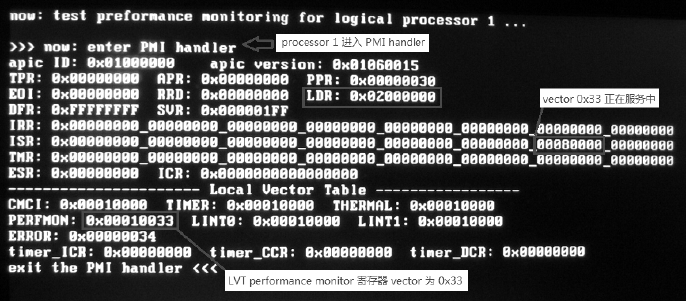

<!-- @import "[TOC]" {cmd="toc" depthFrom=1 depthTo=6 orderedList=false} -->

<!-- code_chunk_output -->

- [LVT preformance monitor 寄存器](#lvt-preformance-monitor-寄存器)
- [PMI 自动屏蔽](#pmi-自动屏蔽)

<!-- /code_chunk_output -->

我们在第 15 章已经对 Performance monitoring(性能监控)有深入的了解, 并且通过 15.3.9 节了解了性能监控的例子. 这个例子的中断 handler 是通过 local APIC 的 LVT performance monitor 寄存器来进行设置的.

# LVT preformance monitor 寄存器

在性能监控里由于被监控的事件的 counter(计数器)溢出而产生 PMI(preformance monitor interrupt), 从而需要调用 PMI handler 进行相应的处理.

那么 local APIC 里的 LVT performance monitor 寄存器需要设置来提供对 PMI handler 相应的支持, 如下所示.


当 bit 16 位的 mask 被置位时, PMI 是被屏蔽的. PMI 支持下面几种 delivery 模式.

① Fixed 模式(000B): 需要显式提供 PMI 的中断服务例程 vector.

② SMI 模式(010B): LVT performance monitor 寄存器的 vector 域必须为 0 值.

③ NMI 模式(100B): PMI 使用 NMI 的 vector 值(即 2), performance monitor 寄存器的 vector 域必须为 0.

因此, INIT 与 ExtINT delivery 模式不支持使用在 performance monitor 寄存器上.

>实验 18-15: 测试 logical processor 1 的 PMI

这个测试实验 18\-15 和实验 15\-3 的实现原理和方法是一样的. 有所不同的是, 在这里测试 logical processor 1 的 PMI, 而不是 BSP 的 PMI.

代码清单 18-37(topic18\ex18-15\protected.asm):

```x86asm
;   设置 logical processor 1 的 IPI handler
       mov esi, PROCESSOR1_IPI_VECTOR  ;  发送给处理器 1 的 IPI vector
       mov edi, processor1_ipi_handler  ;  IPI handler
       call set_interrupt_handler
       mov esi, msg0       ;  打印信息
       call puts
;  发送 IPI 消息到 processor 1
;  使用 Fixed delivery, logical 目标方式发送 IPI 给处理器 1
       mov DWORD [APIC_BASE + ICR1], 02000000h   ;  处理器 1(logical 目标)
       mov DWORD [APIC_BASE + ICR0], LOGICAL_ID | PROCESSOR1_IPI_VECTOR
```

为了让 logical processor 1 执行 PMI, 这里由 BSP 向 processor 1 发送一条 IPI 消息, 让 processor 1 执行自己的 IPI handler.

代码清单 18-38(topic18\ex18-15\protected.asm):

```x86asm
; ---------------------------------------
;  logical processor 1 的 IPI handler
;  desctiptor:
;   使用 Fixed delivery 模式
; ---------------------------------------
processor1_ipi_handler:
;  设置 LVT preformance monitor 寄存器
       mov DWORD [APIC_BASE + LVT_PERFMON], FIXED_DELIVERY | APIC_PERFMON_VECTOR
;  设置 IA32_PERFEVTSEL0 寄存器
       mov ecx, IA32_PERFEVTSEL0
       mov eax, INST_COUNT_EVENT
       mov edx, 0
       wrmsr
;  设置 counter 计数值
       mov esi, IA32_PMC0
       call write_counter_maximum
;  开启 counter
       ENABLE_IA32_PMC0
       nop
       mov DWORD [APIC_BASE + EOI], 0                ;  发送 EOI 命令
       iret
```

在 processor 1 执行的 IPI handler 里, 对 processor 1 的 performance monitor 进行设置, 这个 PMI 使用 Fixed 交付模式, 使用 IA32\_PMC0 进行计数, 监控事件是对执行了多少条指令进行监控. Processor 1 通过这个设置后, 当 counter 溢出时就产生 PMI.

代码清单 18-39(topic18\ex18-15\protected.asm):

```x86asm
; -------------------------------
;  perfmon handler
; ------------------------------
apic_perfmon_handler:
       jmp do_apic_perfmon_handler
ph_msg1 db '>>> now: enter PMI handler', 10, 0
ph_msg2 db 'exit the PMI handler <<<', 10, 0
do_apic_perfmon_handler:
       mov esi, ph_msg1     ;  打印信息
       call puts
       call dump_apic      ;  打印 local APIC 寄存器信息
;  清溢出标志位
       RESET_COUNTER_OVERFLOWr
       mov esi, ph_msg2
       call puts
;  写 EOI 命令
       mov DWORD [APIC_BASE + EOI], 0 ;  发送 EOI 命令
       iret
```

在 PMI handler 里打印出所有 local APIC 寄存器的信息, 清由 IA32_PMC0 计数器溢出产生的溢出状态标志位.

下面是在笔者的 Core i5 处理器笔记本式计算机上的运行结果.



在上面的结果里, 我们看到:

① logical processor 1 进入了 PMI handler, 它的 APIC ID 为 0x01000000, LDR 值为 0x02000000(logical ID).

② ISR 的 bit 51(0x33)位被置位, 指示 vector 为 0x33 的中断服务例程正在运行中.

③ performance monitor 寄存器的中断 vector 为 0x33.

值得注意的是, 在 processor 01 的 IPI handler(由 BSP 指定处理器 01 执行)里发生了 counter 溢出, 由于 IPI handler 正在运行中, PMI 的中断请求会被暂时抑制, 直至 IPI handler 运行完毕, 发送 EOI 命令后, PMI 处理程序才能得到响应执行.

# PMI 自动屏蔽

在上面的运行结果里, 我们看到的另一个信息是, 当进入 PMI handler 后, local APIC 将自动屏蔽 PMI(performance monitor 寄存器的 bit 16 位被置位).

因此, 在进入 PMI 后, 不能响应另一个 PMI 请求, 除非手动清 mask 位, 正如在第 15 章里所使用的例子.