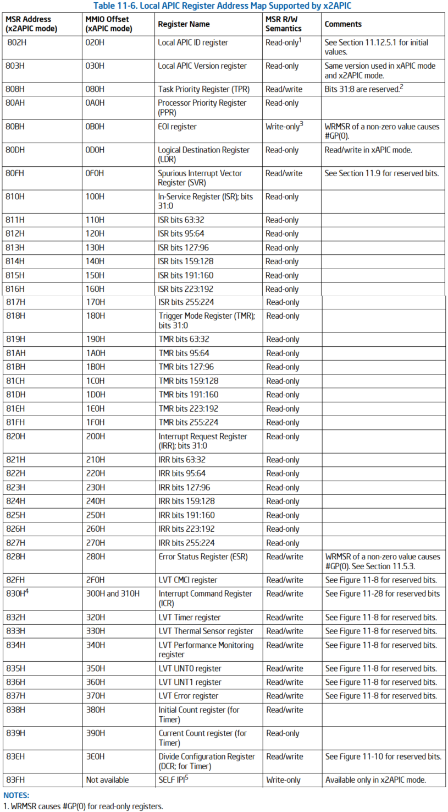

# 概述

x2APIC 是进一步扩展的版本, 并向下兼容 xAPIC, 新增了一组 MSR 寄存器来代替内存映射的寄存器.

在 x2APIC 中处理器的 ID 地址被扩展为 32 位, 后面我们将讨论到 x2APIC ID.

1) 保留与 xAPIC 架构兼容的所有关键元素.

* 交付模式

* 中断处理的优先级

* 中断源

* 中断目标类型

2) 提供扩展来扩展逻辑目标模式和物理目标模式的处理器寻址能力

3) 添加新功能以增强中断传递 (interrupt delivery) 的性能

4) 降低基于链接的平台架构上逻辑目标模式中断传递的复杂性.

5) 使用 MSR 编程接口在 x2APIC 模式下访问 APIC 寄存器, 而不是内存映射接口. 在 xAPIC 模式下运行时仅仅支持内存映射接口.

# 检测并开启 x2APIC 模式

## 访问 APIC 寄存器

## 寄存器地址空间

1) WRMSR 导致 #GP(0) 只读寄存器.

2) WRMSR 会导致尝试将 读/写 寄存器中的保留位设置为 1(包括每个寄存器的 `63:32` 位)时出现 `#GP(O)`

3) RDMSR 会导致只写寄存器出现 #GP(O).

4) MSR 831H 是保留的; 读/写 操作会导致一般保护异常. 在 MMIO 偏移位 310H 的 APIC 寄存器的内容可以在 x2APIC 模式下通过地址 830H 的 MSR 访问.

5) 仅在 x2APIC 模式下支持 SELF IPI 寄存器.

# x2APIC 寄存器可用性

# x2APIC 模式下的 MSR 访问

# MSR 和 x2APIC 寄存器在 VM-exit 的控制

# x2APIC 状态转换

reset 以后都会回到 xAPIC

接收到 INIT 状态不变