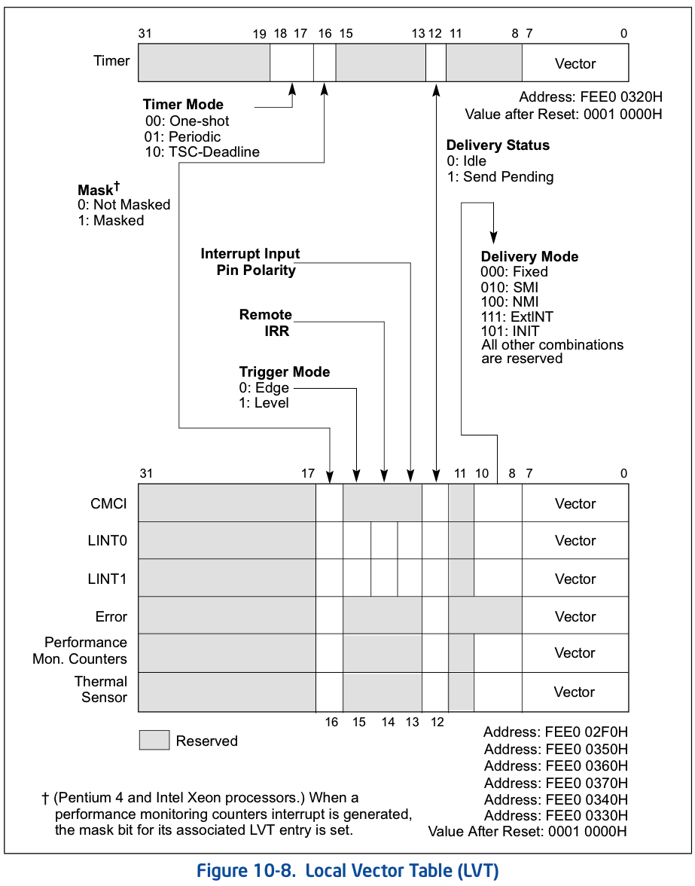

<!-- @import "[TOC]" {cmd="toc" depthFrom=1 depthTo=6 orderedList=false} -->

<!-- code_chunk_output -->

- [1. LVT 寄存器](#1-lvt-寄存器)
  - [1.1. 7 个 LVT 寄存器](#11-7-个-lvt-寄存器)
- [2. 寄存器子域](#2-寄存器子域)
  - [2.1. vector: 向量号](#21-vector-向量号)
  - [2.2. delivery mode: 交付模式](#22-delivery-mode-交付模式)
  - [2.3. delivery status(Read Only): 交付状态](#23-delivery-statusread-only-交付状态)
  - [2.4. interrupt input pin polarity](#24-interrupt-input-pin-polarity)
  - [2.5. remote IRR(Read Only)](#25-remote-irrread-only)
  - [2.6. tirgger mode: 触发模式](#26-tirgger-mode-触发模式)
  - [2.7. mask: 屏蔽位](#27-mask-屏蔽位)
  - [2.8. timer mode: timer 计数模式](#28-timer-mode-timer-计数模式)

<!-- /code_chunk_output -->

# 1. LVT 寄存器

软件设置后, **只在当前 CPU 上发生中断**. 其他 CPU 不感知.

## 1.1. 7 个 LVT 寄存器

LVT(**Local Vector Table**)寄存器是 **local APIC 本地中断源产生者**, 在新的处理器上 local APIC 支持**最多 7 个 LVT 寄存器**, 分别如下.

1) LVT CMCI 寄存器: 地址偏移量在 2F0H.

负责发送 Corrected Machine Check Error Interrupt, 即被纠正的 Machine Check Error 累积至超过一个阈值后, 便会引起一个 CMCI 中断(从至强 5500 起才有此项, 该功能默认禁止)

2) LVT Timer 寄存器: 地址偏移量在 320H.

负责发送由**APIC Timer**产生的**中断**

LVT Thermal Monitor Register, Base + 0x330

LVT Performance Counter Register, Base + 0x340(此地址仅供参考, 该寄存器具体在何处是 implementation specific 的)

LVT LINT0 Register, Base + 0x350

LVT LINT1 Register, Base + 0x360

LVT Error Register, Base + 0x370

3) LVT Thermal Monitor 寄存器: 地址偏移量在 330H.

负责发送由**温度传感器**产生的中断(从奔腾 4 起才有此项)

4) LVT Performance Counter 寄存器: 地址偏移量在 340H.

负责发送由**性能计数器**Overflow 产生的中断(从 P6 family 起才有此项)

5) LVT LINT0 寄存器: 地址偏移量在 350H.

负责**转发**来自 **LINT0 引脚**的中断

6) LVT LINT1 寄存器: 地址偏移量在 360H.

负责**转发**来自 **LINT1 引脚**的中断

7) LVT Error 寄存器: 地址偏移量在 370H.

负责发送**APIC 内部错误**时产生的中断

# 2. 寄存器子域

软件**对这些寄存器进行编程**设置, 可以**接收和产生 local interrupt 源**. 每个寄存器由若干部分组成, 并**不是每个寄存器的子域都相同**.

如上所示, 这些子域如下.

## 2.1. vector: 向量号

1) **vector**(bit7~bit0): 由软件设置 local interrupt 的**中断 vector**, 和一般的中断处理一样, 这个 vector 值被**用于在 IDT 中查找 interrupt 描述符**.

## 2.2. delivery mode: 交付模式

2) **delivery mode**(bit10~bit8): 这个 3 位值提供**5 个 delivery mode(交付模式**), 即**Fixed 模式(000B)、SMI 模式(010B)、NMI 模式(100B)、ExtINT 模式(111B), 以及 INIT 模式(101B**), 其他的组合值是保留的.

## 2.3. delivery status(Read Only): 交付状态

3) **delivery status**(bit12): 这个位指示**中断在 delivery 时的状态**,

- 0 为**idle(空闲)状态**, **当前没有中断在交付中**, 或者**中断已经交付给 processor 进行处理**;
- 1 为 pending(悬挂)状态, 当前的中断**已经 delivery**, 但**processor 未进行处理**.

只有将 delivery status 恢复 idle(空闲)状态才能允许接受**下一次中断(！！！**).

## 2.4. interrupt input pin polarity

4) **interrupt input pin polarity**(bit 13): 这个位**只用于 LVT LINT0 和 LVT LINT1 寄存器(对应于 LINT0 和 LINT1 接口**), 它们分别**对应于处理器的 INTR 和 NMI pin**.

这个位设置这**两个 pin 的 level 触发模式(水平触发！！！**):

* 为 0 时为 **high\-level**

* 为 1 时为 **low\-level**

## 2.5. remote IRR(Read Only)

remote IRR flag(bit 14): 只读的.

看上图, 这个位**只用于 LVT LINT0 和 LVT LINT1 寄存器**. 仅仅使用在 **delivery 模式为 Fixed** 并且 **level 触发模式**中.

* local APIC **已经接收并处理由 INTR 和 NMI 交付的中断**时, 会设置此 bit 为 1.

* local APIC **接收到 EOI 命令**时, 会重置此 bit 为 0.

## 2.6. tirgger mode: 触发模式

6) **trigger mode**(bit 15): **仅用于 LVT LINT0 和 LVT LINT1 寄存器**, 设置它们的**触发模式**.

- 0 为 **edge 触发**,
- 1 为 **level 触发**.

## 2.7. mask: 屏蔽位

7) **mask**(bit16): 设置 local interrupt 的**屏蔽位**, 为 1 时设置为屏蔽中断的响应.

## 2.8. timer mode: timer 计数模式

8) **timer mode**(bit18~bit17): **仅使用于 LVT Timer 寄存器**, 设置 Timer count**计数模式**.

* 00: one-shot(一次性计数);

* 01: periodic 周期计数;

* 10: TSC-deadline(指定 TSC 值计数).