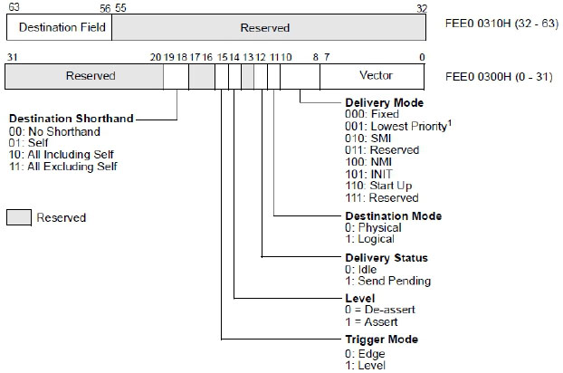

<!-- @import "[TOC]" {cmd="toc" depthFrom=1 depthTo=6 orderedList=false} -->

<!-- code_chunk_output -->

- [1. ICR 寄存器](#1-icr-寄存器)
- [2. Destination Shorthand 域](#2-destination-shorthand-域)
- [3. Destination Mode 域](#3-destination-mode-域)
- [4. Destination Field 域](#4-destination-field-域)
- [5. Lowest Priority 模式](#5-lowest-priority-模式)
- [6. Start Up 模式](#6-start-up-模式)

<!-- /code_chunk_output -->

# 1. ICR 寄存器

**logical processor** 可以使用 **ICR(interrupt command register**)向**一个**或**一组 logical processor**发送**inter-processor interrupt(IPI)进行通信**, 如实验 18-6 所示.

上图是在 **xAPIC 模式**下, **64 位**的 ICR 分为**两部分映射在物理地址**上, **高 32 位地址偏移量是 310H, 低 32 位地址偏移量是 300H**

在 **x2APIC 模式**下使用 **RDMSR 和 WRMSR 指令**访问 **64 位的 MSR 地址是 830H**.

**ICR 与 LVT 寄存器部分域作用是相同的**, 此外还新增了几个域.

注: IPI 有两个意思, `Intra-process interrupt`(处理器内部中断, 也称为 self-IPI) 和 `Inter-processor interrupt`(处理器之间中断), 所以有些资料会统称 IPIs.

# 2. Destination Shorthand 域

这个域设置发送 IPI 消息的**目标类型**.

1) 00(No Shorthand): 这个模式用户可以**自定义**提供发送的**指定目标**.

2) 01(Self): logical processor 给**自己发送 IPI 命令**.

3) 10(All including self): 给**所有 logical processor 发送 IPI 命令**, 包括自己.

4) 11(All excluding self): 给所有 logical processor 发送 IPI 命令, 但**不包括自己**.

# 3. Destination Mode 域

这个域使用在 **No Shorthand 模式**中, 提供**查找目标 processor 的方式**.

- 0 为**physical 方式**,

- 1 为**logical 方式**.

它们的使用依赖于 **LDR(Logical Destination Register**)和 **DFR(Destination Format Register**). 我们将在后面进行探讨.

# 4. Destination Field 域

这个域提供**目标 processor 地址**. 我们将在后面的发送 IPI 消息部分进行探讨.

在 ICR 的 **delivery mode**里增加了 **2 个交付模式**: **Lowest Priority 模式**和**Start Up 模式**, **去掉了 ExtINT 模式**.

# 5. Lowest Priority 模式

使用 lowest priority 交付模式匹配的**目标 logical prcessor**或**一组 logical processor**运行在**低优先级**下.

# 6. Start Up 模式

logical processor 可以发送**SIPI(Start\-Up IPI**)消息给**目标 logical prcessor**或**一组 logical processor**.

在 MP 系统里所有的 AP(Application Processor, 应用处理器)在完成自己的初始化后, 进入`wait-for-SIPI`状态.

等待从**BSP(Bootstrap Processor, 自举处理器)发送过来的 SIPI 消息**, 然后每个 AP 处理器**执行自己的配置程序**.