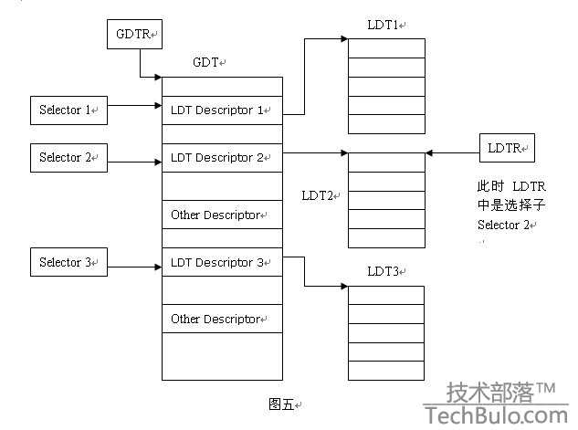

```
参考
http://blog.csdn.net/u013982161/article/details/52138155
```

## 一. 引入

保护模式下的段寄存器由 16 位的选择器与 64 位的段描述符寄存器构成.

段描述符寄存器:  存储段描述符

选择器: 存储段描述符的索引


PS: 原先实模式下的各个段寄存器作为保护模式下的段选择器 80486 中有 6 个(即 CS,SS,DS,ES,FS,GS)80 位的段寄存器. 由选择器 CS 对应表示的段仍为代码段选择器 SS 对应表示的段仍为堆栈段.

## 二. 详解

### 1、全局描述符表 GDT(Global Descriptor Table)

全局描述符表 GDT(段)存在内存中寄存器 GDTR 存放 GDT 的入口.

全局描述符表 GDT 只有一张(**一个处理器对应一个 GDT**)GDT 可以被放在内存的任何位置但 CPU 必须知道 GDT 的入口也就是基地址放在哪里 Intel 提供了一个**寄存器 GDTR 用来存放 GDT 的入口地址**程序员将 GDT 设定在内存中某个位置之后可以通过 LGDT 指令将 GDT 的入口地址装入此寄存器从此以后 CPU 就根据此寄存器中的内容作为 GDT 的入口来访问 GDT 了. GDTR 中存放的是 GDT 在内存中的基地址和其表长界限.

基地址指定 GDT 表中字节 0 在**线性地址空间**中的地址表长度指明 GDT 表的字节长度值.

GDTR 全局描述符寄存器: 48 位高 32 位存放 GDT 基址低 16 为存放 GDT 限长.

指令 LGDT 和 SGDT 分别用于加载和保存 GDTR 寄存器的内容. 在机器刚加电或处理器复位后基地址被默认地设置为 0 而长度值被设置成 0xFFFF. 在保护模式初始化过程中必须给 GDTR 加载一个新值.

### 2、段选择符(Selector)

段寄存器存放段选择符.

由 GDTR 访问全局描述符表是通过"段选择符"(实模式下的段寄存器)来完成的. 段选择符是一个 16 位的寄存器(同实模式下的段寄存器相同)


段选择子包括三部分: 描述符索引(index)、TI、请求特权级(RPL).

- index(描述符索引)部分表示所需要的**段的描述符在描述符表的位置**由这个位置再根据在 GDTR 中存储的描述符表基址就可以找到相应的描述符. 然后用描述符表中的段基址加上逻辑地址(SEL:OFFSET)的 OFFSET 就可以转换成线性地址.

- 段选择子中的 TI 值只有一位 0 或 10 代表选择子是在 GDT 选择 1 代表选择子是在 LDT 选择.

- 请求特权级(RPL)则代表选择子的特权级共有 4 个特权级(0 级、1 级、2 级、3 级).

关于特权级的说明: 任务中的每一个段都有一个特定的级别. 每当一个程序试图访问某一个段时就将该程序所拥有的特权级与要访问的特权级进行比较以决定能否访问该段. 系统约定 CPU 只能访问同一特权级或级别较低特权级的段.

例如给出逻辑地址: 21h:12345678h 转换为线性地址

a. 选择符 SEL=21h=0000000000100 0 01b 他代表的意思是: 选择子的 index=4 即 100b 选择 GDT 中的第 4 个描述符; TI=0 代表选择子是在 GDT 选择; 左后的 01b 代表特权级 RPL=1

b. OFFSET=12345678h 若此时 GDT 第四个描述符中描述的段基址(Base)为 11111111h 则线性地址=11111111h+12345678h=23456789h

### 3、段描述符(Segment Descriptor)

8 个字节 64 位每一个段都有一个对应的描述符.

根据描述符描述符所描述的对象不同描述符可分为三类: 储存段描述符系统段描述符门描述符(控制描述符). 在描述符中定义了段的基址限长和访问内型等属性. 其中基址给出该段的基础地址用于形成线性地址; 限长说明该段的长度用于存储空间保护; 段属性 说明该段的访问权限、该段当前在内存中的存在性以及该段所在的特权级.

### 4、局部描述符表 LDT(Local Descriptor Table)

局部描述符表 LDT(段)存在内存中描述这个的**描述符**存储在 GDT 中(也在内存中)对应这个描述符的选择符存储在寄存器 LDTR 中.

局部描述符表可以有若干张每个任务可以有一张. 我们可以这样理解 GDT 和 LDT: GDT 为一级描述符表 LDT 为二级描述符表. 如图



LDT 和 GDT 从本质上说是相同的只是 LDT 嵌套在 GDT 之中. 由于 LDT 本身同样是一段内存也是一个段所以它也有个描述符描述它这个描述符就存储在 GDT 中对应这个描述符也会有一个选择子 LDTR 装载的就是这样一个选择子. LDTR 记录局部描述符表的起始位置与 GDTR 不同 LDTR 的内容是一个段选择子.

LDTR 局部描述符寄存器: 16 位高 13 为存放 LDT 在 GDT 中的索引值.

LDTR 可以在程序中随时改变通过使用 lldt 指令. 如上图如果装载的是 Selector 2 则 LDTR 指向的是表 LDT2.

举个例子: 如果我们想在表 LDT2 中选择第三个描述符所描述的段的地址 12345678h.

1. 首先需要装载 LDTR 使它指向 LDT2 使用指令 lldt 将 Select2 装载到 LDTR

2. 通过逻辑地址(SEL:OFFSET)访问时 SEL 的 index=3 代表选择第三个描述符; TI=1 代表选择子是在 LDT 选择此时 LDTR 指向的是 LDT2,所以是在 LDT2 中选择此时的 SEL 值为 1Ch(二进制为 11 1 00b). OFFSET=12345678h. 逻辑地址为 1C:12345678h

3. 由 SEL 选择出描述符由描述符中的基址(Base)加上 OFFSET 可得到线性地址例如基址是 11111111h 则线性地址=11111111h+12345678h=23456789h

4. 此时若再想访问 LDT1 中的第三个描述符只要使用 lldt 指令将选择子 Selector1 装入再执行 2、3 两步就可以了(因为此时 LDTR 又指向了 LDT1)

由于每个进程都有自己的一套程序段、数据段、堆栈段有了局部描述符表则可以将每个进程的程序段、数据段、堆栈段封装在一起只要改变 LDTR 就可以实现对不同进程的段进行访问.

当进行任务切换时处理器会把新任务 LDT 的**段选择符**和段描述符自动地加载进 LDTR 中. 在机器加电或处理器复位后段选择符和基地址被默认地设置为 0 而段长度被设置成 0xFFFF.

## 三、实例

### 1. 访问 GDT


当 TI=0 时表示段描述符在 GDT 中如上图所示:

①先从 GDTR 寄存器中获得 GDT 基址.

②然后再 GDT 中以段选择器高 13 位位置索引值得到段描述符.

③段描述符符包含段的基址、限长、优先级等各种属性这就得到了段的起始地址(基址)再以基址加上偏移地址 yyyyyyyy 才得到最后的线性地址.

### 2. 访问 LDT


当 TI=1 时表示段描述符在 LDT 中如上图所示:

①还是先从 GDTR 寄存器中获得 GDT 基址.

②从 LDTR 寄存器中获取 LDT 所在段的位置索引(LDTR 高 13 位).

③以这个位置索引在 GDT 中得到 LDT 段描述符从而得到 LDT 段基址.

④用段选择器高 13 位位置索引值从 LDT 段中得到段描述符.

⑤段描述符符包含段的基址、限长、优先级等各种属性这就得到了段的起始地址(基址)再以基址加上偏移地址 yyyyyyyy 才得到最后的线性地址.

## 四、扩展

除了 GDTR、LDTR 外还有 IDTR 和 TR

### 1、中断描述符表寄存器 IDTR

与 GDTR 的作用类似 IDTR 寄存器用于存放中断描述符表 IDT 的 32 位线性基地址和 16 位表长度值. 指令 LIDT 和 SIDT 分别用于加载和保存 IDTR 寄存器的内容. 在机器刚加电或处理器复位后基地址被默认地设置为 0 而长度值被设置成 0xFFFF.

### 2、任务寄存器 TR

TR 用于寻址一个特殊的任务状态段(TaskState SegmentTSS). TSS 中包含着当前执行任务的重要信息.

TR 寄存器用于存放当前任务 TSS 段的 16 位段选择符、32 位基地址、16 位段长度和描述符属性值. 它引用 GDT 表中的一个 TSS 类型的描述符. 指令 LTR 和 STR 分别用于加载和保存 TR 寄存器的段选择符部分. 当使用 LTR 指令把选择符加载进任务寄存器时 TSS 描述符中的段基地址、段限长度以及描述符属性会被自动加载到任务寄存器中. 当执行任务切换时处理器会把新任务的 TSS 的段选择符和段描述符自动加载进任务寄存器 TR 中.