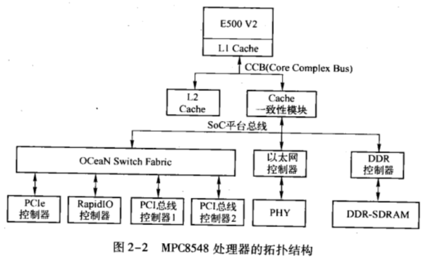
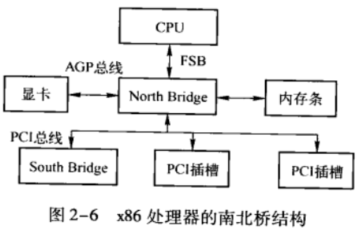
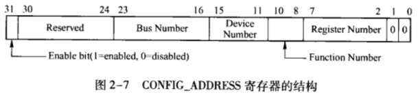

<!-- @import "[TOC]" {cmd="toc" depthFrom=1 depthTo=6 orderedList=false} -->

<!-- code_chunk_output -->

- [概述](#概述)
- [PCI 设备配置空间的访问机制](#pci-设备配置空间的访问机制)
- [存储器域地址空间到 PCI 总线域地址空间的转换](#存储器域地址空间到-pci-总线域地址空间的转换)
- [PCI 总线域地址空间到存储器域地址空间的转换](#pci-总线域地址空间到存储器域地址空间的转换)
- [x86 的 host 主桥](#x86-的-host-主桥)

<!-- /code_chunk_output -->

# 概述

本节以 MPC8548 处理器为例说明 HOST 桥在 PowerPC 处理器中的实现机制，并简要介绍 x86 处理器系统使用的 HOST 主桥。

MPC8548 处理器是 Freescale 基于 E500 V2 内核的一个 PowerPC 处理器。该处理器中集成了 DDR 控制器、多个 eTSEC (Enhanced Three-Speed Ethernet Controller)、PCI/PCI-X 和 PCIe 总线控制器等一系列接口。MPC8548 处理器的拓扑结构如图2-2 所示。

图中，MPC8548 处理器的 L1 Cache 在 E500 V2 内核中，而 L2 Cache 与 FSB 直接相连，不属于 E500 内核。值得注意的是有些高端 PowerPC 处理器的 L2 Cache 也在 CPU 中，而 L3 Cache 与 CCB 总线直接相连。

在 MPC8548 处理器中，所有外部设备，如以太网控制器、DDR 控制器和 0CeaN 连接的总线控制器都与 SoC 平台总线直接连接。而 SoC 平台总线通过 Cache 共享一致性模块与 FSB 连接。

在 MPC8548 处理器中，具有一个 32 位的 PCI 总线控制器，一个 64 位的 PCI/PCI-X 总线控制器，还有多个 PCIe 总线控制器。MPC8548 处理器使用 0CeaN 连接这些 PCI、PCI-X 和 PCIe 总线控制器。在 MPC8548 处理器系统中，PCI 设备进行 DMA 操作时，首先通过 0CeaN，之后经过 SoC 平台总线到达 DDR 控制器。

0CeaN 是 MPC8548 处理器中连接快速外设使用的交叉连总线，不仅可以连接 PCI、PCI-X 和 PCIe 总线控制器，而且可以连接 RapidIO 总线控制器。使用 0CeaN 进行互连的总线控制器可以直接通信，而不需要通过 SOC 平台总线。

# PCI 设备配置空间的访问机制

# 存储器域地址空间到 PCI 总线域地址空间的转换

# PCI 总线域地址空间到存储器域地址空间的转换

# x86 的 host 主桥

x86 处理器使用南北桥结构连接 CPU 和 PCI 设备。其中桥 (North Bridge) 连接快速设备，如显卡和内存条，并推出 PCI 总线，HOST 主桥包含在北桥中。而南桥 (South Bridge) 连接慢速设备。x86 处理器使用的南北桥结构如图2-6 所示.

Intel 使用南北桥概念统一 PC 架构。但是从体系结构的角度上看，南桥架构并不重要，北桥中存放的主要部件不过是存储器控制器、显卡控制器和 HOST 主桥而已，而南桥存放的是一些慢速设备，如 ISA 总线和中断控制器等。

不同的处理器系统集成这些组成部件的方式并不相同，如 PowerPC、MIPS 和 ARM 处理器系统通常将 CPU 和主要外部设备都集成到一颗芯片中，组成一颗基于 SC 架构的处理器系统。这些集成方式并不重要，每一个处理器系统都有其针对的应用领域，不同应用领域的需求对处理器系统的集成方式有较大的影响。Intel 采用的南北桥架构针对 86 处理器的应用领域而设计，并不能说采用这种结构一定比 MPC8548 处理器中即含有 HOST-to-PCI 主桥也含有 HOST-to-PCIe 主桥更为合理。

在许多嵌人式处理器系统中，既含有 PCI 设备也含有 PCIe 设备，为此 MPC8548 处理器同时提供了 PCI 总线和 PCle 总线接口，在这个处理器系统中 PCI 设备可以与 PCI 总线直接相连，而 PCIe 设备可以与 PCIe 总线直接相连，因此并不需要使用 PCIe 桥扩展 PCI 总线从而在一定程度上简化了嵌入式系统的设计。

嵌人式系统所面对的应用千变万化，进行芯片设计时所要考虑的因素相对较多，因而在某种程度上为设计带来了一些难度。而 x86 处理器系统所面对的应用领域针对个人 PC 和服务器，向前兼容和通用性显得更加重要。在多数情况下，一个通用处理器系统的设计难度超过专用处理器系统的设计，Intel 为此付出了极大的代价.

在一些相对较老的北桥中，如 Intel 440 系列片组中包含了 HOST 主桥，从系统软件的角度上看 HOST-to-PCI 主桥实现的功能与 HOST-to-PCIe 主桥实现的功能相近。本节仅简单介绍 Intel 的 HOST-to-PCI 主桥如何产生 PCI 的配置周期，有关 Intel HOST-to-PCIe 主桥的详细信息参见第 5 章。

> 这个 HOST-to-PCIe 主桥也是 RC (Root Complex) 的一部分.

x86 处理器定义了两个 I/O 端口寄存器，分别为 CONFIG_ADDRESS 和 CONFIG_DATA 寄存器，其地址为 0xCF8 和 0xCFC。x86 处理器使用这两个 I/O 端口访问 PCI 设备的配置空间。PCI 总线规范也以这两个寄存器为例，说明处理器如何访问 PCI 设备的配置空间。其中 CONFIG_ADDRESS 寄存器存放 PCI 设备的 ID 号，而 CONFIG_DATA 寄存器存放进行配置读写的数据。

CONFIG_ADDRESS 寄存器与 PowerPC 处理器中的 CFC_ADDR 寄存器的使用方法类似，而 CONFIG_DATA 寄存器与 PowerPC 处理器中的 CFG_DATA 寄存器的使用方法类似。CONFIG_ADDRESS 寄存器的结构如图 2-7 所示。

CONFIG_ADDRESS 寄存器的各个字段和位的说明如下所示。

* Enable 位，第 31 位。该位为 1 时，对 CONFIG_DATA 寄存器进行读写时将引发 PCI 总线的配置周期。

* Bus Number 字段，第 23~16 位，记录 PCI 设备的总线号。

* Device Number 字段，第 15~11 位，记录 PCI 设备的设备号。

* Function Number 字段，第 10~8 位，记录 PCI 设备的功能号。

* Register Number 字段，第 7~2 位，记录 PCI 设备的寄存器号。

当 x86 处理器对 CONFIG_DATA 寄存器进行 I/O 读写访问，且 CONFIG_ADDR 寄存器的 Enable 位为 1 时，HOST 主桥将这个 I/O 读写访问转换为 PCI 配置读写总线事务，然后发送到 PCI 总线上，PCI 总线根据保存在 CONFIG_ADDR 寄存器中的 ID 号，将 PCI 配置读写请求发送到指定 PCI 设备的指定配置寄存器中。

x86 处理器使用小端地址模式，因此从 CONFIG_DATA 寄存器中读出的数据不需要进行模式转换，这点和 PowerPC 处理器不同，此外 x86 处理器的 HOST 桥也实现了存储器域到 PCI 总线域的地址转换，但是这个概念在 x86 处理器中并不明晰。

本书将在第 5 章以 HOST-to-PCIe 主桥为例，详细介绍 Intel 处理器的存储器地址与 PCI 总线地址的转换关系，而在本节不对 x86 处理器的 HOST 桥做进一步说明。x86 处理器系统的升级速度较快，目前在 x86 的处理器体系结构中，已很难发现 HOST 桥的身影。

目前 Intel 对南北桥架构进行了升级，其中北桥被升级为 MCH (Memory Controller Hub)，而南桥被升级为 ICH (I/O Controller Hub)。x86 处理器系统在 MCH 中集成了存储器控制器、显卡芯片和 HOST-to-PCIe 主桥，并通过 Hub Link 与 ICH 相连；而在 ICH 中集成了一些对低速总线接口，如 AC97、LPC (Low Pin Count)、IDE 和 USB 总线，当然也包括一些低带宽的 PCIe 总线接口。

在 Intel 最新的 Nehalem 处理器系统中，MCH 被一分为二，存储器控制器和图形控制器已经与 CPU 内核集成在一个 DIE 中，而 MCH 剩余的部分与 ICH 合并成为 PCH (Peripheral Controller Hub)。但是从体系结构的角度上看，这些升级与整合并不重要。

目前 Intel 在 Menlow 平台基础上，计划推出基于 SoC 架构的 x86 处理器，以进军手持设备市场。在基于 SoC 架的 x86 处理器中将逐渐淡化 Chipset 的概念，其架构与典型的 SoC 处理器，如 ARM 和 PowerPC 处理器，较为类似。

