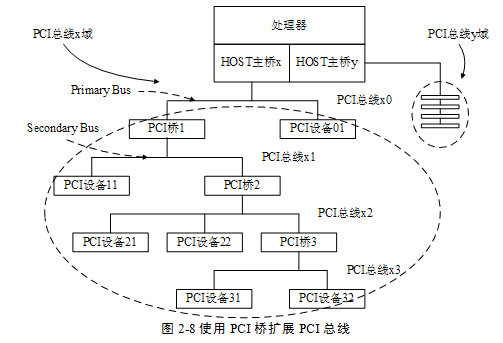

<!-- @import "[TOC]" {cmd="toc" depthFrom=1 depthTo=6 orderedList=false} -->

<!-- code_chunk_output -->

- [PCI 桥](#pci-桥)
- [PCI Agent 设备的配置空间](#pci-agent-设备的配置空间)

<!-- /code_chunk_output -->

PCI 设备都有独立的配置空间 HOST 主桥通过配置读写总线事务访问这段空间. PCI 总线规定了三种类型的 PCI 配置空间分别是 PCI Agent 设备使用的配置空间 PCI 桥使用的配置空间和 Cardbus 桥片使用的配置空间.

本节重点介绍 PCI Agent 和 PCI 桥使用的配置空间而并不介绍 Cardbus 桥片使用的配置空间. 值得注意的是在 PCI 设备配置空间中出现的地址都是 PCI 总线地址属于 PCI 总线域地址空间.

# PCI 桥

PCI 桥的引入使 PCI 总线极具扩展性也极大地增加了 PCI 总线的复杂度. PCI 总线的电气特性决定了在一条 PCI 总线上挂接的负载有限当 PCI 总线需要连接多个 PCI 设备时需要使用 PCI 桥进行总线扩展扩展出的 PCI 总线可以连接其他 PCI 设备包括 PCI 桥. 在一颗 PCI 总线树上最多可以挂接 256 个 PCI 设备包括 PCI 桥. PCI 桥在 PCI 总线树中的位置如图 2‑8 所示.

PCI 桥作为一个特殊的 PCI 设备具有独立的配置空间. 但是 PCI 桥配置空间的定义与 PCI Agent 设备有所不同. PCI 桥的配置空间可以管理其下 PCI 总线子树的 PCI 设备并可以优化这些 PCI 设备通过 PCI 桥的数据访问. PCI 桥的配置空间在系统软件遍历 PCI 总线树时配置系统软件不需要专门的驱动程序设置 PCI 桥的使用方法这也是 PCI 桥被称为透明桥的主要原因.

在某些处理器系统中还有一类 PCI 桥叫做非透明桥. 非透明桥不是 PCI 总线定义的标准桥片但是在使用 PCI 总线挂接另外一个处理器系统时非常有用非透明桥片的主要作用是连接两个不同的 PCI 总线域进而连接两个处理器系统本章将在第 2.5 节中详细介绍 PCI 非透明桥.

使用 PCI 桥可以扩展出新的 PCI 总线在这条 PCI 总线上还可以继续挂接多个 PCI 设备. PCI 桥跨接在两个 PCI 总线之间其中距离 HOST 主桥较近的 PCI 总线被称为该桥片上游总线(Primary Bus)距离 HOST 主桥较远的 PCI 总线被称为该桥片的下游总线(Secondary Bus). 如图 2‑8 所示 PCI 桥 1 的上游总线为 PCI 总线 x0 而 PCI 桥 1 的下游总线为 PCI 总线 x1. 这两条总线间的数据通信需要通过 PCI 桥 1.

通过 PCI 桥连接的 PCI 总线属于同一个 PCI 总线域在图 2‑8 中 PCI 桥 1、2 和 3 连接的 PCI 总线都属于 PCI 总线 x 域. 在这些 PCI 总线域上的设备可以通过 PCI 桥直接进行数据交换而不需要进行地址转换; 而分属不同 PCI 总线域的设备间的通信需要进行地址转换如与 PCI 非透明桥两端连接的设备之间的通信.

如图 2‑8 所示每一个 PCI 总线的下方都可以挂接一个到多个 PCI 桥每一个 PCI 桥都可以推出一条新的 PCI 总线. 在同一条 PCI 总线上的设备之间的数据交换不会影响其他 PCI 总线. 如 PCI 设备 21 与 PCI 设备 22 之间的数据通信仅占用 PCI 总线 x2 的带宽而不会影响 PCI 总线 x0、x1 与 x3 这也是引入 PCI 桥的另一个重要原因.

由图 2‑8 我们还可以发现 PCI 总线可以通过 PCI 桥组成一个胖树结构其中每一个桥片都是父节点而 PCI Agent 设备只能是子节点. 当 PCI 桥出现故障时其下的设备不能将数据传递给上游总线但是并不影响 PCI 桥下游设备间的通信. 当 PCI 桥 1 出现故障时 PCI 设备 11、PCI 设备 21 和 PCI 设备 22 将不能与 PCI 设备 01 和存储器进行通信但是 PCI 设备 21 和 PCI 设备 22 之间的通信可以正常进行.

使用 PCI 桥可以扩展一条新的 PCI 总线但是不能扩展新的 PCI 总线域. 如果当前系统使用 32 位的 PCI 总线地址那么这个系统的 PCI 总线域的地址空间为 4GB 大小在这个总线域上的所有设备将共享这个 4GB 大小的空间. 如在 PCI 总线 x 域上的 PCI 桥 1、PCI 设备 01、PCI 设备 11、PCI 桥 2、PCI 设备 21 和 PCI 设备 22 等都将共享一个 4GB 大小的空间. 再次强调这个 4GB 空间是 PCI 总线 x 域的"PCI 总线地址空间"和存储器域地址空间和 PCI 总线 y 域没有直接联系.

处理器系统可以通过 HOST 主桥扩展出新的 PCI 总线域如 MPC8548 处理器的 HOST 主桥 x 和 y 可以扩展出两个 PCI 总线域 x 和 y. 这两个 PCI 总线域 x 和 y 之间的 PCI 空间在正常情况下不能直接进行数据交换但是 PowerPC 处理器可以通过设置 PIWARn 寄存器的 TGI 字段使得不同 PCI 总线域的设备直接通信详见第 2.2.3 节.

许多处理器系统使用的 PCI 设备较少因而并不需要使用 PCI 桥. 因此在这些处理器系统中 PCI 设备都是直接挂接在 HOST 主桥上而不需要使用 PCI 桥扩展新的 PCI 总线. 即便如此读者也需要深入理解 PCI 桥的知识.

PCI 桥对于理解 PCI 和 PCIe 总线都非常重要. 在 PCIe 总线中虽然在物理结构上并不含有 PCI 桥但是与 PCI 桥相关的知识在 PCIe 总线中无处不在比如在 PCIe 总线的 Switch 中每一个端口都与一个虚拟 PCI 桥对应 Switch 使用这个虚拟 PCI 桥管理其下 PCI 总线子树的地址空间.

# PCI Agent 设备的配置空间

在一个具体的处理器应用中**PCI 设备**通常将**PCI 配置信息存放在 E2PROM**中. **PCI 设备**进行**上电初始化**时将**E2PROM**中的**信息读到 PCI 设备的配置空间**中作为**初始值**. 这个过程由**硬件逻辑完成**绝大多数 PCI 设备使用这种方式初始化其配置空间.

读者可能会对这种机制产生一个疑问如果**系统软件**在**PCI 设备**将**E2PROM**中的信息**读到配置空间之前**就开始**操作配置空间**会不会带来问题?因为此时 PCI 设备的初始值并不"正确"仅仅是 PCI 设备使用的复位值.

读者的这种担心是多余的因为 PCI 设备在配置寄存器**没有初始化完毕之前**即**E2PROM 中的内容没有导入 PCI 设备的配置空间之前**可以使用**PCI 总线规定**的"**Retry**"周期使**HOST 主桥**在**合适的时机**重新发起配置读写请求.

在 x86 处理器中**系统软件**使用 **CONFIG_ADDR！！！** 和 **CONFIG_DATA 寄存器！！！**读取**PCI 设备配置空间**的这些**初始化信息**然后根据处理器系统的实际情况**使用 DFS 算法初始化**处理器系统中**所有 PCI 设备的配置空间！！！**.

在**PCI Agent 设备**的配置空间中包含了许多寄存器这些寄存器决定了该设备在 PCI 总线中的使用方法本节不会全部介绍这些寄存器因为系统软件只对部分配置寄存器感兴趣. PCI Agent 设备使用的配置空间如图 2‑9 所示.

在 PCI Agent 设备配置空间中包含的寄存器如下所示.

(1) Device ID 和 Vendor ID 寄存器

这两个寄存器的值由 **PCISIG** 分配, **只读**. 其中 **Vendor ID** 代表 PCI 设备的**生产厂商**而 **Device ID** 代表**这个厂商**所生产的**具体设备**.

如 Intel 公司的基于 **82571EB 芯片的系列网卡**其 **Vendor ID** 为 `0x8086[1]` 而 **Device ID** 为 `0x105E[2]`.

(2) Revision ID 和 Class Code 寄存器

这两个寄存器**只读**. 其中 **Revision ID** 寄存器记载 **PCI 设备的版本号**. 该寄存器可以被认为是 **Device ID 寄存器的扩展**.

(3) Header Type 寄存器

该寄存器**只读**由**8 位**组成.

第 7 位为 1 表示当前 PCI 设备是**多功能设备**为 0 表示为**单功能设备**.

第 `6~0` 位表示**当前配置空间的类型**为**0**表示该设备使用 PCI Agent 设备的配置空间**普通 PCI 设备**都使用这种配置头; 为**1**表示使用**PCI 桥**的配置空间 PCI 桥使用这种配置头; 为**2**表示使用**Cardbus 桥片**的配置空间 Card Bus 桥片使用这种配置头本篇对这类配置头不感兴趣.

**系统软件**需要使用该寄存器**区分不同类型的 PCI 配置空间**该寄存器的初始化必须与 PCI 设备的实际情况对应而且必须为一个合法值.

(4) Cache Line Size 寄存器

该寄存器记录**HOST 处理器**使用的**Cache 行长度**. 在 PCI 总线中和 Cache 相关的总线事务如存储器写并无效和 Cache 多行读等总线事务需要使用这个寄存器. 值得注意的是该寄存器由系统软件设置但是在 PCI 设备的运行过程中只有其硬件逻辑才会使用该寄存器比如 PCI 设备的硬件逻辑需要得知处理器系统 Cache 行的大小才能进行存储器写并无效总线事务单行读和多行读总线事务.

如果 PCI 设备不支持与 Cache 相关的总线事务系统软件可以不设置该寄存器此时该寄存器为初始值 0x00. 对于 PCIe 设备该寄存器的值无意义因为 PCIe 设备在进行数据传送时在其报文中含有一次数据传送的大小 PCIe 总线控制器可以使用这个"大小"判断数据区域与 Cache 行的对应关系.

(5) Subsystem ID 和 Subsystem Vendor ID 寄存器

这两个寄存器和 Device ID 和 Vendor ID 类似也是记录 PCI 设备的生产厂商和设备名称. 但是这两个寄存器和 Device ID 与 Vendor ID 寄存器略有不同. 下文以一个实例说明 Subsystem ID 和 Subsystem Vendor ID 的用途.

Xilinx 公司在 FGPA 中集成了一个 PCIe 总线接口的 IP 核即 LogiCORE. 用户可以使用 LogiCORE 设计各种各样基于 PCIe 总线的设备但是这些设备的 Device ID 都是 0x10EE 而 Vendor ID 为 `0x0007[3]`.

(6) Expansion ROM base address 寄存器

有些 PCI 设备在处理器还没有运行操作系统之前就需要完成基本的初始化设置比如显卡、键盘和硬盘等设备. 为了实现这个"预先执行"功能 PCI 设备需要提供一段 ROM 程序而处理器在初始化过程中将运行这段 ROM 程序初始化这些 PCI 设备. Expansion ROM base address 记载这段 ROM 程序的基地址.

(7) Capabilities Pointer 寄存器

在 PCI 设备中该寄存器是**可选的**. 但是在 `PCI-X` 和 PCIe 设备中必须支持这个寄存器 Capabilities Pointer 寄存器存放 Capabilities 寄存器组的基地址 PCI 设备使用 Capabilities 寄存器组存放一些与 PCI 设备相关的扩展配置信息. 该组寄存器的详细说明见第 4.3 节.

(8) Interrupt Line 寄存器

这个寄存器是**系统软件！！！**对 PCI 设备进行**配置时写入**的. 该寄存器记录**当前 PCI 设备**使用的**中断向量号**, **设备驱动程序**可以**通过这个寄存器**判断**当前 PCI 设备**使用处理器系统中的**哪个中断向量号**并将驱动程序的**中断服务例程注册到操作系统**中[4].

该寄存器由系统软件初始化, 其保存的值与 8259A 中断控制器相关. 该寄存器的值也是由 PCI 设备与 8259A 中断控制器的连接关系决定的. 如果在一个处理器系统中**没有使用 8259A 中断控制器！！！**管理 PCI 设备的中断, 则**该寄存器中的数据并没有意义**.

> 如果由两个82599芯片级联而成，有0到15号Line，IRQ
Line表示的是用哪一根线

在多数 PowerPC 处理器系统中并不使用 8259A 中断控制器管理 PCI 设备的中断请求因此该寄存器没有意义. 即使在 x86 处理器系统中如果使用 I/O APIC 中断控制器该寄存器保存的内容仍然无效. 目前在绝大多数处理器系统中并没有使用该寄存器存放 PCI 设备使用的中断向量号.

(9) Interrupt Pin 寄存器

这个寄存器保存 PCI 设备使用的**中断引脚**. PCI 总线提供了**四个中断引脚** `INTA#`、`INTB#`、`INTC#` 和 `INTD#`. Interrupt Pin 寄存器为 1 时表示使用 `INTA#` 引脚向中断控制器提交中断请求为 2 表示使用 `INTB#` 为 3 表示使用 `INTC#` 为 4 表示使用 `INTD#`.

如果 PCI 设备只有一个子设备时, 该设备只能使用 `INTA#`; 如果有多个子设备时可以使用 INTB\~D\#信号. 如果 PCI 设备不使用这些中断引脚向处理器提交中断请求时该寄存器的值必须为 0. 值得注意的是虽然在 PCIe 设备中并不含有 INTA\~D#信号但是依然可以使用该寄存器因为 PCIe 设备可以使用 INTx 中断消息模拟 PCI 设备的 INTA\~D#信号详见第 6.3.4 节.

(10) **Base Address Register** 0\~5 寄存器

该组寄存器简称为**BAR 寄存器**BAR 寄存器保存**PCI 设备使用的地址空间的基地址！！！**该基地址保存的是**该设备在 PCI 总线域中的地址**. 其中**每一个设备**最多可以有**6 个基址空间！！！**但多数设备不会使用这么多组地址空间.

在 PCI 设备复位之后该寄存器将存放 PCI 设备需要使用的基址空间大小这段空间是 I/O 空间还是存储器空间[5] 如果是存储器空间该空间是否可预取有关 PCI 总线预读机制的详细说明见第 3.4.5 节.

**系统软件**对**PCI 总线进行配置**时首先获**得 BAR 寄存器中的初始化信息**之后根据处理器系统的配置将**合理的基地址**写入相应的**BAR 寄存器**中. 系统软件还可以使用该寄存器获得 PCI 设备使用的 BAR 空间的长度其方法是向 BAR 寄存器写入 0xFFFF-FFFF 之后再读取该寄存器.

处理器访问 PCI 设备的 BAR 空间时需要使用 BAR 寄存器提供的基地址. 值得注意的是处理器使用存储器域的地址而 BAR 寄存器存放 PCI 总线域的地址. 因此处理器系统并不能直接使用"BAR 寄存器+偏移"的方式访问 PCI 设备的寄存器空间而需要将 PCI 总线域的地址转换为存储器域的地址.

如果 x86 处理器系统使能了 IOMMU 后这两个地址也并不一定相等因此处理器系统直接使用这个 PCI 总线域的物理地址并不能确保访问 PCI 设备的 BAR 空间的正确性. 除此之外在 Linux 系统中 ioremap 函数的输入参数为存储器域的物理地址而不能使用 PCI 总线域的物理地址.

而在 pci\_devàresource[bar].start 参数中保存的地址已经经过 PCI 总线域到存储器域的地址转换因此在编写 Linux 系统的设备驱动程序时需要使用 pci\_devàresource[bar].start 参数中的物理地址然后再经过 ioremap 函数将物理地址转换为"存储器域"的虚拟地址.

(11) Command 寄存器

该寄存器为 PCI 设备的命令寄存器该寄存器在初始化时其值为 0 此时这个 PCI 设备除了能够接收配置请求总线事务之外不能接收任何存储器或者 I/O 请求. 系统软件需要合理设置该寄存器之后才能访问该设备的存储器或者 I/O 空间. 在 Linux 系统中设备驱动程序调用 pci_enable_device 函数使能该寄存器的 I/O 和 Memory Space 位之后才能访问该设备的存储器或者 I/O 地址空间.

(12) Status 寄存器

该寄存器的绝大多数位都是只读位保存 PCI 设备的状态.

(13) Latency Timer 寄存器

在 PCI 总线中多个设备共享同一条总线带宽. 该寄存器用来控制 PCI 设备占用 PCI 总线的时间当 PCI 设备获得总线使用权并使能 Frame#信号后 Latency Timer 寄存器将递减当该寄存器归零后该设备将使用超时机制停止[6]对当前总线的使用.

如果当前总线事务为 Memeory Write and Invalidate 时需要保证对一个完整 Cache 行的操作结束后才能停止当前总线事务. 对于多数 PCI 设备而言该寄存器的值为 32 或者 64 以保证一次突发传送的基本单位为一个 Cache 行.

PCIe 设备不需要使用该寄存器该寄存器的值必须为 0. 因为 PCIe 总线的仲裁方法与 PCI 总线不同使用的连接方法也与 PCI 总线不同.