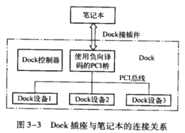
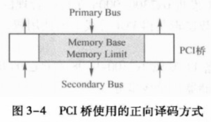

PCI设备的数据传递使用地址译码方式，当一个存储器读写总线事务到达PCI总线时在这条总线上的所有PCI设备将进行地址译码，如果当前总线事务使用的地址在某个PCI设备的 BAR空间中时，该PCI设备将使能DEVSEL#信号，认领这个总线事务。

如果PCI总线上的所有设备都不能通过地址译码，认领这个总线事务时，这条总线的“负向译码”设备将认领这个总线事务，如果在这条PCI总线上没有“负向译码”设备，该总线事务的发起者将使用 Master Abort 总线周期结束当前 PCI 总线事务。

# PCI 设备的正向译码与负向译码

如上文所述，PCI设备使用“地址译码”方式接收存储器读写总线请求。在PCI总线中定义了两种“地址译码”方式，一种是正向译码，另一种是负向译码。

下面仍以图3-2所示的处理器系统为例，说明数据传送使用的寻址方法。当HOST主桥通过存储器或者I/O读写总线事务访问其下所有PCI设备时，PCI总线0下的所有PCI设备都将对出现在地址周期中的PCI总线地址进行译码。如果这个地址在某个PCI设备的BAR空间中命中时，这个PCI设备将接收这个PCI总线请求。这个过程也被称为PCI总线的正向译码，这种方式也是大多数PCI设备所采用的译码方式。

但是在PCI总线上的某些设备，如PCI-0-(E)ISA桥并不使用正向译码接收来自PCI总线的请求，PCI-t0-ISA桥在处理器系统中的位置如图1-1所示。PCI总线0上的总线事务在三个时钟周期后，没有得到任何PCI设备响应时(即总线请求的PCI总线地址不在这些设备的BAR空间中)，PCI-t0-ISA桥将被动地接收这个数据请求。这个过程被称为PCI总线的负向译码。可以进行负向译码的设备也被称为负向译码设备。

在PCI总线中，除了PCI-10-(E)ISA桥可以作为负向译码设备，PCI桥也可以作为负向译码设备，但是PCI桥并不是在任何时候都可以作为负向译码设备。在绝大多数情况下PCI桥无论是处理“来自上游总线”，还是处理“来自下游总线”的总线事务时，都使用正向译码方式，但是在某些特殊应用中，PCI桥也可以作为负向译码设备。

笔记本在连接 Dock 插座时，也使用了PCI桥。因为在大多数情况下，笔记本与 Dock 插座是分离使用的，而且Dock插座上连接的设备多为慢速设备，此时用于连接Dock插座的PCI桥使用负向译码。Dock插座在笔记本系统中的位置如图3-3所示。

当笔记本与Dock建立连接之后，如果处理器需要访问Dock中的外部设备时，Dock中的PCI桥将首先使用负向译码方式接收PCI总线事务，之后将这个PCI总线事务转发到Dock的PCI总线中，再访问相应的PCI设备。

在Dock中使用负向译码PCI桥的优点是，该桥管理的设备并不参与处理器系统对PCI总线的枚举过程。当笔记本插入到Dock之后，系统软件并不需要重新枚举Dock中的设备并为这些设备分配系统资源，而仅需要使用负向译码PCI桥管理好其下的设备即可，从而极大降低了 Dock 对系统软件的影响。

当HOST处理器访问Dock中的设备时，负向译码PCI桥将首先接管这些存储器读写总线事务，然后发送到Dock设备中。值得注意的是，在许多笔记本的Dock实现中，并没有使用负向译码 PCI桥，而使用PCI-to-ISA 桥。

PCI总线规定使用负向译码的PCI桥，其BaseClass Code寄存器为0x06，Sub Class Code寄存器为0x04，而Interface 寄存器为0x01; 使用正向译码方式的PCI桥的Inerface 寄存器为0x00。系统软件(E’PROM)在初始化Interace寄存器时务必注意这个细节。

综上所述，在PCI总线中有两种负向译码设备，PCI-t0-E(ISA)桥和PCI桥。但PCI桥并非在任何时候都是负向译码设备，只有PCI桥连接Dock插座时，PCI桥的PrimaryBus才使用负向译码方式。而这个 PCI桥的 Secondary Bus 在接收 Dock 设备的请求时仍然使用正向译码方式。

PCI桥使用的正向译码方式与PCI设备使用的正向译码方式有所不同。如图3-4所示，当一个总线事务是从PCI桥的PrimaryBus到SecondaryBus时，PCI桥使用的正向译码方式与PCI设备使用的方式类似。如果该总线事务使用的地址在PCI桥任意一个MemoryBase窗口(PCI桥除了具有Memory Base窗口外，还有/0 Base 窗口和 Prefetchable Memory Base 窗口)命中时，该PCI桥将使用正向译码方式接收该总线事务，并根据实际情况决定是否将这个总线事务转发到 Secondary Bus。

当一个总线事务是从PCI桥的SecondaryBus到PrimaryBus时，如果该总线事务使用的地址没有在PCI桥所有的MemoryBase窗口命中，表明当前总线事务不是访问该PCI桥管理的PCI子树中的设备，因此PCI桥将接收当前总线事务，并根据实际情况决定是否将这个总
线事务转发到Primary Bus。

以图3-2为例，当PCI设备11访问主存储器空间时，首先将存储器读写总线事务发送到PCI总线1上，而这个存储器地址显然不会在PCI总线1的任何PCI设备的 BAR 空间中，此时PCI桥1将认领这个PCI总线的数据请求，并将这个总线事务转发到PCI总线0上。最后HOST主桥将接收这个总线事务，并将PCI总线地址转换为存储器域的地址，与主存储器进行读写操作。

值得注意的是，PCI总线并没有规定HOST主桥使用正向还是负向译码方式接收这个存储器读写总线事务，但是绝大多数HOST主桥使用正向译码方式接收来自下游的存储器读写总线事务。在PowerPC处理器中，如果当前存储器读写总线事务使用的地址在Inbound窗口内，HOST主桥将接收这个总线事务，并将其转换为存储器域的读写总线事务，与主存储器进行数据交换。

# 处理器到 PCI 设备的数据传送

下面以图3-2所示的处理器系统为例，说明处理器向PCI设备11进行存储器写的数据传送过程。处理器向PCI设备进行读过程与写过程略有区别，因为存储器写使用Posted方式，而存储器读使用Non-Posted方式，但是存储器读使用的地址译码方式与存储器写类似，因此本节对处理器向PCI设备进行存储器读的过程不做进一步介绍。

PCI设备11在PCI总线域的地址范围是0x7300-0000~0x73FF-FFFF。这段空间在存储器域中对应的地址范围是0xF300-0000~0xF3FF-FFFF。下面假设处理器使用存储器写指令访问0xF300-0008 这个存储器地址，其步骤如下。

(1) 存储器域将0xF300-0008这个地址发向HOST主桥，0xF000-0000~0xF7FF-FFFF 这段地址已经由HOST主桥映射到PCI总线域地址空间，所以HOST主桥认为这是一个对PCI设备的访问。因此HOST主桥将首先接管这个存储器写请求。

(2) HOST主桥将存储器域的地址0xF300-0008转换为PCI总线域的地址 0x7300-0008并通过总线仲裁获得PCI总线0的使用权，启动PCI存储器写周期，并将这个存储器写总线事务发送到PCI总线0上。值得注意的是，这个存储器读写总线事务使用的地址为0x7300-
0008，而不是0xF300-0008。

(3) PCI总线0的PCI桥1发现0x7300-0008在自己管理的地址范围内，于是接管这个存储器写请求，并通过总线仲裁逻辑获得PCI总线1的使用权，并将这个请求转发到PCI总线1上。

(4) PCI总线1的PCI设备11发现0x7300-0008在自己的BARO寄存器中命中，于是接收这个PCI写请求，并完成存储器写总线事务。

# PCI 设备的 DMA 操作

下面以图3-2所示的处理器系统为例，说明PCI设备11向存储器进行DMA写的数据传
送过程。PCI设备的DMA写使用Posted方式而DMA读使用Non-Posted方式。本节不介绍PCI设备进行 DMA 读的过程，而将这部分内容留给读者分析。

假定PCI设备11需要将一组数据发送到0x1000-0000~0x1000-FFFF这段存储器域的地址空间中。由上文所述，存储器域的0x0000-0000~0x7FFF-FFFF这段存储器空间与PCI总线域的0x8000-0000~0xFFFF-FFFF这段PCI总线地址空间对应。

PCI设备11并不能直接操作0x1000-0000~0x1000-FFFF这段存储器域的地址空间，PCI设备11需要对 PCI总线域的地址空间0x9000-0000~0x9000-FFFF进行写操作，因为PCI总线地址空间0x9000-0000~0x9000-FFFF已经被HOST主桥映射到0x1000-0000~0x1000-FFFF这段存储器域。这个DMA写具体的操作流程如下。

(1) 首先PCI设备11通过总线仲裁逻辑获得PCI总线1的使用权，之后将存储器写总线事务发送到PCI总线1上。值得注意的是，这个存储器写总线事务的目的地址是PCI总线域的地址空间0x9000-0000~0x9000-FFFF，这个地址是主存储器在PCI总线域的地址映像。

(2) PCI总线1上的设备将进行地址译码，确定这个写请求是不是发送到自己的BAR空间，在PCI总线1上的设备除了PCI设备11之外，还有PCI桥2和PCI桥1。

(3) 首先PCI桥1、2和PCI设备11对这个地址同时进行正向译码。PCI桥1发现这个PCI地址并不在自己管理的PCI总线地址范围之内，因为PCI桥片1所管理的PCI总线地址空间为0x7000-0000~0x73FF-FFFF。此时PCI桥1将接收这个存储器写总线事务，因为PCI桥1所管理的PCI总线地址范围并不包含当前存储器写总线事务的地址，所以其下所有PCI设备都不可能接收这个存储器写总线事务。

(4) PCI桥1发现自己并不能处理当前这个存储器写总线事务，则将这个存储器写总线事务转发到上游总线。PCI桥1首先通过总线仲裁逻辑获得PCI总线0的使用权后，然后将这个总线事务转发到PCI总线0。

(5) HOST主桥发现0x9000-0000~0x9000-FFFF这段PCI总线地址空间与存储器域的存储器地址空间0x1000-0000~0x1000-FFFF对应，于是将这段PCI总线地址空间转换成为存储器域的存储器地址空间，并完成对这段存储器的写操作。

(6) 存储器控制器将从 HOST 主桥接收数据，并将其写人到主存储器。

PCI设备间的数据传递与PCI设备到存储器的数据传送大体类似。我们以PCI设备11将数据传递到PCI设备42为例说明这个转递过程。我们假定PCI设备11将一组数据发送到PCI设备42的PCI总线地址0x7500-0000~0x7500-FFFF这段地址空间中。这个过程与PCI设备11将数据发送到存储器的第1~5步基本类似，只是第5、6步不同。PCI设备11将数据发送到 PCI设备42的第5、6步如下所示。

(5) PCI总线0发现其下的设备PCI桥4能够处理来自PCI总线0的数据请求，则PCI桥4将接管这个PCI写请求，并通过总线仲裁逻辑获得PCI总线4的使用权，之后将这个存储器写请求发向PCI总线4。此时HOST主桥不会接收当前存储器写总线事务，因为0x7500-0000~0x7500-FFFF这段地址空间并不是HOST主桥管理的地址范围。

(6) PCI总线4的PCI设备42将接收这个存储器写请求，并完成这个PCI存储器写请求总线事务。

PCI总线树内的数据传送始终都在PCI总线域中进行，不存在不同域之间的地址转换因此PCI设备11向PCI设备42进行数据传递时，并不会进行PCI总线地址空间到存储器地址空间的转换。

# PCI 桥的 Combining、Merging 和 Collapsing