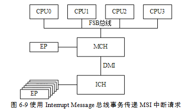

<!-- @import "[TOC]" {cmd="toc" depthFrom=1 depthTo=6 orderedList=false} -->

<!-- code_chunk_output -->

- [Message Address 字段和 Message Data 字段的格式](#message-address-字段和-message-data-字段的格式)
  - [PCIe 设备使用 Message Adress 字段](#pcie-设备使用-message-adress-字段)
  - [Message Data 字段](#message-data-字段)
- [FSB Interrupt Message 总线事务](#fsb-interrupt-message-总线事务)

<!-- /code_chunk_output -->

**PCIe 设备**发出 **MSI\-X 中断请求**的方法与发出 **MSI 中断请求**的方法类似, 都是向 **Message Address** 所在的地址写 **Message Data 字段包含的数据**.

只是 `MSI-X` 中断机制为了支持**更多的中断请求**, 在 MSI-X Capablity 结构中存放了一个**指向一组 Message Address 和 Message Data 字段**的**指针**, 从而一个 PCIe 设备可以支持的 **MSI\-X 中断请求数目大于 32 个**, 而且并不要求中断向量号连续. MSI\-X 机制使用的这组 Message Address 和 Message Data 字段存放在 PCIe 设备的 **BAR** 空间中, 而不是在 PCIe 设备的配置空间中, 从而可以由**用户决定**使用 MSI\-X 中断请求的数目.

当**系统软件**初始化 PCIe 设备时, 如果该 PCIe 设备使用 MSI\-X 机制传递中断请求, 需要对 MSI\-X Capability 结构指向的 **Message Address** 和 **Message Data** 字段进行设置, 并使能 `MSI-X Enable` 位.

x86 处理器在此处的实现与 PowerPC 处理器有较大的不同.

# Message Address 字段和 Message Data 字段的格式

在 **x86 处理器系统**中, **PCIe 设备**也是通过向 **Message Address 写入 Message Data 指定的数值**实现 `MSI/MSI-X` 机制.

在 x86 处理器系统中 PCIe 设备使用的 Message Adress 字段和 Message Data 字段与 PowerPC 处理器不同.

## PCIe 设备使用 Message Adress 字段

在 x86 处理器系统中, **PCIe 设备**使用的 **Message Address 字段**仍然保存 **PCI 总线域的地址**. 其格式如下图所示.

其中第 `31~20` 位存放 **FSB Interrupts 存储器空间的基地址**, 其值为 **0xFEE**. 当 **PCIe 设备**对 `0xFEEX-XXXX` 这段 "**PCI 总线域**" 的**地址空间**进行**写操作**时, `MCH/ICH` 将会首先进行 "PCI 总线域" 到 "**存储器域**" 的地址转换, 之后将**这个写操作**翻译为 **FSB 总线**的 **Interrupt Message 总线事务**, 从而**向 CPU 提交中断请求**.

x86 处理器使用 **FSB Interrupt Message 总线事务**转发 `MSI/MSI-X` **中断请求**. 使用这种方法的**优点**是向 CPU 内核提交中断请求的同时, **提交 PCIe 设备使用的中断向量**, 从而 **CPU 不需要使用中断响应周期从寄存器中获得中断向量**. FSB Interrupt Message 总线事务的详细说明见下文.

Message Address 字段其他位的含义如下所示.

- `Destination ID` 字段保存**目标 CPU 的 ID 号**, 目标 CPU 的 ID 与该字段相等时, **目标 CPU** 将**接收**这个 **Interrupt Message**. FSB Interrupt Message 总线事务可以向不同的 CPU 提交中断请求.

- **RH**(`Redirection Hint Indication`)位

  - 为 0 时, 表示 **Interrupt Message** 将**直接发**向与 Destination ID 字段相同的目标 CPU;

  - 为 1 时, 将**使能中断转发功能**.

- **DM**(`Destination Mode`)位表示在传递优先权最低的中断请求时,  `Destination ID` 字段是否被翻译为 Logical 或者 Physical APIC ID. 在 x86 处理器中 **APIC ID** 有三种模式分别为 **Physical**、**Logical** 和 **Cluster ID** 模式.

- 如果 RH 位为 1 且 DM 位为 0 时, Destination ID 字段使用 **Physical** 模式; 如果 RH 位为 1 且 DM 位为 1, Destination ID 字段使用 **Logical** 模式; 如果 RH 位为 0, DM 位将被忽略.

## Message Data 字段

Message Data 字段的格式如图所示

Trigger Mode 字段为 **0b0x** 时, PCIe 设备使用**边沿触发**方式申请中断；为 **0b10** 时使用**低电平触发**方式；为 **0b11** 时使用**高电平触发**方式.

`MSI/MSI-X` 中断请求使用**边沿触发**方式, 但是 FSB Interrupt Message 总线事务还支持 `Legacy INTx` 中断请求方式, 因此在 Message Data 字段中仍然支持**电平触发**方式. 但是对于 **PCIe 设备**而言, 该字段为 **0b0x**.

Vector 字段表示这个中断请求使用的**中断向量**. FSB Interrupt Message 总线事务在提交中断请求的同时, 将中断向量也通知给处理器. 因此使用 FSB Interrupt Message 总线事务时, 处理器不需要使用中断响应周期通过读取中断控制器获得中断向量号. 与 PowerPC 的传统方式相比, x86 处理器的这种中断请求的效率较高.

值得注意的是, 在 x86 处理器中, MSI 机制使用的 Message Data 字段与 MSI-X 机制相同. 但是当一个 PCIe 设备支持多个 MSI 中断请求时, 其 Message Data 字段必须是连续的, 因而其使用的 Vector 字段也必须是连续的, 这也是在 x86 处理器系统中, PCIe 设备支持多个 MSI 中断请求的问题所在, 而使用 MSI-X 机制有效避免了该问题.

Delivery Mode 字段表示如何处理来自 PCIe 设备的中断请求.

* 该字段为 0b000 时, 表示使用"Fixed Mode"方式. 此时这个中断请求将被 Destination ID 字段指定的 CPU 处理.

边沿触发和电平触发是中断请求常用的两种方式. 其中电平触发指外部设备使用逻辑电平 1(高电平触发)或者 0(低电平触发), 提交中断请求. 使用电平或者边沿方式提交中断请求时, 外部设备一般通过中断线(IRQ_PIN#)与中断控制器相连, 其中多个外部设备可能通过相同的中断线与中断控制器相连(线与或者与门).

# FSB Interrupt Message 总线事务

与 MPC8572 处理器处理 MSI 中断请求不同**x86 处理器使用 FSB 的 Interrupt Message 总线事务处理 PCIe 设备的 MSI/MSI-X 中断请求**. 由上文所示 MPC8572 处理器处理 MSI 中断请求时首先由 MPIC 中断控制器截获这个 MSI 中断请求之后由 MPIC 中断控制器向 CPU 提交中断请求而 CPU 通过中断响应周期从 MPIC 中断控制器的 ACK 寄存器中获得中断向量.

采用这种方式的主要问题是当一个处理器中存在多个 CPU 时这些 CPU 都需要通过中断响应周期从 MPIC 中断控制器的 ACK 寄存器中获得中断向量. 在一个中断较为密集的应用中 ACK 寄存器很可能会成为系统瓶颈. 而采用 Interrupt Message 总线事务可以有效地避免这种系统瓶颈因为使用这种方式中断信息和中断向量将同时到达指定的 CPU 而不需要使用中断响应周期获得中断向量.

x86 处理器也具有通过中断控制器提交 MSI/MSI-X 中断请求的方法在 I/O APIC 具有一个 "The IRQ Pin Assertion Register"寄存器该寄存器地址为 0xFEC00020(该寄存器在存储器域和 PCI 总线域中的地址都为 0xFEC00020),其第 4~0 位存放 IRQ Number. 系统软件可以将 PCIe 设备的 Message Address 寄存器设置为 0xFEC00020 将 Meaasge Data 寄存器设置为相应的 IRQ Number.

当 PCIe 设备需要提交 MSI 中断请求时将向 PCI 总线域的 0xFEC00020 地址写入 Message Data 寄存器中的数据. 此时这个存储器写请求将数据写入 I/O APIC 的 The IRQ Pin Assertion Register 中并由 I/O APIC 将这个 MSI 中断请求最终发向 Local APIC 之后再由 Local APIC 通过 INTR#信号向 CPU 提交中断请求.

上述步骤与 MPC8572 处理器传递 MSI 中断的方法类似. 在 x86 处理器中这种方式基本上已被弃用. 下文以图 6‑9 为例说明 x86 处理器如何使用 FSB 总线的 Interrupt Message 总线事务向 CPU 提交 MSI/MSI-X 中断请求.

PCIe 设备在发送 MSI/MSI-X 中断请求之前, **系统软件**需要合理设置 PCIe 设备 MSI/MSI-X Capability 寄存器, 使 Message Address 寄存器的值为 **0xFEExx00y**(其中 xx 表示 APIC ID 而 y 为 `RH + DM`), 同时合理地设置 Message Data 寄存器 Vector 字段.

**PCIe 设备**提交 MSI/MSI-X 中断请求时, 需要向 **0xFEExx00y** 地址写 **Message Data** 寄存器中包含的数据, 并以**存储器写 TLP** 的形式发送到 **RC**. 如果 **ICH** 收到这个存储器写 TLP 时, 将通过 **DMI 接口**将这个 TLP 提交到 **MCH**. **MCH** 收到这个 TLP 后, 发现这个 TLP 的目的地址在 **FSB Interrupts 存储器空间**中, 则将 PCIe 总线的存储器写请求转换为 **Interrupt Message 总线事务**, 并在 FSB 总线上广播.

FSB 总线上的 CPU, 根据 APIC ID 信息, 选择是否接收这个 Interrupt Message 总线事务, 并进入中断状态, 之后该 CPU 将直接从这个总线事务中获得中断向量号, 执行相应的中断服务例程, 而不需要从 APIC 中断控制器获得中断向量. 与 PowerPC 处理器的 MPIC 中断控制器相比, 这种方法更具优势.

