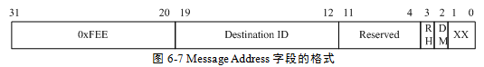
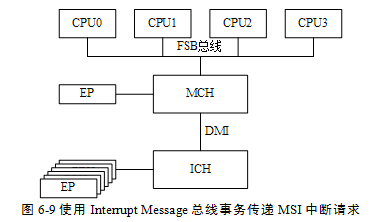

<!-- @import "[TOC]" {cmd="toc" depthFrom=1 depthTo=6 orderedList=false} -->

<!-- code_chunk_output -->

- [Message Address 字段和 Message Data 字段的格式](#message-address-字段和-message-data-字段的格式)
  - [PCIe 设备使用 Message Adress 字段](#pcie-设备使用-message-adress-字段)
- [FSB Interrupt Message 总线事务](#fsb-interrupt-message-总线事务)

<!-- /code_chunk_output -->

**PCIe 设备**发出**MSI\-X 中断请求**的方法与发出**MSI 中断请求**的方法类似都是**向 Message Address 所在的地址写 Message Data 字段包含的数据**. 只是 MSI\-X 中断机制为了支持**更多的中断请求**在 MSI\-X Capablity 结构中存放了一个**指向一组 Message Address 和 Message Data 字段**的**指针**从而一个 PCIe 设备可以支持的**MSI\-X 中断请求数目大于 32 个**而且并不要求中断向量号连续. MSI\-X 机制使用的这组 Message Address 和 Message Data 字段存放在 PCIe 设备的 BAR 空间中而不是在 PCIe 设备的配置空间中从而可以由用户决定使用 MSI\-X 中断请求的数目.

当系统软件初始化 PCIe 设备时如果该 PCIe 设备使用 MSI\-X 机制传递中断请求需要对 MSI\-X Capability 结构指向的 Message Address 和 Message Data 字段进行设置并使能 MSI\-X Enable 位. x86 处理器在此处的实现与 PowerPC 处理器有较大的不同.

# Message Address 字段和 Message Data 字段的格式

在**x86 处理器系统**中**PCIe 设备**也是通过向**Message Address 写入 Message Data 指定的数值**实现 MSI/MSI\-X 机制. 在 x86 处理器系统中 PCIe 设备使用的 Message Adress 字段和 Message Data 字段与 PowerPC 处理器不同.

## PCIe 设备使用 Message Adress 字段

在 x86 处理器系统中 **PCIe 设备**使用的**Message Address 字段**仍然保存 PCI 总线域的地址其格式如图 6‑7 所示.

其中第 31\~20 位存放**FSB Interrupts 存储器空间的基地址**其值为 0xFEE. 当 PCIe 设备对 0xFEEX-XXXX 这段"PCI 总线域"的地址空间进行写操作时 MCH/ICH 将会首先进行"PCI 总线域"到"存储器域"的地址转换之后将这个写操作翻译为 FSB 总线的 Interrupt Message 总线事务从而向 CPU 内核提交中断请求.

x86 处理器**使用 FSB Interrupt Message 总线事务转发 MSI/MSI-X 中断请求**. 使用这种方法的优点是向 CPU 内核提交中断请求的同时提交 PCIe 设备使用的中断向量从而 CPU 不需要使用中断响应周期从寄存器中获得中断向量. FSB Interrupt Message 总线事务的详细说明见下文.

Message Address 字段其他位的含义如下所示.

- Destination ID 字段保存目标 CPU 的 ID 号目标 CPU 的 ID 与该字段相等时目标 CPU 将接收这个 Interrupt Message. FSB Interrupt Message 总线事务可以向不同的 CPU 提交中断请求.
- RH(Redirection Hint Indication)位为 0 时表示 Interrupt Message 将直接发向与 Destination ID 字段相同的目标 CPU; 如果 RH 为 1 时将使能中断转发功能.
- DM(Destination Mode)位表示在传递优先权最低的中断请求时 Destination ID 字段是否被翻译为 Logical 或者 Physical APIC ID. 在 x86 处理器中 APIC ID 有三种模式分别为 Physical、Logical 和 Cluster ID 模式.
- 如果 RH 位为 1 且 DM 位为 0 时 Destination ID 字段使用 Physical 模式; 如果 RH 位为 1 且 DM 位为 1Destination ID 字段使用 Logical 模式; 如果 RH 位为 0DM 位将被忽略.

以上这些字段的描述与 x86 处理器使用的 APIC 中断控制器相关. 对 APIC 的详细说明超出了本书的范围对此部分感兴趣的读者请参阅 Intel 64 and IA-32 Architectures Software Developer’s Manual Volume 3A: System Programming Guide, Part 1.

# FSB Interrupt Message 总线事务

与 MPC8572 处理器处理 MSI 中断请求不同**x86 处理器使用 FSB 的 Interrupt Message 总线事务处理 PCIe 设备的 MSI/MSI-X 中断请求**. 由上文所示 MPC8572 处理器处理 MSI 中断请求时首先由 MPIC 中断控制器截获这个 MSI 中断请求之后由 MPIC 中断控制器向 CPU 提交中断请求而 CPU 通过中断响应周期从 MPIC 中断控制器的 ACK 寄存器中获得中断向量.

采用这种方式的主要问题是当一个处理器中存在多个 CPU 时这些 CPU 都需要通过中断响应周期从 MPIC 中断控制器的 ACK 寄存器中获得中断向量. 在一个中断较为密集的应用中 ACK 寄存器很可能会成为系统瓶颈. 而采用 Interrupt Message 总线事务可以有效地避免这种系统瓶颈因为使用这种方式中断信息和中断向量将同时到达指定的 CPU 而不需要使用中断响应周期获得中断向量.

x86 处理器也具有通过中断控制器提交 MSI/MSI-X 中断请求的方法在 I/O APIC 具有一个 "The IRQ Pin Assertion Register"寄存器该寄存器地址为 0xFEC00020(该寄存器在存储器域和 PCI 总线域中的地址都为 0xFEC00020),其第 4~0 位存放 IRQ Number. 系统软件可以将 PCIe 设备的 Message Address 寄存器设置为 0xFEC00020 将 Meaasge Data 寄存器设置为相应的 IRQ Number.

当 PCIe 设备需要提交 MSI 中断请求时将向 PCI 总线域的 0xFEC00020 地址写入 Message Data 寄存器中的数据. 此时这个存储器写请求将数据写入 I/O APIC 的 The IRQ Pin Assertion Register 中并由 I/O APIC 将这个 MSI 中断请求最终发向 Local APIC 之后再由 Local APIC 通过 INTR#信号向 CPU 提交中断请求.

上述步骤与 MPC8572 处理器传递 MSI 中断的方法类似. 在 x86 处理器中这种方式基本上已被弃用. 下文以图 6‑9 为例说明 x86 处理器如何使用 FSB 总线的 Interrupt Message 总线事务向 CPU 提交 MSI/MSI-X 中断请求.

**PCIe 设备在发送 MSI/MSI-X 中断请求之前系统软件需要合理设置 PCIe 设备 MSI/MSI-X Capability 寄存器使 Message Address 寄存器的值为 0xFEExx00y(其中 xx 表示 APIC ID 而 y 为 RH+DM)同时合理地设置 Message Data 寄存器 Vector 字段**.

PCIe 设备提交 MSI/MSI-X 中断请求时需要向 0xFEExx00y 地址写 Message Data 寄存器中包含的数据并以存储器写 TLP 的形式发送到 RC. 如果 ICH 收到这个存储器写 TLP 时将通过 DMI 接口将这个 TLP 提交到 MCH. MCH 收到这个 TLP 后发现这个 TLP 的目的地址在 FSB Interrupts 存储器空间中则将 PCIe 总线的存储器写请求转换为 Interrupt Message 总线事务并在 FSB 总线上广播.

FSB 总线上的 CPU 根据 APIC ID 信息选择是否接收这个 Interrupt Message 总线事务并进入中断状态之后该 CPU 将直接从这个总线事务中获得中断向量号执行相应的中断服务例程而不需要从 APIC 中断控制器获得中断向量. 与 PowerPC 处理器的 MPIC 中断控制器相比这种方法更具优势.