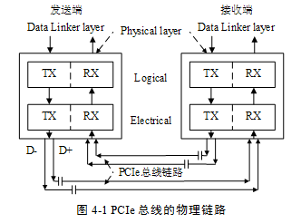
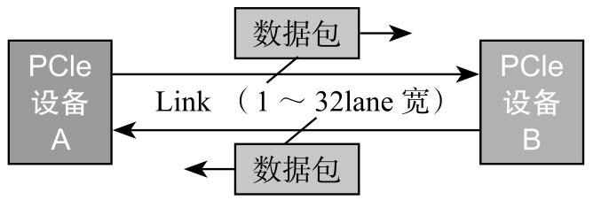
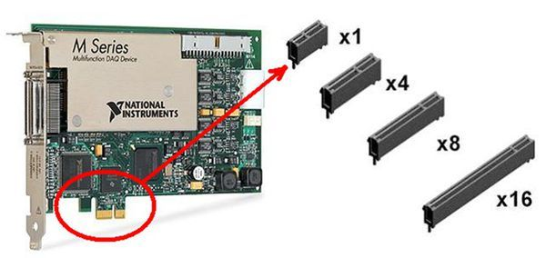
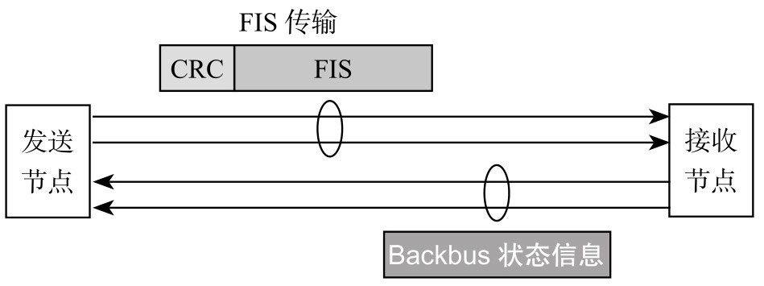
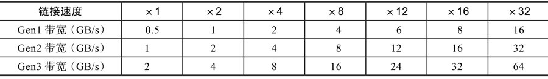
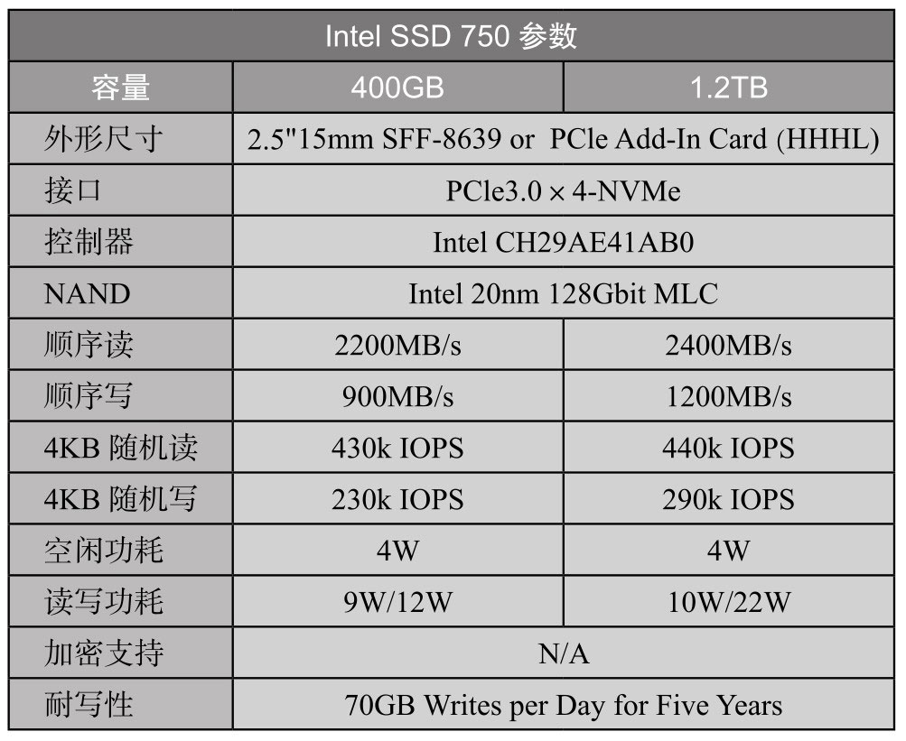
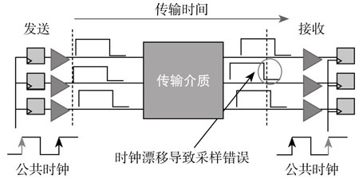

<!-- @import "[TOC]" {cmd="toc" depthFrom=1 depthTo=6 orderedList=false} -->

<!-- code_chunk_output -->

- [1. 并行总线到高速差分总线](#1-并行总线到高速差分总线)
- [2. PCIe 总线](#2-pcie-总线)
  - [2.1. Lane](#21-lane)
  - [2.2. Link](#22-link)
- [3. 工作模式](#3-工作模式)
  - [3.1. 全双工模式](#31-全双工模式)
  - [3.2. 半双工模式](#32-半双工模式)
- [4. 带宽](#4-带宽)
  - [4.1. 带宽的计算](#41-带宽的计算)
    - [4.1.1. PCIe1.0](#411-pcie10)
    - [4.1.2. PCIe2.0](#412-pcie20)
    - [4.1.3. PCIe3.0](#413-pcie30)
  - [4.2. 速度和成本](#42-速度和成本)
  - [4.3. IOPS](#43-iops)
- [5. 并口和串口](#5-并口和串口)
- [6. todo](#6-todo)

<!-- /code_chunk_output -->

# 1. 并行总线到高速差分总线

随着现代处理器技术的发展在互连领域中使用**高速差分总线**替代**并行总线**是大势所趋. 与**单端并行信号**相比, **高速差分信号**可以使用更高的时钟频率, 从而使用更少的信号线, 完成之前需要许多单端并行数据信号才能达到的总线带宽.

**PCI 总线**使用**并行总线**结构, 在**同一条总线上的所有外部设备共享总线带宽**, 而 PCIe 总线使用了**高速差分总线**, 并**采用端到端的连接方式**, 因此在**每一条 PCIe 链路中只能连接两个设备**.

这使得 PCIe 与 PCI 总线采用的拓扑结构有所不同. PCIe 总线除了在连接方式上与 PCI 总线不同之外, 还使用了一些在网络通信中使用的技术, 如支持多种数据路由方式, 基于多通路的数据传递方式, 和基于报文的数据传送方式, 并充分考虑了在数据传送中出现服务质量 QoS (`Quality of Service`)问题.

# 2. PCIe 总线

与 PCI 总线不同, PCIe 总线使用**端到端的连接方式**, 在一条 **PCIe 链路**的两端只能**各连接一个设备**, 这两个设备**互为数据发送端和数据接收端**.

PCIe 总线除了**总线链路**外, 还具有多个层次, 发送端发送数据时将通过这些层次, 而接收端接收数据时也使用这些层次. **PCIe 总线使用的层次结构与网络协议栈较为类似**.

> 也就是分层

## 2.1. Lane

一个 lane: **一组不同的信号对**, **一对**用来**传送**, **一对**用来**接收**. 由于 PCIE 使用差分信号传输, **一条 lane 四条线**, 两条线组成一对, 供发送. 另外两条接收!

PCIe 链路使用"**端到端的数据传送方式**", **发送端**和**接收端**中都含有**TX(发送逻辑**)和**RX(接收逻辑**)其结构如图 4‑1 所示.



由上图所示在**PCIe 总线的物理链路**的一个**数据通路(Lane！！！可能有多个数据通路！！！**)中由**两组！！！差分信号**共**4 根信号线！！！组成**.

- 其中**发送端的 TX 部件**与**接收端的 RX 部件**使用**一组差分信号！！！**连接该**链路**也被称为**发送端的发送链路**也是**接收端的接收链路**;

- 而**发送端的 RX 部件**与**接收端的 TX 部件**使用**另一组差分信号**连接该链路也被称为发送端的接收链路也是接收端的发送链路.

PCIe3.0 x1、x2、x4 指的是 PCIe 连接的**通道**(Lane)数目. 类似于**单车道**、**2 车道**、**4 车道**. PCIe 最多可以有 32 个 Lane.

> 因为 PCIe 中**发送通道和接收通道是分开的**, 所以这里 **单/2/4 车道**是指**发送通道的数目**或**接收通道的数目**,  类似于**高速公路的左右两侧分开**. 所以**总通道数目 = 2/4/8**
>
> x1(**一条 lane**) 对应 (**来向的一条路** + **去向的一条路**)

PCIe Lane 类比高速公路通道:


**高速差分信号电气规范**要求其**发送端(！！！)串接一个电容**以进行 AC 耦合. 该电容也被称为 AC 耦合电容. **PCIe 链路**使用**差分信号进行数据传送(！！！**)**一个差分信号**由 **D+ 和 D- 两根信号**组成**信号接收端**通过**比较这两个信号的差值**判断**发送端**发送的是**逻辑"1**"还是**逻辑"0**".

与单端信号相比**差分信号抗干扰的能力更强**因为**差分信号**在**布线(！！！**)时要求"**等长**"、"**等宽**"、"**贴近**"而且在**同层**. 因此**外部干扰噪声**将被"**同值**"而且"**同时**"加载到 `D+` 和 `D-` 两根信号**上其**差值**在**理想情况下为 0**对**信号的逻辑值产生的影响较小(！！！**). 因此差分信号可以使用**更高的总线频率**.

此外使用**差分信号**能**有效抑制电磁干扰 EMI(Electro Magnetic Interference**). 由于差分信号 `D+` 与 `D-` 距离很近而且信号幅值相等、极性相反. 这两根线与地线间耦合电磁场的幅值相等将相互抵消因此差分信号对外界的电磁干扰较小. 当然差分信号的缺点也是显而易见的一是**差分信号**使用**两根信号**传送**一位数据**; 二是差分信号的**布线相对严格一些**.

## 2.2. Link

Link: The collection of two Ports and their interconnecting Lanes. A Link is a dual-simplex communications path between two components. 两个 Ports 之间所连接的 Lanes 的集合. 一个 Link 是在两个部件之间的一个双工通信通道.

**两个设备之间的 PCIe 连接**, 叫作**一个 Link**.

PCIe Link 的概念:



> 一个 link 可能有 1 ~ 32 lane, 每个 lane 包含了上图中一条向左的和一条向右的
>
> 类比到高速公路, x1(**一条 lane**) 对应 (**来向的一条路** + **去向的一条路**)

**一个 PCIe 链路(物理链路**, link)可以由**多个 Lane** 组成. 目前 PCIe 链路可以支持**1、2、4、8、12、16 和 32 个 Lane**即**×1**、×2、×4、×8、×12、×16 和**×32** 宽度的 **PCIe 链路**. **每一个 Lane**上**使用的总线频率**与**PCIe 总线使用的版本**相关.



# 3. 工作模式

## 3.1. 全双工模式

两个 PCIe 设备之间, 有**专门的发送通道和接收通道**(类比到高速公路, 分别对应的是**左右两侧**, 而**两侧分别是单行的**), 数据可以**同时**往两个方向传输(**左侧车道和右侧车道可以同时跑**).

PCIe Spec 称这种工作模式为**双单工模式**(`Dual-Simplex`), 可以理解为**全双工模式**.

## 3.2. 半双工模式

SATA 工作模式:



和 PCIe 一样, SATA 也有**独立的发送通道和接收通道**, 但与 PCIe 工作模式不一样, **同一时间**, **只有一条通道(高速公路只有一侧可用)可以进行数据传输**. 也就是说, 对一个节点而言, 在**一条通道上发送数据**, **就不能在另外一条通道上接收数据**, 反之亦然.

这种工作模式称为**半双工模式**.

> 两个设备之间的 link 同时只能有一个 lane 在工作
>
> PCIe 犹如我们的手机, 双方可以同时讲话; 而 SATA 就是对讲机了, 一个人在说话, 另外一个人就只能听不能说.

# 4. 带宽

为什么 **SSD 要使用 PCIe 接口**? 因为比 SATA 快.

PCIe 各代的带宽:



> 本章内容仅限于 PCIe 3.0 或更早

> 因为接收通道和发送通道是分开的, x1(**一条 lane**) 对应 (**来向的一条路** + **去向的一条路**)

所以表中的带宽, 比如 `PCIe3.0×1`, 带宽为 `2GB/s`, 是指**双向带宽**, 即**读写带宽**. 如果单指读或者写, 该值应该减半, 即` 1GB/s` 的**读速度**或者**写速度**.

## 4.1. 带宽的计算

PCIe 是串行总线

### 4.1.1. PCIe1.0

PCIe1.0 的**线上比特传输速率**为 `2.5Gbps`, 物理层使用 **8/10 编码**, 即 8bit 的数据, 实际在物理线路上是需要**传输 10 bit**的, 多余的 2bit 用来校验.

> Gbps, bit per second; 1 Byte(B) = 8 bit(b)

因此:

```
PCIe1.0 ×1 的带宽 = (2.5Gbps × 2(双向通道) x (8bit / 10bit)) / 8(1B=8b) = 0.5GB/s
```

> 这里也提到了: **一条 lane 是双向通道**

这是**单条 Lane 的带宽**, 有几条 Lane, 那么**整个带宽**计算就是用 **0.5GB/s 乘以 Lane 的数目**.

### 4.1.2. PCIe2.0

PCIe2.0 的线上比特传输速率在 PCIe1.0 的基础上翻了一倍, 为 **5Gbps**, 物理层同样使用 8/10 编码, 所以:

```
PCIe2.0×1 的带宽 = (5Gbps × 2(双向通道) x (8bit / 10bit)) / 8(1B=8b) = 1GB/s
```

同样, 有多少条 Lane, **带宽**就是 **1GB/s 乘以 Lane 的数目**.

### 4.1.3. PCIe3.0

PCIe3.0 的线上比特传输速率没有在 PCIe2.0 的基础上翻倍, 不是 10Gbps, 而是 8Gbps, 但物理层使用的是 `128/130` 编码进行数据传输, 所以:

```
PCIe3.0×1 的带宽 = (8Gbps × 2(双向通道) × (128bit / 130bit)) / 8(1B=8b) ≈ 2GB/s
```

同样, 有多少条 Lane, **带宽**就是 **2GB/s 乘以 Lane 的数目**.

由于采用了 128/130 编码, 每 128bit 的数据, 只额外增加了 2bit 的开销, 有效数据传输比率增大, 虽然线上比特传输率没有翻倍, 但有效数据带宽还是在 PCIe2.0 的基础上实现翻倍.

## 4.2. 速度和成本

和 SATA 单通道不同, PCIe 连接可以**通过增加通道数扩展带宽**, 弹性十足. 通道数越多, **速度越快**. 不过, 通道数越多, **成本越高**, **占用更多空间**, **还有就是更耗电**.

因此, 使用多少通道, 应该在性能和其他因素之间进行一个综合考虑. 单考虑性能的话, PCIe 最高带宽可达 64GB/s, 即 PCIe 3.0×32 对应的带宽, 这是很恐怖的一个数据. 不过, 现有的 PCIe SSD 一般最多使用 4 通道, 如 PCIe3.0x4, 双向带宽为 8GB/s, 读或者写带宽为 4GB/s.

Intel PCIe SSD 750 规格书:



## 4.3. IOPS

在此, 顺便来算算 PCIe3.0×4 理论上最大的 4KB IOPS.

`PCIe3.0×4` 理论**最大读或写的速度**为 4GB/s, 不考虑协议开销, 每秒可以传输 4GB/4KB 个 4KB 大小的 IO, 该值为 1M, 即理论上最大 IOPS 为 1000k.

因此, 一个 SSD, 不管底层用什么介质, 闪存还是 3D XPoint, 接口速度就这么快, 最大 IOPS 是不可能超过这个值的.

# 5. 并口和串口

PCIe 是从 PCI 发展过来的, PCIe 的"e"是 express 的简称, 表示"**快**".

PCIe 怎么就能比 PCI(或者 PCI-X)快呢?那是因为 PCIe 在物理传输上, 跟 PCI 有着本质的区别:

* **PCI** 使用 **并口传输** 数据

* **PCIe** 使用 **串口传输** 数据

PCI 并行总线, **单个时钟周期**可以传输 **32bit** 或 **64bit**, 怎么比不了**单个时钟周期**传输 **1 个 bit** 数据的串行总线呢?

并行传输时序在**实际时钟频率比较低**的情况下, 并口因为可以同时传输若干比特, 速率确实比串口快, 如图所示.

并行传输时序:



随着技术的发展, 要求数据传输速率越来越快, 要求时钟频率也越来越快, 但是, 并行总线时钟频率不是想快就能快的.

在发送端, 数据在某个时钟沿传出去(左边时钟第一个上升沿), 在接收端, 数据在下个时钟沿(右边时钟第二个上升沿)接收. 因此, 要在接收端能正确采集到数据, 要求时钟的周期必须大于数据传输的时间(从发送端到接收端的时间, Flight Time), 受限于数据传输时间(该时间还随着数据线长度的增加而增加), 因此时钟频率不能做得太高. 另外, 时钟信号在线上传输的时候, 也会存在相位偏移(Clock Skew ), 影响接收端的数据采集. 由于采用并行传输, 接收端必须等最慢的那个 bit 数据到了以后, 才能锁住整个数据.

PCIe 使用串行总线进行数据传输就没有这些问题. 它没有外部时钟信号, 它的时钟信息通过 8/10 编码或者 128/130 编码嵌入在数据流, 接收端可以从数据流里面恢复时钟信息, 因此, 它不受数据在线上传输时间的限制, 导线多长、数据传输频率多快都没有问题. 没有外部时钟信号, 自然就没有所谓的相位偏移问题. 由于是串行传输, 只有一个 bit 传输, 所以不存在信号偏移(Signal Skew)问题. 但是, 如果使用多条 Lane 传输数据(串行中又有并行), 这个问题又回来了, 因为接收端同样要等最慢的那个 Lane 上的数据到达才能处理整个数据. 不过, 你不用担心, PCIe 自己能解决好这个问题.


# 6. todo

bus 0 的设备是没有 hot-plug 功能, 必须通过 root port 连接 endpoint 或者 switch


switch 的 upstream port 不是 endpoint, 注意 end 这个概念, 这个 upstream port 是有 hot-plug 功能的, 所以上面必须接 root port

switch 中的 upstream port 有路由转发功能, 往下的 switch 内部线只有一根, 数据都会往下发, 下面的 downstream port 会判断包是不是自己的.

> switch 内部一根线多根线


memory controller 是 host bridge 的一个 function, 而不是一个独立的 device.


rc 可以包含多个 root port


Memory Base + limit 是为 TLP 地址路由用的, 是下面所有设备的 BAR 空间范围, 所以会预留空间, 等有设备时候从保留的中分配.


