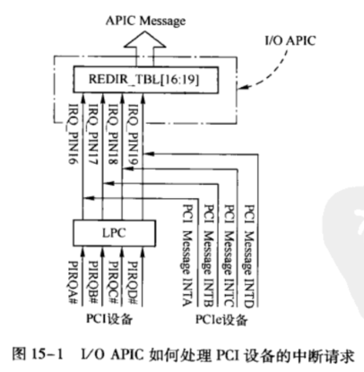
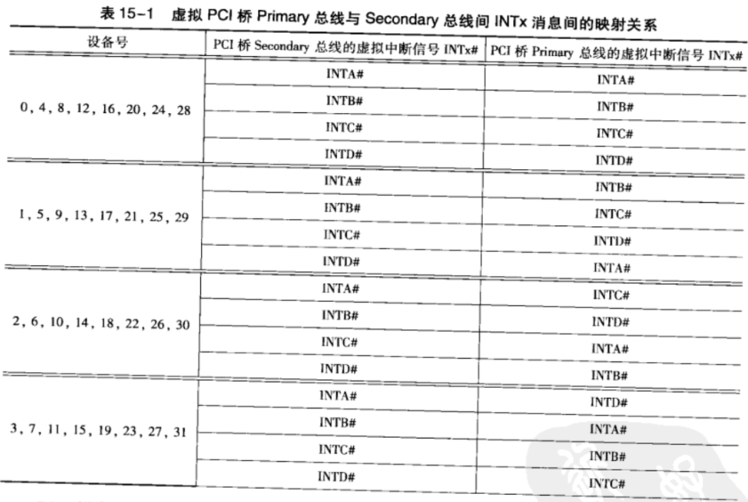
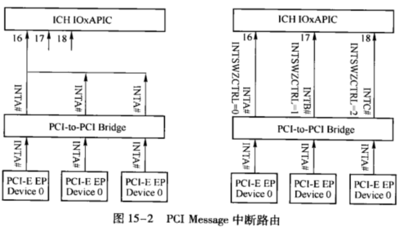
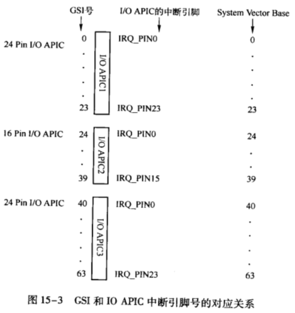
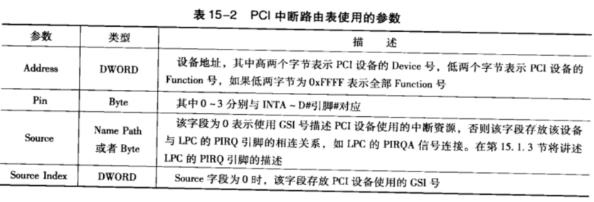

# 硬件连接结构

## APIC 体系

I/O APIC 位于 LPC 控制器中(`Architecture\0. 基本架构\x86\0. Learning\2. x86_64编程体系探索及编程\第4篇 中断体系\第17章 8259中断控制器\0. LPC控制器.md`)

## PCI 设备

> PCI 设备(`INTA~D#`) -> LPC(`PIRQA~D#`) -> I/O APIC(`IRQ_PIN16~19#`)

在多数 x86 处理器系统中, 

* **PCI 设备**的 `INTA~D#` 四个中断请求信号与 **LPC** 接口提供的**外部引脚** `PIRQA~D#` 相连;

* 之后 **LPC** 的 `PIRQA~D#` 再与 **I/O APIC** 的中断请求信号 `IRQ_PIN16~19#` 相连.

## PCIe 设备

> PCIe 设备(`INTA~D#`) -> I/O APIC(`IRQ_PIN16~19#`)

如果 **PCIe 设备**没有使用 MSI 中断请求机制, 而是使用了 `Legacy INTx` 方式 (**I/O APIC** 将这种方式称为 **PCI Messege**. PCIe 设备可以通过 `INTx` 中断消息报文, 向 I/O APIC 提交中断请求, 详见第 6.3.4 节.) 模拟 `INTA~D#` 信号时, 这些 Assert INTx 和 Deassert INTx 消息也由 Chipset 处理, 并由 Chipset 将这些消息转换为一根硬件引脚, 然后将这个硬件引脚与 `I/O APIC` 的中断输入引脚相连. 

其连接关系如前图所示. 



无论 PCI 设备, 还是 PCIe 设备都最终到 `I/O APIC`, 而 `I/O APIC` 最终使用 `REDIR_TBL` 表, 将来自输入引脚的**中断请求**发送至 **Local APIC**, 并由 CPU 进一步处理这个中断请求.

## 引脚对应关系

本书并不关心 I/O APIC 如何使用 APIC Message 将中断消息传递给 LocaL APIC, 而重点关注 **PCI** 和 **PCIe** 设备使用的**中断信号**与 **I/O APIC 输入引脚** `IRQ_PIN16~19#` 的连接关系.

如前图 15-1 所示, **LPC** 的 `PIRQA~D#` 分别与 **I/O APIC** 的 `IRQ_PIN16~19#` 对应;

> 现代 I/O APIC 的 `IRQ_PIN16~23#` 可以用来连接 8 个 PCI 设备. I/O APIC 在 LPC 中, 所以 

但是 **PCI 设备**的 `INTA~D#` 与 **LPC** 的 `PIRQA~D#` 的连接关系并**不是唯一**的, 图 15-1 所示的 PCI 设备与中断控制器连接方法只是其中一种连接方法.

> PCIe 设备也是一样的.

## PCI 中断路由表

而无论硬件采用何种连接结构, **系统软件**都需要能够正确识别是**哪个 PCI 设备**发出的中断请求, 为此系统软件使用 **PCI 中断路由表** (PCI Interrupt Routing Table) 记录 **PCI 设备**使用的 `INTA~D#` 与 **I/O APIC** 中断输人引脚 `IRQ16~19` 的对应关系.


如果在 x86 处理器系统中存在 **Switch** (PCIe 系统存在, PCI 系统中不存在), 而这个 Switch 的**每一个端口**都相当于**一个虚拟 PCI 桥**, 当 **Switch** 的**下游端口**收到 PCI Message INTx 消息后, 将通过虚拟 PCI 桥**向上传递**这个消息. 值得注意的是, **虚拟 PCI 桥**可能会**改变** PCI Message INTx 消息, 如将设备号为 1 的 `INTA#` 消息转换为 `INTB#` 消息.

在**虚拟 PCI 桥**中, **Primary** 总线和 **Secondary** 总线 PCI Message INTx 消息的对应关系如表 15-1 所示.



**PCIe 设备**发送的 **PCI Message INTx 消息**首先到达虚拟 PCI 桥的 **Secondany** 总线, 之后**虚拟 PCI 桥**根据 PCIe 设备的**设备号**将这些 PCI Message INTx 消息**转换**为 **Primany** 总线合适的**虚拟中断信号**. 如**设备号为 1** 的 PCIe 设备使用 `PCI Message INTA` 消息进行中断请求时, 该消息在通过**虚拟 PCI 桥**后, 将被转换为 **PCI Message INTB** 消息, 然后**继续传递**该消息报文, 最终 PCI Message INTx 消息将到达 **RC**, 并由 **RC** 将该消息报文转换为**虚拟中断信号 INTx**, 并与 `I/O APIC` 的中断请求引脚 `IRQ_PIN16~19` 相连.

然而**直接使用 PCIe 总线**提供的标准方法会带来一些问题. 因为**一条 PCe 链路**只能挂接**一个 EP**, 这个 EP 的**设备号通常为 0**(device number), 而**这些设备**使用的虚拟**中断信号**多为 `INTA#`, 因此这些 PCIe 设备通过 Switch 的虚拟 PCI-to-PCI 桥进行中断路由后, 将使用虚拟中断信号 `INTA#` 并与 I/O APIC 的 `IRQ_PIN16` 引脚相连, 并不会使用其他 `IRQ_PIN` 引脚, 这造成了 `IRQPIN16` 的**负载过重**. 其连接拓扑结构如图 15-2 所示.



如上图所示, **PCIe 设备**使用的 **INTx** 中断请求都最终使用 `I/O APIC` 的 **IRQ_PIN16 引脚**从而造成了这个引脚所申请的中断过于密集, 因此采用**这种中断路由方法并不合理**. 为此 Intel 在 **5000** 系列的 **Chipset** 中使用了 **Interrupt Swizzling** 技术将这些来自 PCIe 设备的中断请求**平均分配**到 I/O APIC 的 `IRQ_PIN16~19` 引脚中.

在图 15-2 中, **Chipset** 设置了一个 **INTSWZCTRL** 寄存器, 通过这些寄存器可以将 PCIe 设备提交的中断请求均衡地发送至 I/O APIC 中.

* 如果一个 EP 对应的 INISWZCTRL 位为 0, 则该设备的 `INTA#` 将与 **IROPIN16** 相连;

* 如果为 1, 将与 **IROPIN17** 相连, 并以此类推, 最终实现中断请求的负载均衡.

在一个 x86 处理器系统中, PCI 设备或者 PCIe 设备使用的中断信号 `INTA~D#` 与 `I/O APIC` 的 `IRO_PIN16~19` 之间的**对应关系并不明确**, **各个厂商**完全可以按照需要**定制其映射关系**. 这为系统软件的设计带来了不小的麻烦. 为此 **BIOS** 为系统软件提供了一个 **PCI 中断路由表**, 存放这个映射关系, **ACPI** 规范将这个中断路由表存放在 **DSDT** 中.

值得注意的是, **每一个 HOST 主桥**和**每一条 PCI 总线**都含有一个**中断路由表**. 在讲述 PCI 中断路由表之前, 我们简要回顾 Linux 系统如何为 PCI 设备分配中断向量.

# PCI 设备如何获取 irq 号

在 Linux 系统中, PCI 设备使用的 irq 号存放在 `pdev->irq` 参数中, 该参数在 Linux **设备驱动**程序进行**初始化**时, 由 `pci_enable_device` 函数设置. 本书在第 12.3.2 节曾简要介绍过这个函数, 下文进一步说明如何使用该函数设置 PCI 设备的 irq 号. `pci_enable_device` 函数将依次调用 `__pci_enable_device_flags` -> `do_pci_enable_device` -> `pcibios_enable_device` 函数设置 PCI 设备使用的 irq 号.

`pcibios_enable_device` 函数将调用 `pcibios_enable_irq` 函数, 设置 PCI 设备使用的 irq 号. 如果处理器系统使能了 **ACPI** 机制, `pcibios_enable_irq` 函数将被赋值为 `acpi_pci_irq_enable`. `acpi_pci_irq_enable` 函数在 `./drivers/acpi/pci_irq.c` 文件中, 其实现过程如源代码 15-1 所示

```cpp
// drivers/acpi/pci_irq.c
int acpi_pci_irq_enable(struct pci_dev *dev)
{
	int irq = 0;
	u8 pin = 0;
	int triggering = ACPI_LEVEL_SENSITIVE;
	int polarity = ACPI_ACTIVE_LOW;
	char *link = NULL;
	char link_desc[16];
	int rc;

	pin = dev->pin;
	if (!pin) {
		ACPI_DEBUG_PRINT((ACPI_DB_INFO,
				  "No interrupt pin configured for device %s\n",
				  pci_name(dev)));
		return 0;
	}

	entry = acpi_pci_irq_lookup(dev, pin);
	if (!entry) {
		/*
		 * IDE legacy mode controller IRQs are magic. Why do compat
		 * extensions always make such a nasty mess.
		 */
		if (dev->class >> 8 == PCI_CLASS_STORAGE_IDE &&
				(dev->class & 0x05) == 0)
			return 0;
	}

	if (entry) {
        // I/O APIC
		if (entry->link)
            // 分配了一个 GSI
			gsi = acpi_pci_link_allocate_irq(entry->link,
							 entry->index,
							 &triggering, &polarity,
							 &link);
        // 8259A
		else
			gsi = entry->index;
	} else
		gsi = -1;

	if (irq < 0) {
		dev_warn(&dev->dev, "PCI INT %c: no GSI", 'A' + pin);
		/* Interrupt Line values above 0xF are forbidden */
		if (dev->irq > 0 && (dev->irq <= 0xF)) {
			printk("- using IRQ %d\n", dev->irq);
			acpi_register_gsi(&dev->dev, dev->irq,
					  ACPI_LEVEL_SENSITIVE,
					  ACPI_ACTIVE_LOW);
			return 0;
		} else {
			printk("\n");
			return 0;
		}
	}
    // 将 GSI 转换成 irq
	rc = acpi_register_gsi(&dev->dev, gsi, triggering, polarity);
	if (rc < 0) {
		dev_warn(&dev->dev, "PCI INT %c: failed to register GSI\n",
			 pin_name(pin));
		return rc;
	}
	dev->irq = rc;
	...
	return 0;
}
```

该函数首先调用 `acpi_pci_irq_lookup` -> `acpi_pci_irq_find_prt_entry` 函数, 从 `acpi_prt_list` 链表中获得一个 `acpi_prt_entry` 结构的 **entry**. 在 `acpi_prt_list` **链表**中存放 PCI 总线的**中断路由表**, 本章将在第 15.1.2 节进一步介绍该表. 在这个 entry 中, 存放

* PCI 设备使用的 Segment, Bus, Device 和 Function 号;

* PCI 设备使用的**中断请求信号** (`INTA# ~ INTD#`);

* **GSI**(ClobalSystem Interrupt) 号.

这段程序在获得 entry 后, 将判断 `entry->link` 是否为空, 如果为空, 表示当前 x86 处理器系统使用 **I/O APIC 管理外部中断**, 而不是使用 8259A. 在 Intel 的 **ICH9** 中集成了**两个中断控制器**, 一个是 **8259A**, 另一个是 I/O APIC. Linux x86 通过软件配置, 决定究竟使用哪个中断控制器, 在绝大多数情况下, Linux x86 使用 `I/O APIC` 而不是 8259A 管理外部中断请求 200. 本章不再关心 8259A 中断控制器, 因此也不再关心 `entry->link` 不为空的处理情况 (Linux IA 在引导时可以加入 "noapic" 参数关闭 I/O APIC, 此时处理器系统将使用 8259A 中断控制器).

这段程序在获得 **GSI** 号之后, 将调用 `acpi_register_gsi` 函数, 将 **GSI** 号**转换**为系统软件使用的 **irq** 号. `acpi_register_gsi` 函数使用三个入口参数, 分别为 **GSI 号**, **中断触发方式**和**采用电平触发时的极性**. 其中 PCI 设备使用**低电平触发**方式.

`acpi_register_gsi` 函数执行完毕后, 将为 PCI 设备分配一个 irq 号, 这个 irq 号是**系统软件使用**的, 之后 PCI 设备的驱动程序可以使用 `request_irq` 函数将**中断服务例程**与 **irq** 号建立**映射**关系; 该函数还将设置 I/O APIC 的 `REDIR_TBL` 表, 将 **GSI** 号与 `REDIR_TBL` 表中的中断向量建立对应关系, 同时初始化与操作系统相关的 irq 结构 (在 Linux 系统中, 该结构为 `irq_desc`, 该结构记录与 irq 号相关的信号). 为了深入理解 acpi_register_gsi 函数, 读者需要理解 GSI 号, I/O APIC 的 REDIR_TBL 表, IRQ_PIN 引脚和 Linux 使用的 irq 号之间的对应关系.

GSI 号是 ACPI 规范引入的, 用于记录 I/O APIC 的 IRO_PIN 引脚号的参数. 如果 x86 处理器系统使用 I/O APIC 管理外部中断请求, 而且在这个处理器系统中具有多个 I/O APIC 控制器, 那么 GSI 号与 I/O APIC 中断引脚号的对应关系如图 15-1 所示.



假设在一个 x86 处理器系统中存在 3 个 I/O APIC, 其中有两个 I/O APIC 的外部中断引脚数为 24 根, 另外一个 I/O APIC 的外部中断引脚数为 16 根. 其中 GSI 号的 0~23 与 I/O APIC1 的 IRQ_PIN0-23 对应; GSI 号的 24~39 与 I/O APIC2 的 IRQ_PINO~15 对应; 而 CSI 号的 40~63 与 I/O APIC3 的 IRQ_PINO~23 对应. ACPI 规范为统一起见使用 GSI 号描述外部设备与 /O APIC 中断引脚的连接关系.

I/O APIC 的 IRQ_PIN 引脚与外部设备的中断请求引脚相连, 如 I/O APIC1 的 IRQPIN16 与某个 PCI 设备的 INTA# 相连. 值得注意的是, PCI 设备的 INTA# 信号首先与 LPC 的 PIRQA# 信号相连, 而 PIRQA# 信号再与 I/O APIC1 的 IRO_PIN16 相连. 其中 I/O APIC 集成在 ICH 中, 因此这些 IRQ_PIN 引脚并没有从 ICH 中引出.

REDIR_TBL 表中存放对 IRQ_PIN 引脚的描述, 一个 I/O APIC 具有多少个 IRO_PIN 引脚, REDIR_TBL 表就由多少项组成. 该表的每一个 Enty 由多个字段组成, 本节仅对这个 Entrny 的 Vector 字段感兴趣, Vector 字段是这个 entry 的第 7~0 位, 存放对应 IROPIN 引脚使用的中断向量.

在 Linux 系统中, 与 IRQ_PIN 引脚对应的中断向量由 acpi_register_gsi 函数设置, 当 x86 处理器系统使用 I/O APIC 管理外部中断时, acpi_register_gsi 函数将调用 mp_register_gsi 函数. mp_register_gsi 函数在 `./drvers/acpi/boot.c` 文件中定义, 其实现机制如源代码 15-2 所示. 我们假定在 Linux 系统中使能了 `CONFIG_X86_32` 选项.

```cpp
//drvers/acpi/boot.c
int mp_register_gsi(u32 gsi, int triggering, int polarity)
{
	int ioapic;
	int ioapic_pin;
    ...
	ioapic = mp_find_ioapic(gsi);

	ioapic_pin = gsi - mp_ioapic_routing[ioapic].gsi_base;

#ifdef CONFIG_X86_32
	if (ioapic_renumber_irq)
		gsi = ioapic_renumber_irq(ioapic, gsi);
#endif

	if (ioapic_pin > MP_MAX_IOAPIC_PIN) {
		printk(KERN_ERR "Invalid reference to IOAPIC pin"
		       "%d-%d\n", mp_ioapic_routing[ioapic].apic_id,
		       ioapic_pin);
		return gsi;
	}

    if (enable_update_mptable)
        mp_config_acpi_gsi(dev, gsi, triggering, polarity);

    set_io_apic_irq_attr(&irq_attr, ioapic, ioapic_pin,
				triggering == ACPI_EDGE_SENSITIVE ? 0 : 1,
				polarity == ACPI_ACTIVE_HIGH ? 0 : 1);
	io_apic_set_pci_routing(dev, gsi, &irq_attr);
	return gsi;
}
```

这段程序首先根据 GSI 号, 使用 mp_find_ioapic 和 mp_find_ioapic_pin 函数, 确定当前 PCI 设备与 I/O APIC 中断控制器的哪个 IRO_PIN 引脚相连 (CSI 号与 I/O APIC 和 IRQ_PIN 引脚的对应关系如图 15-1 所示).

然后 mp_register__gsi 函数调用 io_apic_set_pci_routing 函数设置 I/O APIC 中的寄存器. 在 Linux x86 的源代码中, mp_register_gsi 函数调用 io_apic_set_pci_routing 函数时, 有一个并不恰当的处理, 在 mp_register_gsi 函数中使用 GSI 号作为 io_apic_set_pci_routing 函数的第二个人口参数, 但是 io_apic_set_pci_routing 函数要求的这个输人参数是 irq 号.

在 Linux x86 系统中, irq 号是一个纯软件概念 (如果 Linux x86 并没有使用 8825A 作为中断控制器, imp 号和中断向量并没有直接的对应关系), 而这段代码的作用实际上是令 CSI 号直接等于 irq 号. 笔者认为这种方法并不十分恰当, 因为 GS 号用来描述 IOAPIC 的 IRQPIN 输入引脚, 而 irq 号是设备驱动程序用来挂接中断服务例程的.

本节在此强调这个问题, 主要为了读者辨明 GSI 号和 irq 号的关系, 目前在 Linuxx86 系统中, PCI 设备使用的 GSI 号与 irq 号采用了 "直接相等"(如果在一个处理器系统中, ip 号大于 16, 那么 ip 号等于 GSI 号). 的一一映射关系, 实际上, GSI 号并不等同于 irq 号. 在系统软件的实现中, 两者只要建立一一映射的对应关系即可, 并不一定要 "直接相等". 还有一点需要提醒读者注意, 就是不同的 PCI 设备可以共享同一个 GSI 号, 即共享 I/O APIC 的一个 IRO_PIN 引脚, 从而在 Linux 系统中共享同一个 irq 号.

io_apic_set_pci_routing 函数调用 __io_apic_set_pci_routing -> setup_IO_APIC_irq 操作 I/O APIC 中的寄存器. setup_IO_APIC_irq 是一个重要函数, 如源代码 15-3 所示.

```cpp
// 
static void setup_IO_APIC_irq(int apic_id, int pin, unsigned int irq,
			      struct irq_desc *desc, int trigger, int polarity)
{
	struct irq_cfg *cfg;
	struct IO_APIC_route_entry entry;
	unsigned int dest;
    ...
	cfg = desc->chip_data;
	if (assign_irq_vector(irq, cfg, TARGET_CPUS))
		return;
    ...
	if (setup_ioapic_entry(mp_ioapics[apic_id].apicid, irq, &entry,
                        dest, trigger, polarity, cfg->vector, pin)) {
        ...
    }

	ioapic_register_intr(irq, desc, trigger);
    // 16
	if (irq < NR_IRQS_LEGACY)
		disable_8259A_irq(irq);

	ioapic_write_entry(apic, pin, entry);
}
```

该函数首先调用 assign_irq_vector->_assign_irq_vector 函数将外部设备使用的 GS 号与 I0APIC 中 REDIR_TBL 表建立联系, 并将其结果记录到 CPU 的 vector_irq 表中. 这个步骤非常重要, 在 Linuxx86 系统中, 如果存在多个 CPU, 那么每一个 CPU 都有一个 vector_irq 表, 这张表中包含了 vector 号与 irq 号的对应关系. 这张表也是处理器硬件与系统软件联系的桥梁.

处理器硬件并不知道 irq 号的存在, 而仅仅知道 vector 号, 而 Linuxx86 系统使用的是 irq 号. 在处理外部中断请求时, Linux 系统需要通过 vector_irq 表将 vector 号转换为 irq 号才能通过 irq_desc 表找到相关设备的中断服务例程.

setup_ioapic_entry 函数将初始化 entry 参数. 该参数是一个 I0_APIC_route_entry 类型的结构. 而 ioapic_register_intr 函数调用 set_irq_chip_and_handler_name 函数设置 irq_desc[irq] 变量, 并将这个变量的 chip 参数设置为 ioapic_chip,handle_irq 参数设置为 handle_fasteoi_irq, 这个步骤对于 Linuxx86 中断处理系统非常重要.

ioapic_write_entry 函数将保存在 entry 参数中的数据写人到与 GSI 号对应的 REDIR_TBL 表中, 该函数将直接操作 I/O APIC 的寄存器.

由以上描述, 我们可以发现当 acpi_pci_irq_enable 函数执行完毕后, Linux 系统将 GSI 号与 irq 号建立映射关系, 同时又将 irq 号与 I/O APIC 中的 vector 号进行映射, 并将这个映射关系记录到 vector_irq 表中, 这个映射表由操作系统使用. 之后该程序还将初始化 I/O APIC 的 REDIR_TBL 表, 将 PCI 设备使用的 GSI 号与 I/O APIC 的 vector 号联系在一起. 在 x86 处理器系统中, PCI 设备的 INTx 引脚首先与 LPC 的 PIRQA~H 引脚直接相连而 LPC 中的 PIRQA~H 引脚将与 IOAPIC 的 IRQ_PIN16~23 引脚相连. 当 PCI 设备通过 INTx 引脚提交中断请求时, 最终将传递到 IRQ_PIN16~23 引脚. 而 I/O APIC 接收到这个中断请求后, 将根据 REDIR_TBL 表与 "IRO_PIN16~23 引脚" 对应的 entry 向 LocaI APIC 发送中断请求消息, 处理器通过 LcaIAPIC 收到这个中断请求后, 将执行中断处理程序进一步处理这个来自 PCI 设备的中断请求.

Linux x86 系统使用 do_IRQ 函数处理外部中断请求, 该函数在 `./arch/x86/kernel/irq.c` 文件中, 如源代码 15-4 所示.

```cpp
// arch/x86/kernel/irq.c
unsigned int __irq_entry do_IRQ(struct pt_regs *regs)
{
	struct pt_regs *old_regs = set_irq_regs(regs);

	/* high bit used in ret_from_ code */
	int vector = ~regs->orig_ax;
	unsigned irq;

	exit_idle();
	irq_enter();

    irq = __get_cpu_var(vector_irq)[vector];

	overflow = check_stack_overflow();

	if (!handle_irq(irq, regs)) {
        ack_APIC_irq();

		if (printk_ratelimit())
			...
	}

	irq_exit();

	set_irq_regs(old_regs);
	return 1;
}
```

do_IRQ 函数首先获得 vector 号, 这个 vector 号由 I/O APIC 传递给 Local APIC, 并与某个 IRQ_PIN 引脚对应, 其描述在 I/O APIC 的 REDIR_TBL 表中. vector 号是一个硬件概念 x86 处理器系统在处理外部中断请求时, 仅仅知道 vector 号的存在, 而不知道 irq 号.

Linux x86 系统通过 vector_irq 表, 将 vector 号转换为 irq 号, 之后执行 handle_irq 函数进一步处理这个中断请求. 对于 PCI 设备, 这个 handle_irq 函数将调用 handle_fasteoi_irq 函数, 而 handle_fasteoi_irq 函数将最终执行 PCI 设备使用的中断服务例程. handle_fasteoi_irq 函数的源代码在./kermel/irq/chip.c 文件中, 本节对该函数不做进一步分析.

在 PCI 设备的 Linux 驱动程序中, 将使用 request_irq 函数将其中断服务例程挂接到系统中断服务处理程序中.

# PCI 中断路由表

上节简要介绍了 PCI 设备如何获取中断向量. 由上文所述, PCI 设备在获取中断向量之前需要从 acpi_prt_list 链表获得 GSI 号, 在 acpi_prt_list 链表中存放 PCI 总线的中断路由表, 而这个中断路由表中存放 PCI 设备所使用的 GSI 号.

这个 PCI 中断路由表由 BIOS 提供, 如果 x86 处理器系统支持 ACPI 机制, 这个中断路由表存在于 `DSDT.dsl` 文件中, 如源代码 15-5 所示. ACPI 规范使用 ASL 语言描述 PCI 中断路由表.

DSDT 表中的 PCI 中断路由表:

```dsl
Device (PCI0)
{
    ...
    Method (_PRT, 0, NotSerialized)
    {
        If (LEqual (GPIC, Zero))
        {
            Package (0x04)
            {
                0x0001FFFF,
                0x00,
                \_SB.PCI0.LPC.LNKA,
                0x00
            },
            Package (0x04)
            {
                0x0001FFFF,
                0x01,
                \_SB.PCI0.LPC.LNKB,
                0x00
            },
            Package (0x04)
            {
                0x0001FFFF,
                0x02,
                \_SB.PCI0.LPC.LNKC,
                0x00
            },
            Package (0x04)
            {
                0x0001FFFF,
                0x03,
                \_SB.PCI0.LPC.LNKD,
                0x00
            },
            ...
        }
        Else
        {
            Return (Package (0x47)
            {
                ...
                Package (0x04)
                {
                    0x001CFFFF,
                    Zero,
                    Zero,
                    0x11
                },
                Package (0x04)
                {
                    0x001CFFFF,
                    One,
                    Zero,
                    0x10
                },
                Package (0x04)
                {
                    0x001CFFFF,
                    0x02,
                    Zero,
                    0x12
                },
                Package (0x04)
                {
                    0x001CFFFF,
                    0x03,
                    Zero,
                    0x13
                },


                Package (0x04)
                {
                    0x001DFFFF,
                    Zero,
                    Zero,
                    0x17
                },
                Package (0x04)
                {
                    0x001DFFFF,
                    One,
                    Zero,
                    0x13
                },
                Package (0x04)
                {
                    0x001DFFFF,
                    0x02,
                    Zero,
                    0x12
                },
                Package (0x04)
                {
                    0x001DFFFF,
                    0x03,
                    Zero,
                    0x10
                },
                ...
            })
        }
    }
}
```

在以上源代码中,_PRT 存放 x86 处理器系统 PCI 总线 0 的中断路由表, 在 x86 处理器体系结构中, 每一条 PCI 总线都有一个中断路由表, 因此在 DSDT 中, 将存在多个中断路由表. 在以上源代码中, 我们仅列出 PCI 总线 0 使用的中断路由表, 即 RC 使用的中断路由表, 在一个处理器系统中还可能有其他中断路由表, 如 PCe 桥使用的中断路由表等.

在以上源代码中, 首先判断 GPIC 是否为 0, 如果为 0 表示当前 x86 处理器系统使用 PIC 模式, 即使用 8259A 中断控制器管理外部中断, 在第 15.1.3 节将介绍这种情况; 如果为 1 表示当前 x86 处理器系统使用 I/O APIC 管理外部中断, 此时 "Package(0x04)"(对应 Else 之后的这段代码) 中含有四个参数, 这四个参数的定义如表 15-2 所示.



通过以上描述, 发现 "`Package(0x04) {0x0001FFFF, 0x00, \_SB.PCI0.LPC.LNKA, 0x00}`"(使用 8859A 中断控制器的情况) 的含义为, PCI 总线 0 的某个设备, 其 Device 号为 0x01, 而且这个设备的 INTA# 号脚与 LPC 的 PIRQA 相连, INTB# 引脚与 PIRQB 相连, INTC# 引脚与 PIRQC 相连, 而 INTD# 引脚与 PIRQD 相连.

而 "`Package(0x04) {0x001CFFFF,Zero,Zero,0x11 }...`"(使用 APIC 中断控制器的情况) 这段代码的含义为, PCI 总线 0 的某个 PCI 设备, 其 Device 号为 0x1C, 而且这个设备的 INTA# 引脚使用的 GSI 号为 0x11; 这个 PCI 设备的 INTB# 引脚使用的 GSI 号为 0x10: 这个 PCI 设备的 INTC# 使用的 GSI 号为 0x12, 这个 PCI 设备的 INTD# 引脚使用的 GSI 号为 0x13.

Linux x86 系统进行初始化时, 将_PRT 表加载到 acpi_prt_list 链表中, 操作系统首先执行 acpi_pci_root_init 函数, 之后调用 acpi_device_probe->acpi_bus_driver_init->acpi_pci_rootadd 函数. acpi_pci_root_add 函数将调用 acpi_pci_irq_add_prt->acpi_pci_irq_add_entry 兩数将 PRT 表中的中断路由表的每一个 entry 加载到 acpi_prt_list 链表.

通过上文的分析, 可以发现在每一个 PCI 桥中, 包括 Switch 的虚拟 PCI 桥中都有一个中断路由表, 因此 acpi_pei_root_add 还会调用 acpi_pci_bridge_scan 函数分析并加载每一个 PCI 桥的中断路由表. 对 Linuxx86 系统初始化 PCI 中断路由表感兴趣的读者可以自行分析这段代码, 本节对此不做进一步介绍.

在 Linux x86 系统中, PCI 设备在获取 irq 号时, 将从这个链表中获得 GSI 号, 从而最终获得 irq 号, 具体过程见第 15.1.1 节.

# PCI 插槽使用的 irq 号

在 x86 处理器系统中, 还有一类特殊的 PCI 设备, 即 PCI 插槽. PCI 插槽无法确定其上的 PCI 设备如何使用 INTA#~INTD# 信号, 因此必须处理全部中断请求引脚, 而在其上的 PCI 设备有选择地使用这些信号.

PCI 插槽使用的中断请求信号将与 LPC 的 PIROA~F 相连, 如果处理器系统使能了 I/O APIC,LPC 的这些中断请求引脚将与 IROPIN16~23 相连, 否则中断控制器 8259A 将管理这些中断引脚. 在 ACPI 表中含有对这些 PCI 插槽中断请求信号的描述, 这些描述主要针对处理器系统没有使用 I/O APIC 的处理情况, 如源代码 15-6 所示.

PCI 插槽使用中断请求信号:

```dsl
Device (LPC)
{
    ...
    Device (LNKA)
    {
        Name (_HID, EisaId ("PNP0C0F"))
        Name (_UID, 0x01)
        Method (_STA, 0, NotSerialized)
        {
            If (And (PIRA, 0x80))
            {
                Return (0x09)
            }
            Else
            {
                Return (0x08)
            }
        }
        Method (_DIS, 0, NotSerialized)
        {
            Or (PIRA, 0x80, PIRA)
        }
        Method (_CRS, 0, NotSerialized)
        {
            Name (BUF0, ResourceTemplate ()
            {
                IRQ (Level, ActiveLow, Shared, _Y02)
                {0}
            })
            CreateWordField (BUF0, \_SB.PCI0.LPC.LNKA._CRS._Y02._INT, IRQW)
            If (And (PIRA, 0x80))
            {
                Store (Zero, Local0)
            }
            Else
            {
                Store (One, Local0)
            }
            ShiftLeft (Local0, And (PIRA, 0x0F), IRQW)
            Return (BUF0)
        }
        Name (_PRS, ResourceTemplate ()
        {
            IRQ (Level, ActiveLow, Shared, )
            {3,4,5,7,9,10,11,12}
        })
        Method (_SRS, 1, NotSerialized)
        {
            CreateWordField (Arg0, 0x01, IRQW)
            FindSetRightBit (IRQW, Local0)
            If (LNotEqual (IRQW, Zero))
            {
                And (Local0, 0x7F, Local0)
                Decrement (Local0)
            }
            Else
            {
                Or (Local0, 0x80, Local0)
            }
                Store (Local0, PIRA)
            }
        }
    }
}
```

在 ACPI 规范中, PCI 插槽的中断请求信号的标识符 "PNPOCOF". 在这段源代码中 LNKA 与 LPC 的 PIRQA 引脚对应, 这段代码的作用是描述 LPC 的 PIRQA 引脚. 在 ICH 中, 使用 PIROA ROUT 寄存器描述 PIRQA 引脚. 在以上这段源程序中,"_STA","_DIS""CRS","PRS"和"_SRS" 可以操作 PIROA_ROUT 寄存器, 具体含义如下所示._STA 用来测试当前 PIRQA 引脚的状态, 这段代码判断 PIRQA_ROUT 寄存器的第 7 位是否为 1, 如果为 1 表示当前 PIRQ 引脚并没有与 8259A 相连, 此时 I/O APIC 将管理该引脚, STA 将返回 0x09 表示 PIROA 没有与 8259A 相连; 否则返回 0xOB, 表示 PIROA 与 8259A 相连._STA 的返回值在 ACPI 规范中具有明确的定义. DIS 用来关闭 PIRQA 引脚与 8259A 的联系, 即使用 I/O APIC 管理该引脚._DIS 的作用是将 PIRQA_ROUT 寄存器的第 7 位置 1.
_CRS 用来获得当前资源的描述, 对于 PIRQA 引脚而言, 这段描述表示 PIRQA 引脚使用 "低电平有效的共享中断请求", 随后通过 PIRQ[A]_ROUT 寄存器的最高位判断, 该中断信号是由 8259A 中断控制器还是 APIC 中断控制器接管, 最后将 IRQW 根据 PIRQ[A]_ROUT 寄存器的 IRQRouting 字段赋值, IRQRouting 字段可以使用的资源在 3,4,5,7,9,10,11,12} 集合中.

_PRS 描述 PCI 插槽的中断请求信号可能使用的中断资源, 对于 PIROA 而言, 可能使用的 irq 号为 (3,4,5,7,9,10,11,12|. 这些 ig 号由 x86 处理器系统规定, 这些 irq 号与 ISA 总线兼容, 如果一个系统使用了 I/O APIC, 这些规定将不再有效.

在 Linux 系统中, `acpi_pci_link_init` 函数处理 PCI 插槽的中断请求, 该函数在 `./drivers/acpi/pci_link.c` 文件中, 其实现如源代码 15-7 所示.

```cpp
// drivers/acpi/pci_link.c
static int __init acpi_pci_link_init(void)
{
    ...
	if (acpi_bus_register_driver(&acpi_pci_link_driver) < 0)
		return -ENODEV;

	return 0;
}
subsys_initcall(acpi_pci_link_init);
```

acpi_pci_link_init 函数调用 acpi_bus_register_driver-...- acpi_pci_link_add 函数将 LPC 的 PIRQA~H 引脚与 irq 号对应在 - 起. acpi_pci_link_add 函数的执行过程较为简单, 首先该函数调用 acpi_pci_link_get_possible 函数, 运行_PRS 代码获得 (3,4,5,7,9,10,1112} 这个集合; 之后调用 acpi_pci_link_get_curent 函数, 运行_CRS 代码并从 {3,4,5,79,10,11,12} 集合中获得 irq 号. acpi_pci_link_init 函数执行完毕后, Linux 系统将显示以下信息.

```shell
ACPI: PCI Interrupt Link [LNKA](IRQs 3 4 5 7 9 10 * 11 12)
ACPI: PCI Interrupt Link [LNKB](IRQs 3 4 5 7 9 * 10 11 12)
ACPI: PCI Interrupt Link [LNKC](IRQs 3 4 5 7 9 10 * 11 12)
ACPI: PCI Interupt Link [LNKD](IRQs 3 4 5 79 10 * 11 12)
ACPI: PCI Interrupt Link [LNKE](IRQs 3 4 5 7 *9 10 11 12)
ACPI: PCI Interrupt Link [LNKF](IRQs 3 4 5 79 *10 11 12)
ACPI: PCI Interupt Link [LNKG](IRQs 3 4 5 7 *9 10 11 12)
ACPI: PCI Interrupt Link [LNKH](IRQs 3 4 5 79 10 * 11 12)
```

其中 LNKA 使用 IRQ11,LNKB 使用 IRQ10, 并以此类推. 如果一个处理器系统使能了 I/O APIC,acpi_pci_link_init 函数的执行结果并不重要, 因为 PCI 设备在执行 pci_enable_de-vice 函数后, 该设备使用的 irq 号, 还将发生变化.

目前 Linux x86 系统在大多数情况下, 都会使能 O APIC, 在这种情况下, 即便不执行 acpi_pci_link_add 函数对系统也没有什么影响, 也正是基于这个考虑, 本节对 acpi_pci_link_init 函数并不做深人研究.

