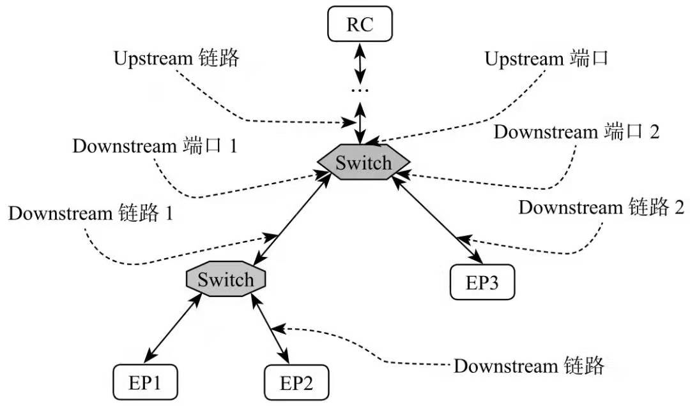
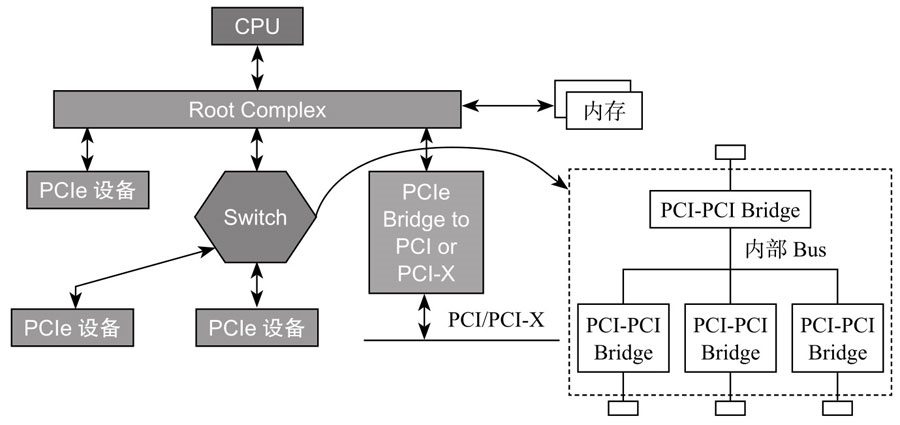
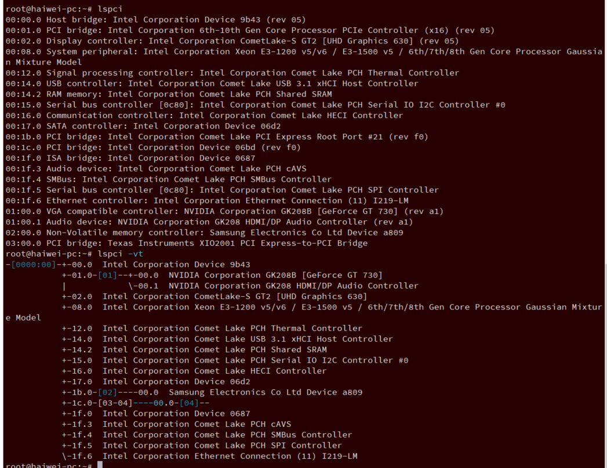
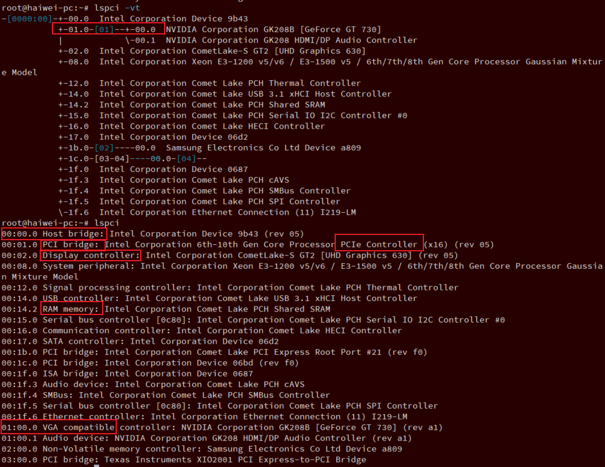
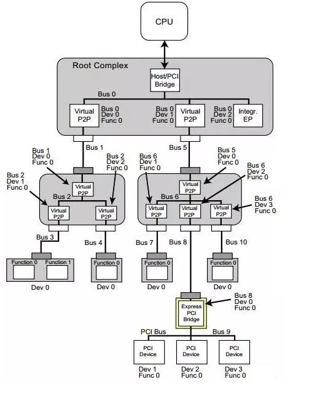

<!-- @import "[TOC]" {cmd="toc" depthFrom=1 depthTo=6 orderedList=false} -->

<!-- code_chunk_output -->

- [3.1. RC](#31-rc)
- [3.2. Endpoint](#32-endpoint)
- [3.3. Switch](#33-switch)
  - [3.3.1. 内部构成](#331-内部构成)
- [3.4. 小结](#34-小结)

<!-- /code_chunk_output -->


## 3.1. RC


## 3.2. Endpoint

Port: 1. Logically, an interface between a component and a PCI Express Link. 2. Physically, a group of Transmitters and Receivers located on the same chip that define a Link.

Port: 1. 逻辑上, 位于部件和一个 PCIe 链接之间的接口. 2. 物理上, 位于同一个芯片上用来定义一个链路的一组发射器和接收器.

Receiver: The componenet that receives Packet information across a Link.

Receiving Port: In the context of a specific TLP or DLLP, the Port that receives the Packet on a given Link.

PCIe Endpoint, 就是 **PCIe 终端设备**, 比如 PCIe SSD、PCIe 网卡等, 这些 Endpoint 可以直接连在 RC 上, 也可以通过 Switch 连到 PCIe 总线上.

Switch 用于扩展链路, 提供更多的端口用以连接 Endpoint. 拿 USB 打比方, 计算机主板上提供的 USB 口有限, 如果你要连接很多 USB 设备, 比如无线网卡、无线鼠标、USB 摄像头、USB 打印机、U 盘等, USB 口不够用, 我会上网买个 USB HUB 用以扩展接口.

## 3.3. Switch

Switch: A defined System Element that connects two or more Ports to allow Packets to be routed from one Port to another. To configuration software, a Switch appears as a collection of virtual PCI-to-PCI Bridges.

Switch: 一个定义好的用来连接两个或多个 Ports 且允许数据包在不同 Ports 之间被路由转发的一个系统元素. 通过配置软件, 一个 Switch 也被配置为一组虚拟 PCI-to-PCI Bridge 的集合.

Switch 扩展了 PCIe 端口, **靠近 RC 的那个端口**, 我们称为**上游端口**(`Upstream Port`), 而分出来的其他端口, 我们称为**下游端口**(`Downstream Port`).

> 下面会讲到, 端口是有 bdf 信息的, 所以一个端口算一个 lspci device 吗? 一个 Switch 有多个 device(一个 port 算一个) 吗?

**一个 Switch 只有一个上游端口**, 可以扩展出**若干个下游端口**. **下游端口**可以**直接连接 Endpoint**, 也可以**连接 Switch**, 扩展出更多的 PCIe 端口, **如图**.

PCIe Switch:



**对每个 Switch 来说, 它下面的 Endpoint 或者 Switch, 都是归它管的**.
* **上游**下来的**数据**, 它需要甄别数据是传给**它下面哪个设备**的, 然后**进行转发**;
* **下面设备向 RC 传数据**, 也要**通过 Switch 代为转发**.

因此, Switch 的**作用**就是**扩展 PCIe 端口**, 并为挂在它上面的设备(Endpoint 或者 Switch)提供**路由和转发服务**.

### 3.3.1. 内部构成

**每个 Switch 内部**, 也是**有一根内部 PCIe 总线**的, 然后通过**若干个 Bridge**, **扩展出若干个下游端口**, 如图.

> 所以会生成新的 bus number?

Switch 内部总线结构:




## 3.4. 小结

PCIe 采用的是树形拓扑结构.

**RC 是树的根或主干, 它为 CPU 代言**, 与 PCIe 系统其他部分通信, **一般为通信的发起者**.

Switch 是树枝, 树枝上有叶子(Endpoint), 也可节外生枝, Switch 上连 Switch, 归根结底, 是为了连接更多的 Endpoint. **Switch 为它下面的 Endpoint 或 Switch 提供路由转发服务**.

Endpoint 是树叶, 诸如 SSD、网卡、显卡等, 实现某些特定功能(Function).

我们还看到有所谓的 **Bridge**, 用以**将 PCIe 总线转换成 PCI 总线**, 或者反过来, 不是我们要讲的重点, 忽略之.

PCIe 与采用**总线共享式通信方式**的 **PCI** 不同, PCIe 采用**点到点**(`Endpoint to Endpoint`)的通信方式, **每个设备独享通道带宽**, 速度和效率都比 PCI 好.

> PCIe 的总线并不共享

需要指出的是, 虽然 PCIe 采用点到点通信, 即**理论上任何两个 Endpoint 都可以直接通信**, 但实际中很少这样做, 因为**两个不同设备的数据格式不一样**, 除非这两个设备是同一个厂商的. 通常都是 **Endpoint 与 RC 通信**, 或者 **Endpoint 通过 RC 与另外一个 Endpoint 通信**.


---

整体情况




系统中 PCI Bridge 有三种: 一种是 Root Port; 一种是下面连接 Endpoint 的; 还有 Switch 中的.




1. 但是 UPI 总线可以直接连接 memory/Display controller, 从而连接 内存/图形.
2.

 `00:01.0` PCI bridge 会生成新的 PCIe 总线.

---





lspci 命令详解: https://www.cnblogs.com/machangwei-8/p/10403495.html

```
# lspci
00:00.0 Host bridge: Intel Corporation Device 9b43 (rev 05)
00:01.0 PCI bridge: Intel Corporation 6th-10th Gen Core Processor PCIe Controller (x16) (rev 05)
00:02.0 Display controller: Intel Corporation CometLake-S GT2 [UHD Graphics 630] (rev 05)
00:08.0 System peripheral: Intel Corporation Xeon E3-1200 v5/v6 / E3-1500 v5 / 6th/7th/8th Gen Core Processor Gaussian Mixture Model
00:12.0 Signal processing controller: Intel Corporation Comet Lake PCH Thermal Controller
00:14.0 USB controller: Intel Corporation Comet Lake USB 3.1 xHCI Host Controller
00:14.2 RAM memory: Intel Corporation Comet Lake PCH Shared SRAM
00:15.0 Serial bus controller [0c80]: Intel Corporation Comet Lake PCH Serial IO I2C Controller #0
00:16.0 Communication controller: Intel Corporation Comet Lake HECI Controller
00:17.0 SATA controller: Intel Corporation Device 06d2
00:1b.0 PCI bridge: Intel Corporation Comet Lake PCI Express Root Port #21 (rev f0)
00:1c.0 PCI bridge: Intel Corporation Device 06bd (rev f0)
00:1f.0 ISA bridge: Intel Corporation Device 0687
00:1f.3 Audio device: Intel Corporation Comet Lake PCH cAVS
00:1f.4 SMBus: Intel Corporation Comet Lake PCH SMBus Controller
00:1f.5 Serial bus controller [0c80]: Intel Corporation Comet Lake PCH SPI Controller
00:1f.6 Ethernet controller: Intel Corporation Ethernet Connection (11) I219-LM
01:00.0 VGA compatible controller: NVIDIA Corporation GK208B [GeForce GT 730] (rev a1)
01:00.1 Audio device: NVIDIA Corporation GK208 HDMI/DP Audio Controller (rev a1)
02:00.0 Non-Volatile memory controller: Samsung Electronics Co Ltd Device a809
03:00.0 PCI bridge: Texas Instruments XIO2001 PCI Express-to-PCI Bridge

# lspci -vt
-[0000:00]-+-00.0  Intel Corporation Device 9b43
           +-01.0-[01]--+-00.0  NVIDIA Corporation GK208B [GeForce GT 730]
           |            \-00.1  NVIDIA Corporation GK208 HDMI/DP Audio Controller
           +-02.0  Intel Corporation CometLake-S GT2 [UHD Graphics 630]
           +-08.0  Intel Corporation Xeon E3-1200 v5/v6 / E3-1500 v5 / 6th/7th/8th Gen Core Processor Gaussian Mixture Model
           +-12.0  Intel Corporation Comet Lake PCH Thermal Controller
           +-14.0  Intel Corporation Comet Lake USB 3.1 xHCI Host Controller
           +-14.2  Intel Corporation Comet Lake PCH Shared SRAM
           +-15.0  Intel Corporation Comet Lake PCH Serial IO I2C Controller #0
           +-16.0  Intel Corporation Comet Lake HECI Controller
           +-17.0  Intel Corporation Device 06d2
           +-1b.0-[02]----00.0  Samsung Electronics Co Ltd Device a809
           +-1c.0-[03-04]----00.0-[04]--
           +-1f.0  Intel Corporation Device 0687
           +-1f.3  Intel Corporation Comet Lake PCH cAVS
           +-1f.4  Intel Corporation Comet Lake PCH SMBus Controller
           +-1f.5  Intel Corporation Comet Lake PCH SPI Controller
           \-1f.6  Intel Corporation Ethernet Connection (11) I219-LM

# lspci | grep -i bridge
00:00.0 Host bridge: Intel Corporation Device 9b43 (rev 05)
00:01.0 PCI bridge: Intel Corporation 6th-10th Gen Core Processor PCIe Controller (x16) (rev 05)
00:1b.0 PCI bridge: Intel Corporation Comet Lake PCI Express Root Port #21 (rev f0)
00:1c.0 PCI bridge: Intel Corporation Device 06bd (rev f0)
00:1f.0 ISA bridge: Intel Corporation Device 0687
03:00.0 PCI bridge: Texas Instruments XIO2001 PCI Express-to-PCI Bridge
```

`01.0-[01]` 意思是通过 `00:01.0` 生成新的总线 01, 下面有两个 device, 分别是 `01:00.0` 和 `01:00.1`


RC 本身并不表现为一个 device

`00:00.0` 是 RC 中的 Host bridge

```
# lspci -s 00:00.0
00:00.0 Host bridge: Intel Corporation Device 9b43 (rev 05)
```

`00.01.0` 是 RC 中的 PCI bridge

```
# lspci -s 00:01.0
00:01.0 PCI bridge: Intel Corporation 6th-10th Gen Core Processor PCIe Controller (x16) (rev 05)
```

bus 相同, device 不同的多个 `PCI bridge` 可能就是一个 Switch.


