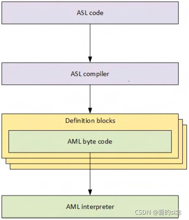

# 什么是ACPI?

ACPI首先可以理解为一个**独立于体系结构**的**电源管理和配置框架**，它在主机OS中形成一个**子系统**。该框架建立**一个硬件寄存器集**来定义**电源状态**(休眠、hibernate、唤醒等)。硬件寄存器集可以容纳**专用硬件**和**通用硬件**上的**操作**。

标准ACPI框架和硬件寄存器集的主要目的是**启用电源管理和系统配置**，**无需操作系统来直接调用固件**。ACPI作为**系统固件**(`BIOS`)和**OS**之间的接口层，如图1和图2所示，有一定的限制和规则。

Figure 1: ACPI overview

从根本上说，ACPI定义了**两种数据结构**，它们在系统固件和操作系统之间共享: **数据表**和**定义块**。这些数据结构是固件和操作系统之间的主要通信机制。

* 数据表存储**原始数据**，并**由设备驱动程序使用**
* 定义块由解释程序**可执行的字节码**组成。

Figure 2: ACPI structure

这个**定义块字节码**是从**ACPI源语言**(`ASL`)代码编译而来的。ASL是用来定义ACPI对象和编写控制方法的语言。**ASL编译器**将ASL翻译成**ACPI机器语言**(AML)**字节码**。AML是ACPI AML解释器处理的语言，如图3所示。

Figure 3: ASL and AML

ACPI Source Language (ASL)代码用于定义对象和控制方法。然后，ASL编译器将ASL转换为包含在ACPI定义块中的ACPI机器语言(AML)字节码。定义块由标识表头和字节码组成，由**AML解释器执行**(AML interpreter)。

AML解释器执行字节码并计算定义块中的对象，以允许字节码执行循环构造、条件计算、访问已定义的地址空间以及应用程序所需的其他操作。AML解释器对**已定义的地址空间**具有读/写访问权，包括系统内存、I/O、PCI配置等等。它通过定义称为**对象的入口点**来访问这些地址空间。对象可以具有直接定义的值，也可以由AML解释器计算和解释。

这个**可枚举对象集合**是一个OS结构，称为**ACPI名称空间**。命名空间是**系统上ACPI设备的层次表示**。**系统总线**是这些**ACPI设备枚举的根**。在**其他总线上可枚举的设备**(如PCI或USB设备)通常**不在名称空间中枚举**。相反，它们有自己的**总线枚举设备**并**加载驱动程序**。然而，**所有可枚举的总线都有一种编码技术**，允许**ACPI对设备的总线特定地址进行编码**，这样就可以在ACPI中找到它们，尽管**ACPI通常不为这些设备加载驱动程序**。

通常，枚举具有`_HID`对象(**硬件标识对象**)的**设备**，并**由ACPI加载其驱动程序**。具有`_ADR`对象(**物理地址对象**)的设备通常**不由ACPI枚举**，通常也**不由ACPI加载驱动程序**。`_ADR`设备通常可以在**不涉及ACPI**的情况下执行所有必要的功能，但是在设备驱动程序不能执行某个功能的情况下，或者如果驱动程序需要与系统固件通信，**ACPI可以评估对象来执行所需的功能**。

作为一个例子，**PCI不支持本地热插拔**。然而，**PCI可以使用ACPI**来评估对象和定义方法，这些方法允许**ACPI填充在PCI上执行热插拔所需的函数**。

ACPI的另一个方面是**运行时模型**，它处理在**系统运行期间发生的任何ACPI中断事件**。ACPI将继续评估处理这些事件所需的对象。这个基于中断的运行时模型将在下面的运行时模型一节中进行更详细的讨论。

# ACPI 初始化

**了解ACPI工作原理的最佳方法是按时间顺序排列**。

当用户启动系统时，系统固件就完成了设置、初始化和自我测试。

Figure 4: ACPI initialization

然后，在将控制传递给引导加载程序之前，系统固件使用在固件初始化期间获得的信息，根据需要使用各种平台配置和电源接口数据更新ACPI表。扩展的根系统描述表(XSDT)是ACPI子系统使用的第一个表，它包含系统上大多数其他ACPI表的地址。XSDT指向固定的ACPI描述表(FADT)以及操作系统在初始化期间处理的其他主要表。在操作系统初始化之后，FADT将ACPI子系统定向到差分系统描述表(DSDT)， DSDT是名称空间的开始，因为它是包含定义块的第一个表。

        然后ACPI子系统处理DSDT，并开始从ACPI定义块构建名称空间。XSDT还指向辅助系统描述表(SSDTs)，并将它们添加到名称空间。ACPI数据表向操作系统提供关于系统硬件的原始数据。

        当操作系统从ACPI表构建了命名空间后，它开始遍历命名空间并为它在命名空间中遇到的所有_HID设备加载设备驱动程序。

        在上面的ACPI初始化图中，在将控制权移交给引导加载程序之前，系统固件根据需要使用仅在运行时可用的信息更新ACPI表。XSDT是操作系统的ACPI子系统使用的第一个表，它包含系统上大多数其他ACPI表的地址。XSDT指向FADT、ssdt和其他主要ACPI表。FADT将ACPI子系统定向到DSDT, DSDT是名称空间的开始，因为DSDT是包含定义块的第一个表。ACPI子系统然后使用DSDT，并开始从定义块构建ACPI名称空间。XSDT还指向ssdt并将它们添加到名称空间。

运行时模型

        在系统启动并运行之后，ACPI与操作系统一起处理通过中断发生的任何ACPI事件。此中断以两种一般方式之一调用ACPI事件:固定事件和通用目的事件(GPEs)。

        固定事件是在ACPI规范中具有预定义含义的ACPI事件。这些固定事件包括按下电源按钮或ACPI计时器溢出等操作。这些事件由操作系统处理程序直接处理。

        GPEs是ACPI规范没有预定义的ACPI事件。这些事件通常通过评估控制方法来处理，这些方法是名称空间中的对象，可以访问系统硬件。当ACPI子系统使用AML解释器评估控制方法时，GPE对象根据操作系统的实现来处理事件。通常，这可能涉及向设备发出通知，以调用设备驱动程序来执行某个函数。

热事件的例子

        ACPI包含一个热模型，允许系统主动控制系统温度(通过执行打开风扇等操作)或通过减少系统使用的电量(通过执行控制处理器等操作)被动控制系统温度。我们可以使用图5所示的通用热事件示例来演示ACPI运行时模型是如何工作的。

ACPI热区包括读取当前系统温度和跳闸点的控制方法。

        当操作系统最初在名称空间中找到一个热区域时，它加载热区域驱动程序，该驱动程序评估热区域以获得当前温度和跳点。

当系统组件的温度升高到足以触发跳闸点时，就会出现一个热区GPE。

        GPE导致中断。当ACPI子系统接收到中断时，它首先检查是否发生了任何固定的事件。在本例中，热区事件是一个GPE，因此没有固定的事件发生。

        ACPI子系统然后在命名空间中搜索与中断的GPE号匹配的控制方法。一旦找到它，ACPI子系统就会评估控制方法，然后可能访问硬件和/或通知热区处理程序。

操作系统的热区域处理程序然后采取任何必要的操作来处理事件，包括可能的访问硬件。

        ACPI是一个非常健壮的接口实现。热区跳点可以根据需要通知系统开启风扇、降低设备性能、读取温度、关闭系统，或这些操作和其他操作的任何组合。

在整个系统中使用此运行时模型来管理在系统操作期间发生的所有ACPI事件。

# 参考

https://www.rdzhijia.com/home.php?mod=space&uid=13910&do=blog&id=58