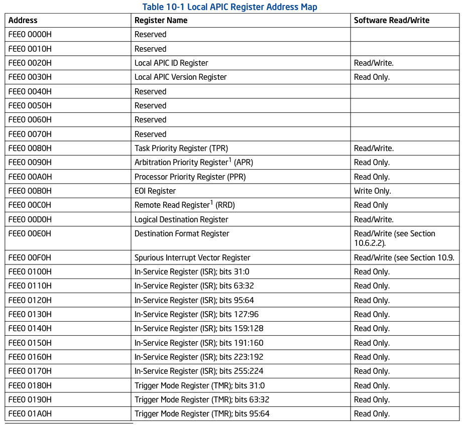

<!-- @import "[TOC]" {cmd="toc" depthFrom=1 depthTo=6 orderedList=false} -->

<!-- code_chunk_output -->

- [1. 两种寄存器映射方式](#1-两种寄存器映射方式)
- [2. local APIC寄存器地址](#2-local-apic寄存器地址)
  - [2.1. local APIC寄存器基地址](#21-local-apic寄存器基地址)
    - [2.1.1. local APIC寄存器重定位](#211-local-apic寄存器重定位)
- [3. local APIC寄存器列表](#3-local-apic寄存器列表)

<!-- /code_chunk_output -->

# 1. 两种寄存器映射方式

**APIC**和**xAPIC版本**中, local APIC寄存器映射到**物理地址**中。

而**x2APIC模式**中local APIC寄存器映射到**MSR寄存器组**。

# 2. local APIC寄存器地址

local APIC**寄存器的地址**是以`APIC_BASE`(在`IA32_APIC_BASE MSR`寄存器中)作为基地址, **每个local APIC寄存器**都有**自己对应的偏移量**, 以**local APIC ID寄存器**的地址为例: 它的**偏移量是20H**, 那么local APIC ID寄存器的地址就是`APIC_BASE+20H`。

## 2.1. local APIC寄存器基地址

local APIC寄存器的**基地址值**来自`IA32_APIC_BASE`寄存器。

当**处理器power\-up**或**reset**时**APIC base值为FEE00000h**。APIC base值的**宽度依赖于MAXPHYADDR值**(**36位, 40位或52位**), **低12位为0**值, 因此APIC base地址将在**4K页边界**上。

在**分页机制**下, 由于**APIC base是物理地址(！！！**), 而**软件代码**里使用的是**virtual address**, 因此系统必须负责**某个区域的virtual address映射到APIC base的物理地址(！！！**)上, 以便于**在软件里使用MOV指令访问local APIC寄存器**。

代码清单18-6(lib\page32.asm): 

```asm
; 0x800000 映射到 0xFEE00000(Local APIC 区域)
      mov DWORD [PDT_BASE + 4 * 8], 0xFEE00000 | PS | PCD | PWT | RW | P
; PCD=1, PWT=1
      mov eax, [xd_bit]
      mov DWORD [PDT_BASE + 4 * 8 + 4], eax          ; XD位
```

上面这段代码将**virtual address 0x800000**映射到**物理地址0xFEE00000**上, 如果我们定义一个常量符号APIC\_BASE为0x800000值, 那么: 

```asm
mov eax, [APIC_BASE + SVR]   ;访问 local APIC 的 SVR
```

上面的代码就是**基于APIC\_BASE地址加上local APIC寄存器的偏移量来访问local APIC寄存器(！！！**), 其中`APIC_BASE`的值就是**0x800000**。当然, 如果愿意也可以使用一对一的映射形式(virtual address和physical address相等, 也就是virtual address 0xFEE00000映射到物理地址0xFEE00000), 我想没有OS会使用这样的映射方式。

值得注意的是, 由于APIC base物理地址是提交到local APIC硬件上, 因此APIC base的物理地址必须以stong uncacheable(不可cache)的内存类型映射。我们在映射的时候使用PCD=1, 并且PWT=1的PAT属性来指定page的内存类型(关于PAT属性详情, 请参考11.7节描述)。这段区域也可以指定为XD(Execute disable)类型

### 2.1.1. local APIC寄存器重定位

xAPIC版本的local APIC寄存器的地址允许被重定位, 使用IA32\_APIC\_BASE寄存器提供一个新值。在开启分页机制的环境下, 我们还必须考虑到上面所说的映射page的内存类型。

代码清单18-7(lib\apic.asm): 

```x86asm
；------------------------------------
； set_apic_base(): 设置 APIC base地址
； input: 
；  esi: 低 32 位, edi: 高半部分
；------------------------------------
set_apic_base: 
      call get_MAXPHYADDR    ； 得到MAXPHYADDR 值
      mov ecx, 64
      sub ecx, eax
      shl edi, cl
      shr edi, cl       ； 去掉 MAXPHYADDR 以上的位
      mov ecx, IA32_APIC_BASE
      rdmsr
      mov edx, edi
      and esi, 0xfffff000
      and eax, 0x00000fff    ；保持原来的 IA32_APIC_BASE 寄存器低 12 位
      or eax, esi
      wrmsr
      ret
```

为了做得更好一些, 这个set\_apic\_base()函数通过得到MAXPHYADDR值来设置APIC base地址的宽度, 这样的话, 即使输入地址0xFFFFFFFF\_FFFFFFFFF也只能写入0x0000000F\_FFFFF000(在MAXPHYADRR为36的情况下)。

实验18-2: 测试APIC base的重定位

在这个实验里, 我们将APIC base默认的0xFEE00000地址, 重定位在0xFEF00000位置上并进行对local APIC寄存器的读取。

代码清单18-8(topic18\ex18-2\protected.asm): 

```x86asm
mov esi, 0xFEF00000    ； 重定位在 0xFEF00000 上
mov edi, 0
call set_apic_base
```

这段代码输入0xfef00000地址给set\_apic\_base()函数设置新的APIC base地址值, 然后使用

```x86asm
mov esi, [APIC_BASE + 0xfef00000 - 0xfee00000 + SVR]
```
这条指令在新的APIC base地址上读取 SVR的值, 这里需要计算新APIC base对应的virtual address值。


我们可以看到, 这个结果中使用基于新APIC base地址的SVR值和原SVR的值是相同的, 表明APIC base地址已经成功设置为新的地址。

# 3. local APIC寄存器列表

LAPIC的寄存器有:

* **ICR** 用于发送 **IPI**(中断的信息)
* **IRR** 当前 LAPIC 接收的消息
* ISR 当前 CPU增长处理的中断
* **TPR** 和 **PPR** CPU中断处理的优先级

下面是local APIC寄存器的完整列表, **APIC寄存器的基地址是FEE00000H**。




注: 在基于Intel微架构 Nehalem 的处理器中, local APIC ID寄存器不再读写;它是只读的。

这些local APIC寄存器共**占据了4K的页空间**, 每个local APIC寄存器地址都是**16字节边界对齐**的, 寄存器宽度分别为**32位、64位, 以及256位**。

下面的**寄存器是256位**的。

① ISR(In-Service Register)。

② TMR(Trigger Mode Register)。

③ IRR(Interrupt Request Register)。

这些寄存器的**每一位**对应**一个中断vector(共256个interrupt vector**), 而**64位寄存器**只有一个**ICR(Interrupt Command Register**), 其余寄存器都是32位的。

因此, **访问一个完整的64位寄存器**需要进行**2次DWORD访问**, 256位的寄存器需进行8次DWORD访问。

>实验18-3: 打印local APIC寄存器列表

在这个实验里, 笔者使用`dump_apic()`函数打印local APIC寄存器的信息, 这个dump\_apic()函数实现在lib\apic.asm文件里, 函数比较长, 为节省篇幅这里不列出来, 读者可自行查阅。


这个图是运行在Westmere微架构移动Core i5处理器上的结果, 这些local APIC寄存器的值经过了BIOS的初始化设置。除了LINT0、LINT1及Thermal寄存器外, 其他的LVT寄存器都被mask(屏蔽)。