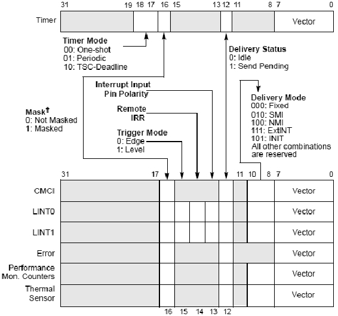

<!-- @import "[TOC]" {cmd="toc" depthFrom=1 depthTo=6 orderedList=false} -->

<!-- code_chunk_output -->

- [7个LVT寄存器](#7个lvt寄存器)
- [寄存器子域](#寄存器子域)
  - [vector: 向量号](#vector-向量号)
  - [delivery mode: 交付模式](#delivery-mode-交付模式)

<!-- /code_chunk_output -->

# 7个LVT寄存器

LVT（**Local Vector Table**）寄存器是**local APIC本地中断源产生者**，在新的处理器上local APIC支持**最多7个LVT寄存器**，分别如下。

① LVT CMCI寄存器：地址偏移量在2F0H。

② LVT Timer寄存器：地址偏移量在320H。

③ LVT Thermal Monitor寄存器：地址偏移量在330H。

④ LVT Performance Counter寄存器：地址偏移量在340H。

⑤ LVT LINT0寄存器：地址偏移量在350H。

⑥ LVT LINT1寄存器：地址偏移量在360H。

⑦ LVT Error寄存器：地址偏移量在370H。

# 寄存器子域

软件**对这些寄存器进行编程**设置，可以**接收和产生local interrupt源**。每个寄存器由若干部分组成，并**不是每个寄存器的子域都相同**。

如上所示，这些子域如下。

## vector: 向量号

① **vector**（bit7～bit0）：由软件设置local interrupt的**中断vector**，和一般的中断处理一样，这个vector值被**用于在IDT中查找interrupt描述符**。

## delivery mode: 交付模式

② **delivery mode**（bit10～bit8）：这个3位值提供**5个delivery mode（交付模式**），即**Fixed模式（000B）、SMI模式（010B）、NMI模式（100B）、ExtINT模式（111B），以及INIT模式（101B**），其他的组合值是保留的。

## delivery status:

③ **delivery status**（bit12）：这个位指示**中断在delivery时的状态**，0为**idle（空闲）状态**，**当前没有中断在交付中**，或者**中断已经交付给processor进行处理**；1为pending（悬挂）状态，当前的中断**已经delivery**，但**processor未进行处理**。只有将delivery status恢复idle（空闲）状态才能允许接受**下一次中断(！！！**)。

④ **interrupt input pin polarity**（bit 13）：这个位**只用于LVT LINT0和LVT LINT1寄存器（对应于LINT0和LINT1接口**），它们分别**对应于处理器的INTR和NMI pin**。这个位设置这**两个pin的level触发模式(水平触发！！！**)：为0时为**high\-level**，为1时为**low\-level**。

⑤ remote IRR flag（bit14）：这个位**只用于LVT LINT0和LVT LINT1寄存器**，使用在**delivery模式为Fixed**，**level触发模式**中。为1时，local APIC**已经接收并处理由INTR和NMI交付的中断**；为0时，**接收到EOI命令**。

⑥ **trigger mode**（bit15）：**仅用于LVT LINT0和LVT LINT1寄存器**，设置它们的**触发模式**。0为**edge触发**，1为**level触发**。

⑦ **mask**（bit16）：设置local interrupt的**屏蔽位**，为1时设置为屏蔽中断的响应。

⑧ **timer mode**（bit18～bit17）：**仅使用于LVT Timer寄存器**，设置Timer count**计数模式**。00：one-shot（一次性计数）；01：periodic周期计数；10：TSC-deadline（指定TSC值计数）。