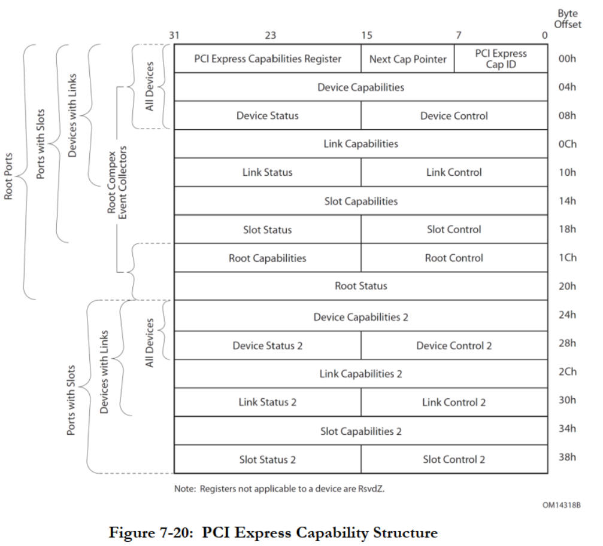

<!-- @import "[TOC]" {cmd="toc" depthFrom=1 depthTo=6 orderedList=false} -->

<!-- code_chunk_output -->

- [1. 配置空间概述](#1-配置空间概述)
  - [1.1. 配置空间分类](#11-配置空间分类)
    - [1.1.1. 配置空间Header](#111-配置空间header)
    - [1.1.2. 设备Capability结构](#112-设备capability结构)
    - [1.1.3. 扩展Capability空间](#113-扩展capability空间)
  - [1.2. 配置空间的访问](#12-配置空间的访问)
  - [1.3. Capability结构链表](#13-capability结构链表)
  - [多个Capability结构](#多个capability结构)
- [2. Power Management Capability结构](#2-power-management-capability结构)
- [3. PCI Express Capability结构](#3-pci-express-capability结构)
  - [3.1. PCI Express Capability Register](#31-pci-express-capability-register)
  - [3.2. Device Capability Register](#32-device-capability-register)
- [4. PCI Express Extended Capability结构](#4-pci-express-extended-capability结构)
- [5. 示例](#5-示例)

<!-- /code_chunk_output -->

# 1. 配置空间概述

## 1.1. 配置空间分类


* **配置空间Header**(`Configuration Space Header`), `0x00 ~ 0x3F`, 64 字节
* **设备Capability结构**(`Capability Structure`), `0x40 ~ 0xFF`, 192 字节, 前面两个统称 **PCI Configuration Space**
* **扩展Capability空间**(`PCI Express Extended Configuration Space`), `0x100~0xFFF`, 3840 字节

### 1.1.1. 配置空间Header

前面讲述了**PCI设备**使用的基本配置空间, 叫做 **配置空间Header**(`Configuration Space Header`).

这个基本配置空间共由**64个字节**组成其地址范围为`0x00 ~ 0x3F`这**64个字节**是**所有PCI设备必须支持(！！！PCI设备**)的. 事实上**许多PCI设备**也**仅支持**这64个配置寄存器.

### 1.1.2. 设备Capability结构

此外 `PCI/PCI-X` 和 `PCIe` 设备还有 `0x40 ~ 0xFF`！！！这段共**192个字节**的**配置空间**, 叫做**设备Capability数据结构**(`Capability Structure`).

在这段空间**主要存放**一些**与 MSI 或者 MSI-X 中断机制**和**电源管理相关的Capability结构**等等.

> 不是 PCIe 设备独有的, PCI 设备也可以有.

> 其中**所有能够提交中断请求**的 PCIe 设备**必须支持 MSI 或者 MSI-X Capability 结构(！！！**).

### 1.1.3. 扩展Capability空间

**PCIe设备**还支持 `0x100~0xFFF`(！！！, 3840 字节) 这段**扩展配置空间**, 叫做**扩展配置空间**(`Extended Configuration Space`). 这是 **PCIe 设备独有空间**.

> 即 PCIe Extended Capabilities 结构, 与上面说的 中断/PM Capability 的地址空间地址是分开的. 这是为了兼容, 因为 中断/PM capability 在 PCI 中也可能存在.

PCIe设备使用的扩展配置空间**最大为4KB(其实是一共的配置空间大小！！！**), 在PCIe总线的扩展配置空间中存放**PCIe设备所独有**的一些**Capability结构**而**PCI设备不能使用**这段空间.

## 1.2. 配置空间的访问

* 在 **x86** 处理器中使用 `CONFIG_ADDRESS` **寄存器**与 `CONFIG_DATA` **寄存器**访问 PCIe 配置空间的 `0x00~0xFF`, 而使用**ECAM方式**访问 `0x000~0xFFF` 这段空间;
* 在 **PowerPC** 处理器中可以使用 `CFG_ADDR` 和 `CFG_DATA` 寄存器访问 `0x000~0xFFF` 详见 `2.2` 节.

## 1.3. Capability结构链表

`PCI-X` 和 `PCIe` 总线规范要求其**设备必须支持 Capabilities 结构**. 在**PCI总线**的**基本配置空间**(64字节的配置空间header)中包含一个 **Capabilities Pointer寄存器(！！！**), 该寄存器存放 Capabilities 结构**链表的头指针**. 在一个PCIe设备中可能含有**多个 Capability 结构**, 这些寄存器**组成一个链表**, 其结构如图4‑14所示.

> 在 `PCI` 设备中 Capabilities Pointer 寄存器是**可选**的. `PCI-X/PCIe` 设备**必须支持**.


> 注意, 这个链表中元素仅仅包括了 192 字节的设备 Capability 结构, 不包含 3840 字节的扩展Capability空间, 扩展的指针起始 offset 地址是 0x100.

其中**每一个 Capability** 结构都有**唯一的 ID号！！！**, 每一个 Capability 寄存器都有**一个指针**, 这个指针指向下一个 Capability 结构, 从而组成一个**单向链表结构**, 这个链表的**最后一个 Capability** 结构的**指针为0**.

## 多个Capability结构

**一个PCIe设备**可以包含**多个Capability结构(！！！**), 包括:

* 与**电源管理相关**的结构;
* 与**PCIe总线相关**的结构(就是 PCIe Capability?);
* 与**中断请求相关**的结构;
* **PCIe Capability**结构;
* **PCIe Extended Capability**结构;
* **Single Root I/O Virtualization Extended Capability**结构;
* 等等

在第6章详细将讨论 `MSI/MSI-X Capability` 结构. 在**PCIe总线规范**中定义了**较多的Capability结构**这些结构适用于不同的应用场合. 在一个指定的PCIe设备中并不一定支持本篇中涉及的所有Capability结构.

下面简单介绍几种 capability 结构

# 2. Power Management Capability结构

> 这种结构 ID 是 `0x01`, 电源管理相关.它属于上面的 Capability 空间, PCI/PCI-X/PCIe 设备都可能有, 在 `0x40~0xFF` 范围.

PCIe 总线使用的软件电源管理机制与 PCI PM(Power Management) **兼容**. 而 **PCI 总线**(！！！)的电源管理机制需要使用 Power Management Capability 结构, 该结构由一些和 PCI/PCI-X

# 3. PCI Express Capability结构

> 这种结构 ID 是 0x10, 存放PCIe总线相关信息. 它还是属于上面的 Capability 空间, 不是 PCIe Extended Capability 空间, 在 `0x40~0xFF` 范围.

存放一些和**PCIe总线相关的信息**, 包括 **PCIe 链路**和**插槽**的信息. 有些 **PCIe** 设备**不一定**实现结构中所有寄存器, 或者并没有提供这些配置寄存器供系统软件访问.

PCI Express Capability 结构的部分寄存器及其相应字段**与硬件的具体实现细节相关**, 本节仅介绍部分字段.

该结构中, `Cap ID` 字段为 **PCI Express Capability 结构**使用的 ID 号, 其值为`0x10`. 而 `Next Capability` 字段存放**下一个 Capability 寄存器的地址**.

PCI Express Capability结构如图. (**与 PCIe Extended Capability 不同**)



## 3.1. PCI Express Capability Register

**PCI Express Capability 寄存器**存放与PCIe设备相关的一些参数,  包括**版本号信息**、**端口描述**, 当前 PCIe 链路是与 PCIe 插槽直接连接还是作为内置的 PCIe 设备等-系列信息. 这些参数的详细定义如表4-3所示.

<table style="width:100%">
<caption>PCI Express Capability 寄存器</caption>
  <tr>
    <th>Bits</th>
    <th>定义</th>
    <th>描述</th>
  </tr>
  <tr>
    <td>3: 0</td>
    <td>Capability Version</td>
    <td>
    存放 PCIe 设备的<b>版本号</b>.<br>
    如果该设备基于 PCIe 总线规范 2.x. 该字段的只为 0x2; 如果该设备基于 PCIe 总线规范 1.x, 该字段的值为 0x1. 该字段<b>只读</b>.
    </td>
  </tr>
  <tr>
    <td>7:4</td>
    <td>Device/Port Type</td>
    <td>
    存放 PCIe 设备的<b>类型</b>. <br>
    <li><b>0b0000</b> 对应 PCle 总线的<b>EP</b>;</li>
    <li><b>0b0001</b> 对应 Legacy PCle 总线的<b>EP</b>;</li>
    <li><b>0b0100</b> 对应 RC 的<b>Root port</b>;</li>
    <li><b>0b0101</b> 对应 Switch 的<b>上游端口</b>;</li>
    <li><b>0b0110</b> 对应 Switch 的<b>下游端口</b>;</li>
    <li><b>0b0111</b> 对应 PCle <b>桥片</b>;</li>
    <li><b>0b1000</b> 对应 PCI/PCI-X-to-PCle <b>桥片</b>;</li>
    <li><b>0b1001</b> 对应 RC 中集成的 <b>EP</b>;</li>
    <li><b>0b1010</b> 对应 RC 中的 <b>Event Collector</b>;</li>
    该字段只读.
    </td>
  </tr>
  <tr>
    <td>8</td>
    <td>Slot Implemented</td>
    <td>
    当该位为1时, 表示和当前端口相连的是一个PCle插槽, 而不是PCle设备
    </td>
  </tr>
  <tr>
    <td>13:9</td>
    <td>Interrupt Message Number</td>
    <td>
    当 PCI Express Capability 结构的 Slot Status 寄存器或者Root Status寄存器的状态发生变化时, 该PCle设备可以通过 MSI/MSI-X 中断机制向处理器提交中断请求. <br>
    该字段存放 MSI/MSI-X 中断机制需要的Message Data字段
    </td>
  </tr>
</table>

> Slot Implemented: 插槽表明可以用来做热插拔, 不是设备本身

> Event Collector是RC集成的一个功能部件,进行错误检查和处理PME消息,该部件可选

> 有关MSI中断机制的详细描述见第10章

## 3.2. Device Capability Register


# 4. PCI Express Extended Capability结构

> PCIe扩展Capability结构, 即上面讲到的 PCIe Extended Capability 空间(扩展Capability空间), PCIe 设备独有, 从 0x100 开始.

PCI Express Extended Capabilities 结构存放在 PCI 配置空间 `0x100` **之后的位置**, 该结构是 **PCIe 设备独有**的, PCI 设备并不支持该结构. 实际上**绝大多数 PCIe 设备**也并**不支持**该结构.

在一个 PCle 设备中可能含有**多个 PCI Express Extended Capabilities 结构**, 并形成一个**单向链表**, 其中**第一个** Capability 结构的**基地址**为 **0x100**, 其结构如图4-19所示.

> 这个链表第一个为什么是 0x100?

在这个**单向链表的尾部**, 其 `Next Capability Offset`、`Capability ID` 和 `Capbility Version` 字段的值都为 **O**. 如果在 PCIe 设备中**不含有** PCI Express Extended Capabilities 结构, 则 0x100 指针所指向的结构, 其 Capability ID 字段为 `0xFFFF`, 而 Next Capability Offset 字段为 0x0.


一个 PCI Express Extended Capabilities 结构由以下参数组成.

* `PCI Express Capability ID` 字段存放Extended Capability结构的ID号.
* `Capability Version` 字段存放Extended Capability结构的版本号.
* `Next Capability Offset` 字段存放**下一个 Extended Capability 结构**的**偏移**. 低 2 位是保留位且必须是 00b

PCle 总线定义了一系列PCIExpress Extended Capabilities结构, 如下所示.

* AER Capability结构. 该结构定义了所有PCIe设备可能遇到的错误, 包括Uncorect-able Eror(不可恢复错误）和Cormectable Ermor（可恢复错误）. 当PCle设备发现这些错误时, 可以根据该寄存器的设置使用Eror Mesage将错误状态发送给Event Col.
lector, 并由Event Collector统一处理这些错误. 系统软件必须认真处理每一个Ermor Message,并进行恢复. 对一个实际的工程项目, 错误处理是保证整个项目可靠性的重要一环, 不可忽视. AER机制与Eror Mesage报文的处理相关, 第6.3.4节将进一步介绍AER机制.
* Device Serial Number Capability结构. 该结构记载PCle设备使用的序列号. IEEE定义了一个64位宽度的PCle序列号, 其中前24位作为PCle 设备提供商使用的序列号, 而后40位由厂商选择使用.
* PCle RC Link Declaration Capability结构. 在RC、RC内部集成的设备或者RCRB中可以包含该结构. 该结构存放RC的拓扑结构, 如RC使用的PCI链路宽度. 如果RC 支持多个PCIe链路, 该结构还包含每一个链路的描述和端口命名.
* PCle RC Intemal lLink Control Capability结构. 该结构的主要作用是描述RC内部互连使用的PCIe链路. 该结构由Root Complex Link Status 和Root Complex Link Control寄存器组成.
* Power Budget Carpability结构. 当处理器系统为一些动态加入的PCle 设备分配电源配额时, 将使用该设备的Power Budget Capability结构.
* ACS(Access Control Services)Capability结构. 该结构对PCle设备进行访问控制管理.


# 5. 示例

以一个网卡设备为例

```
# lspci -s 16:00.1 -v
16:00.1 Ethernet controller: Intel Corporation Ethernet Controller X710 for 10GBASE-T (rev 02)
        Subsystem: Intel Corporation Ethernet Network Adapter X710-TL
        Physical Slot: 1
        Flags: bus master, fast devsel, latency 0, IRQ 16, NUMA node 0
        Memory at a7ffd000000 (64-bit, prefetchable) [size=16M]
        Memory at a7fff800000 (64-bit, prefetchable) [size=32K]
        Expansion ROM at 9f600000 [disabled] [size=512K]
        Capabilities: [40] Power Management version 3
        Capabilities: [50] MSI: Enable- Count=1/1 Maskable+ 64bit+
        Capabilities: [70] MSI-X: Enable+ Count=129 Masked-
        Capabilities: [a0] Express Endpoint, MSI 00
        Capabilities: [e0] Vital Product Data
        Capabilities: [100] Advanced Error Reporting
        Capabilities: [140] Device Serial Number ae-5e-a7-ff-ff-91-96-b4
        Capabilities: [150] Alternative Routing-ID Interpretation (ARI)
        Capabilities: [160] Single Root I/O Virtualization (SR-IOV)
        Capabilities: [1a0] Transaction Processing Hints
        Capabilities: [1b0] Access Control Services
        Kernel driver in use: i40e
        Kernel modules: i40e
```

查看 config 信息

```
# cd /sys/bus/pci/devices/0000\:16\:00.1
# xxd -e config
00000000: 15ff8086 00100546 02000002 00800008  ....F...........
00000010: fd00000c 00000a7f 00000000 ff80000c  ................
00000020: 00000a7f 00000000 00000000 00008086  ................
00000030: 9f600000 00000040 00000000 0000010b  ..`.@...........
00000040: c8235001 00002008 00000000 00000000  .P#.. ..........
00000050: 01807005 00000000 00000000 00000000  .p..............
00000060: 00000000 00000000 00000000 00000000  ................
00000070: 8080a011 00000003 00001003 00000000  ................
00000080: 00000000 00000000 00000000 00000000  ................
00000090: 00000000 00000000 00000000 00000000  ................
000000a0: 0002e010 10008ce4 00095157 00425883  ........WQ...XB.
000000b0: 10830040 00000000 00000000 00000000  @...............
000000c0: 00000000 0000001f 00000009 0000000e  ................
000000d0: 00000000 00000000 00000000 00000000  ................
000000e0: 80840003 0000784c 00000000 00000000  ....Lx..........
000000f0: 00000000 00000000 00000000 00000000  ................
00000100: 14020001 00000000 00188000 00063030  ............00..
00000110: 00002000 00003000 000000a0 00000000  . ...0..........
00000120: 00000000 00000000 00000000 00000000  ................
00000130: 00000000 00000000 00000000 00000000  ................
00000140: 15010003 ff9196b4 ae5ea7ff 00000000  ..........^.....
00000150: 1601000e 00000000 00000000 00000000  ................
00000160: 1a010010 00000000 00000009 00400040  ............@.@.
00000170: 00010005 0001004f 154c0000 00000553  ....O.....L.S...
00000180: 00000001 ff00000c 00000a7f 00000000  ................
00000190: ff81000c 00000a7f 00000000 00000000  ................
000001a0: 1b010017 00000005 00000000 00000000  ................
000001b0: 0001000d 00000000 00000000 00000000  ................
000001c0: 00000000 00000000 00000000 00000000  ................
000001d0: 00000000 00000000 00000000 00000000  ................
000001e0: 00000000 00000000 00000000 00000000  ................
000001f0: 00000000 00000000 00000000 00000000  ................
00000200: 00000000 00000000 00000000 00000000  ................
00000210: 00000000 00000000 00000000 00000000  ................
00000220: 00000000 00000000 00000000 00000000  ................
00000230: 00000000 00000000 00000000 00000000  ................
00000240: 00000000 00000000 00000000 00000000  ................
00000250: 00000000 00000000 00000000 00000000  ................
00000260: 00000000 00000000 00000000 00000000  ................
00000270: 00000000 00000000 00000000 00000000  ................
00000280: 00000000 00000000 00000000 00000000  ................
00000290: 00000000 00000000 00000000 00000000  ................
000002a0: 00000000 00000000 00000000 00000000  ................
000002b0: 00000000 00000000 00000000 00000000  ................
000002c0: 00000000 00000000 00000000 00000000  ................
000002d0: 00000000 00000000 00000000 00000000  ................
000002e0: 00000000 00000000 00000000 00000000  ................
000002f0: 00000000 00000000 00000000 00000000  ................
00000300: 00000000 00000000 00000000 00000000  ................
00000310: 00000000 00000000 00000000 00000000  ................
00000320: 00000000 00000000 00000000 00000000  ................
00000330: 00000000 00000000 00000000 00000000  ................
00000340: 00000000 00000000 00000000 00000000  ................
00000350: 00000000 00000000 00000000 00000000  ................
00000360: 00000000 00000000 00000000 00000000  ................
00000370: 00000000 00000000 00000000 00000000  ................
00000380: 00000000 00000000 00000000 00000000  ................
00000390: 00000000 00000000 00000000 00000000  ................
000003a0: 00000000 00000000 00000000 00000000  ................
000003b0: 00000000 00000000 00000000 00000000  ................
000003c0: 00000000 00000000 00000000 00000000  ................
000003d0: 00000000 00000000 00000000 00000000  ................
000003e0: 00000000 00000000 00000000 00000000  ................
000003f0: 00000000 00000000 00000000 00000000  ................
00000400: 00000000 00000000 00000000 00000000  ................
00000410: 00000000 00000000 00000000 00000000  ................
00000420: 00000000 00000000 00000000 00000000  ................
00000430: 00000000 00000000 00000000 00000000  ................
00000440: 00000000 00000000 00000000 00000000  ................
00000450: 00000000 00000000 00000000 00000000  ................
00000460: 00000000 00000000 00000000 00000000  ................
00000470: 00000000 00000000 00000000 00000000  ................
00000480: 00000000 00000000 00000000 00000000  ................
00000490: 00000000 00000000 00000000 00000000  ................
000004a0: 00000000 00000000 00000000 00000000  ................
000004b0: 00000000 00000000 00000000 00000000  ................
000004c0: 00000000 00000000 00000000 00000000  ................
000004d0: 00000000 00000000 00000000 00000000  ................
000004e0: 00000000 00000000 00000000 00000000  ................
000004f0: 00000000 00000000 00000000 00000000  ................
00000500: 00000000 00000000 00000000 00000000  ................
00000510: 00000000 00000000 00000000 00000000  ................
00000520: 00000000 00000000 00000000 00000000  ................
00000530: 00000000 00000000 00000000 00000000  ................
00000540: 00000000 00000000 00000000 00000000  ................
00000550: 00000000 00000000 00000000 00000000  ................
00000560: 00000000 00000000 00000000 00000000  ................
00000570: 00000000 00000000 00000000 00000000  ................
00000580: 00000000 00000000 00000000 00000000  ................
00000590: 00000000 00000000 00000000 00000000  ................
000005a0: 00000000 00000000 00000000 00000000  ................
000005b0: 00000000 00000000 00000000 00000000  ................
000005c0: 00000000 00000000 00000000 00000000  ................
000005d0: 00000000 00000000 00000000 00000000  ................
000005e0: 00000000 00000000 00000000 00000000  ................
000005f0: 00000000 00000000 00000000 00000000  ................
00000600: 00000000 00000000 00000000 00000000  ................
00000610: 00000000 00000000 00000000 00000000  ................
00000620: 00000000 00000000 00000000 00000000  ................
00000630: 00000000 00000000 00000000 00000000  ................
00000640: 00000000 00000000 00000000 00000000  ................
00000650: 00000000 00000000 00000000 00000000  ................
00000660: 00000000 00000000 00000000 00000000  ................
00000670: 00000000 00000000 00000000 00000000  ................
00000680: 00000000 00000000 00000000 00000000  ................
00000690: 00000000 00000000 00000000 00000000  ................
000006a0: 00000000 00000000 00000000 00000000  ................
000006b0: 00000000 00000000 00000000 00000000  ................
000006c0: 00000000 00000000 00000000 00000000  ................
000006d0: 00000000 00000000 00000000 00000000  ................
000006e0: 00000000 00000000 00000000 00000000  ................
000006f0: 00000000 00000000 00000000 00000000  ................
00000700: 00000000 00000000 00000000 00000000  ................
00000710: 00000000 00000000 00000000 00000000  ................
00000720: 00000000 00000000 00000000 00000000  ................
00000730: 00000000 00000000 00000000 00000000  ................
00000740: 00000000 00000000 00000000 00000000  ................
00000750: 00000000 00000000 00000000 00000000  ................
00000760: 00000000 00000000 00000000 00000000  ................
00000770: 00000000 00000000 00000000 00000000  ................
00000780: 00000000 00000000 00000000 00000000  ................
00000790: 00000000 00000000 00000000 00000000  ................
000007a0: 00000000 00000000 00000000 00000000  ................
000007b0: 00000000 00000000 00000000 00000000  ................
000007c0: 00000000 00000000 00000000 00000000  ................
000007d0: 00000000 00000000 00000000 00000000  ................
000007e0: 00000000 00000000 00000000 00000000  ................
000007f0: 00000000 00000000 00000000 00000000  ................
00000800: 00000000 00000000 00000000 00000000  ................
00000810: 00000000 00000000 00000000 00000000  ................
00000820: 00000000 00000000 00000000 00000000  ................
00000830: 00000000 00000000 00000000 00000000  ................
00000840: 00000000 00000000 00000000 00000000  ................
00000850: 00000000 00000000 00000000 00000000  ................
00000860: 00000000 00000000 00000000 00000000  ................
00000870: 00000000 00000000 00000000 00000000  ................
00000880: 00000000 00000000 00000000 00000000  ................
00000890: 00000000 00000000 00000000 00000000  ................
000008a0: 00000000 00000000 00000000 00000000  ................
000008b0: 00000000 00000000 00000000 00000000  ................
000008c0: 00000000 00000000 00000000 00000000  ................
000008d0: 00000000 00000000 00000000 00000000  ................
000008e0: 00000000 00000000 00000000 00000000  ................
000008f0: 00000000 00000000 00000000 00000000  ................
00000900: 00000000 00000000 00000000 00000000  ................
00000910: 00000000 00000000 00000000 00000000  ................
00000920: 00000000 00000000 00000000 00000000  ................
00000930: 00000000 00000000 00000000 00000000  ................
00000940: 00000000 00000000 00000000 00000000  ................
00000950: 00000000 00000000 00000000 00000000  ................
00000960: 00000000 00000000 00000000 00000000  ................
00000970: 00000000 00000000 00000000 00000000  ................
00000980: 00000000 00000000 00000000 00000000  ................
00000990: 00000000 00000000 00000000 00000000  ................
000009a0: 00000000 00000000 00000000 00000000  ................
000009b0: 00000000 00000000 00000000 00000000  ................
000009c0: 00000000 00000000 00000000 00000000  ................
000009d0: 00000000 00000000 00000000 00000000  ................
000009e0: 00000000 00000000 00000000 00000000  ................
000009f0: 00000000 00000000 00000000 00000000  ................
00000a00: 00000000 00000000 00000000 00000000  ................
00000a10: 00000000 00000000 00000000 00000000  ................
00000a20: 00000000 00000000 00000000 00000000  ................
00000a30: 00000000 00000000 00000000 00000000  ................
00000a40: 00000000 00000000 00000000 00000000  ................
00000a50: 00000000 00000000 00000000 00000000  ................
00000a60: 00000000 00000000 00000000 00000000  ................
00000a70: 00000000 00000000 00000000 00000000  ................
00000a80: 00000000 00000000 00000000 00000000  ................
00000a90: 00000000 00000000 00000000 00000000  ................
00000aa0: 00000000 00000000 00000000 00000000  ................
00000ab0: 00000000 00000000 00000000 00000000  ................
00000ac0: 00000000 00000000 00000000 00000000  ................
00000ad0: 00000000 00000000 00000000 00000000  ................
00000ae0: 00000000 00000000 00000000 00000000  ................
00000af0: 00000000 00000000 00000000 00000000  ................
00000b00: 00000000 00000000 00000000 00000000  ................
00000b10: 00000000 00000000 00000000 00000000  ................
00000b20: 00000000 00000000 00000000 00000000  ................
00000b30: 00000000 00000000 00000000 00000000  ................
00000b40: 00000000 00000000 00000000 00000000  ................
00000b50: 00000000 00000000 00000000 00000000  ................
00000b60: 00000000 00000000 00000000 00000000  ................
00000b70: 00000000 00000000 00000000 00000000  ................
00000b80: 00000000 00000000 00000000 00000000  ................
00000b90: 00000000 00000000 00000000 00000000  ................
00000ba0: 00000000 00000000 00000000 00000000  ................
00000bb0: 00000000 00000000 00000000 00000000  ................
00000bc0: 00000000 00000000 00000000 00000000  ................
00000bd0: 00000000 00000000 00000000 00000000  ................
00000be0: 00000000 00000000 00000000 00000000  ................
00000bf0: 00000000 00000000 00000000 00000000  ................
00000c00: 00000000 00000000 00000000 00000000  ................
00000c10: 00000000 00000000 00000000 00000000  ................
00000c20: 00000000 00000000 00000000 00000000  ................
00000c30: 00000000 00000000 00000000 00000000  ................
00000c40: 00000000 00000000 00000000 00000000  ................
00000c50: 00000000 00000000 00000000 00000000  ................
00000c60: 00000000 00000000 00000000 00000000  ................
00000c70: 00000000 00000000 00000000 00000000  ................
00000c80: 00000000 00000000 00000000 00000000  ................
00000c90: 00000000 00000000 00000000 00000000  ................
00000ca0: 00000000 00000000 00000000 00000000  ................
00000cb0: 00000000 00000000 00000000 00000000  ................
00000cc0: 00000000 00000000 00000000 00000000  ................
00000cd0: 00000000 00000000 00000000 00000000  ................
00000ce0: 00000000 00000000 00000000 00000000  ................
00000cf0: 00000000 00000000 00000000 00000000  ................
00000d00: 00000000 00000000 00000000 00000000  ................
00000d10: 00000000 00000000 00000000 00000000  ................
00000d20: 00000000 00000000 00000000 00000000  ................
00000d30: 00000000 00000000 00000000 00000000  ................
00000d40: 00000000 00000000 00000000 00000000  ................
00000d50: 00000000 00000000 00000000 00000000  ................
00000d60: 00000000 00000000 00000000 00000000  ................
00000d70: 00000000 00000000 00000000 00000000  ................
00000d80: 00000000 00000000 00000000 00000000  ................
00000d90: 00000000 00000000 00000000 00000000  ................
00000da0: 00000000 00000000 00000000 00000000  ................
00000db0: 00000000 00000000 00000000 00000000  ................
00000dc0: 00000000 00000000 00000000 00000000  ................
00000dd0: 00000000 00000000 00000000 00000000  ................
00000de0: 00000000 00000000 00000000 00000000  ................
00000df0: 00000000 00000000 00000000 00000000  ................
00000e00: 00000000 00000000 00000000 00000000  ................
00000e10: 00000000 00000000 00000000 00000000  ................
00000e20: 00000000 00000000 00000000 00000000  ................
00000e30: 00000000 00000000 00000000 00000000  ................
00000e40: 00000000 00000000 00000000 00000000  ................
00000e50: 00000000 00000000 00000000 00000000  ................
00000e60: 00000000 00000000 00000000 00000000  ................
00000e70: 00000000 00000000 00000000 00000000  ................
00000e80: 00000000 00000000 00000000 00000000  ................
00000e90: 00000000 00000000 00000000 00000000  ................
00000ea0: 00000000 00000000 00000000 00000000  ................
00000eb0: 00000000 00000000 00000000 00000000  ................
00000ec0: 00000000 00000000 00000000 00000000  ................
00000ed0: 00000000 00000000 00000000 00000000  ................
00000ee0: 00000000 00000000 00000000 00000000  ................
00000ef0: 00000000 00000000 00000000 00000000  ................
00000f00: 00000000 00000000 00000000 00000000  ................
00000f10: 00000000 00000000 00000000 00000000  ................
00000f20: 00000000 00000000 00000000 00000000  ................
00000f30: 00000000 00000000 00000000 00000000  ................
00000f40: 00000000 00000000 00000000 00000000  ................
00000f50: 00000000 00000000 00000000 00000000  ................
00000f60: 00000000 00000000 00000000 00000000  ................
00000f70: 00000000 00000000 00000000 00000000  ................
00000f80: 00000000 00000000 00000000 00000000  ................
00000f90: 00000000 00000000 00000000 00000000  ................
00000fa0: 00000000 00000000 00000000 00000000  ................
00000fb0: 00000000 00000000 00000000 00000000  ................
00000fc0: 00000000 00000000 00000000 00000000  ................
00000fd0: 00000000 00000000 00000000 00000000  ................
00000fe0: 00000000 00000000 00000000 00000000  ................
00000ff0: 00000000 00000000 00000000 00000000  ................
```

整个配置空间大小是 4K, Header 中的 Capabilities Pointer 在第 (13) 个 double word 处, 即

```

```

PCI Express Extended Capabilities 地址范围是 `0x100 ~ 0xFFF`, 所以如果只看 PCI Express Extended Capabilities 的话可以只从 0x100 开始看

```
00000100: 14020001 00000000 00188000 00063030  ............00..
```

`14020001` 就是前 32 位(十六进制), Intel 是小端字节序:

* `0x140` 是 `31:20`, 代表了 next capability offset;
* `0x2` 是 `19:16`, 代表了 Capability Version;
* `0x0001` 是 `15:0`, 代表了 PCIe Cap ID, 这里表示是 `AER(Advanced Error Reporting)`.

>ID code 可以见 `PCI_Code-ID_r_1_11__v24_Jan_2019.pdf`

next offset 是 140

```
00000140: 15010003 ff9196b4 ae5ea7ff 00000000  ..........^.....
```

这个 capability ID 是 `0003`, 称作 `Device Serial Number`; next offset 是 0x150

```
00000150: 1601000e 00000000 00000000 00000000  ................
```

这个 capability ID 是 `000e`, 称作 `Alternative Routing-ID Interpretation (ARI)`; next offset 是 0x160

```
00000160: 1a010010 00000000 00000009 00400040  ............@.@.
```

这个 capability ID 是 `0010`, 就是 `Single Root I/O Virtualization (SR-IOV)`; next offset 是 0x1a0

```
000001a0: 1b010017 00000005 00000000 00000000  ................
```

这个 capability ID 是 `0017`, 称作 `Transaction Processing Hints (TPH Requester)`; next offset 是 0x1b0

```
000001b0: 0001000d 00000000 00000000 00000000  ................
```

这个 capability ID 是 `000d`, 称作 `Access Control Services (ACS)`; next offset 是 0x000, 即这就是最后一个 pcie extended capability structure.