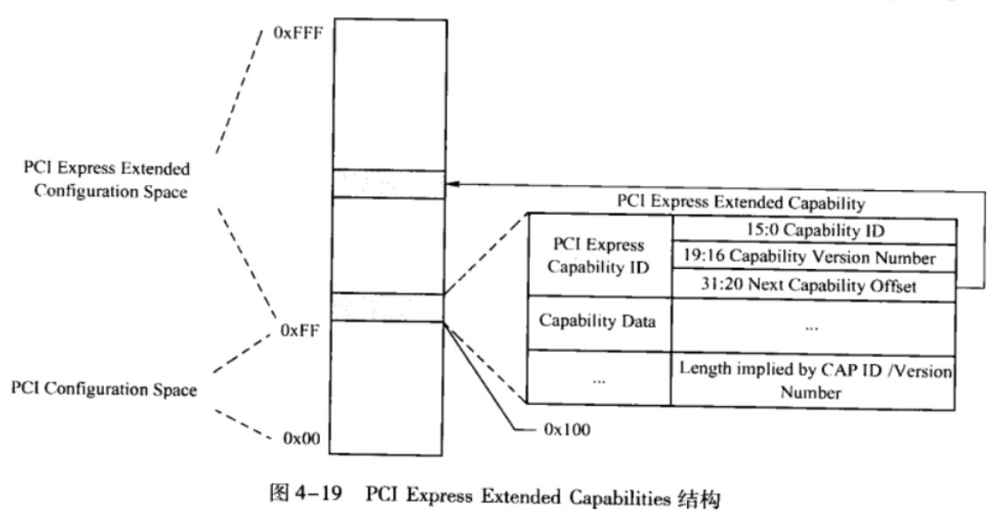

<!-- @import "[TOC]" {cmd="toc" depthFrom=1 depthTo=6 orderedList=false} -->

<!-- code_chunk_output -->

- [1. 配置空间概述](#1-配置空间概述)
  - [1.1. 配置空间分类](#11-配置空间分类)
    - [1.1.1. 基本配置空间](#111-基本配置空间)
    - [1.1.2. Capability空间](#112-capability空间)
    - [1.1.3. 扩展Capability空间](#113-扩展capability空间)
  - [1.2. 配置空间的访问](#12-配置空间的访问)
  - [1.3. 多个Capability结构](#13-多个capability结构)
- [2. Power Management Capability结构](#2-power-management-capability结构)
- [3. PCI Express Capability结构](#3-pci-express-capability结构)
  - [3.1. PCI Express Capability Register](#31-pci-express-capability-register)
  - [3.2. Device Capability Register](#32-device-capability-register)
- [4. PCI Express Extended Capability结构](#4-pci-express-extended-capability结构)

<!-- /code_chunk_output -->

# 1. 配置空间概述

## 1.1. 配置空间分类

### 1.1.1. 基本配置空间

前面讲述了**PCI设备**使用的**基本配置空间**. 这个基本配置空间共由**64个字节**组成其地址范围为`0x00~0x3F`这**64个字节**是**所有PCI设备必须支持(！！！PCI设备**)的. 事实上**许多PCI设备**也**仅支持**这64个配置寄存器.

### 1.1.2. Capability空间

此外 `PCI/PCI-X` 和 `PCIe` 设备还有 `0x40~0xFF`(！！！) 这段**配置空间**. 在这段空间**主要存放**一些**与 MSI 或者 MSI-X 中断机制**和**电源管理相关的Capability结构**等等.

> 不是 PCIe 设备独有的, PCI 设备也可以有.

> 其中**所有能够提交中断请求**的 PCIe 设备**必须支持 MSI 或者 MSI-X Capability 结构(！！！**).

### 1.1.3. 扩展Capability空间

> 即 PCIe Extended Capabilities 结构, 与上面的 中断/PM Capability 的地址空间地址是分开的. 这是为了兼容, 因为 中断/PM capability 在 PCI 中也可能存在.

**PCIe设备**还支持 `0x100~0xFFF`(！！！) 这段**扩展配置空间**. 这是 PCIe 设备独有空间.

PCIe设备使用的扩展配置空间**最大为4KB(其实是一共的配置空间大小！！！**), 在PCIe总线的扩展配置空间中存放**PCIe设备所独有**的一些**Capability结构**而**PCI设备不能使用**这段空间.

## 1.2. 配置空间的访问

* 在 **x86** 处理器中使用 `CONFIG_ADDRESS` **寄存器**与 `CONFIG_DATA` **寄存器**访问 PCIe 配置空间的 `0x00~0xFF`, 而使用**ECAM方式**访问 `0x000~0xFFF` 这段空间;
* 在 **PowerPC** 处理器中可以使用 `CFG_ADDR` 和 `CFG_DATA` 寄存器访问 `0x000~0xFFF` 详见 `2.2` 节.

## 1.3. 多个Capability结构

`PCI-X` 和 `PCIe` 总线规范要求其**设备必须支持 Capabilities 结构**. 在**PCI总线**的**基本配置空间**中包含一个 **Capabilities Pointer寄存器(！！！**), 该寄存器存放 Capabilities 结构**链表的头指针**.

> 在 PCI 设备中 **Capabilities Pointer寄存器** 是可选的.

在一个PCIe设备中可能含有**多个 Capability 结构**, 这些寄存器**组成一个链表**, 其结构如图4‑14所示.

其中**每一个 Capability** 结构都有**唯一的 ID号！！！**, 每一个 Capability 寄存器都有**一个指针**, 这个指针指向下一个 Capability 结构, 从而组成一个**单向链表结构**, 这个链表的**最后一个 Capability** 结构的**指针为0**.

**一个PCIe设备**可以包含**多个Capability结构(！！！**), 包括:

* 与**电源管理相关**的结构;
* 与**PCIe总线相关**的结构, (就是 PCIe Capability?);
* 与**中断请求相关**的结构;
* **PCIe Capability**结构;
* **PCIe Extended Capability**结构;
* **Single Root I/O Virtualization Extended Capability**结构;
* 等等

在第6章详细将讨论 `MSI/MSI-X Capability` 结构. 在**PCIe总线规范**中定义了**较多的Capability结构**这些结构适用于不同的应用场合. 在一个指定的PCIe设备中并不一定支持本篇中涉及的所有Capability结构.

# 2. Power Management Capability结构

> 属于上面的 Capability 空间, 在 `0x40~0xFF` 范围

PCIe 总线使用的软件电源管理机制与 PCI PM(Power Management) **兼容**. 而 **PCI 总线**(！！！)的电源管理机制需要使用 Power Management Capability 结构, 该结构由一些和 PCI/PCI-X 

# 3. PCI Express Capability结构

> 注意, > 属于上面的 Capability 空间, 在 `0x40~0xFF` 范围, 不是 PCIe Extended Capability 空间

存放一些和**PCIe总线相关的信息**, 包括 **PCIe 链路**和**插槽**的信息. 有些 **PCIe** 设备**不一定**实现结构中所有寄存器, 或者并没有提供这些配置寄存器供系统软件访问.

PCI Express Capability 结构的部分寄存器及其相应字段**与硬件的具体实现细节相关**, 本节仅介绍部分字段.

该结构中, `Cap ID` 字段为 **PCI Express Capability 结构**使用的 ID 号, 其值为`0x10`. 而 `Next Capability` 字段存放**下一个 Capability 寄存器的地址**.

PCI Express Capability结构如图. (**与 PCIe Extended Capability 不同**)

## 3.1. PCI Express Capability Register

**PCI Express Capability 寄存器**存放与PCIe设备相关的一些参数,  包括**版本号信息**、**端口描述**, 当前 PCIe 链路是与 PCIe 插槽直接连接还是作为内置的 PCIe 设备等-系列信息. 这些参数的详细定义如表4-3所示. 

<table style="width:100%">
<caption>PCI Express Capability 寄存器</caption>
  <tr>
    <th>Bits</th>
    <th>定义</th>
    <th>描述</th>
  </tr>
  <tr>
    <td>3：0</td>
    <td>Capability Version</td>
    <td>
    存放 PCIe 设备的<b>版本号</b>. 
    如果该设备基于 PCIe 总线规范 2.x. 该字段的只为 0x2; 如果该设备基于 PCIe 总线规范 1.x, 该字段的值为 0x1. 该字段<b>只读</b>.
    </td>
  </tr>
  <tr>
    <td>7:4</td>
    <td>Device/Port Type</td>
    <td>
    存放 PCIe 设备的<b>类型</b>.  
    <li><b>0b0000</b> 对应 PCle 总线的<b>EP</b>;</li>
    <li><b>0b0001</b> 对应 Legacy PCle 总线的<b>EP</b>;</li>
    <li><b>0b0100</b> 对应 RC 的<b>Root port</b>;</li>
    <li><b>0b0101</b> 对应 Switch 的<b>上游端口</b>;</li>
    <li><b>0b0110</b> 对应 Switch 的<b>下游端口</b>;</li>
    <li><b>0b0111</b> 对应 PCle <b>桥片</b>;</li>
    <li><b>0b1000</b> 对应 PCI/PCI-X-to-PCle <b>桥片</b>;</li>
    <li><b>0b1001</b> 对应 RC 中集成的 <b>EP</b>;</li>
    <li><b>0b1010</b> 对应 RC 中的 <b>Event Collector</b>;</li>
    该字段只读.
    </td>
  </tr>
  <tr>
    <td>8</td>
    <td>Slot Implemented</td>
    <td>
    当该位为1时, 表示和当前端口相连的是一个PCle插槽, 而不是PCle设备
    </td>
  </tr>
  <tr>
    <td>13:9</td>
    <td>Interrupt Message Number</td>
    <td>
    当 PCI Express Capability 结构的 Slot Status 寄存器或者Root Status寄存器的状态发生变化时, 该PCle设备可以通过 MSI/MSI-X 中断机制向处理器提交中断请求.  
    该字段存放 MSI/MSI-X 中断机制需要的Message Data字段
    </td>
  </tr>
</table>

> Slot Implemented: 插槽表明可以用来做热插拔, 不是设备本身

> Event Collector是RC集成的一个功能部件,进行错误检查和处理PME消息,该部件可选

> 有关MSI中断机制的详细描述见第10章

## 3.2. Device Capability Register

# 4. PCI Express Extended Capability结构

> PCIe扩展Capability结构, 即上面讲到的 PCIe Extended Capability 空间, 从 0x100 开始.

PCI Express Extended Capabilities 结构存放在 PCI 配置空间 `0x100` **之后的位置**, 该结构是 **PCIe 设备独有**的, PCI 设备并不支持该结构. 实际上**绝大多数 PCIe 设备**也并**不支持**该结构. 

在一个 PCle 设备中可能含有**多个 PCI Express Extended Capabilities 结构**, 并形成一个**单向链表**, 其中**第一个** Capability 结构的**基地址**为 **0x100**, 其结构如图4-19所示. 

在这个**单向链表的尾部**, 其 `Next Capability Offset`、`Capability ID` 和 `Capbility Version` 字段的值都为 **O**. 如果在 PCIe 设备中**不含有** PCI Express Extended Capabilities 结构, 则 0x100 指针所指向的结构, 其 Capability ID 字段为 0xFFFF, 而 Next Capability Offset 字段为 0x0.

一个 PCI Express Extended Capabilities 结构由以下参数组成.

* `PCI Express Capability ID` 字段存放Extended Capability结构的ID号. 
* `Capability Version` 字段存放Extended Capability结构的版本号. 
* `Next Capability Offset` 字段存放**下一个 Extended Capability 结构**的**偏移**. 

PCle 总线定义了一系列PCIExpress Extended Capabilities结构, 如下所示. 

* AER Capability结构. 该结构定义了所有PCIe设备可能遇到的错误, 包括Uncorect-able Eror(不可恢复错误）和Cormectable Ermor（可恢复错误）. 当PCle设备发现这些错误时, 可以根据该寄存器的设置使用Eror Mesage将错误状态发送给Event Col.
lector, 并由Event Collector统一处理这些错误. 系统软件必须认真处理每一个Ermor Message,并进行恢复. 对一个实际的工程项目, 错误处理是保证整个项目可靠性的重要一环, 不可忽视. AER机制与Eror Mesage报文的处理相关, 第6.3.4节将进一步介绍AER机制. 
* Device Serial Number Capability结构. 该结构记载PCle设备使用的序列号. IEEE定义了一个64位宽度的PCle序列号, 其中前24位作为PCle 设备提供商使用的序列号, 而后40位由厂商选择使用. 
* PCle RC Link Declaration Capability结构. 在RC、RC内部集成的设备或者RCRB中可以包含该结构. 该结构存放RC的拓扑结构, 如RC使用的PCI链路宽度. 如果RC 支持多个PCIe链路, 该结构还包含每一个链路的描述和端口命名. 
* PCle RC Intemal lLink Control Capability结构. 该结构的主要作用是描述RC内部互连使用的PCIe链路. 该结构由Root Complex Link Status 和Root Complex Link Control寄存器组成. 
* Power Budget Carpability结构. 当处理器系统为一些动态加入的PCle 设备分配电源配额时, 将使用该设备的Power Budget Capability结构. 
* ACS(Access Control Services)Capability结构. 该结构对PCle设备进行访问控制管