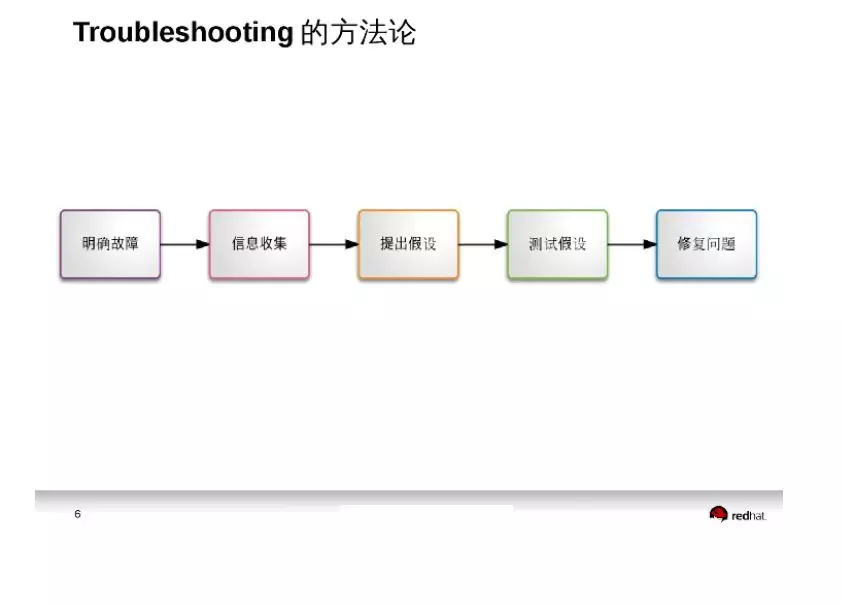
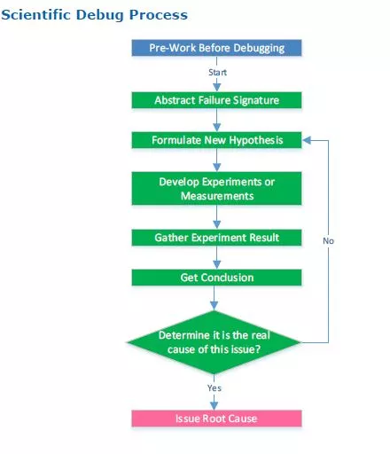

我本想先以linux 内核和crash分析系列开始，但是后来却发现linux 内核的相关内容已经中断了几个月了。若要写这一系列总结，我需要重新系统化的review一遍，又需要一段时间。而最近几个月正好在看intel 寄存器，intel架构的参考资料和学习笔记就在手边，脑子里的相关的思路也比较清晰，所以就想换一下topic，趁着热乎说说X86服务器intel purley架构，就当趁热拿出来黄金万两，爽一下朋友圈。

不要问我公众号的文档是不是原创了——肯定是原创。否则也不好意思发出来，否则也不敢用调侃的语气评论怪现象。

另外公众号内容中有可能引用或涉及了**某些上游的文档内容**，而这些文档已被标注成confidential，所以这些文档的引用，我无法详细的说明文档名称，只能以简写来标注，见谅。

# 1 洗脑的方法论

前几个月，我从redhat的一片文档里看到了文档中引用的troubleshooting方法论，很好：

最近又从intel 相关的文档里又看到了intel的诊断思路方法论，图很好，很好：

其实intel这副图和上面redhat的图，又是一样一样的。这一部分的内容，本想放到后面 intel skyX cpu 寄存器诊断里作为引言来讲。

在这里先引用一下，首先暗示我是做苦逼售后出身。然后我想说，公众号中的技术内容，都是我自己看资料、自己琢磨出来的（——没办法，某司提供不了底层架构的培训）。从现在到将来，上面的思维导图其实早已融入到了自己的骨子里。自己看资料和琢磨就相当于“信息收集”，而目前所写下的文档，相当于“确定假设”、也就相当于“立”。我一直认为：“假设”是有可能会错的。但确立假设毕竟是认知过程中的里程碑，有了假设，总比一直混沌迷糊、脑中空空要强好多。——正如亚里士多德的好多“假设”，从现在的高度来看都是错的，甚至是可笑的，但是总不能掩盖这些“假设”在那个时代的里程碑意义。

若我周围走在前面的大牛，能发现我的“假设”有错，请指出、并帮我破而再立，跪谢。但着重希望届时大牛们话能说全，不要留个半句故作玄虚，这样会憋死人的。或者我也会在实践中发现之前的错误而破而后立——就如同intel debug方法论中向上反馈的那个箭头(if it is no, Formulate New hypothesis) 。