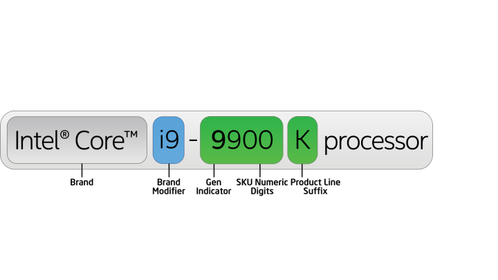

<!-- @import "[TOC]" {cmd="toc" depthFrom=1 depthTo=6 orderedList=false} -->

<!-- code_chunk_output -->

* [1 系列分类](#1-系列分类)
* [2 系列的所有产品](#2-系列的所有产品)
* [3 某个产品参数](#3-某个产品参数)
* [4 关于处理器编号](#4-关于处理器编号)

<!-- /code_chunk_output -->

# 1 系列分类

链接: https://ark.intel.com/content/www/cn/zh/ark.html#@Processors

处理器以及场景用途: https://www.intel.cn/content/www/cn/zh/products/processors.html

这是目前在售的全部8个产品系列

在第二个链接, 可以通过筛选"台式机"、"移动式"、 "服务器"、 "工作站"

# 2 系列的所有产品

每一个系列的产品可以点进去查看, 比如Xeon

# 3 某个产品参数

从上面可以点入查看详细信息参数

# 4 关于处理器编号

链接: https://www.intel.cn/content/www/cn/zh/processors/processor-numbers.html

