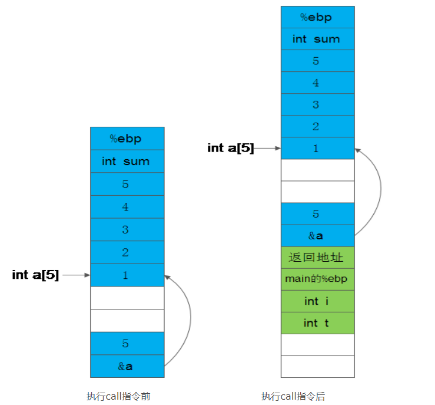

<!-- @import "[TOC]" {cmd="toc" depthFrom=1 depthTo=6 orderedList=false} -->

<!-- code_chunk_output -->

- [简介](#简介)
- [Linux 汇编语法格式](#linux-汇编语法格式)
- [Hello World!](#hello-world)
- [Linux汇编工具](#linux汇编工具)
  - [汇编器](#汇编器)
  - [链接器](#链接器)
    - [4.3 调试器](#43-调试器)
  - [5. 系统调用](#5-系统调用)
  - [6. 命令行参数](#6-命令行参数)
  - [7. GCC内联汇编](#7-gcc内联汇编)
  - [8. IA32寄存器](#8-ia32寄存器)
    - [8.1 通用寄存器](#81-通用寄存器)
  - [9. 函数调用过程](#9-函数调用过程)
- [小结](#小结)
- [参考](#参考)

<!-- /code_chunk_output -->

以下内容皆为32位系统

# 简介

现代情况下，汇编语言仅仅在驱动程序，嵌入式系统等对性能要求苛刻的领域才能见到它们的身影。

汇编语言直接同计算机的底层软件甚至硬件进行交互，它具有如下一些优点：

- 能够直接访问与硬件相关的存储器或 I/O 端口；
- 能够不受编译器的限制，对生成的二进制代码进行完全的控制；
- 能够对关键代码进行更准确的控制，避免因线程共同访问或者硬件设备共享引起的死锁；
- 能够根据特定的应用对代码做最佳的优化，提高运行速度；
- 能够最大限度地发挥硬件的功能。

Linux 下用汇编语言编写的代码具有两种不同的形式。第一种是**完全的汇编代码**，指的是整个程序全部用汇编语言编写。尽管是完全的汇编代码，Linux 平台下的汇编工具也吸收了 C 语言的长处，使得程序员可以使用 #include、#ifdef 等预处理指令，并能够通过宏定义来简化代码。第二种是**内嵌的汇编代码**，指的是可以嵌入到C语言程序中的汇编代码片段。虽然 ANSI 的 C 语言标准中没有关于内嵌汇编代码的相应规定，但各种实际使用的 C 编译器都做了这方面的扩充，这其中当然就包括 Linux 平台下的 GCC。

# Linux 汇编语法格式

绝大多数 Linux 程序员以前只接触过DOS/Windows 下的汇编语言，这些汇编代码都是 **Intel 风格**的。

但在 Unix 和 Linux 系统中，更多采用的还是 **AT&T 格式**，两者在语法格式上有着很大的不同：

1. 在 AT&T 汇编格式中，寄存器名要加上 '%' 作为前缀；而在 Intel 汇编格式中，寄存器名不需要加前缀。例如：


2. 在 AT&T 汇编格式中，用 '$' 前缀表示一个立即操作数；而在 Intel 汇编格式中，立即数的表示不用带任何前缀。例如：


3. AT&T 和 Intel 格式中的源操作数和目标操作数的位置正好相反。在 Intel 汇编格式中，目标操作数在源操作数的左边；而在 AT&T 汇编格式中，目标操作数在源操作数的右边。例如：


4. 在 AT&T 汇编格式中，操作数的字长由操作符的最后一个字母决定，后缀'b'、'w'、'l'分别表示操作数为字节（byte，8 比特）、字（word，16 比特）和长字（long，32比特）；而在 Intel 汇编格式中，操作数的字长是用 "byte ptr" 和 "word ptr" 等前缀来表示的。例如：


5. 在 AT&T 汇编格式中，绝对转移和调用指令（jump/call）的操作数前要加上'*'作为前缀，而在 Intel 格式中则不需要。

6. 远程转移指令和远程子调用指令的操作码，在 AT&T 汇编格式中为 "ljump" 和 "lcall"，而在 Intel 汇编格式中则为 "jmp far" 和 "call far"，即：


与之相应的远程返回指令则为：


7. 在 AT&T 汇编格式中，内存操作数的寻址方式是

```
section:disp(base, index, scale)
```

在 Intel 汇编格式中，内存操作数的寻址方式为：

```
section:[base + index*scale + disp]
```

由于 Linux 工作在保护模式下，用的是 32 位线性地址，所以在计算地址时不用考虑段基址和偏移量，而是采用如下的地址计算方法：

```
disp + base + index * scale
```

下面是一些内存操作数的例子：


# Hello World!

Linux 是一个运行在保护模式下的 32 位操作系统，采用 flat memory 模式，目前最常用到的是 ELF 格式的二进制代码。一个 ELF 格式的可执行程序通常划分为如下几个部分：.text、.data 和 .bss，其中 .text 是只读的代码区，.data 是可读可写的数据区，而 .bss 则是可读可写且没有初始化的数据区。代码区和数据区在 ELF 中统称为 section，根据实际需要你可以使用其它标准的 section，也可以添加自定义 section，但一个 ELF 可执行程序至少应该有一个 .text 部分。 下面给出我们的第一个汇编程序，用的是 AT&T 汇编语言格式：

AT&T 格式：

```
#hello.s 
.data                    # 数据段声明
        msg : .string "Hello, world!\\n" # 要输出的字符串
        len = . - msg                   # 字串长度
.text                    # 代码段声明
.global _start           # 指定入口函数
         
_start:                  # 在屏幕上显示一个字符串
        movl $len, %edx  # 参数三：字符串长度
        movl $msg, %ecx  # 参数二：要显示的字符串
        movl $1, %ebx    # 参数一：文件描述符(stdout) 
        movl $4, %eax    # 系统调用号(sys_write) 
        int  $0x80       # 调用内核功能
         
                         # 退出程序
        movl $0,%ebx     # 参数一：退出代码
        movl $1,%eax     # 系统调用号(sys_exit) 
        int  $0x80       # 调用内核功能
```

Intel 风格：

```
; hello.asm 
section .data            ; 数据段声明
        msg db "Hello, world!", 0xA     ; 要输出的字符串
        len equ $ - msg                 ; 字串长度
section .text            ; 代码段声明
global _start            ; 指定入口函数
_start:                  ; 在屏幕上显示一个字符串
        mov edx, len     ; 参数三：字符串长度
        mov ecx, msg     ; 参数二：要显示的字符串
        mov ebx, 1       ; 参数一：文件描述符(stdout) 
        mov eax, 4       ; 系统调用号(sys_write) 
        int 0x80         ; 调用内核功能
                         ; 退出程序
        mov ebx, 0       ; 参数一：退出代码
        mov eax, 1       ; 系统调用号(sys_exit) 
        int 0x80         ; 调用内核功能
```

上面代码语法风格不一样，但功能都是调用Linux内核提供的sys\_write来显示一个字符串，然后再调用sys\_exit退出系统。在Linux内核源文件include/asm-i386/unistd.h中，可以找到所有系统调用的定义。

# Linux汇编工具

Linux平台下汇编工具很多，最基本的仍是汇编器、链接器和调试器。

## 汇编器

汇编器（assembler）作用是将**汇编源码**转换成**二进制形式**的目标代码。

Linux平台的标准汇编器是**GAS**，它是GCC依赖的后台汇编工具，通常包含在**binutils软件包**中.

GAS使用标准的**AT&T汇编语法**，可以用来汇编用AT&T格式的程序。

```
as -o hello.o hello.s -m32
```

**Linux平台**另一个常用的汇编器是NASM，它提供很好的宏指令功能，并能**支持相当多的目标代码格式**，**包括bin、a.out、coff、elf、rdf**等。NASM采用人工编写的语法分析器，因而比GAS速度快很多，更重要使用Intel汇编语法，可用来编译Intel语法格式编写的汇编程序：

```
nasm -f elf32 hello.asm
```

## 链接器

由**汇编器**产生的**目标代码**是**不能直接在计算机上运行**的，它必须经过**链接器**处理才能生成**可执行文件**。

链接器用来将**多个目标代码**链接成**一个可执行代码**，这样可以先将**整个程序**分为**几个模块单独开发**，然后才将它们链接成一个应用程序。Linux使用ld作为标准链接程序，它同样在binutils软件包中。汇编程序在成功通过GAS或NASM的编译成目标代码后，就可以通过ld进行链接成可执行文件：

```
ld -m elf_i386 -o hello hello.o
```

通过ld -V可以查看仿真的模式

```
[root@tsinghua-pcm nasm]# ld -V
GNU ld version 2.25.1-32.base.el7_4.1 
  支持的仿真：
   elf_x86_64
   elf32_x86_64
   elf_i386
   i386linux
   elf_l1om
   elf_k1om
```

### 4.3 调试器

Linux下调试汇编代码既可以用GDB、DDD这类通用的调试器，也可以使用专门用来调试汇编代码的ALD（Assembly Language Debugger）。

从调试角度来看，使用GAS的好处是可以在生成的目标代码中包含符号表（symbol table），这样就可以使用GDB和DDD来进行源码级调试了。要在生成的可执行程序中包含符号表，可以采用下面的方式进行编译和链接：

```
as --gstabs -o hello.o hello.s -32
nasm -g -o hello.o -f elf32 hello.asm
ld -m elf_i386 -o hello hello.o
```

执行as命令时带上参数--gstabs可以告诉汇编器在生成的目标代码中加上符号表，同时需要注意的是，在用ld命令进行链接时不要加上-s参数，否则目标代码中的符号表在链接时将被删除。

在GDB和DDD中调试汇编和调试C一样。

## 5. 系统调用

程序都是要用到诸如输入、输出和退出等操作，而要进行这些操作则需要调用操作系统所提供的服务，也就是系统调用。除非你的程序只进行加减乘除等数学运算，否则将很难避免使用系统调用，事实上除了系统调用不同之外，各种操作系统的汇编编程往往很类似。

Linux有两种方式使用系统调用：**利用C库（libc）或通过汇编直接调用**。其中通过汇编来直接调用系统调用，是最高效地使用Linux内核服务的方法，因为最终生成的程序不需要与任何库进行链接，而是直接和内核通信。

**与DOS一样，Linux下的系统调用也是通过中断（int 0x80）来实现的。在执行int 80指令时，寄存器eax中存放的是系统调用的功能号，而传给系统调用的参数则必须按照顺序放到寄存器ebx，ecx，edx，esi，edi中，当系统调用完成后，返回值可以在寄存器eax中获得。**

所有的系统调用功能号都可以在文件/usr/include/bits/syscall.h中找到（号码定义不同架构不同文件，例如x86是/usr/include/x86\_64-linux-gnu/asm/unistd\_32.h，x86\_64是/usr/include/x86\_64-linux-gnu/asm/unistd\_64.h），为方便使用，它们是用SYS\_\<name\>这样的宏来定义，如SYS\_write、SYS\_exit等。例如，经常用到的write函数是如下定义：

```
ssize_t write(int fd, const void *buf, size_t count);
```

该函数功能最终是通过SYS\_write这一系统调用来实现的。根据上面约定，参数fb、buf和count分别存在寄存器ebx、ecx和edx中，而系统调用号SYS\_write则放在寄存器eax中，当int 0x80指令执行完毕后，返回值可以从寄存器eax中获得。

进行系统调用时至少只有5个寄存器能够用来保存参数，难道所有系统调用的参数个数都不超过5吗？当然不是，例如mmap函数就有6个参数，这些参数最后都需要传递给系统调用SYS_mmap：

```
void  *  mmap(void *start, size_t length, int prot , int flags, int fd, off_t offset);
```

当一个系统调用所需的参数个数大于 5 时，执行int 0x80 指令时仍需将系统调用功能号保存在寄存器 eax 中，所不同的只是**全部参数应该依次放在一块连续的内存区域里，同时在寄存器 ebx 中保存指向该内存区域的指针**。系统调用完成之后，返回值仍将保存在寄存器 eax 中。

由于只是需要一块连续的内存区域来保存系统调用的参数，因此完全可以像普通的函数调用一样使用栈(stack)来传递系统调用所需的参数。但要注意一点，Linux 采用的是 C 语言的调用模式，这就意味着所有参数必须以相反的顺序进栈，即最后一个参数先入栈，而第一个参数则最后入栈。如果采用栈来传递系统调用所需的参数，在执行int 0x80 指令时还应该将栈指针的当前值复制到寄存器 ebx中。

## 6. 命令行参数

在 Linux 操作系统中，当一个可执行程序通过命令行启动时，其所需的参数将被保存到栈中：首先是 argc，然后是指向各个命令行参数的指针数组 argv，最后是指向环境变量的指针数据 envp。在编写汇编语言程序时，很多时候需要对这些参数进行处理，下面的代码示范了如何在汇编代码中进行命令行参数的处理：

处理命令行参数：

```
# args.s
.text
.globl _start
         
_start:
        popl    %ecx        # argc
vnext:
        popl    %ecx        # argv
        test    %ecx, %ecx      # 空指针表明结束
        jz  exit
        movl    %ecx, %ebx
        xorl    %edx, %edx
strlen:
        movb    (%ebx), %al
        inc %edx
        inc %ebx
        test    %al, %al
        jnz strlen
        movb    $10, -1(%ebx)
        movl    $4, %eax        # 系统调用号(sys_write) 
        movl    $1, %ebx        # 文件描述符(stdout) 
        int $0x80
        jmp vnext
exit:
        movl    $1,%eax         # 系统调用号(sys_exit) 
        xorl    %ebx, %ebx      # 退出代码
        int     $0x80
         
        ret
```

## 7. GCC内联汇编

用汇编编写的程序虽然运行速度快，但开发速度非常慢，效率也很低。如果只是想对关键代码段进行优化，或许更好的办法是将汇编指令嵌入到 C 语言程序中，从而充分利用高级语言和汇编语言各自的特点。但一般来讲，在 C 代码中嵌入汇编语句要比"纯粹"的汇编语言代码复杂得多，因为需要解决如何分配寄存器，以及如何与C代码中的变量相结合等问题。

GCC提供了很好的内联汇编支持，最基本格式是：

```
__asm__("asm statements");
```

例如：

```
__asm__("nop");
```

如果需要同时执行多条汇编语句，则应该用"\\n\\t"将各个语句分隔开，例如：

```
__asm__( "pushl %%eax \\n\\t"
         "movl $0, %%eax \\n\\t"
         "popl %eax");
```

通常嵌入到 C 代码中的汇编语句很难做到与其它部分没有任何关系，因此更多时候需要用到完整的内联汇编格式：

```
__asm__("asm statements" : outputs : inputs : registers-modified);
```

插入到 C 代码中的汇编语句是以":"分隔的四个部分，其中第一部分就是汇编代码本身，通常称为指令部，其格式和在汇编语言中使用的格式基本相同。指令部分是必须的，而其它部分则可以根据实际情况而省略。

在将汇编语句嵌入到C代码中时，操作数如何与C代码中的变量相结合是个很大的问题。GCC采用如下方法来解决这个问题：程序员提供具体的指令，而对寄存器的使用则只需给出"样板"和约束条件就可以了，具体如何将寄存器与变量结合起来完全由GCC和GAS来负责。

在GCC内联汇编语句的指令部中，加上前缀'%'的数字(如%0，%1)表示的就是需要使用寄存器的"样板"操作数。指令部中使用了几个样板操作数，就表明有几个变量需要与寄存器相结合，这样GCC和GAS在编译和汇编时会根据后面给定的约束条件进行恰当的处理。由于样板操作数也使用'%'作为前缀，因此在涉及到具体的寄存器时，寄存器名前面应该加上两个'%'，以免产生混淆。

紧跟在指令部后面的是输出部，是规定输出变量如何与样板操作数进行结合的条件，每个条件称为一个"约束"，必要时可以包含多个约束，相互之间用逗号分隔开就可以了。每个输出约束都以'='号开始，然后紧跟一个对操作数类型进行说明的字后，最后是如何与变量相结合的约束。凡是与输出部中说明的操作数相结合的寄存器或操作数本身，在执行完嵌入的汇编代码后均不保留执行之前的内容，这是GCC在调度寄存器时所使用的依据。

输出部后面是输入部，输入约束的格式和输出约束相似，但不带'='号。如果一个输入约束要求使用寄存器，则GCC在预处理时就会为之分配一个寄存器，并插入必要的指令将操作数装入该寄存器。与输入部中说明的操作数结合的寄存器或操作数本身，在执行完嵌入的汇编代码后也不保留执行之前的内容。
有时在进行某些操作时，除了要用到进行数据输入和输出的寄存器外，还要使用多个寄存器来保存中间计算结果，这样就难免会破坏原有寄存器的内容。在GCC内联汇编格式中的最后一个部分中，可以对将产生副作用的寄存器进行说明，以便GCC能够采用相应的措施。

下面是一个内联汇编的简单例子：

```
/* inline.c */
int main()
{
    int a = 10, b = 0;
    __asm__ __volatile__("movl %1, %%eax;\\n\\r"
                         "movl %%eax, %0;"
                         :"=r"(b)      /* 输出 */    
                         :"r"(a)       /* 输入 */
                         :"%eax");     /* 不受影响的寄存器 */
     
    printf("Result: %d, %d\\n", a, b);
}
```

上面的程序完成将变量a的值赋予变量b，有几点需要说明：

- 变量b是输出操作数，通过%0来引用，而变量a是输入操作数，通过%1来引用。

- 输入操作数和输出操作数都使用r进行约束，表示将变量a和变量b存储在寄存器中。输入约束和输出约束的不同点在于输出约束多一个约束修饰符'='。

- 在内联汇编语句中使用寄存器eax时，寄存器名前应该加两个'%'，即%%eax。内联汇编中使用%0、%1等来标识变量，任何只带一个'%'的标识符都看成是操作数，而不是寄存器。

- 内联汇编语句的最后一个部分告诉GCC它将改变寄存器eax中的值，GCC在处理时不应使用该寄存器来存储任何其它的值。

- 由于变量b被指定成输出操作数，当内联汇编语句执行完毕后，它所保存的值将被更新。
 
在内联汇编中用到的操作数从输出部的第一个约束开始编号，序号从0开始，每个约束记数一次，指令部要引用这些操作数时，只需在序号前加上'%'作为前缀就可以了。需要注意的是，内联汇编语句的指令部在引用一个操作数时总是将其作为32位的长字使用，但实际情况可能需要的是字或字节，因此应该在约束中指明正确的限定符：


## 8. IA32寄存器

### 8.1 通用寄存器

顾名思义，通用寄存器是那些你可以根据自己的意愿使用的寄存器，但有些也有特殊作用，IA32处理器包括8个通用寄存器，分为3组

1) 数据寄存器

EAX 累加寄存器，常用于运算；在乘除等指令中指定用来存放操作数，另外，所有的I/O指令都使用这一寄存器与外界设备传送数据。

EBX 基址寄存器，常用于地址索引

ECX 计数寄存器，常用于计数；常用于保存计算值，如在移位指令,循环(loop)和串处理指令中用作隐含的计数器.

EDX 数据寄存器，常用于数据传递。

2) 变址寄存器

ESI 源地址指针

EDI 目的地址指针

3) 指针寄存器

EBP为基址指针(Base Pointer)
寄存器，**存储当前栈帧的底部地址**。

ESP为堆栈指针(Stack Pointer)寄存器，一直记录栈顶位置，不可直接访问，push时ESP减小，pop时增大。

## 9. 函数调用过程

函数调用时的具体步骤如下：

1. 调用函数将被调用函数参数入栈，入栈顺序由调用约定规定，包括cdecl，stdcall，fastcall，naked call等，c编译器默认使用cdecl约定，参数从右往左入栈。

2. 执行call命令。

call命令做了两件事情。先将EIP寄存器内的值压入栈中，称为返回地址，函数完成后还要到这个地址继续执行程序；然后将被调用函数第一条指令地址存入EIP中，由此进入被调函数。

3. 被调函数开始执行，先准备当前栈帧的环境，分为3步

- pushl %ebp 保存调用函数（前一个函数）的基址到栈中

- movl %esp, %ebp **设置EBP为当前被调用函数的基址指针，即当前栈顶**

- subl $xx, %esp **为当前函数分配xx字节栈空间用于存储局部变量**

4. 执行被调函数主体

5. 被调函数结束返回，恢复现场，第3步的逆操作，由leave和ret两条指令完成，

leave 主要恢复栈空间，相当于

- movl %ebp, %esp 释放被调函数栈空间

- popl %ebp 恢复ebp为调用函数基址

ret与call指令相对，等于pop %EIP

6. 返回到调用函数，从下一条语句继续执行

我们来看两个具体例子，第一个求数组和，

```
int ArraySum(int *array, int n){
  int t = 0;
  for(int i=0; i<n; ++i) t += array[i];
  return t;
}

int main() {
  int a[5] = {1, 2, 3, 4, 5 };
  int sum = ArraySum(a, 5);
  return sum;
}
```

编译成汇编代码

```
gcc -std=c99 -S -o sum.s sum.c -m32
```

gcc加入了很多汇编器和连接器用到的指令，与我们讨论的内容无关，简化汇编代码如下：

```
ArraySum:
    pushl    %ebp
    movl    %esp, %ebp   
    subl    $16, %esp  //分配16字节栈空间
    movl    $0, -8(%ebp)  //初始化t
    movl    $0, -4(%ebp)  //初始化i
    jmp    .L2
.L3:
    movl    -4(%ebp), %eax
    sall    $2, %eax  //i<<2, 即i*4, 一个int占4字节
    addl    8(%ebp), %eax  //得到array[i]地址，array+i*4
    movl    (%eax), %eax   //array[i]
    addl    %eax, -8(%ebp) //t+=array[i]
    addl    $1, -4(%ebp)
.L2:
    movl    -4(%ebp), %eax   
    cmpl    12(%ebp), %eax  //比较i<n
    jl    .L3
    movl    -8(%ebp), %eax //return t; 默认eax存函数返回值
    leave
    ret

main:
.LFB1:
    pushl    %ebp
    movl    %esp, %ebp
    subl    $40, %esp       
    movl    $1, -24(%ebp) //初始化a[0]
    movl    $2, -20(%ebp) //初始化a[1]
    movl    $3, -16(%ebp) //初始化a[2]
    movl    $4, -12(%ebp) //初始化a[3]
    movl    $5, -8(%ebp)   //初始化a[4]
    movl    $5, 4(%esp)    //5作为第二个参数传给 ArraySum
    leal    -24(%ebp), %eax  //leal产生数组a的地址
    movl    %eax, (%esp)   //作为第一个参数传给ArraySum
    call    ArraySum
    movl    %eax, -4(%ebp)  //返回值传给sum
    movl    -4(%ebp), %eax  //return sum
    leave
    ret
```

栈变过程如下：



# 小结

Linux操作系统是用C语言编写的，汇编只在必要的时候才被人们想到，但它却是减少代码尺寸和优化代码性能的一种非常重要的手段，特别是在与硬件直接交互的时候，汇编可以说是最佳的选择。Linux提供了非常优秀的工具来支持汇编程序的开发，使用GCC的内联汇编能够充分地发挥C语言和汇编语言各自的优点。

# 参考

https://www.ibm.com/developerworks/cn/linux/l-assembly/index.html
