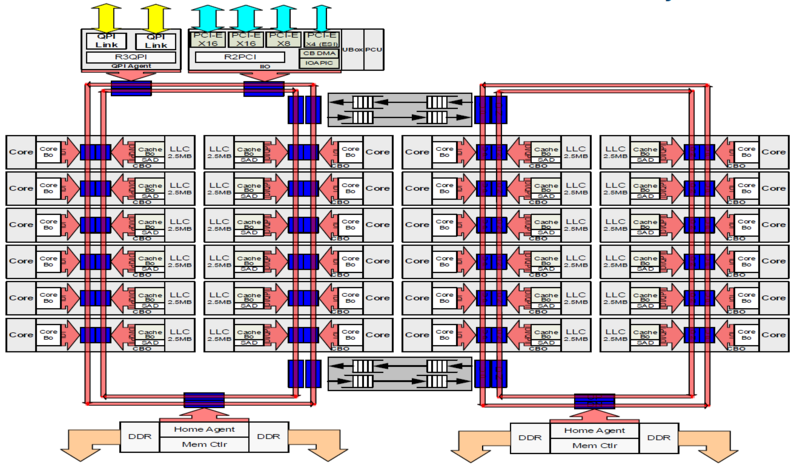

<!-- @import "[TOC]" {cmd="toc" depthFrom=1 depthTo=6 orderedList=false} -->

<!-- code_chunk_output -->

* [1 概述](#1-概述)
* [2 为什么需要片内总线？](#2-为什么需要片内总线)
* [3 星型连接](#3-星型连接)
* [4 环形总线(Ring Bus)](#4-环形总线ring-bus)
* [参考](#参考)

<!-- /code_chunk_output -->

# 1 概述

在大多数普通用户眼里，CPU也许就是一块顶着铁盖子的电路板而已。但是如果我们揭开顶盖，深入正中那片小小的集成电路，我们会发现这里有着人类科技史上，最伟大的奇迹。几十亿个晶体管层层叠叠，密密麻麻挤在一起，占据着这个仅有一点几个平方厘米的狭小世界。**晶体管**们在“上帝之手”的安排下，组成了**各个功能模块**。而这些**功能模块之间**，则是宽阔无比的**超高速公路**。这条超高速公路如此重要，以至于它的距离、速度和塞车与否，会大大影响这个小小世界的效率。

这些**模块**就是**CPU内部的功能模块**，例如**内存控制器！！！**、**L3/L2 Cache**、**PCU**、**PCIe root complex！！！**等等，而这条高速公路，就是我们今天的主角，片内总线了。

# 2 为什么需要片内总线？

片内总线**连接Die内部**的**各个模块(！！！各个模块！！！**)，是它们之间信息交流的必须途径。它的设计高效与否，会大大影响CPU的性能。如果我们把各个模块看做一个个节点，那么它们之间相互连接关系一般可以有以下几种：

而我们CPU片内总线连接就经历了从**星型（Star**）连接 \-\-> **环形总线**（Ring Bus）\-\-> **Mesh网络**的过程。

# 3 星型连接

早期CPU内部**模块数目较少**，结构单一，星型连结不失是一个简单高效的办法。

我们尊贵的**Core**无可争议的被放在**中心的位置**，各个模块都和它连接，而彼此并不直接交互，必须要**Core中转**。这种设计简单高效，被使用了相当长的时间。

问题随着**多core**的出现而显现出来，这个多出来的core放在哪里合适呢？一种星型连接的变种被利用起来。它类似一种**双星结构**，中间的节点似乎进行了有丝分裂，一分为二，各自掌管着自己的势力范围。同时为了高效，每个Core又伸出了些触手，和别的Core的小弟发生了些不清不楚的关系。问题被暂时解决了，这种混乱的关系被固定下来，世界又恢复了些许和平，直到**Core数目的进一步增加**。

# 4 环形总线(Ring Bus)

Intel的服务器产品线是第一个受不了这种临时安排的。**至强CPU**必须提供**更多的CPU**，而**低效的变种星形连结**限制了内核数目的增加，加上各个模块之间通讯的需求越来越多，一种新的总线便孕育而出。

在**Nehalem EP/EX**这个划时代的产品中，很多新技术被引入进来，Intel也由此确定了领先的地位。而**Ring Bus**就是其中重要的一个。

我们可以看到，Ring Bus实际上是**两个环**，一个**顺时针环**和一个**逆时针环**。**各个模块**一视同仁的通过**Ring Stop**挂接在**Ring Bus**上。如此设计带来很多好处：

1. **双环**设计可以保证**任何两个ring stop之间距离不超过Ring Stop总数的一半**，延迟较低。
2. 各个模块之间交互方便，**不需要Core中转**。这样一些高级加速技术，如DCA（Direct Cache Access), Crystal Beach等等应运而生。
3. **高速的ring bus**保证了性能的极大提高。Core to Core latency只有**60ns**左右，而带宽则高达数百G(记得Nehalem是192GB/s).
4. 方便灵活。**增加一个Core**，只要在Ring上面加个新的ring stop就好，不用像以前一样考虑复杂的互联问题。

真是个绝妙的设计！然而，**摩尔定律**是无情的，计划能使用好久的设计往往很快就过时了，这点在计算机界几乎变成了普遍规律。

Ring Bus的缺点也很快随着内核的快速增加而暴露出来。由于**每加一个Core**，**ring bus**就长大一些，**延迟就变大一点**，很快ring bus性能就随着core的增多而严重下降，**多于12个core**后会严重拖累系统的**整体延迟**。

和星型连接一样，一种变种产生了：

Intel Xeon E5-2600 V4 High Core Count Die

在**至强HCC(High Core Count, 核很多版**)版本中，又加入了一个ring bus。

**两个ring bus**各接**12个Core**，将**延迟**控制在可控的范围内。**俩个Ring Bus**直接用两个**双向Pipe Line连接**，保证通讯顺畅。于此同时由于Ring 0中的模块访问Ring 1中的模块延迟明显高于本Ring，亲缘度不同，所以**两个Ring分属于不同的NUMA！！！**（Non\-Uniform Memory Access Architecture）node。这点在**BIOS设计**中要特别注意。

聪明的同学可能要问了，如果Core比12个多，比24个少些呢？是不是凑合塞到第一个ring里拉倒呢？其实还有个1.5 ring的奇葩设计：

# 参考

- 本文章来自: https://zhuanlan.zhihu.com/p/32216294
- Xeon\_e5的wikichip: https://en.wikichip.org/wiki/intel/xeon_e5