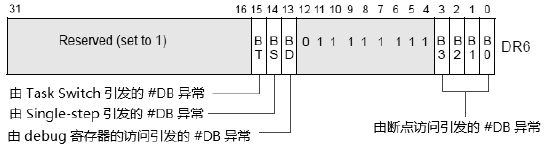
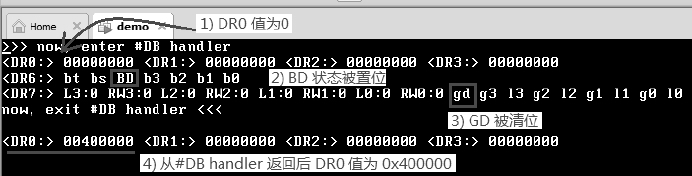

<!-- @import "[TOC]" {cmd="toc" depthFrom=1 depthTo=6 orderedList=false} -->

<!-- code_chunk_output -->

* [0 概述](#0-概述)
	* [0.1 DR4和DR5寄存器](#01-dr4和dr5寄存器)
* [1 断点寄存器DR0～DR3](#1-断点寄存器dr0~dr3)
* [2 状态寄存器DR6](#2-状态寄存器dr6)
	* [2.1 B0～B3标志位](#21-b0~b3标志位)
	* [2.2 BD标志位](#22-bd标志位)
	* [2.3 BS标志位](#23-bs标志位)
	* [2.4 BT标志位](#24-bt标志位)
	* [2.5 多个debug条件同时触发](#25-多个debug条件同时触发)
	* [2.6 EFLAGS.RF标志位](#26-eflagsrf标志位)
* [3 控制寄存器DR7](#3-控制寄存器dr7)
	* [3.1 L0～L3（local breakpoint enable）控制位](#31-l0~l3local-breakpoint-enable控制位)
	* [3.2 G0～G3（global breakpoint enable）控制位](#32-g0~g3global-breakpoint-enable控制位)
	* [3.3 GE与LE控制位](#33-ge与le控制位)
	* [3.4 GD（general detect enable）控制位](#34-gdgeneral-detect-enable控制位)
	* [3.5 R/W0～R/W3（read/write）控制位](#35-rw0~rw3readwrite控制位)
	* [3.6 LEN0～LEN3（Length）控制位](#36-len0~len3length控制位)
* [4 Fault与Trap类型的debug异常](#4-fault与trap类型的debug异常)
* [5 General Detect产生的\#DB异常](#5-general-detect产生的db异常)
* [6 执行断点指令产生的\#DB异常](#6-执行断点指令产生的db异常)

<!-- /code_chunk_output -->

# 0 概述

处理器提供了三类Debug Register以支持调试功能。

① 断点寄存器：DR0、DR1、DR2及DR3。

② 状态寄存器：DR6。

③ 控制寄存器：DR7。

这些debug寄存器的读/写使用MOV指令进行。

```assembly
mov DR0，0x200000       ;设置断点1
```

上面这条mov指令将0x200000值写入DR0，用来设置其中一个断点地址。debug寄存器属于特权级资源，需要在CPL=0权限下进行读/写。

## 0.1 DR4和DR5寄存器

这两个寄存器是保留的，当CR4.DE=1时，访问DR4和DR5将会产生#UD异常。当CR4.DE=0时，访问DR4和DR5寄存器的结果将是对DR6和DR7的访问。

# 1 断点寄存器DR0～DR3

4个断点寄存器DR0、DR1、DR2及DR3用来设置断点的线性地址。


在64位模式下，DR0～DR3寄存器是64位宽，保存64位的线性地址。

# 2 状态寄存器DR6

状态寄存器有一个：DR6寄存器。



DR6寄存器反映最后一次发生#DB异常时的状态，这些状态位记录着最后一次由哪些条件引发#DB异常。只有当再一次发生#DB异常时，DR6寄存器的状态才会更新。

## 2.1 B0～B3标志位

B0～B3标志位被置位时，指示处理器在执行指令时遇到了DR0～DR3寄存器所设置的断点地址而引发#DB异常。例如：当B0被置位时，表示DR0寄存器内的断点被触发。

## 2.2 BD标志位

当DR7.GD=1时，对任何一个debug寄存器的访问（读或写）都会引发#DB异常。此时DR6.BD将会被置位，指示下一条指令是对debug寄存器的访问。

## 2.3 BS标志位

当由Eflags.TF标志位置位而引发Single-Step调试时，DR6.BS将被置位，指示发生了single-step调试。

## 2.4 BT标志位

在使用TSS进行任务切换时，由TSS块内的T标志置位而引发Trap调试时，DR6.BT将被置位，指示在任务切换时发生了Trap（#DB异常）。

## 2.5 多个debug条件同时触发

在DR6寄存器记录的多个debug条件可能会遇到同时触发的情形，读取DR6寄存器内容可以得到多个标志位被置位。

## 2.6 EFLAGS.RF标志位

当遇到Fault类型的debug异常发生时，EFLAGS寄存器的RF标志位将起重要的作用。此时需要对RF置位，让发生debug异常的指令得到成功执行（对Trap类型的#DB异常无影响）。

# 3 控制寄存器DR7

debug异常发生的允许条件由DR7寄存器进行控制，如下图所示。


除了DR6寄存器中记录的BS（single-step）和BT（task switch，即由TSS内的T标志引发）debug异常外，其他类型的debug发生都可以在DR7里开启。

## 3.1 L0～L3（local breakpoint enable）控制位

对应于DR0～DR3这4个断点寄存器。当被置位时，允许对DR0～DR3中设置的断点地址访问时发生#DB异常（包括数据断点和执行断点）。

当发生task switch时，处理器会对L0～L3控制位清位，以防止在新任务里受原任务的影响而产生#DB异常。

## 3.2 G0～G3（global breakpoint enable）控制位

意义与L0～L3控制位一致，不同的是，在发生task switch时，处理器会保持原任务的G0～G3控制位有效，不会进行清位处理。

处理器检测到L0～L3或G0～G3中任何一个被置位，对应的DR0～DR3寄存器的断点被访问都会引发#DB异常。

举例说，无论是G0=1还是L0=1，在DR0寄存器中的断点地址被访问（在符合产生#DB异常的条件下）都会产生#DB异常。

## 3.3 GE与LE控制位

这两个控制位在P6家族以后的处理器不支持，Intel推荐这两个位设为1以兼容旧处理器。

## 3.4 GD（general detect enable）控制位

当DR7.GD=1时，对任何一个debug寄存器的访问都会产生#DB异常。处理器在进入#DB handler前会将GD清位，这将允许在#DB handler内访问debug寄存器。

GD控制位的设立是为了给emulator（模拟器）使用，在emulator里面的guest系统需要设置debug寄存器时，emulator可以对真实机器里的DR7.GD进行置位，让emulator产生#DB异常，在#DB handler里进行相关的处理。

DR7.GD用于避免emulator里的guest系统影响到真实机器里的debug寄存器。

按笔者的理解，这里所说的emulator应该是指VMware这类虚拟机软件，但应该不包括Bochs这类模拟器。

## 3.5 R/W0～R/W3（read/write）控制位

这4个域用来设置对DR0～DR3寄存器里的断点地址所进行访问的类型，可以包括：

① 00B：对断点地址fetch指令（即执行断点里的指令）。

② 01B：对断点地址进行Write操作（仅限于写）。

③ 10B：对I/O地址进行Read和Write操作。此时对应的DR0～DR3寄存器保存的是I/O地址。

④ 11B：对断点地址进行Read和Write操作。

在上面的（3）里，需要开启CR4.DE（Debug Extension）控制位。当CR4.DE=0时，10B值是未定义的设置。注意（2）与（4）的区别，01B仅限于写操作，11B可以包括读操作。

## 3.6 LEN0～LEN3（Length）控制位

这4个域用来设置DR0～DR3寄存器的断点地址有效范围，如下所示。

① 00B：byte（1个字节）。

② 01B：word（2个字节）。

③ 10B：quad word（8个字节）。

④ 11B：double word（4个字节）。

上面的（3），使用在IA-32e模式（long-mode）里，否则是未定义的设置。

# 4 Fault与Trap类型的debug异常

\#**DB异常**可以是**Fault或者Trap类型**，下面**两类条件**引发的\#**DB异常属于Fault类型**。

① **DR7.GE=1**时，对debug寄存器的访问引发\#DB异常。

② 对**断点指令的执行**引发\#**DB异常**。

下面条件引发的\#DB异常属于Trap类型。

① **Eflags.TF=1**时引发的**single\-step \#DB异常**。

② 由**task switch时TSS段**里的**TF置位**而引发的\#DB异常。

③ 对断点地址的访问引发的\#DB异常。

④ 对I/O地址的访问引发的\#DB异常。

Fault类型的debug异常在引发异常的指令执行之前产生，而Trap类型的debug异常在引发异常的指令执行完后产生。

# 5 General Detect产生的\#DB异常

由General Detect产生的debug异常很简单，它所需要的条件如下。

① DR7.GD=1。

② 在后续指令流里访问任何一个debug寄存器。

处理器在响应general detect产生的#DB异常时，会将DR6.BD位置位，记录发生了general detect（即对debug寄存器的访问）。

值得注意的是，由于general detect条件是一次性的，处理器在进入#DB handler前，会将DR7.GD清位，以便在#DB handler里访问debug寄存器。因此，DR7.GD只能使用一次。如果需要再次启动general detect，那么需要重新对DR7.GD进行置位。

下面我们作为一个练习用实验13-1来测试general detect功能。

>实验13-1：测试general detect产生的#DB异常

由于general detect产生的#DB异常属于Fault类型，因此我们通过对其中一个断点寄存器进行写来观察其行为。

代码清单13-1（topic13\ex13-1\protected.asm）：

```assembly
；① 对 DR7.GD 置位
      mov eax，dr7
      bts eax，13                        ； GD=1
      mov dr7，eax
；② 写 debug 寄存器，引发 #DB 异常
      mov ebx，0x400000
      mov dr0，ebx                        ； 写DR0寄存器，产生 #DB 异常
；③ 从#DB handler返回后，再输出 debug寄存器
      call println
      call dump_drs
```

上面的代码中，在①里对DR7.GD进行置位，在②里往DR0寄存器写入0x400000作为断点地址值，③中打印DR0～DR3寄存器的内容。

代码清单13-2（topic13\ex13-1\protected.asm）：

```assembly
；*********************************
； #DB handler
；*********************************
debug_handler：
      jmp do_db_handler
dh_msg1        db '>>> now，enter #DB handler'，10，0
dh_msg2        db 'now，exit #DB handler <<<'，10，0
do_debug_handler：
      mov esi，dh_msg1
      call puts
      call dump_drs                                ； 打印 DR0～DR3
      call dump_dr6                                ； 打印 DR6
      call dump_dr7                                ； 打印 DR7
      mov esi，dh_msg2
      call puts
do_debubg_handler_done：
      bts DWORD [esp+8]，16                      ； RF=1
      iret
```
在这个\#DB handler里只是简单地打印各个debug寄存器的值，这些dump函数在lib\debug.asm文件里实现。

最后一步是将stack内里EFLAGS寄存器映像的RF标志位置位，使发生#DB异常的指令可以继续执行下去。

运行结果如下。



我们留意运行结果的输出：

① 在进入#DB handler时，DR0值为0，这表明#DB异常发生在指令执行之前。

② DR6寄存器的BD状态被置位，这表明发生了由general detect引发的#DB异常。

③ DR7寄存器的GD被清位，这表明在进入#DB handler前，处理器对它执行清位。

④ 从#DB handler返回后，DR0的值为0x400000，这表明指令顺利得到执行。

我们通过这个实验对general detect产生的#DB异常情况已经有所了解。在下面的实验里我们还会得到更多的信息。

# 6 执行断点指令产生的\#DB异常

在**debugger（调试软件**）里进行调试时，我们可以**对一个指令流设置断点**，当处理器**执行到这个断点时产生\#DB异常**。

除了可以使用INT3指令（Opcode为0xCC）设置断点外，还可以使用功能更强大的断点寄存器设置断点位置。

执行一个断点指令产生#DB异常的条件如下。

① DR7寄存器的L0～L3或者G0～G3位被置位。

② DR7寄存器的R/W0～R/W3域的值为00B，指示属于执行访问类型。

③ DR7寄存器的LEN0～LEN3域的值为00B，指示属于byte（1个字节）的有效宽度。

④ 在DR0～DR3寄存器里设置断点地址。

对于断点的执行，必须使用1个字节的访问宽度，其他的值是不被支持的。由执行断点指令产生的#DB异常也属于Fault类型。表明在指令执行前产生#DB异常。下面我们作为一个练习用实验13-2来测试由执行断点产生的#DB异常。

>实验13-2：测试执行断点指令产生的#DB异常

作为对比，我们使用了和实验13-1相同的代码结构。

代码清单13-3（topic13\ex13-2\protected.asm）：

```assembly
；① 对 DR7 进行设置
      mov eax，dr7
      bts eax，0                            ； L0=1，R/W0=0，LEN0=0
      mov dr7，eax
；② 设置断点位置
      mov eax，breakpoint                 ； 断点位置在后续指令流里
      mov dr0，eax                          ； DR0 保存断点
      mov ebx，0x400000                    ； 写入值
；③ 断点位置
      breakpoint：
      mov dr1，ebx                           ； 断点位置的指令执行写 DR1 寄存器
；④ 从#DB handler返回后，再输出 debug寄存器
      call println
      call dump_drs
```

上面代码中①里对DR7进行设置：L0=1，R/W0及LEN0都保持0值。这一步设置开启指令断点enable位。在②里将断点设为接下来要执行的指令，断点位置保存在DR0寄存器里。

在breakpoint里的指令是对DR1寄存器进行设置，值为0x400000，最后在#DB handler返回后输出debug寄存器的标志位。

\#DB handler代码和实验13-1是相同的。

下面是在笔者的Core i5处理器笔记本式计算机上的测试结果。


在这个实验里，只有在真实机器上的结果才是正确的。这个结果显示：

① 断点地址位置在0x00009078处，这是因为我们的protected.asm模块的起始地址在0x9000位置上。

② DR6寄存器的B0标志位被置位，指示#DB异常由DR0寄存器内的断点地址引发。

③ DR7寄存器的L0位被置位，允许使用DR0寄存器内的断点。

④ 最后，在#DB handler返回后，DR1寄存器的值被设为0x400000。

我们从最后的信息里得知，由执行断点指令引发的#DB异常在指令执行之前引发。在#DB handler返回后完成对指令的执行，这个情形和general detect引发的#DB异常一样。

实验13-2在VMware上运行产生了意想不到的结果（不正确的）。

