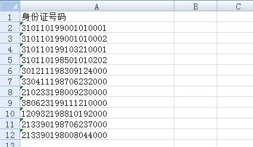

https://www.zhihu.com/question/29265587/answer/125091104?from=singlemessage&isappinstalled=0&utm_medium=social&utm_source=wechat_session

《七周七学习成为数据分析师》

- 第一周: Excel学习掌握
- 第二周: 数据可视化
- 第三周: 分析思维的训练
- 第四周: 数据库学习
- 第五周: 统计知识学习
- 第六周: 业务学习(用户行为、产品、运营)
- 第七周: Python/R 学习

## 第一周: Excel学习掌握

重点是了解各种函数，包括但不限于sum，count，sumif，countif，find，if，left/right，时间转换等。Excel函数不需要学全，重要的是学会搜索。即如何将遇到的问题在搜索引擎上描述清楚。

我认为掌握vlookup和数据透视表足够，是最具性价比的两个技巧。

- 学会vlookup，SQL中的join，Python中的merge很容易理解。

- 学会数据透视表，SQL中的group，Python中的pivot\_table也是同理。

Excel是熟能生巧，多找练习题。还有需要养成好习惯，不要合并单元格，不要过于花哨。表格按照原始数据(sheet1)、加工数据(sheet2)，图表(sheet3)的类型管理。

下面是三篇Excel的文章，比较简单，大体介绍了Excel应用，可以作为职场新人的指南。

- 第一篇[数据分析—函数篇](https://zhuanlan.zhihu.com/p/23345231)。主要简单讲解常用的函数，以及与之对应的SQL/Python函数。
- 第二篇[数据分析—技巧篇](https://zhuanlan.zhihu.com/p/23618955)。主要简单讲解我认为很有新价比的功能，提高工作效率。
- 第三篇[数据分析—实战篇](https://zhuanlan.zhihu.com/p/24084300)。主要将前两篇的内容以实战方式进行，简单地进行了一次数据分析。数据源采用了真实的爬虫数据，是5000行数据分析师岗位数据。

下面是为了以后更好的基础而附加的学习任务。

- 了解单元格格式，后期的数据类型包括各类timestamp，date，string，int，bigint，char，factor，float等。

- 了解数组，以及怎么用(excel的数组挺难用)，Python和R也会涉及到 list。

- 了解函数和参数，当进阶为编程型的数据分析师时，会让你更快的掌握。

- 了解中文编码，UTF8和ASCII，包括CSV的delimiter等。

养成一个好习惯，不要合并单元格，不要过于花哨。表格按照原始数据、加工数据，图表的类型管理。如果时间还有剩余，可以看大数据时代 (豆瓣)，培养职业兴趣。

再来一道练习题，我给你1000个身份证号码，告诉我里面有多少男女，各省市人口的分布，这些人的年龄和星座。(身份证号码规律可以网上搜索)

## 第二周: 数据可视化

数据分析界有一句经典名言，字不如表，表不如图。数据可视化是数据分析的主要方向之一。除掉数据挖掘这类高级分析，不少数据分析就是监控数据观察数据。

**首先要了解常用的图表**: 

各类图表的详细介绍可以查看第四篇文章: [数据可视化: 你想知道的经典图表全在这](https://zhuanlan.zhihu.com/p/24168144)

了解图表后，还应该**学会报表制作**，这里准备了第五篇: [数据可视化: 打造高端的数据报表](https://zhuanlan.zhihu.com/p/24409555)。将教会大家Excel的高级图表用法。

如果还不过瘾，我们得掌握信息图和BI。

BI(商业智能)和图表的区别在于BI擅长交互和报表，更擅长解释已经发生和正在发生的数据。将要发生的数据是数据挖掘的方向。

BI市面上的产品很多，基本都是建立仪表盘Dashboard，通过维度的联动和钻取，获得可视化的分析。第六篇: [数据可视化: 深入浅出BI](https://zhuanlan.zhihu.com/p/24573880) 

**数据可视化的学习就是三个过程，了解数据(图表)，整合数据(BI)，展示数据(信息化)**。

[Excel 图表绘制 - 热门问答](https://www.zhihu.com/topic/19792123/hot)

## 第三周: 分析思维的训练

## 第四周: 数据库学习

数据库入门看这篇文章: [写给新人的数据库指南](https://zhuanlan.zhihu.com/p/25120684)

学习围绕Select展开。增删改、约束、索引、数据库范式均可以跳过。

主要了解where，group by，order by，having，like，count，sum，min，max，distinct，if，join，left join，limit，and和or的逻辑，时间转换函数等。

如果想要跟进一步，可以学习row_number，substr，convert，contact等。另外不同数据平台的函数会有差异，例如Presto和phpMyAdmin。

按照《[SQL，从入门到熟练SQL](https://zhuanlan.zhihu.com/p/25203710)》和《[从熟练到掌握](https://zhuanlan.zhihu.com/p/25435517)》这两篇的内容学习。

期间你不需要考虑优化和写法丑陋。

**附加学习**: 

如果这周的学习充裕，可以了解MapReduce原理。

来一道练习题，表A是用户的注册时间表，表B是用户所在地，写出各地区每月新注册用户的查询SQL。掌握到这个程度，基本够用，虽然往后工作中会有更多变态数据需求。

## 第五周: 统计知识学习

## 第六周: 业务学习(用户行为、产品、运营)

## 第七周: Python/R 学习

Python拥有很多分支，我们专注数据分析这块，入门可以学习 [深入浅出Python(影印版) (豆瓣)](https://link.zhihu.com/?target=https%3A//book.douban.com/subject/6892016/) 。也是把代码写一遍。

需要学会条件判断，字典，切片，循环，迭代，自定义函数等。知道数据领域最经典的包Pandas+Numpy。

这两门语言最好安装IDE，R语言我建议用RStudio，Python我建议用 Anaconda。都是数据分析的利器。