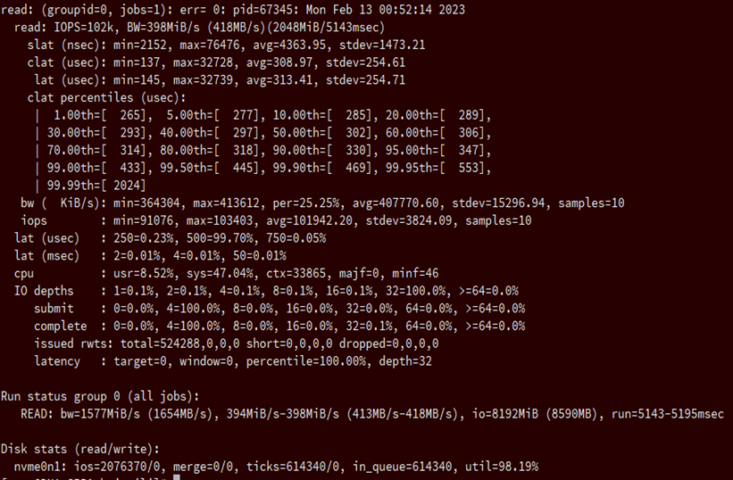

FIO是测试IOPS的非常好的工具, 用来对硬件进行压力测试和验证, 支持13种不同的 I/O 引擎, 包括: sync, mmap, libaio, posixaio, SG v3, splice, null, network, syslet, guasi, solarisaio 等等.

# 源码

URL: https://git.kernel.dk/cgit/fio/

git://git.kernel.dk/fio.git

https://git.kernel.dk/fio.git

# 编译安装

```
$ ./configure
$ make
$ make install
```

注意, GNU make 是必需的. 在 BSD 上, 它可以从 ports 目录中的 devel/gmake 获得; 在 Solaris 上, 它位于 SUNWgmake 包中. 在默认不是 GNU make 的平台上, 键入 `gmake` 而不是 `make`.

Configure 将打印已启用的选项. 注意, 在基于 Linux 的平台上, 必须安装 libaio 开发包才能使用 libaio 引擎. 根据发行版的不同, 它通常被称为 libaio-devel 或 libaio-dev.

对于 gfio, 需要安装 gtk 2.18(或更高版本)、关联的 glib 线程和 cairo. GFIO 不是自动构建的, 可以使用 "--enable-GFIO" 选项进行 configure.

交叉编译:

```
$ make clean
$ make CROSS_COMPILE=/path/to/toolchain/prefix
```

配置将尝试自动确定目标平台.

也可以为 ESX 构建 fio, 使用 `--esx` 开关进行配置.

# 文档

Fio 使用 Sphinx_ 从 reStructuredText_ 文件生成文档.  要构建HTML格式的文档, 请运行 "`make -C doc html`" 并将浏览器定向到: file: `./doc/output/html/index.html`.  要构建手册页, 请运行 "`make -C doc man`", 然后运行 "`man doc/output/man/fio.1`".  要查看支持哪些其他输出格式, 请运行 "`make -C doc help`".

```
.._reStructuredText: https://www.sphinx-doc.org/rest.html
.._Sphinx: https://www.sphinx-doc.org
```

# 平台

Fio(至少)在 Linux, Solaris, AIX, HP-UX, OSX, NetBSD, OpenBSD, Windows, FreeBSD 和 DragonFly 上工作. 某些功能和/或选项可能仅在某些平台上可用, 通常是因为这些功能仅适用于该平台(如 solarisaio 引擎或 Linux 上的 splice 引擎).

Fio 使用 pthread mutexes(互斥锁)进行 signaling 和 locking, 某些平台不支持 process 进程共享 pthread mutexes. 因此, 在这种平台上仅支持 threads. 这可以通过 sysv ipc locking 或其他 locking 替代方案来解决.

# 命令选项

```
$ fio [options] [jobfile] ...
```

它会按照 jobfile 内容运行. 可以有多个 jobfile, fio 将串行化运行. 在内部, 这与使用参数部分中描述的 `:option:'stonewall'` 参数相同.

如果作业文档只包含一个作业, 则不妨在命令行上给出参数. 命令行参数与作业参数相同, 只是有一些额外的参数用于控制全局参数.  例如, 对于作业文档参数 : option: 'iodepth=2 <iodepth>', 镜像命令行选项为 : option: '--iodepth 2 <iodepth>' 或 : option: '--iodepth=2 <iodepth>'. 您还可以使用命令行提供多个作业条目. 对于 fio 看到的每个 : option: '--name <name>' 选项, 它将使用该名称启动一个新作业.  : option: "--name <name>"条目后面的命令行条目将应用于该作业, 直到没有更多条目或看到新的 : option: "--name <name>"条目. 这类似于作业文档选项, 其中每个选项都适用于当前作业, 直到看到新的 [] 作业条目.


```
fio
-filename=/dev/nvme0n1
-direct=1
-iodepth=32
-rw=read
-ioengine=libaio
-size=2G
-bs=4k
-numjobs=4
-thread
-cpus_allowed=0-3
-cpus_allowed_policy=split
-name=read
```

filename: 这里可以是一个文件名，也可以是分区或者块设备, 这里是ssd 块设备

direct: 跳过缓存，直接读写SSD, 测试结果会更真实. Linux读写的时候，内核维护了缓存，数据先写到缓存，然后再后台写到SSD。读的时候也优先读缓存里的数据。这样速度可以加快。所以有一种模式叫作DirectIO，跳过缓存，直接读写SSD, 测试结果会更真实

iodepth=64：队列深度64. 应用层面的, 在libaio模式一次性丢给系统处理的io请求数量. libaio引擎会用这个iodepth值来调用 io_setup 准备个可以一次提交iodepth个IO的上下文，同时申请一个io请求队列用于保持IO. 对于sync, 该值大于1无效

> io队列请求丢过来后，攒积到这些请求后，立即提交，默认是iodepth的值

rw: 读写模式，randwrite是随机写测试，还有顺序读read，顺序写write，随机读randread，混合读写rw, 随机混合读写randrw等。

ioengine:libaio指的是异步模式，如果是同步就要用sync. libaio也就是使用io_submit提交I/O请求，然后再异步地使用io_getevents获取结果

> 为了提高并行性，大部分情况下SSD读写采用的是异步模式。就是用几微秒发送命令，发完后继续发后面的命令。如果前面的命令执行完了，SSD通知会通过中断或者轮询等方式告诉CPU，由CPU来调用该命令的回调函数来处理结果。SSD里面几十上百个并行单元都能分到活干，效率暴增。libaio指的是异步模式，如果是同步就要用sync。

## size

每个线程/进程操作的数据量.

它的值有两种形式：

* 绝对大小，例如10M,20G；

* 百分比，例如20%；需要文件事先存在；

无论哪种形式都是指定一个 job 实例读写的空间(多个 job 实例的情况下每个job实例都读写这么大的空间)；fio运行时间取决于–runtime指定的时间和读写这么多空间所需时间二者中的最小者。

bs: 每一个BIO命令包含的数据大小是4KB

numjobs: 每个job是1个进程/线程，后面每个用-name指定的任务就开几个线程测试。所以最终线程数=任务数×numjobs。

thread: 使用pthread_create创建线程，另一种是fork创建进程

> 进程的开销比线程要大，一般都采用thread测试

cpu_allowed: 允许执行的 cpu

name: 一个代表一个task

# 输出

> fio -filename=/dev/nvme0n1 -direct=1 -iodepth=32 -rw=read -ioengine=libaio -size=2G -bs=4k -numjobs=4 -cpus_allowed=0-3 -cpus_allowed_policy=split -runtime=300 -name=read

值得一提的是，上面一共有 5 个fio进程；因为其中一个是主控进程，其他 4 个才是 job 实例进程

4 个 job, 只取了其中一个的 output 以及整体的 summary



1. 显示了所属group，pid，运行时间等

2. IOPS: 每秒的输入输出量(或读写次数)，是衡量磁盘性能的主要指标之一；

Bw: 平均带宽. KiB/s是按1K=1024计算的，kB/s是按1K=1000计算的

I/O延迟包括三种：slat，clat，lat：
* slat 表示fio submit某个I/O的延迟；slat只在–ioengine=libaio的时候才会出现，因为对于–ioengine=sync/psync没有所谓的提交延迟
* clat 表示fio complete某个I/O的延迟；
* lat 表示从fio将请求提交给kernel，再到kernel完成这个I/O为止所需要的时间；

关系是 lat = slat + clat；stdev表示标准差(standard deviation)，越大代表波动越大

对于–ioengine=sync/psync，不显示slat，clat接近总延迟

>usec：微秒；msec：毫秒；1ms=1000us；

clat的百分位数. 1%在265us内; 5%在277us内, 以此类推

bw. 基于采样得到的带宽统计, 与上面类似, per表示当前job的带宽在group内的百分比, samples是采样数

iops. 基于采样得到的iops统计

lat. 这组数据表明lat(latency：延迟 )的分布；有0.23%的request延迟<250us，有99.70%的 250us =< request lat < 500us, 以此类推;

cpu: cpu使用情况. usr是用户态占比, sys是内核态占比. ctx表示该job经历的context switch数目

> 因为上下文切换导致的主要和次要页面失败的用户/系统 CPU使用百分比。因为测试被配置的使用直接IO，因此有很少的页面失败：；

IO depth. 1表示1-2占比, 16表示16-32占比, 32表示32-64占比.                        表示在任何时间有多少IO分发给系统。这完全是应用方面的，意味着它和设备的IO队列做不同的事情，iodepth设置为32, 因此IO深度在100%的时间里一直是一个32；

IO submit. 在一个submit调用里，提交了多少 I/O. 4=表示0-4区间内的占比, 8=表示4-8区间内的占比；以此类推.

IO complete. 一次complete查询中(io_getevents调用), 完成了多少 I/O.

IO issued rwts. 总共发出了多少read/write/trim/x请求，有多少short(read, write, send, recv等返回大小小于请求大小)，有多少被dropped

IO latency. 和 latency_target 相关, 忽略

group统计

bw=这组进程的总带宽，最小带宽和最大带宽；

io=这组总io大小；

run. 线程的最小和最大运行时间；

磁盘统计

> 以下内容跳过

ios=所有group总共执行的IO数

merge=总共发生的IO合并数.

ticks=Number of ticks we kept the disk busy.

io_queue=花费在队列上的总共时间

Util: The disk utilizatio，磁盘利用率.

