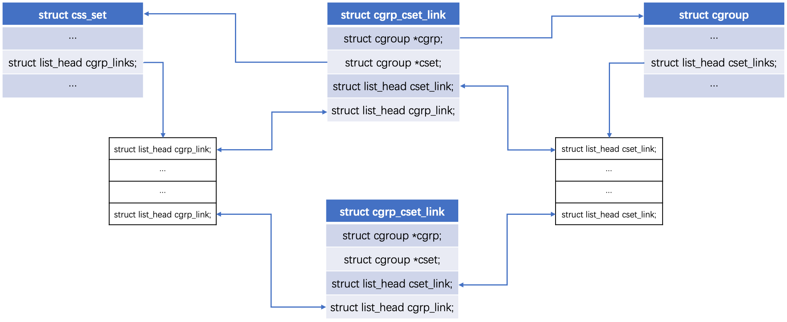

<!-- @import "[TOC]" {cmd="toc" depthFrom=1 depthTo=6 orderedList=false} -->

<!-- code_chunk_output -->

- [1. cgroup概念](#1-cgroup概念)
  - [1.1. 目的](#11-目的)
  - [1.2. 资源划分: 子系统和节点cgroup](#12-资源划分-子系统和节点cgroup)
  - [1.3. 进程分组: 通过css_set](#13-进程分组-通过css_set)
  - [1.4. 进程分组css_set和节点cgroup的关系: 多对多](#14-进程分组css_set和节点cgroup的关系-多对多)
- [2. 架构](#2-架构)
  - [2.1.](#21)
- [3. 相关数据结构](#3-相关数据结构)
  - [3.1. task_struct](#31-task_struct)
  - [3.2. css_set](#32-css_set)
    - [rcu 锁](#rcu-锁)
    - [3.2.1. 小结](#321-小结)
  - [3.3. cgroup_subsys_state](#33-cgroup_subsys_state)
  - [3.4. cgroup_subsys](#34-cgroup_subsys)
  - [3.5. cgroup](#35-cgroup)
- [3.6. css_set 和 cgroup](#36-css_set-和-cgroup)
  - [3.6.1. cgrp_cset_link](#361-cgrp_cset_link)
- [3.7. css 和 cgroup](#37-css-和-cgroup)
  - [3.7.1. cgroup v1](#371-cgroup-v1)
  - [3.7.2. cgroup v2](#372-cgroup-v2)
  - [3.8. cgroup_root](#38-cgroup_root)
  - [3.9. 全局变量](#39-全局变量)
  - [3.10. 小结](#310-小结)
    - [3.10.1. 示例](#3101-示例)
- [总结](#总结)
- [4. 参考](#4-参考)
  - [4.1. v1 和 v2](#41-v1-和-v2)

<!-- /code_chunk_output -->

# 1. cgroup概念

## 1.1. 目的

`cgroup_init_early();`函数就是初始化 cgroup所需要的参数的。

cgroup最初是在2006年由google的一名工程师提出的，目的是把一些**共同目标的进程**放在**一个组**里面，而这个组里面的进程能**共享指定数额！！！的资源**。而后就有了cgroup这个概念了。

这里就涉及了两个东西
* **资源划分**
* **进程分组**

## 1.2. 资源划分: 子系统和节点cgroup

我们把**每种类型资源**叫做**子系统**，比如**CPU子系统**，**内存子系统**。为什么叫做子系统呢，因为它是从**整个操作系统的资源衍生出来**的。

然后我们创建一种**虚拟的节点**，叫做**cgroup**，然后这个虚拟节点可以扩展，以树形的结构，有**root节点**和**子节点**。这个**父节点**和**各个子节点**就形成了**层级**（`hierarchy`）。

**每个层级hierarchy**都可以关联**一个或者多个子系统**，就意味着，我们把**资源**按照类型**分割**到**多个hierarchy层级系统**中，**层级系统**中的**每个节点**对**这个资源**的**占比各有不同**。

> 一个 hierarchy 可以关联多个子系统; 但一个子系统只能挂载到一个 hierarchy;

* 子系统: **每个代表了系统中可以隔离的资源类型**
* cgroup: **某个节点**. 既是**限制额设置节点**(`css->cgroup`对应), 又是**使用节点**(每个cgroup可以有**一种或多种类型资源**的**数额使用**, 即占比)

## 1.3. 进程分组: 通过css_set

下面我们想办法把进程分组，**进程分组**的逻辑叫做`css_set`。这里的css是**cgroup_subsys_state(！！！**)的缩写。所以 **css_set** 和**进程**的关系是**一对多**的关系。

* **一个 css_set** 中有**多个 task**;

* **一个 task** 只属于**某一个 css_set**

另外，在cgroup眼中，进程叫做**task**。这个可能是为了和内核中进程的名词区分开吧。

## 1.4. 进程分组css_set和节点cgroup的关系: 多对多

我们的目的是将 **一组进程** 和 **一组资源**(**每种类型子系统对应一个资源**, 但不一定会有所有类型的限制) 对应起来.

**进程分组css_set**、**不同层级hierarchy**中的**节点cgroup**也都有了。那么，就要把**节点cgroup**和**进程分组css_set**进行关联，和数据库中关系表一样。这个是一个**多对多的关系**。为什么呢？

* 首先，**一个节点cgroup**可以隶属于**多个css_set**，这就代表着**这批css_set**中的**进程**都拥有**这个cgroup所代表的资源！！！**。

* 其次，**一个css_set**需要**多个cgroup**。因为**一个层级的cgroup**只代表**一种或者几种类型的资源限制**，而一般**进程**是需要**多种资源的集合体**。

至于说怎么关联起来的, 见下面详细描述.

# 2. 架构


按照资源的划分，系统被划分成了**不同的子系统**(subsystem)，正如我们上面列出的cpu, cpuset, blkio...每种资源独立构成一个subsystem.

可以将cgroup的架构抽象的理解为**多根**的树结构，一个hierarchy代表**一棵树**，树**绑定一个或多个subsystem**. 而**树的叶子或中间节点**则是**cgroup**, **一个cgroup**具体的限制了**某种或某几种资源**。一个或多个cgroup组成一个css_set.

简单来讲，一个**资源限制集合**(`css_set`)在**一种subsystem**(cpu，devices)的**限制条件只能有一个！！！**，最终的**task**(进程)同`css_set`关联，从而达到**限制资源**的目的。

常见的4个

task（任务）：cgroups的术语中，task就表示系统的一个进程。

cgroup（控制组）：cgroups 中的资源控制都以cgroup为单位实现。cgroup表示按某种资源控制标准划分而成的任务组，包含一个或多个子系统。一个任务可以加入某个cgroup，也可以从某个cgroup迁移到另外一个cgroup。

subsystem（子系统）：cgroups中的subsystem就是一个资源调度控制器（Resource Controller）。比如CPU子系统可以控制CPU时间分配，内存子系统可以限制cgroup内存使用量。

hierarchy（层级树）：hierarchy由一系列cgroup以一个树状结构排列而成，每个hierarchy通过绑定对应的subsystem进行资源调度。hierarchy中的cgroup节点可以包含零或多个子节点，子节点继承父节点的属性。整个系统可以有多个hierarchy。

另外整理的：
css_set:一组关联cgroup的集合。
cgroupfs_root:代表一个hierarchy
cgroup_subsys:代表一个subsystem

## 2.1. 

1. 一个hierarchy上可以绑定一个或者多个subsystem.

2. **一个 subsystem** 只能附加到**一个 hierarchy** 上

3. 创建一个hierarchy的时候，系统所有css_set都会和此hierarchy的root cgroup关联。也就相当于所有的task都和root cgroup关联。但是在同一个hierarchy中，一个css_set只能和一个cgroup关联。

4. fork子进程的时候父子进程在同一个cgroup.但是后续可以修改。


# 3. 相关数据结构

## 3.1. task_struct

首先先看进程的结构

```cpp
#ifdef CONFIG_CGROUPS
    /* Control Group info protected by css_set_lock: */
     // 设置这个进程属于哪个css_set
    struct css_set __rcu *cgroups;
    /* cg_list protected by css_set_lock and tsk->alloc_lock: */
     //用于将所有同属于一个css_set的task连成一起
    struct list_head cg_list;
#endif
```

我们会在代码中经常见到list_head。它其实就是表示，这个在链表中存在。

```cpp
struct list_head {
    struct list_head *next, *prev;
};
```

它的结构很简单，就能把某种相同性质的结构连成一个链表，根据这个链表我能前后找全整个链表或者头部节点等。

## 3.2. css_set

```cpp
struct css_set {
    // 包含一系列的css, 这个就代表了css_set和子系统的多对多的其中一面
    // css_set关联的所有css(cgroup_subsys_state). css就是子系统状态 
    // 每一个subsystem对应数组中相应id的项, 每一项就表示了这个 css_set 对应的某类子系统的状态, 即资源限制等等
    struct cgroup_subsys_state *subsys[CGROUP_SUBSYS_COUNT];

    // 引用计数，gc使用，如果子系统有引用到这个css_set, 则计数＋1
    refcount_t refcount;
    struct css_set *dom_cset;
    // 默认连接的cgroup
    struct cgroup *dfl_cgrp;
    
    int nr_tasks;
    // 将所有的task连起来;
    struct list_head tasks;
    // mg_tasks 代表迁移的任务
    struct list_head mg_tasks;
    struct list_head dying_tasks;
    // 所有迭代任务的列表，这个补丁参考: https://patchwork.kernel.org/patch/7368941/
    struct list_head task_iters;

    // 把->subsys[ssid]->cgroup->e_csets[ssid]结构展平放在这里，提高迭代效率
    struct list_head e_cset_node[CGROUP_SUBSYS_COUNT];

    struct list_head threaded_csets;
    struct list_head threaded_csets_node;

    //列出有相同hash值的cgroup
    struct hlist_node hlist;
    // 将这个css_set对应的cgroup链接起来
    // 由 cgrp_cset_links 组成的链表，链表上每一项 cgrp_cset_link 都指向和css_set关联的cgroup
    struct list_head cgrp_links;

    // 内存迁移的时候产生的系列数据
    struct list_head mg_preload_node;
    struct list_head mg_node;
    struct cgroup *mg_src_cgrp;
    struct cgroup *mg_dst_cgrp;
    struct css_set *mg_dst_cset;

    // 这个css_set是否已经无效了
    bool dead;

    /* For RCU-protected deletion */
    // rcu锁所需要的callback等信息
    struct rcu_head rcu_head;
```


`css_set`是直接和task关联的结构，`css_set`用来将**进程**关联到一组`cgroup_subsys_state`对象，。


`css_set` 是一个**各类子系统状态(资源限制等)实例的集合**(每种类型资源一个, `subsys[]`, `css->cgroup`是**这类资源限额信息**的**节点**). 

`css_set` 直接和**task**关联(`tasks`), 同时通过`cgrp_cset_links`和**所有相关的cgroup**建立关联, 这样cgroup节点和一组task就关联起来了, 从而达到了**限制资源**的目的(**一组进程共享指定数额的资源**).

所以`css_set`其实**最重要**的就是`cgroup_subsys_state subsys[]`数组这个结构, 每个 css_set 有这么一个的数组, 代表**关联到这个 css_set 的进程组**对应的**每种类型资源的状态**(即**每种子系统的资源限制**), 一般不同 css_set 是不同的.

`cgroup_subsys_state subsys[]` 应当包括**所有子系统的css**. 也就是说, **一类可隔离的资源算一个**, 应该包含**系统中所有可隔离的资源类型**个数目. 如果此`css_set`**没有指定某个subsystem的css**或者**subsystem没有mount**，则默认初始化为根css.

### rcu 锁

这里说一下rcu锁，这个锁是linux2.6引入的。它是非常高效的，适合读多写少的情况。全称是(Read-Copy Update, 读－拷贝修改)。原理就是读操作的时候，不需要任何锁，直接进行读取，写操作的时候，先拷贝一个副本，然后对副本进行修改，最后使用回调（callback）在适当的时候将**指向原来数据的指针**指向**新的被修改的数据**。https://www.ibm.com/developerworks/cn/linux/l-rcu/

这里的`rcu_head`就存储了对这个结构上rcu锁所需要的回调信息。

```cpp
struct callback_head {
    struct callback_head *next;
    void (*func)(struct callback_head *head);
} __attribute__((aligned(sizeof(void *))));

#define rcu_head callback_head
```


### 3.2.1. 小结


## 3.3. cgroup_subsys_state

这个结构最重要的就是保存的**进程**与**特定子系统**相关的信息。通过它，可以将 **task_struct** 和 **cgroup** 连接起来了：

`task_struct->css_set->cgroup_subsys_state[]->cgroup`

```cpp
// 子系统状态
struct cgroup_subsys_state {
        // 这个 css 对应的cgroup
        // v2下, 一个 cgroup 可以对应多个 css(因为很多种资源类型)
        // 这个 cgroup 就是这个状态所属于的 cgroup
        struct cgroup *cgroup;

        // 这个 css 对应的子系统
        struct cgroup_subsys *ss;

        // per-cpu信息的引用计数
        struct percpu_ref refcnt;

        // 兄弟和孩子链表串
        struct list_head sibling;
        struct list_head children;

        struct list_head rstat_css_node;

        // css的唯一id
        int id;

        // 可设置的flag有：CSS_NO_REF/CSS_ONLINE/CSS_RELEASED/CSS_VISIBLE
        unsigned int flags;

        // 为了保证遍历的顺序性，设置遍历按照这个字段的升序走
        u64 serial_nr;

        // 计数，计算本身css和子css的活跃数，当这个数大于1，说明还有有效子css
        atomic_t online_cnt;

        // 带cpu信息的引用计数使用的rcu锁
        struct work_struct destroy_work;
        struct rcu_work destroy_rwork;

        // 父css
        struct cgroup_subsys_state *parent;
}
```

`cgroup_subsys_state` 代表了**某一类！！！可隔离的资源(子系统)的一个状态！！！**(每一类子系统会有很多个css状态), 而不是整体资源.

所有的**资源限制状态**(即css)也是通过**cgroup节点**体现的, css结构中的`cgroup` 就对应的是这个cgroup节点.

## 3.4. cgroup_subsys

```cpp
// 对应特定的子系统
struct cgroup_subsys {
    // 下面的是函数指针，定义了该子系统对css_set结构的系列操作
    struct cgroup_subsys_state *(*css_alloc)(struct cgroup_subsys_state *parent_css);
    int (*css_online)(struct cgroup_subsys_state *css);
    void (*css_offline)(struct cgroup_subsys_state *css);
    void (*css_released)(struct cgroup_subsys_state *css);
    void (*css_free)(struct cgroup_subsys_state *css);
    void (*css_reset)(struct cgroup_subsys_state *css);
    void (*css_rstat_flush)(struct cgroup_subsys_state *css, int cpu);
    int (*css_extra_stat_show)(struct seq_file *seq,
                struct cgroup_subsys_state *css);

    // 这些函数指针表示了该子系统对进程task的一系列操作
    int (*can_attach)(struct cgroup_taskset *tset);
    void (*cancel_attach)(struct cgroup_taskset *tset);
    void (*attach)(struct cgroup_taskset *tset);
    void (*post_attach)(void);
    int (*can_fork)(struct task_struct *task,
            struct css_set *cset);
    void (*cancel_fork)(struct task_struct *task, struct css_set *cset);
    void (*fork)(struct task_struct *task);
    void (*exit)(struct task_struct *task);
    void (*release)(struct task_struct *task);
    void (*bind)(struct cgroup_subsys_state *root_css);

    // 是否在前期初始化了
    bool early_init:1;

    // 如果设置了true，那么在cgroup.controllers和cgroup.subtree_control就不会显示
    bool implicit_on_dfl:1;

    bool threaded:1;

    // 启动阶段自动初始化
    int id;
    const char *name;

    // 如果子cgroup的结构继承子系统的时候没有设置name，就会沿用父系统的子系统名字，所以这里存的就是父cgroup的子系统名字
    const char *legacy_name;

    // 这个就是子系统指向的层级中的root的cgroup, 即 hierarchy
    struct cgroup_root *root;

    // 对应的css的idr
    struct idr css_idr;

    // 对应的文件系统相关信息
    struct list_head cfts;
    /* 默认的文件系统 */
    struct cftype *dfl_cftypes; /* for the default hierarchy */
    /* 继承的文件系统 */
    struct cftype *legacy_cftypes;  /* for the legacy hierarchies */

    // 有的子系统是依赖其他子系统的，这里是一个掩码来表示这个子系统依赖哪些子系统
    unsigned int depends_on;
}
```

这里特别说一下**cftype**。它是`cgroup_filesystem_type`的缩写。这个要从我们的**linux虚拟文件系统**说起（`VFS`）。VFS封装了**标准文件**的**所有系统调用**。那么我们使用cgroup，也抽象出了一个**文件系统**，自然也需要实现这个VFS。实现这个VFS就是使用这个cftype结构。

这里说一下 idr. 这个是linux的**整数id管理机制**。你可以把它看成**一个map**，这个map是把**id**和**指定指针**关联在一起的机制。它的原理是使用**基数树**。**一个结构**存储了一个**idr**，就能很方便**根据id找出这个id对应的结构的地址**了。http://blog.csdn.net/dlutbrucezhang/article/details/10103371

## 3.5. cgroup

`cgroup_root`和**子节点cgroup**是使用两个不同结构表示的.

cgroup 代表了**某一个子节点**, 有着**相应的资源占比**

```cpp
struct cgroup {
    // cgroup 所在的 css
    struct cgroup_subsys_state self;

    unsigned long flags;

    // 这个cgroup所在层级中，当前cgroup的深度
    int level;

    int max_depth;

    int nr_descendants;
    int nr_dying_descendants;
    int max_descendants;

    // 每当有个非空的css_set和这个cgroup关联的时候，就增加计数1
    int nr_populated_csets;
    int nr_populated_domain_children;
    int nr_populated_threaded_children;

    int nr_threaded_children;

    struct kernfs_node *kn;     /* cgroup kernfs entry */
    struct cgroup_file procs_file;  /* handle for "cgroup.procs" */
    struct cgroup_file events_file; /* handle for "cgroup.events" */

    u16 subtree_control;
    u16 subtree_ss_mask;
    u16 old_subtree_control;
    u16 old_subtree_ss_mask;

    // 一个cgroup属于多个css，这里就是保存了cgroup和css直接多对多关系的另一半
    // 此cgroup关联subsystem的css结构，每个subsystem的css在数组中对应subsys[subsystem->subsys_id]
    // 为 v2 引入的, v1 情况下只会有一个项有意义
    struct cgroup_subsys_state __rcu *subsys[CGROUP_SUBSYS_COUNT];
    // cgroup所处的cgroupfs_root,对应hirerarchy
    struct cgroup_root *root;
    // 这个cgroup关联的所有css_set链表
    // 由 cgrp_cset_links 组成的链表，链表上每一项 cgrp_cset_link 都指向这个cgroup中task关联的css_set
    struct list_head cset_links;
    // 这个cgroup使用的所有子系统的每个链表
    struct list_head e_csets[CGROUP_SUBSYS_COUNT];

    struct cgroup *dom_cgrp;
    struct cgroup *old_dom_cgrp;

    struct cgroup_rstat_cpu __percpu *rstat_cpu;
    struct list_head rstat_css_list;

    struct cgroup_base_stat last_bstat;
    struct cgroup_base_stat bstat;
    struct prev_cputime prev_cputime;

    struct list_head pidlists;
    struct mutex pidlist_mutex;

    /* used to wait for offlining of csses */
    // 用来保存下线task
    wait_queue_head_t offline_waitq;

    /* used to schedule release agent */
    // 用来保存释放任务
    struct work_struct release_agent_work;

    /* used to track pressure stalls */
    struct psi_group psi;

    /* used to store eBPF programs */
    struct cgroup_bpf bpf;

    /* If there is block congestion on this cgroup. */
    atomic_t congestion_count;

    /* Used to store internal freezer state */
    struct cgroup_freezer_state freezer;

    /* ids of the ancestors at each level including self */
    // 保存每个level的祖先
    u64 ancestor_ids[];
};
```

这里看到一个新的结构，`wait_queue_head_t`，这个结构是用来将一个资源挂在等待队列中，具体参考：http://www.cnblogs.com/lubiao/p/4858086.html

# 3.6. css_set 和 cgroup

**cgroup节点**需要和`css_set`关联起来. 这样**每个 task_struct** 就可以通过 `task_struct->cgroups`(是`css_set`)再继而和**cgroup**关联，达到**控制和隔离资源**的目的，那么`css_set`和`cgroup`具体是怎么关联的呢？

首先需要明确的是`cgroup`和`css_set`是**多对多**的关系，详细见上面.

这种多对多的映射关系，是通过`cgrp_cset_link`这个中间结构来关联的。

## 3.6.1. cgrp_cset_link

```cpp
struct cgrp_cset_link {
    /* the cgroup and css_set this link associates */
    struct cgroup       *cgrp;
    struct css_set      *cset;

    /* list of cgrp_cset_links anchored at cgrp->cset_links */
    struct list_head    cset_link;

    /* list of cgrp_cset_links anchored at css_set->cgrp_links */
    struct list_head    cgrp_link;
};
```

**一个 cgrp_cset_link** 需要包含**两类信息**，即**关联的cgroup**和**关联的css_set**信息，一个 `cgrp_cset_link` 可以让**一个cgroup**和**一个css_set**相**关联**。

但是正如我们前面所说，`css_set`和`cgroup`是**多对多**的对应关系，所以，
* **一个css_set**需要保存**多个 cgrp_cset_link 信息**, 
* **一个cgroup**也需要保存**多个 cgrp_cset_link 信息**。

具体来说，
* **css_set** 结构体中的 `cgrp_links` 维护了一个**链表**，链表中的**元素**为 `cgrp_cset_link` 中的 `cgrp_link`. 
* **cgroup** 结构体中的 `cset_links` 也维护了一个**链表**，链表中**元素**为 `cgrp_cset_links` 中的 `cset_link`. 

从而不管从cgroup还是从css_set都可以进行遍历查询.

结构如下图所示：



# 3.7. css 和 cgroup

**一个 cgroup_subsys_state 只可能对应一个cgroup节点**, 因为不同cgroup节点的子系统状态(比如限制信息)可以不同且可修改.

**一个cgroup节点**可以对应**多个** `cgroup_subsys_state`, 因为一个cgroup节点在每种子系统都可以有相应的状态:
* 在 v1 下, 一个 cgroup 节点只会有一个对应的 css, 因为所有的cgroup节点都是在某一个子系统目录下, 而不会存在属于多个子系统; 
* 而 v2 下, 一个 cgroup 节点会对应多个 css, 因为一个cgroup节点下会有很多种资源类型.

## 3.7.1. cgroup v1

```
某个进程的所有cgroup信息
# cat /proc/2904586/cgroup
12:memory:/kubepods/burstable/pod6f66b36b-6505-11eb-8aad-5254001e103d/834eda17136a44ae92ea3e26df7f4c6a56a09c130bf773a3e4dd9f0484c52b18
11:devices:/kubepods/burstable/pod6f66b36b-6505-11eb-8aad-5254001e103d/834eda17136a44ae92ea3e26df7f4c6a56a09c130bf773a3e4dd9f0484c52b18
10:net_cls:/kubepods/burstable/pod6f66b36b-6505-11eb-8aad-5254001e103d/834eda17136a44ae92ea3e26df7f4c6a56a09c130bf773a3e4dd9f0484c52b18
9:hugetlb:/kubepods/burstable/pod6f66b36b-6505-11eb-8aad-5254001e103d/834eda17136a44ae92ea3e26df7f4c6a56a09c130bf773a3e4dd9f0484c52b18
8:cpuset:/kubepods/burstable/pod6f66b36b-6505-11eb-8aad-5254001e103d/834eda17136a44ae92ea3e26df7f4c6a56a09c130bf773a3e4dd9f0484c52b18
7:blkio:/kubepods/burstable/pod6f66b36b-6505-11eb-8aad-5254001e103d/834eda17136a44ae92ea3e26df7f4c6a56a09c130bf773a3e4dd9f0484c52b18
6:perf_event:/kubepods/burstable/pod6f66b36b-6505-11eb-8aad-5254001e103d/834eda17136a44ae92ea3e26df7f4c6a56a09c130bf773a3e4dd9f0484c52b18
5:oom:/
4:freezer:/kubepods/burstable/pod6f66b36b-6505-11eb-8aad-5254001e103d/834eda17136a44ae92ea3e26df7f4c6a56a09c130bf773a3e4dd9f0484c52b18
3:pids:/kubepods/burstable/pod6f66b36b-6505-11eb-8aad-5254001e103d/834eda17136a44ae92ea3e26df7f4c6a56a09c130bf773a3e4dd9f0484c52b18
2:cpuacct,cpu:/kubepods/burstable/pod6f66b36b-6505-11eb-8aad-5254001e103d/834eda17136a44ae92ea3e26df7f4c6a56a09c130bf773a3e4dd9f0484c52b18
1:name=systemd:/kubepods/burstable/pod6f66b36b-6505-11eb-8aad-5254001e103d/834eda17136a44ae92ea3e26df7f4c6a56a09c130bf773a3e4dd9f0484c52b18


// 查看这个进程的 pids 子系统
# cd /sys/fs/cgroup/pids
# ls kubepods/burstable/pod6f66b36b-6505-11eb-8aad-5254001e103d/834eda17136a44ae92ea3e26df7f4c6a56a09c130bf773a3e4dd9f0484c52b18
cgroup.clone_children  cgroup.event_control  cgroup.procs  notify_on_release  pids.current  pids.max  tasks
# cat kubepods/burstable/pod6f66b36b-6505-11eb-8aad-5254001e103d/834eda17136a44ae92ea3e26df7f4c6a56a09c130bf773a3e4dd9f0484c52b18/tasks | grep 2904586
2904586

// 查看这个进程的 memory 子系统
# cd /sys/fs/cgroup/memory
# ls kubepods/burstable/pod6f66b36b-6505-11eb-8aad-5254001e103d/834eda17136a44ae92ea3e26df7f4c6a56a09c130bf773a3e4dd9f0484c52b18
cgroup.clone_children           memory.kmem.tcp.max_usage_in_bytes  memory.numa_stat
cgroup.event_control            memory.kmem.tcp.usage_in_bytes      memory.oom_control
cgroup.procs                    memory.kmem.usage_in_bytes          memory.pressure_level
memory.failcnt                  memory.limit_in_bytes               memory.soft_limit_in_bytes
memory.force_empty              memory.max_usage_in_bytes           memory.stat
memory.kmem.failcnt             memory.meminfo                      memory.swappiness
memory.kmem.limit_in_bytes      memory.memsw.failcnt                memory.usage_in_bytes
memory.kmem.max_usage_in_bytes  memory.memsw.limit_in_bytes         memory.use_hierarchy
memory.kmem.slabinfo            memory.memsw.max_usage_in_bytes     memory.vmstat
memory.kmem.tcp.failcnt         memory.memsw.usage_in_bytes         notify_on_release
memory.kmem.tcp.limit_in_bytes  memory.move_charge_at_immigrate     tasks
# cat kubepods/burstable/pod6f66b36b-6505-11eb-8aad-5254001e103d/834eda17136a44ae92ea3e26df7f4c6a56a09c130bf773a3e4dd9f0484c52b18/tasks | grep 2904586
2904586
```

可以看到, v1中, task可能在每个子系统都有了一个对应的cgroup节点

接下来查看这个具体信息

```
// 查看 2904586 进程信息
crash> ps 2904586
crash: pid_hash[1821]: duplicate task: ffff880055444d70
crash: pid_hash[1445]: duplicate task: ffff880163d04d70
crash: pid_hash[3492]: duplicate task: ffff88002f3b0000
   PID    PPID  CPU       TASK        ST  %MEM     VSZ    RSS  COMM
  2904586  2904548   0  ffff8807ae1f19d0  IN   0.0    9708    300  tail

// 查看这个进程的 css_set 信息
crash> task_struct.cgroups ffff8807ae1f19d0
  cgroups = 0xffff8800885e35c0
crash> css_set 0xffff8800885e35c0
struct css_set {
  ......
  // 这是这个进程对应的所有css, 每种类型一个
  subsys = {0xffff88011a8b7800, 0xffff880fe27b8400, 0xffff880159f3a400, 0xffff8800b1e99000, 0xffff880159f3a900, 0xffff881cfec45900, 0xffff881cfec45360, 0xffff880505225800, 0xffff881cfec45a80, 0xffff880d7c619080, 0xffff8825ef869720, 0xffff882f061f32a0, 0x0},
  ......
}

// 查看进程对应的 pids css
crash> cgroup_subsys_state 0xffff8825ef869720
struct cgroup_subsys_state {
  // 得到对应的 cgroup 信息
  cgroup = 0xffff880a48112a00,
  refcnt = {
    counter = 1
  },
  flags = 2,
  id = 0x0,
  dput_work = {
    data = {
      counter = 68719476704
    },
    entry = {
      next = 0xffff8825ef869748,
      prev = 0xffff8825ef869748
    },
    func = 0xffffffff810c2c30 <css_dput_fn>
  }
}

// 查看 cgroup 信息
crash> cgroup 0xffff880a48112a00
struct cgroup {
  ......
  parent = 0xffff880453448c00,
  dentry = 0xffff88028f306960,
  name = 0xffff8825ef869ae0,
  // 可以看到 v1 中一个cgroup只会对应一个有效 css
  subsys = {0x0, 0x0, 0x0, 0x0, 0x0, 0x0, 0x0, 0x0, 0x0, 0x0, 0xffff8825ef869720, 0x0, 0x0},
  root = 0xffff882ef954c000,

```

v1 一个 cgroup 节点只会对应一个有效的 css, 这个也和目录结构是一致的.

## 3.7.2. cgroup v2


## 3.8. cgroup_root

还有一个结构是cgroup_root

```cpp
struct cgroup_root {
    struct kernfs_root *kf_root;

    /* The bitmask of subsystems attached to this hierarchy */
    // 挂载到这个 hierarchy 的子系统掩码
    unsigned int subsys_mask;

    /* Unique id for this hierarchy. */
    // 层级的id
    int hierarchy_id;

    /* The root cgroup.  Root is destroyed on its release. */
    // // 根部的cgroup，这里面就有下级cgroup
    struct cgroup cgrp;

    /* for cgrp->ancestor_ids[0] */
    // 相等于cgrp->ancestor_ids[0]
    u64 cgrp_ancestor_id_storage;

    /* Number of cgroups in the hierarchy, used only for /proc/cgroups */
    // 这个root层级下的cgroup数，初始化的时候为1
    atomic_t nr_cgrps;

    /* A list running through the active hierarchies */
    // 串起所有的cgroup_root
    struct list_head root_list;

    /* Hierarchy-specific flags */
    unsigned int flags;

    /* The path to use for release notifications. */
    char release_agent_path[PATH_MAX];

    /* The name for this hierarchy - may be empty */
    // 这个层级的名称，有可能为空
    char name[MAX_CGROUP_ROOT_NAMELEN];
};
```

## 3.9. 全局变量

此外，还有几个cgroup相关的全局变量

```cpp

// 默认 hierarchy
struct cgroup_root cgrp_dfl_root = { .cgrp.rstat_cpu = &cgrp_dfl_root_rstat_cpu };
EXPORT_SYMBOL_GPL(cgrp_dfl_root);

/* The default css_set - used by init and its children prior to any
 * hierarchies being mounted. It contains a pointer to the root state
 * for each subsystem. Also used to anchor the list of css_sets. Not
 * reference-counted, to improve performance when child cgroups
 * haven't been created.
 * 
 * 初始化默认的css_set. 在没有hierarchy被mount之前，系统初始化时init及其子进程关联此css_set。
 * init_css_set->subsys 指向每个subsys的root css.
 */
struct css_set init_css_set = {
        .refcount               = REFCOUNT_INIT(1),
        .dom_cset               = &init_css_set,
        .tasks                  = LIST_HEAD_INIT(init_css_set.tasks),
        .mg_tasks               = LIST_HEAD_INIT(init_css_set.mg_tasks),
        .dying_tasks            = LIST_HEAD_INIT(init_css_set.dying_tasks),
        .task_iters             = LIST_HEAD_INIT(init_css_set.task_iters),
        .threaded_csets         = LIST_HEAD_INIT(init_css_set.threaded_csets),
        .cgrp_links             = LIST_HEAD_INIT(init_css_set.cgrp_links),
        .mg_preload_node        = LIST_HEAD_INIT(init_css_set.mg_preload_node),
        .mg_node                = LIST_HEAD_INIT(init_css_set.mg_node),

        /*
         * The following field is re-initialized when this cset gets linked
         * in cgroup_init().  However, let's initialize the field
         * statically too so that the default cgroup can be accessed safely
         * early during boot.
         */
        .dfl_cgrp               = &cgrp_dfl_root.cgrp,
};

/*
 * hash table for cgroup groups. This improves the performance to find
 * an existing css_set. This hash doesn't (currently) take into
 * account cgroups in empty hierarchies.
 * 
 * css_set的hash table.将task关联到指定css，就是将task->cgroup指针指向一个
 * css_set. css_set_table 以css[]为key, 相同的css集合，即为同一个css_set.
 * 当有task需要关联到到一组css时，以css[]为key在hash table中查找是否存在,
 * 存在直接引用此key的css_set，否则创建 css_set 并添加到hash table.
 * 
#define CSS_SET_HASH_BITS    7
static DEFINE_HASHTABLE(css_set_table, CSS_SET_HASH_BITS);
```

## 3.10. 小结

核心架构:


关键链路:

`task_struct->css_set->cgroup_subsys_state[CGROUP_SUBSYS_COUNT]->cgroup`

目的: **一组进程**使用**一组资源**, **进程**和**资源**是多对多

**很多** `task_struct` 指向一个 `css_set`, 表示**这些 task 都属于一个组**, 即**属于这一个 css_set**;

一个 `css_set` 中有 `CGROUP_SUBSYS_COUNT`(即**子系统的数目**) 个 `cgroup_subsys_state`(**子系统状态**), **每个**都代表了**这个进程组 css_set** 在**相应子系统的状态**.

>`css_set` 关联了**一组进程**和**一组系统中所有可隔离的资源状态**

`cgroup_subsys_state` 是特定于**某个子系统**的**状态**, `struct cgroup_subsys *ss`就是对应的子系统; 它同时要和某个节点cgroup对应起来, 

### 3.10.1. 示例

> 可能理解不对

# 总结

框架图:


task_struct 是进程描述符的结构体，这里的ccs_set *cgroups成员是task和cgroup的桥梁， cg_list是一个链表的头指针，该链表包含了所有同一css_set下的task进程。一个task对应了唯一的ccs_set，但是一个ccs_set可以对应多个task

ccs_set的核心成员为`struct cgroup_subsys_state *subsys[CGROUP_SUBSYS_COUNT]`，每一个不为空的cgroup_subsys_state组员都有一个子系统struct cgroup_subsys *ss成员(表示task所挂载的子系统)和struct cgroup *cgroup成员，那么一个task对应的所有cgroup都可以找到了。

再看cgroup结构体，同样有`struct cgroup_subsys_state *subsys[CGROUP_SUBSYS_COUNT]`成员表示当前cgroup所挂载的子系统，root指向了所在层级的根cgroup，也就是创建层级时自动创建的那个cgroup。cset_links成员指向了一张链表，该链表链入到cgrp_cset_link结构体，cgroup和css_set是一个多对多的关系，必须添加一个中间结构cgrp_cset_link来将两者联系起来。结构体中cset_link连入到cgroup->cset_links指向的链表，cgrp_link连入到ccs_set->cgrp_links指向的链表，使得不管从cgroup还是从css_set都可以进行遍历查询。

下图为ccs_set和cgroup的多对多关系，一个子系统只能挂载于一个cgroup_root之上，一个cgroup可以挂载多个子系统由cgroup_subsys_state指针数组表示，与此同时ccs_set也通过指针数组挂载了多个子系统。


# 4. 参考

https://www.cnblogs.com/muahao/p/10280998.html (ing)

https://tech.meituan.com/2015/03/31/cgroups.html (none)

http://files.cnblogs.com/files/lisperl/cgroups介绍.pdf

http://tech.meituan.com/cgroups.html

http://coolshell.cn/articles/17049.html


在挂载的目录下，mkdir可创建新的cgroup, rmdir可删除cgroup(不能直接rm).


## 4.1. v1 和 v2

> 自我理解, 可能不对

在 v1 中, 一个cgroup对应的就是某一个controller的实例, 而 v2 下就不是了.

> 感觉 css 是某一类controller的实例.

* v1 cgroup: `/sys/fs/cgroup/${controller}/${cgroup}`, 比如`/sys/fs/cgroup/pids/${cgroup}`, `/sys/fs/cgroup/memory/${cgroup}`
* v2 cgroup: `根/${cgroup}/${cgroup}`, 而 `cgroup.controllers` 表明可用的 controller, 也就是说一个目录下面的cgroup节点会对应多个 controller 实例的.

可以看到, 

* v1 中, 一个 cgroup **只会**对应一个 controller 实例(css), 而一个 controller 实例(css)会对应多个 cgroup(一层目录对应一个 controller 实例, 在这个目录下创建的节点都是这个 css 对应的 cgroup); 

* v2 中, 一个 cgroup 可以对应多个 controller 实例(css), 而一个 controller(css)实例也会对应多个 cgroup
