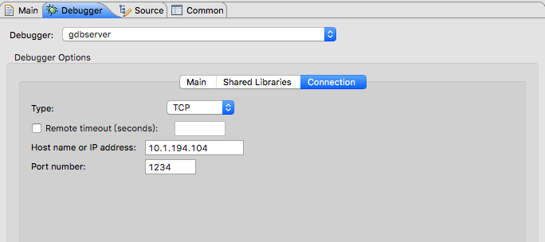

<!-- @import "[TOC]" {cmd="toc" depthFrom=1 depthTo=6 orderedList=false} -->

<!-- code_chunk_output -->

* [1 两个环境(远程调试)](#1-两个环境远程调试)
	* [1.1 初始化环境配置](#11-初始化环境配置)
	* [1.2 连接调试测试](#12-连接调试测试)
	* [1.3 配置eclipse](#13-配置eclipse)
		* [1.3.1 创建项目](#131-创建项目)
		* [1.3.2 配置debug选项](#132-配置debug选项)
		* [1.3.2.1 远程手动运行方式](#1321-远程手动运行方式)

<!-- /code_chunk_output -->

使用QEMU \+ GDB \+ Eclipse调试Linux内核

有两种情况, 一种是内核虚拟机和eclipse在同一个环境, 另一种分属两个环境

# 1 两个环境(远程调试)

## 1.1 初始化环境配置

本地安装Eclipse for Cpp, 这个版本自带了CDT，不用另行安装CDT插件。

本地checkout一份代码出来, 该代码和编译的调试用的kernel commit信息一致

本地安装gdb

远端的bzImage作为虚拟机启动镜像

本地vmlinux是带有调试信息的镜像, 与上面的对应

## 1.2 连接调试测试

启动远端gdbserver

```
qemu-system-x86_64 -smp 2 -m 1024 -kernel arch/x86/boot/bzImage -nographic -append "rdinit=/linuxrc loglevel=8 console=ttyS0" -S -s
```

或

```
qemu-system-x86_64 -smp 2 -m 1024 -kernel arch/x86/boot/bzImage -append "rdinit=/linuxrc loglevel=8" -S -s -daemonize
```

在当前节点

```
# gdb
(gdb) target remote 10.1.194.104:1234
(gdb) b start_kernel
(gdb) c
```

## 1.3 配置eclipse

### 1.3.1 创建项目

New → "Makefile Project with Existing Code", 这里代码目录选择上面说的与调试内核代码一致的目录, Toolchain选为None.


右上角"Debug", 选择"C/C\+\+"


### 1.3.2 配置debug选项

配置debug选项, "Run" → "Debug Configurations", 选择"C\/C\+\+ Remote Application(属于CDT插件)"

Eclipse的C/C++插件CDT已经很好的支持gdb在远程调试了。调试一个应用程序时，CDT有三种运行方式：

1. Automatic Remote Launcher ：**远程自动运行**，这是最方便好用的一种方式

2. Manual Remote Launcher : **远程手动运行**。**用户**自己在**目标板**上运行**gdbserver**，然后在**开发主机**上指定**远程连接的方式**（如IP地址和端口），连接到gdbserver

3. Remote Attach Launcher ：**远程依附运行**。类似于上一种，但它不是重新运行程序开启一个debug会话，而是**直接Attach到一个已经运行的程序**，然后调试

在Debug Configurations 对话框中，创建一个远程调试配置，这个配置在创建时会根据项目情况提供一个默认的配置，默认将使用第一种Automatic Remote Launcher方式，这在Main标签中下方“GDB (DSF) Automatic Remote Debugging Launcher”可以看出，点击右边的“Select other…”可以切换其它方式。

### 1.3.2.1 远程手动运行方式

我们希望Eclipse**每次生成一个项目**之后，**自动**把生成出来的**二进制程序拷贝到目标板上**，这可以通过**NFS挂载共享目录来实现**，我们只需要配置项目属性（依次展开：C/C\+\+Build > Settings > Build Steps > Post\-build steps，在Command中输入“cp ProgramBin /mnt/share”）即可。

接下来配置CDT的Debug选项，步骤如下：

1. 选中项目→菜单栏 ”Run“→Debug Configurations…

2. 双击 C/C++ Remote Application 新建一个配置，Eclipse会根据当前选择的项目初始化大部分配置，这里只需**修改Debugger配置页**

3. 在右下方点击“**Select other**”，选择“**GDB(DSF) Manual Remote Debugging Launcher**”，确认

4. 选择进入Debugger配置页，在**Main标签**中，GDB debugger 填写gdb，如果未加入PATH环境变量则应该填入绝对路径

5. 在Debugger配置页的Shared Libraries标签中，可以添加库路径，比如调试过程中要步入**外部函数**，就必须在这里给出**带调试信息的库文件路径**，否则会找不到该函数的定义

6. 在Debugger配置页的Connection标签中，Type选“TCP”，并填写目标板上gdbserver监听的IP和端口号（这个在下面文档会提及）

所有配置完成后，点“Apply”保存配置，并关掉配置窗口


选择"C/C\+\+ Attach to Application"双击, 新建一个配置, 起个名字

Main中

Project选择刚才创建的project, C/C\+\+ Application选择上面所说的vmlinux. 


Debugger中

Debugger选择"gdbserver"

Main中, 如下


connection中, 如下, 对端IP填写, 端口为1234



点击右下的"debug"


