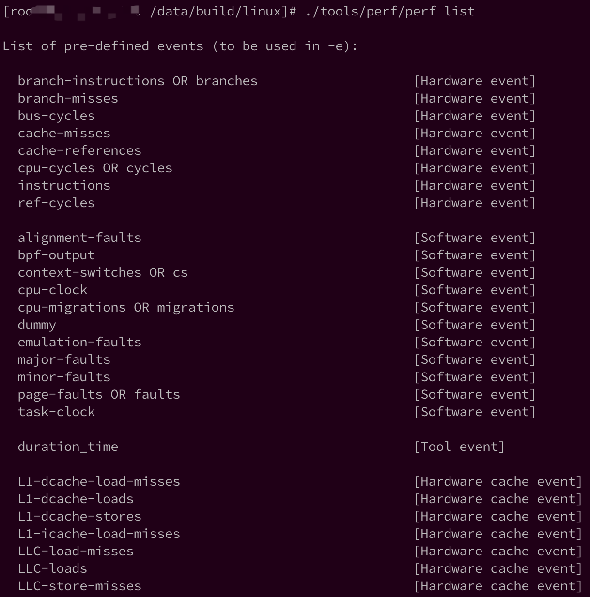
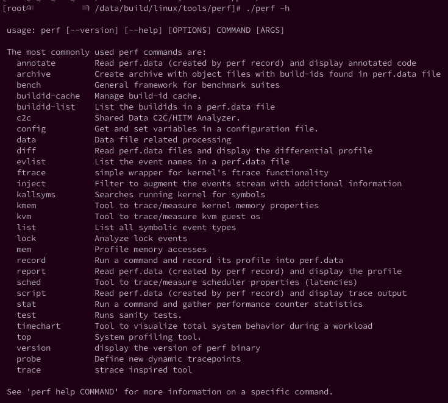

<!-- @import "[TOC]" {cmd="toc" depthFrom=1 depthTo=6 orderedList=false} -->

<!-- code_chunk_output -->

- [1. 系统级性能优化](#1-系统级性能优化)
- [2. Perf 简介](#2-perf-简介)
  - [2.1. 基本原理](#21-基本原理)
- [3. 一个简单例子](#3-一个简单例子)
- [4. 常用命令](#4-常用命令)
  - [4.1. 三种类型命令](#41-三种类型命令)
  - [4.2. Listing: 列出事件](#42-listing-列出事件)
  - [4.3. Counting: 计数统计事件](#43-counting-计数统计事件)
  - [4.4. Profiling: 采样数据](#44-profiling-采样数据)
  - [4.5. static tracing: 静态跟踪](#45-static-tracing-静态跟踪)
  - [4.6. Dynamic Tracing: 动态追踪](#46-dynamic-tracing-动态追踪)
  - [4.7. Mixed: 混合使用](#47-mixed-混合使用)
  - [4.8. Special: 特定](#48-special-特定)
  - [4.9. Reporting: report分析](#49-reporting-report分析)
- [5. 演示](#5-演示)
- [6. Perf的相关依赖](#6-perf的相关依赖)
  - [6.1. Symbols: 符号表](#61-symbols-符号表)
  - [6.2. perf annotate](#62-perf-annotate)
  - [6.3. Stack Traces](#63-stack-traces)
  - [6.4. 小结](#64-小结)
- [7. Perf 安装](#7-perf-安装)
  - [7.1. 安装依赖库](#71-安装依赖库)
  - [7.2. 测试](#72-测试)
  - [7.3. 编译](#73-编译)
  - [7.4. 安装](#74-安装)
  - [7.5. 帮助文档](#75-帮助文档)
- [8. Perf 性能事件](#8-perf-性能事件)
  - [8.1. perf list查看所有性能事件](#81-perf-list查看所有性能事件)
  - [8.2. 六种类型](#82-六种类型)
    - [8.2.1. Hardware Events (PMCs): 硬件性能事件(PMCs)](#821-hardware-events-pmcs-硬件性能事件pmcs)
    - [8.2.2. Software Events: 软件性能事件](#822-software-events-软件性能事件)
    - [8.2.3. Kernel Tracepoints: 内核态Tracepoints](#823-kernel-tracepoints-内核态tracepoints)
    - [8.2.4. User-Level Statically Defined Tracing (USDT): 用户态tracepoint](#824-user-level-statically-defined-tracing-usdt-用户态tracepoint)
    - [8.2.5. Dynamic Tracing: 动态追踪](#825-dynamic-tracing-动态追踪)
    - [8.2.6.](#826)
    - [8.2.7. 事件限定符](#827-事件限定符)
  - [8.3. 性能事件的属性](#83-性能事件的属性)
    - [8.3.1. PMI中断和PEBS中断](#831-pmi中断和pebs中断)
    - [8.3.2. 性能事件的精度级别](#832-性能事件的精度级别)
    - [8.3.3. 其他属性](#833-其他属性)
  - [8.4. 没有预定义字符描述的硬件性能事件](#84-没有预定义字符描述的硬件性能事件)
  - [8.5. 性能事件指定错误](#85-性能事件指定错误)
- [9. 例子](#9-例子)
  - [9.1. CPU Statistics: CPU统计](#91-cpu-statistics-cpu统计)
  - [9.2. Timed Profiling:](#92-timed-profiling)
  - [9.3. Event Profiling:](#93-event-profiling)
  - [9.4. Static Kernel Tracing: 静态内核态追踪](#94-static-kernel-tracing-静态内核态追踪)
  - [9.5. Static User Tracing: 静态用户态追踪](#95-static-user-tracing-静态用户态追踪)
  - [9.6. Dynamic Tracing](#96-dynamic-tracing)
  - [9.7. Scheduler Analysis](#97-scheduler-analysis)
  - [9.8. eBPF](#98-ebpf)
- [Visualizations: 可视化](#visualizations-可视化)
  - [Flame Graphs: 火焰图](#flame-graphs-火焰图)
    - [示例](#示例)
    - [生成](#生成)
- [10. Perf 功能概述](#10-perf-功能概述)
  - [10.1. 全局性概况](#101-全局性概况)
  - [10.2. 全局细节](#102-全局细节)
  - [10.3. 特定功能分析](#103-特定功能分析)
  - [10.4. perf record](#104-perf-record)
  - [10.5. 可视化工具perf timechart](#105-可视化工具perf-timechart)
- [11. 简单示例](#11-简单示例)
  - [11.1. cycles原理](#111-cycles原理)
- [12. 参考](#12-参考)

<!-- /code_chunk_output -->

参照: http://www.brendangregg.com/perf.html

# 1. 系统级性能优化

系统级性能优化是指为了提高应用程序对操作系统资源与硬件资源的使用 效率，或者为了提高操作系统对硬件资源的使用效率而进行的代码优化。通过提 高对操作系统资源与硬件资源的利用率，使得应用程序与基础软硬件平台具有更 好的交互性，往往可以显著提升应用程序的执行速度和稳定性。

**系统级性能优化**包含**2个阶段**：

1. 性能剖析（**performance profiling**）：**寻找性能瓶颈**，查找引发性能问题的原因及热点代码。
2. 代码优化：针对具体的性能问题而**优化代码与编译选项**，以改善软件性能。

在代码优化阶段往往需要凭借开发者的经验，编写简洁高效的代码，甚至在汇编 语言级别合理使用各种指令，合理安排各种指令的执行顺序。

而在**性能剖析阶段**，则需要借助于现有的**profiling工具**，如 perf，VTune，Oprofile 等。

在Linux下诊断的工具比较多，比如systemtap, dtrace, perf。

# 2. Perf 简介

本文将介绍一下perf的用法，网上很多叫法如`perf_events` , `perf profiler` , `Performance Counters for Linux(Linux性能计数器, PCL)`。叫法不同，都指perf。

通过perf，你可以发现以下问题的答案：

* 为什么内核使用**太多的CPU**，**哪些代码**使用了这些CPU时间
* **什么代码**导致**CPU二级缓存不命中**
* CPU是否因**内存、IO**而卡顿
* 什么代码在**分配内存**，分配了**多少**
* 什么触发了**TCP重传**
* 某个内核函数是否**被频繁调用**
* 线程**离开CPU的原因** 

## 2.1. 基本原理

Perf是一个基于内核的子系统，它提供一个**性能分析框架**，它以**性能事件**为基础，基于**对这些事件！！！采样！！！** 进行**性能统计**原理，可用于性能瓶颈的查找与热点代码的定位.

perf的采样是**基于事件**进行的。**采样的周期**以**事件的数量来表示**，而**非基于时间**。当**目标事件计数溢出指定的数值！！！**，则**产生一个采样**。

Perf不但可以分析制定应用程序的性能问题（per thread），也可以用来分析内核的性能问题。

- 要想从剖析中获得更多**内核相关**信息，你需要`符号（Symbol）`和`栈追踪`，这可能需要安装额外的包，甚至使用**特定选项重新编译**你的内核。
- 剖析**用户空间代码**时，也要求目标应用程序的**调试信息（符号表**）被保留。

总之perf是一款很牛逼的综合性分析工具，大到系统全局性性能，再小到进程线程级别，甚至到函数及汇编级别。

perf利用Linux的**trace特性**，可以用于实时跟踪，统计event计数(perf stat)；或者使用采样(perf record)，报告(perf report|script|annotate)的使用方式进行诊断。perf命令行接口并不能利用所有的Linux trace特性，有些trace需要通过ftrace接口使用。

对于perf和ftrace的使用见 https://github.com/brendangregg/perf-tools

而Linux有多少性能事件呢?? 下面会说到。

# 3. 一个简单例子

追踪磁盘I/O:

```
# perf record -e block:block_rq_issue -ag
^C
# ls -l perf.data
-rw------- 1 root root 3458162 Jan 26 03:03 perf.data
# perf report
[...]
# Samples: 2K of event 'block:block_rq_issue'
# Event count (approx.): 2216
#
# Overhead       Command      Shared Object                Symbol
# ........  ............  .................  ....................
#
    32.13%            dd  [kernel.kallsyms]  [k] blk_peek_request
                      |
                      --- blk_peek_request
                          virtblk_request
                          __blk_run_queue
                         |          
                         |--98.31%-- queue_unplugged
                         |          blk_flush_plug_list
                         |          |          
                         |          |--91.00%-- blk_queue_bio
                         |          |          generic_make_request
                         |          |          submit_bio
                         |          |          ext4_io_submit
                         |          |          |          
                         |          |          |--58.71%-- ext4_bio_write_page
                         |          |          |          mpage_da_submit_io
                         |          |          |          mpage_da_map_and_submit
                         |          |          |          write_cache_pages_da
                         |          |          |          ext4_da_writepages
                         |          |          |          do_writepages
                         |          |          |          __filemap_fdatawrite_range
                         |          |          |          filemap_flush
                         |          |          |          ext4_alloc_da_blocks
                         |          |          |          ext4_release_file
                         |          |          |          __fput
                         |          |          |          ____fput
                         |          |          |          task_work_run
                         |          |          |          do_notify_resume
                         |          |          |          int_signal
                         |          |          |          close
                         |          |          |          0x0
                         |          |          |          
                         |          |           --41.29%-- mpage_da_submit_io
[...]
```

这里的`perf record`命令用来追踪`block:block_rq_issue`探针, 当发起块设备I/O(磁盘io)请求时候会触发该探针.

`-a`选项用于追踪所有CPUs, `-g`用于记录调用栈, 追踪数据保存到了`perf.data`文件.

`perf report`输出显示 2216 次`disk I/O`事件被追踪, 32.13% 负载来自dd命令. 这些命令是由内核函数`blk_peek_request()`发出, 遍历下堆栈信息, 32%负载中的58.71%来自close()系统调用.

# 4. 常用命令

## 4.1. 三种类型命令

Brendan D. Gregg 收集和写了很多命令, 按从小到大开销进行划分, 分为三种:

* statistics/count: **统计/计数**, 事件计数的增加
* sample: 采样. 对**某几个事件**进行**采样**, 收集性能数据(比如IP和堆栈), 这就意味着每隔一段时间就会收集一次数据, 所以开销变大
* trace: 追踪. 收集**所有事件的性能数据**

## 4.2. Listing: 列出事件

```
# Listing all currently known events:
perf list

# Listing sched tracepoints:
perf list 'sched:*'
```

## 4.3. Counting: 计数统计事件

全是stat子命令

```
# CPU counter statistics for the specified command:
perf stat command

# Detailed CPU counter statistics (includes extras) for the specified command:
perf stat -d command

# CPU counter statistics for the specified PID, until Ctrl-C:
perf stat -p PID

# CPU counter statistics for the entire system, for 5 seconds:
perf stat -a sleep 5

# Various basic CPU statistics, system wide, for 10 seconds:
perf stat -e cycles,instructions,cache-references,cache-misses,bus-cycles -a sleep 10

# Various CPU level 1 data cache statistics for the specified command:
perf stat -e L1-dcache-loads,L1-dcache-load-misses,L1-dcache-stores command

# Various CPU data TLB statistics for the specified command:
perf stat -e dTLB-loads,dTLB-load-misses,dTLB-prefetch-misses command

# Various CPU last level cache statistics for the specified command:
perf stat -e LLC-loads,LLC-load-misses,LLC-stores,LLC-prefetches command

# Using raw PMC counters, eg, counting unhalted core cycles:
perf stat -e r003c -a sleep 5 

# PMCs: counting cycles and frontend stalls via raw specification:
perf stat -e cycles -e cpu/event=0x0e,umask=0x01,inv,cmask=0x01/ -a sleep 5

# Count syscalls per-second system-wide:
perf stat -e raw_syscalls:sys_enter -I 1000 -a

# Count system calls by type for the specified PID, until Ctrl-C:
perf stat -e 'syscalls:sys_enter_*' -p PID

# Count system calls by type for the entire system, for 5 seconds:
perf stat -e 'syscalls:sys_enter_*' -a sleep 5

# Count scheduler events for the specified PID, until Ctrl-C:
perf stat -e 'sched:*' -p PID

# Count scheduler events for the specified PID, for 10 seconds:
perf stat -e 'sched:*' -p PID sleep 10

# Count ext4 events for the entire system, for 10 seconds:
perf stat -e 'ext4:*' -a sleep 10

# Count block device I/O events for the entire system, for 10 seconds:
perf stat -e 'block:*' -a sleep 10

# Count all vmscan events, printing a report every second:
perf stat -e 'vmscan:*' -a -I 1000
```

## 4.4. Profiling: 采样数据

子命令record

子命令top, 动态显示

```
# Sample on-CPU functions for the specified command, at 99 Hertz:
perf record -F 99 command

# Sample on-CPU functions for the specified PID, at 99 Hertz, until Ctrl-C:
perf record -F 99 -p PID

# Sample on-CPU functions for the specified PID, at 99 Hertz, for 10 seconds:
perf record -F 99 -p PID sleep 10

# Sample CPU stack traces (via frame pointers) for the specified PID, at 99 Hertz, for 10 seconds:
perf record -F 99 -p PID -g -- sleep 10

# Sample CPU stack traces for the PID, using dwarf (dbg info) to unwind stacks, at 99 Hertz, for 10 seconds:
perf record -F 99 -p PID --call-graph dwarf sleep 10

# Sample CPU stack traces for the entire system, at 99 Hertz, for 10 seconds (< Linux 4.11):
perf record -F 99 -ag -- sleep 10

# Sample CPU stack traces for the entire system, at 99 Hertz, for 10 seconds (>= Linux 4.11):
perf record -F 99 -g -- sleep 10

# If the previous command didn't work, try forcing perf to use the cpu-clock event:
perf record -F 99 -e cpu-clock -ag -- sleep 10

# Sample CPU stack traces for a container identified by its /sys/fs/cgroup/perf_event cgroup:
perf record -F 99 -e cpu-clock --cgroup=docker/1d567f4393190204...etc... -a -- sleep 10

# Sample CPU stack traces for the entire system, with dwarf stacks, at 99 Hertz, for 10 seconds:
perf record -F 99 -a --call-graph dwarf sleep 10

# Sample CPU stack traces for the entire system, using last branch record for stacks, ... (>= Linux 4.?):
perf record -F 99 -a --call-graph lbr sleep 10

# Sample CPU stack traces, once every 10,000 Level 1 data cache misses, for 5 seconds:
perf record -e L1-dcache-load-misses -c 10000 -ag -- sleep 5

# Sample CPU stack traces, once every 100 last level cache misses, for 5 seconds:
perf record -e LLC-load-misses -c 100 -ag -- sleep 5 

# Sample on-CPU kernel instructions, for 5 seconds:
perf record -e cycles:k -a -- sleep 5 

# Sample on-CPU user instructions, for 5 seconds:
perf record -e cycles:u -a -- sleep 5 

# Sample on-CPU user instructions precisely (using PEBS), for 5 seconds:
perf record -e cycles:up -a -- sleep 5 

# Perform branch tracing (needs HW support), for 1 second:
perf record -b -a sleep 1

# Sample CPUs at 49 Hertz, and show top addresses and symbols, live (no perf.data file):
perf top -F 49

# Sample CPUs at 49 Hertz, and show top process names and segments, live:
perf top -F 49 -ns comm,dso
```

## 4.5. static tracing: 静态跟踪

子命令record, 针对具体事件进行收集

```
# Trace new processes, until Ctrl-C:
perf record -e sched:sched_process_exec -a

# Sample (take a subset of) context-switches, until Ctrl-C:
perf record -e context-switches -a

# Trace all context-switches, until Ctrl-C:
perf record -e context-switches -c 1 -a

# Include raw settings used (see: man perf_event_open):
perf record -vv -e context-switches -a

# Trace all context-switches via sched tracepoint, until Ctrl-C:
perf record -e sched:sched_switch -a

# Sample context-switches with stack traces, until Ctrl-C:
perf record -e context-switches -ag

# Sample context-switches with stack traces, for 10 seconds:
perf record -e context-switches -ag -- sleep 10

# Sample CS, stack traces, and with timestamps (< Linux 3.17, -T now default):
perf record -e context-switches -ag -T

# Sample CPU migrations, for 10 seconds:
perf record -e migrations -a -- sleep 10

# Trace all connect()s with stack traces (outbound connections), until Ctrl-C:
perf record -e syscalls:sys_enter_connect -ag

# Trace all accepts()s with stack traces (inbound connections), until Ctrl-C:
perf record -e syscalls:sys_enter_accept* -ag

# Trace all block device (disk I/O) requests with stack traces, until Ctrl-C:
perf record -e block:block_rq_insert -ag

# Sample at most 100 block device requests per second, until Ctrl-C:
perf record -F 100 -e block:block_rq_insert -a

# Trace all block device issues and completions (has timestamps), until Ctrl-C:
perf record -e block:block_rq_issue -e block:block_rq_complete -a

# Trace all block completions, of size at least 100 Kbytes, until Ctrl-C:
perf record -e block:block_rq_complete --filter 'nr_sector > 200'

# Trace all block completions, synchronous writes only, until Ctrl-C:
perf record -e block:block_rq_complete --filter 'rwbs == "WS"'

# Trace all block completions, all types of writes, until Ctrl-C:
perf record -e block:block_rq_complete --filter 'rwbs ~ "*W*"'

# Sample minor faults (RSS growth) with stack traces, until Ctrl-C:
perf record -e minor-faults -ag

# Trace all minor faults with stack traces, until Ctrl-C:
perf record -e minor-faults -c 1 -ag

# Sample page faults with stack traces, until Ctrl-C:
perf record -e page-faults -ag

# Trace all ext4 calls, and write to a non-ext4 location, until Ctrl-C:
perf record -e 'ext4:*' -o /tmp/perf.data -a 

# Trace kswapd wakeup events, until Ctrl-C:
perf record -e vmscan:mm_vmscan_wakeup_kswapd -ag

# Add Node.js USDT probes (Linux 4.10+):
perf buildid-cache --add `which node`

# Trace the node http__server__request USDT event (Linux 4.10+):
perf record -e sdt_node:http__server__request -a
```

## 4.6. Dynamic Tracing: 动态追踪

子命令probe

子命令record, 记录probe事件

```
# Add a tracepoint for the kernel tcp_sendmsg() function entry ("--add" is optional):
perf probe --add tcp_sendmsg

# Remove the tcp_sendmsg() tracepoint (or use "--del"):
perf probe -d tcp_sendmsg

# Add a tracepoint for the kernel tcp_sendmsg() function return:
perf probe 'tcp_sendmsg%return'

# Show available variables for the kernel tcp_sendmsg() function (needs debuginfo):
perf probe -V tcp_sendmsg

# Show available variables for the kernel tcp_sendmsg() function, plus external vars (needs debuginfo):
perf probe -V tcp_sendmsg --externs

# Show available line probes for tcp_sendmsg() (needs debuginfo):
perf probe -L tcp_sendmsg

# Show available variables for tcp_sendmsg() at line number 81 (needs debuginfo):
perf probe -V tcp_sendmsg:81

# Add a tracepoint for tcp_sendmsg(), with three entry argument registers (platform specific):
perf probe 'tcp_sendmsg %ax %dx %cx'

# Add a tracepoint for tcp_sendmsg(), with an alias ("bytes") for the %cx register (platform specific):
perf probe 'tcp_sendmsg bytes=%cx'

# Trace previously created probe when the bytes (alias) variable is greater than 100:
perf record -e probe:tcp_sendmsg --filter 'bytes > 100'

# Add a tracepoint for tcp_sendmsg() return, and capture the return value:
perf probe 'tcp_sendmsg%return $retval'

# Add a tracepoint for tcp_sendmsg(), and "size" entry argument (reliable, but needs debuginfo):
perf probe 'tcp_sendmsg size'

# Add a tracepoint for tcp_sendmsg(), with size and socket state (needs debuginfo):
perf probe 'tcp_sendmsg size sk->__sk_common.skc_state'

# Tell me how on Earth you would do this, but don't actually do it (needs debuginfo):
perf probe -nv 'tcp_sendmsg size sk->__sk_common.skc_state'

# Trace previous probe when size is non-zero, and state is not TCP_ESTABLISHED(1) (needs debuginfo):
perf record -e probe:tcp_sendmsg --filter 'size > 0 && skc_state != 1' -a

# Add a tracepoint for tcp_sendmsg() line 81 with local variable seglen (needs debuginfo):
perf probe 'tcp_sendmsg:81 seglen'

# Add a tracepoint for do_sys_open() with the filename as a string (needs debuginfo):
perf probe 'do_sys_open filename:string'

# Add a tracepoint for myfunc() return, and include the retval as a string:
perf probe 'myfunc%return +0($retval):string'

# Add a tracepoint for the user-level malloc() function from libc:
perf probe -x /lib64/libc.so.6 malloc

# Add a tracepoint for this user-level static probe (USDT, aka SDT event):
perf probe -x /usr/lib64/libpthread-2.24.so %sdt_libpthread:mutex_entry

# List currently available dynamic probes:
perf probe -l
```

## 4.7. Mixed: 混合使用

```
# Trace system calls by process, showing a summary refreshing every 2 seconds:
perf top -e raw_syscalls:sys_enter -ns comm

# Trace sent network packets by on-CPU process, rolling output (no clear):
stdbuf -oL perf top -e net:net_dev_xmit -ns comm | strings

# Sample stacks at 99 Hertz, and, context switches:
perf record -F 99 -e cpu-clock -e cs -a -g 

# Sample stacks to 2 levels deep, and, context switch stacks to 5 levels (needs 4.8):
perf record -F 99 -e cpu-clock/max-stack=2/ -e cs/max-stack=5/ -a -g 
```

## 4.8. Special: 特定

```
# Record cacheline events (Linux 4.10+):
perf c2c record -a -- sleep 10

# Report cacheline events from previous recording (Linux 4.10+):
perf c2c report
```

## 4.9. Reporting: report分析

```
# Show perf.data in an ncurses browser (TUI) if possible:
perf report

# Show perf.data with a column for sample count:
perf report -n

# Show perf.data as a text report, with data coalesced and percentages:
perf report --stdio

# Report, with stacks in folded format: one line per stack (needs 4.4):
perf report --stdio -n -g folded

# List all events from perf.data:
perf script

# List all perf.data events, with data header (newer kernels; was previously default):
perf script --header

# List all perf.data events, with customized fields (< Linux 4.1):
perf script -f time,event,trace

# List all perf.data events, with customized fields (>= Linux 4.1):
perf script -F time,event,trace

# List all perf.data events, with my recommended fields (needs record -a; newer kernels):
perf script --header -F comm,pid,tid,cpu,time,event,ip,sym,dso 

# List all perf.data events, with my recommended fields (needs record -a; older kernels):
perf script -f comm,pid,tid,cpu,time,event,ip,sym,dso

# Dump raw contents from perf.data as hex (for debugging):
perf script -D

# Disassemble and annotate instructions with percentages (needs some debuginfo):
perf annotate --stdio
```

# 5. 演示

在Kernel Recipes 2017上，Brendan D. Gregg 分享了关于Linux perf的演讲，重点在CPU分析和火焰图工作。

视频在YouTube: https://www.youtube.com/watch?v=UVM3WX8Lq2k

PPT在: https://www.slideshare.net/brendangregg/kernel-recipes-2017-using-linux-perf-at-netflix

2015年也有个: http://www.brendangregg.com/blog/2015-02-27/linux-profiling-at-netflix.html


# 6. Perf的相关依赖

我们看到perf支持这么多的事件和trace，它依赖了很多的接口来干这件事情。

## 6.1. Symbols: 符号表

没有符号表，**无法**将**内存地址**翻译成**函数**和**变量名**。

例如，无符号表的跟踪显示如下

```
    57.14%     sshd  libc-2.15.so        [.] connect           
               |
               --- connect
                  |          
                  |--25.00%-- 0x7ff3c1cddf29
                  |          
                  |--25.00%-- 0x7ff3bfe82761
                  |          0x7ff3bfe82b7c
                  |          
                  |--25.00%-- 0x7ff3bfe82dfc
                   --25.00%-- [...]
```

有符号表的跟踪显示如下

```
    57.14%     sshd  libc-2.15.so        [.] __GI___connect_internal
               |
               --- __GI___connect_internal
                  |          
                  |--25.00%-- add_one_listen_addr.isra.0
                  |          
                  |--25.00%-- __nscd_get_mapping
                  |          __nscd_get_map_ref
                  |          
                  |--25.00%-- __nscd_open_socket
                   --25.00%-- [...]
```

如何安装符号表?

对于**内核代码**的符号表，在编译内核时，使用`CONFIG_KALLSYMS=y`。 检查如下

```
# cat /boot/config-`uname -r` |grep CONFIG_KALLSYMS
CONFIG_KALLSYMS=y
CONFIG_KALLSYMS_ALL=y
CONFIG_KALLSYMS_EXTRA_PASS=y
```

对于用户安装软件的符号表，如果是**yum安装**的，可以安装对应的**debuginfo**包。

如果是用户自己编译的，例如使用**GCC编译**时加上`-g`选项。

## 6.2. perf annotate

`perf annotate`能够提供源码信息, 不过需要在应用编译的时候带有`-ggdb`.

## 6.3. Stack Traces

(使用`perf record -g`收集stack traces)

要跟踪完整的stack，编译时需要注意几个东西。

1. 编译perf时候需要包含`libunwind`和`-g dwarf`

2. 有些编译优化项会忽略frame pointer，所以编译**应用软件**时必须指定 `-fno-omit-frame-pointer` ，才能跟踪完整的stack trace.

3. **编译内核**时包含 `CONFIG_FRAME_POINTER=y`

## 6.4. 小结

总结一下，要愉快的跟踪更完备的信息，就要在**编译软件**时打开符号表的支持(`gcc -g`)，开启**annotate**的支持(`gcc -ggdb`)，以及**Stack trace**的支持(`gcc -fno-omit-frame-pointer`)。

# 7. Perf 安装

centos你可以使用yum安装，也可以使用源码安装。

perf 在内核源码包中的位置 tools/perf。

## 7.1. 安装依赖库

安装依赖库，有一个小窍门可以找到依赖的库

```
# cat Makefile |grep found
```

## 7.2. 测试

```
[root@centos7 linux]# make -C tools/perf -f tests/make
```

## 7.3. 编译

```
[root@centos7 linux]# make -C tools/perf
```

## 7.4. 安装

```
[root@centos7 linux]# make -C tools/perf install
```

## 7.5. 帮助文档

```
man 1 perf
man 1 perf-stat
man 1 perf-top
man 1 perf-record
man 1 perf-report
man 1 perf-list
```

# 8. Perf 性能事件

利用perf剖析程序性能时，需要指定**当前测试**的**性能事件**。性能事件是指在**处理器**或**操作系统**中发生的，**可能影响到程序性能**的硬件事件或软件事件。比如Cache丢失，流水线停顿，页面交换等。这些事件会对程序的执行时间造成较大的负面影响。在优化代码时，应尽可能减少此类事件发生。

因此，必须先利用perf等性能剖析工具查找引发这些性能事件的热点代码以及热点指令。

使用perf，可以分析程序运行期间发生的硬件事件，比如instructions retired、processor clock cycles等；也可以分析**软件事件**，比如page fault和进程切换。


这张图大致列出了perf支持的跟踪事件，从kernerl到user space，支持块设备、网络、CPU、文件系统、内存等，同时还支持系统调用，用户库的事件跟踪。

我们看到perf支持这么多的事件和trace，它**依赖了很多的接口**来干这件事情。

## 8.1. perf list查看所有性能事件

不同型号的 CPU 支持的硬件性能事件不尽相同。不同版本的内核提供的软件 性能事件与 Tracepoint events 也不尽相同。因此，perf提供了list工具以查看当前软硬件平台支持的性能事件列表。

使用方法如下：

```
# ./perf list -h

 Usage: perf list [<options>] [hw|sw|cache|tracepoint|pmu|sdt|event_glob]

    -d, --desc            Print extra event descriptions. --no-desc to not print.
    -v, --long-desc       Print longer event descriptions.
        --debug           Enable debugging output
        --deprecated      Print deprecated events.
        --details         Print information on the perf event names and expressions used internally by events.
```

执行命令后，perf将给出当前软硬件平台的所有性能事件。输出结果如下图所示。每行后面括弧里的信息表示该事件是**硬件事件**、**软件事件**还是Tracepoint events。



......


## 8.2. 六种类型

六种类型的事件:

* Hardware Events: CPU performance monitoring counters.
* Software Events: These are low level events based on kernel counters. For example, CPU migrations, minor faults, major faults, etc.
* Kernel Tracepoint Events: This are static kernel-level instrumentation points that are hardcoded in interesting and logical places in the kernel.
* User Statically-Defined Tracing (USDT): These are static tracepoints for user-level programs and applications.
* Dynamic Tracing: Software can be dynamically instrumented, creating events in any location. For kernel software, this uses the kprobes framework. For user-level software, uprobes.
* Timed Profiling: Snapshots can be collected at an arbitrary frequency, using perf record -FHz. This is commonly used for CPU usage profiling, and works by creating custom timed interrupt events.

### 8.2.1. Hardware Events (PMCs): 硬件性能事件(PMCs)

- Hardware Event

由**PMU部件产生**，在特定的条件下探测性能事件是否发生以及发生的次数。比如cache命中。

来自CPU自己或CPU的PMU（`Performance Monitoring Unit`，性能监控单元），包含一系列**微架构事件**例如时钟周期、L1缓存丢失等。具体支持的事件类型取决于CPU型号

完整的性能事件列表见Intel手册`Performance Monitoring Events`

一个典型CPU将以下面方式实现PMCs: 在同一时间只能从成千上万的可用PMCs中记录几个. 因为CPU上的硬件资源是固定的(寄存器数量有限), 通过编程这些寄存器对已选的事件进行计数.

使用PMCs的例子, 可以见下面的 `CPU Statistics`

### 8.2.2. Software Events: 软件性能事件

- Software Event是**内核产生的事件/计数器**，分布在**各个功能模块**中，统计和**操作系统相关性能事件**。比如**进程切换**，等。

基于**内核计数器**的低级事件，例如CPU迁移、**tick数**、上下文切换、Minor Faults、Major Faults（页面错误）

软件性能事件比较少

```
# ./perf list
List of pre-defined events (to be used in -e):
...
  alignment-faults                                   [Software event]
  bpf-output                                         [Software event]
  context-switches OR cs                             [Software event]
  cpu-clock                                          [Software event]
  cpu-migrations OR migrations                       [Software event]
  dummy                                              [Software event]
  emulation-faults                                   [Software event]
  major-faults                                       [Software event]
  minor-faults                                       [Software event]
  page-faults OR faults                              [Software event]
  task-clock                                         [Software event]
...
```

通过`man perf_event_open`也能看到, type是`PERF_TYPE_SOFTWARE`

```
              If type is PERF_TYPE_SOFTWARE, we are measuring software events provided by the kernel.  Set config to one of the following:

                   PERF_COUNT_SW_CPU_CLOCK
                          This reports the CPU clock, a high-resolution per-CPU timer.

                   PERF_COUNT_SW_TASK_CLOCK
                          This reports a clock count specific to the task that is running.

                   PERF_COUNT_SW_PAGE_FAULTS
                          This reports the number of page faults.

                   PERF_COUNT_SW_CONTEXT_SWITCHES
                          This counts context switches.  Until Linux 2.6.34, these were all reported as user-space events, after that they are reported as
                          happening in the kernel.

                   PERF_COUNT_SW_CPU_MIGRATIONS
                          This reports the number of times the process has migrated to a new CPU.

                   PERF_COUNT_SW_PAGE_FAULTS_MIN
                          This counts the number of minor page faults.  These did not require disk I/O to handle.

                   PERF_COUNT_SW_PAGE_FAULTS_MAJ
                          This counts the number of major page faults.  These required disk I/O to handle.

                   PERF_COUNT_SW_ALIGNMENT_FAULTS (Since Linux 2.6.33)
                          This counts the number of alignment faults.  These happen when unaligned memory accesses happen; the kernel can handle these but
                          it reduces performance.  This happens only on some architectures (never on x86).

                   PERF_COUNT_SW_EMULATION_FAULTS (Since Linux 2.6.33)
                          This counts the number of emulation faults.  The kernel sometimes traps on unimplemented instructions and emulates them for user
                          space.  This can negatively impact performance.
...
```

内核也支持tracepoints, 和软件事件类似, 但是内核tracepoints有不同的扩展性更强的API.

软件事件有默认的周期. 这意味着当对软件事件采样时, 采样的是事件的子事件, 而不是每个事件. 通过`perf record -vv`可以查看

```
./perf record -vv -e context-switches /bin/true
Using CPUID GenuineIntel-6-55-7
intel_pt default config: tsc,mtc,mtc_period=3,psb_period=3,pt,branch
nr_cblocks: 0
affinity: SYS
mmap flush: 1
comp level: 0
------------------------------------------------------------
perf_event_attr:
  type                             1
  size                             120
  config                           0x3
  { sample_period, sample_freq }   4000
  sample_type                      IP|TID|TIME|PERIOD
  read_format                      ID
  disabled                         1
  inherit                          1
  mmap                             1
  comm                             1
  freq                             1
  enable_on_exec                   1
  task                             1
  sample_id_all                    1
  exclude_guest                    1
  mmap2                            1
  comm_exec                        1
  ksymbol                          1
  bpf_event                        1
...
```

注意: `{ sample_period, sample_freq }`

通过`man perf_event_open`查看这几个属性的描述. 默认情况下, 这些属性表明内核调整采样频率, 从而每秒能捕获 4000 个`context-switch`事件. 如果打算record所有, 使用`-c 1`:

```
./perf record -vv -e context-switches -c 1 /bin/true
Using CPUID GenuineIntel-6-55-7
intel_pt default config: tsc,mtc,mtc_period=3,psb_period=3,pt,branch
nr_cblocks: 0
affinity: SYS
mmap flush: 1
comp level: 0
------------------------------------------------------------
perf_event_attr:
  type                             1
  size                             120
  config                           0x3
  { sample_period, sample_freq }   1
  sample_type                      IP|TID|TIME
  read_format                      ID
  disabled                         1
  inherit                          1
  mmap                             1
  comm                             1
  enable_on_exec                   1
  task                             1
  sample_id_all                    1
  exclude_guest                    1
  mmap2                            1
  comm_exec                        1
  ksymbol                          1
  bpf_event                        1
------------------------------------------------------------
...
```

注意: `{ sample_period, sample_freq }`

Check the rate of events using perf stat first, so that you can estimate the volume of data you'll be capturing. Sampling a subset by default may be a good thing, especially for high frequency events like context switches.

Many other events (like tracepoints) have a default of 1 anyway. You'll encounter a non-1 default for many software and hardware events.


### 8.2.3. Kernel Tracepoints: 内核态Tracepoints

- Tracepoint Event是内核中**静态tracepoint所触发的事件**，是硬编码进内核中的, 可以用来判断程序运行期间内核的行为细节（这些tracepint的对应的sysfs节点在`/sys/kernel/debug/tracing/events`目录下）。比如system calls、TCP events、file system I/O、disk I/O、slab分配器的分配次数等。

内核态tracepoints被分组, 比如, "sock:"表明是socket事件, "sched:"表明是CPU调度事件.

tracepoints有个关键的点事要有稳定的API(事件名字和参数), 当写代码能使用它们, 并且在后续的版本中持续支持.

kernel tracepoints在内核代码中实现通常是宏定义在`include/trace/events/*.XXX`.

查看内核中分组的名字和数量:

```
# ./perf list | awk -F: '/Tracepoint event/ { lib[$1]++ } END {
>     for (l in lib) { printf "  %-16.16s %d\n", l, lib[l] } }' | sort | column
    alarmtimer     4	    kmem           13	    raw_syscalls   2
    block          18	    kvm            76	    rcu            1
    bridge         4	    kvmmmu         16	    rpcgss         21
    cgroup         13	    kyber          3	    rpm            5
    clk            16	    libata         6	    rseq           2
    compaction     14	    mce            1	    rtc            12
    context_tracki 2	    mdio           1	    sched          24
    cpuhp          3	    migrate        1	    scsi           5
    devfreq        1	    mlx5           9	    signal         2
    devlink        5	    mmap           1	    skb            3
    dma_fence      7	    module         5	    sock           3
    exceptions     2	    msr            3	    sunrpc         109
    ext4           105	    napi           1	    swiotlb        1
    fib            1	    nbd            5	    syscalls       662
    fib6           1	    neigh          7	    task           2
    filelock       12	    net            18	    tcp            7
    filemap        4	    nfsd           64	    thermal        3
    ftrace         2	    nmi            1	    timer          13
    huge_memory    4	    nvme           4	    tlb            1
    hwmon          3	    oom            8	    udp            1
    initcall       3	    page_isolation 1	    ufs            13
    intel_iommu    7	    page_pool      4	    vmscan         18
    io_uring       14	    pagemap        2	    vsyscall       1
    iomap          8	    percpu         5	    workqueue      4
    iommu          7	    power          22	    writeback      34
    irq            5	    printk         1	    x86_fpu        11
    irq_matrix     12	    qdisc          4	    xdp            12
    irq_vectors    34	    qla            1	    xhci-hcd       53
    iscsi          7	    random         15
    jbd2           17	    ras            5
```

这些包括:

* block: block device I/O
* ext4: file system operations
* kmem: kernel memory allocation events
* random: kernel random number generator events
* sched: CPU scheduler events
* syscalls: system call enter and exits
* task: task events

关于使用这些tracepoints的例子, 见下面的`Static Kernel Tracing` 静态内核Tracing


由内核中的**ftrace**实现，包括：
1. 内核**追踪点事件**，静态的、内核级的追踪点，**硬编码**到内核
2. 用户**静态定义追踪**（USDT），**用户态应用程序硬编码**的追踪点
3. **动态追踪**，软件可以被动态instrumented，在任何位置创建事件。
  - 对于**内核软件**，使用**kprobes框架**；
  - 对于**用户软件**，使用**uprobes**
4. 定时追踪，以任意频率抓取快照，主要用于CPU剖析，工作机制是定期引发中断
  - perf record -F XXXHz


### 8.2.4. User-Level Statically Defined Tracing (USDT): 用户态tracepoint

和kernel tracepoints类似, USDT是在用户态应用中硬编码的, 对外表现就是稳定的API(事件名字和参数).

目前, 很多应用程序已经开始包含了tracepoints, 用来支持DTrace. 但是, 多数应用默认情况下并不会默认编译. 通常编译时候需要使用参数`--with-dtrace`.

例如, `Node.js`编译支持

```
$ sudo apt-get install systemtap-sdt-dev       # adds "dtrace", used by node build
$ wget https://nodejs.org/dist/v4.4.1/node-v4.4.1.tar.gz
$ tar xvf node-v4.4.1.tar.gz 
$ cd node-v4.4.1
$ ./configure --with-dtrace
$ make -j 8
```

检查编译结果是否含有probes.


关于USDT使用的例子, 见下面`Static User Tracing`.

### 8.2.5. Dynamic Tracing: 动态追踪

tracepoints和dynamic tracing动态追踪的不同在于下图, 说明了一个通用tracepoint的覆盖范围:


http://www.brendangregg.com/perf.html#DynamicTracing


要启用内核动态追踪，需要使用内核编译参数`CONFIG_KPROBES=y`、`CONFIG_KPROBE_EVENTS=y`。要追踪基于帧指针的内核栈，需要内核编译参数`CONFIG_FRAME_POINTER=y`。

要启用**用户动态追踪**，需要使用内核编译参数`CONFIG_UPROBES=y`、`CONFIG_UPROBE_EVENTS=y`

### 8.2.6. 

### 8.2.7. 事件限定符

事件有多种表示方式，最简单的是它的字符串表示。引用事件时，可以指定限定符：

https://blog.gmem.cc/perf

## 8.3. 性能事件的属性

### 8.3.1. PMI中断和PEBS中断

perf的采样是**基于事件**进行的。**采样的周期**以**事件的数量来表示**，而**非基于时间**。当**目标事件计数溢出指定的数值！！！**，则**产生一个采样**。

样本中包含的信息取决于用户和工具指定的**度量类型**，但是最重要的信息是**指令指针**（instruction pointer），也就是程序**被中断时所处的位置**。

这种基于中断的采样，在现代处理器上存在刹车效应。也就是说，**样本中记录的指针**，和程序被中断以处理PMU事件时的指令指针，可能**相隔数十个指令**。

record子命令默认使用cycle事件，类似于定期采样。


**硬件性能事件**由处理器的PMU提供支持。

如前文所述，perf会对PMI中断发生时的PC寄存器进行采样。由于现代处理器的主频非常高，在加上深度流水线机制，从**性能事件被触发**，到处理器**响应PMI中断**，流水线上可能已处理过百条指令。那么**PMI中断**采到的**指令地址**就不再是处罚性能事件的那条指令的地址了，而可能具有**非常严重的偏差**。

为了解决这个问题，intel处理器通过**PEBS**（Precise Event Based Sampling）机制实现了**高精度事件采样**。PEBS通过硬件在**计数器溢出**时将处理器现场直接保存到内存（而**不是在相应中断时**才保存寄存器现场），从而使得perf能够真正触发性能事件的那条指令的地址，提高了采样精度。

在默认条件下，perf**不使用PEBS机制**。用户如果想要使用**高精度采样**，需要在指定性能事件时，在事件后调价后缀"`:p`"或"`:pp`"。

例如：

```
perf top -e cycles:pp
```

### 8.3.2. 性能事件的精度级别

Perf 在采样精度上定义了 4 个级别.

Level | Comment
---|---
0 | 无精度保证
1 | 采样指令与触发性能事件的指令之间的偏差为常数（:p）
2 | 需要尽量保证采样指令与触发性能事件的指令的偏差为0（:pp）
3 | 保证采样指令与触发性能事件的指令之间的偏差**必须为0**（:ppp）

目前X86处理器，包括Intel处理器与AMD处理器Jun仅能实现前3个精度级别。

### 8.3.3. 其他属性

除了精度级别以外，事件还具有其他几个属性，均可以通过"event:X"的方式予以指定。

attribute | Comment
---|---
u | 仅统计用户空间程序触发的性能事件。
k | 仅统计内核触发的性能事件。
h | 仅统计Hypervisor触发的性能事件。
G | 在KVM虚拟机中，仅攻击Guest系统触发的性能事件。
H | 仅统计Host系统触发的性能事件。
p | 精度级别。

## 8.4. 没有预定义字符描述的硬件性能事件

另外需要补充的是，perf list工具仅列出了具有字符描述的**硬件性能事件**。而那些**没有预定义字符描述的性能事件**，也可以通过特殊方式使用。

这时，就需要我们**根据CPU的手册**，通过性能事件的标号配置PMU的性能计数器。可以采用如下方式：

```
perf top -e r[UMask+EventSelect]
```

举个例子，我们现在想统计所有**从内存中读过数据的指令的个数**，perf list中并未预定义此事件的字符描述。通过查找intel的处理器手册，我们找了此事件编码：


便可以通过以下方式使用此事件：

```
perf stat -e r010b ls
```

所以完整的性能事件列表见Intel手册`Performance Monitoring Events`


## 8.5. 性能事件指定错误

所以如果指定性能事件失败, 可能会有类似打印

```
./perf record -e syscalls:sys_enter ls
event syntax error: 'syscalls:sys_enter'
                     \___ unknown tracepoint

Error:	File /sys/kernel/debug/tracing/events/syscalls/sys_enter not found.
Hint:	Perhaps this kernel misses some CONFIG_ setting to enable this feature?.

Run 'perf list' for a list of valid events

 Usage: perf record [<options>] [<command>]
    or: perf record [<options>] -- <command> [<options>]

    -e, --event <event>   event selector. use 'perf list' to list available events
```

# 9. 例子

## 9.1. CPU Statistics: CPU统计

## 9.2. Timed Profiling:

## 9.3. Event Profiling:

## 9.4. Static Kernel Tracing: 静态内核态追踪

## 9.5. Static User Tracing: 静态用户态追踪

## 9.6. Dynamic Tracing

## 9.7. Scheduler Analysis

## 9.8. eBPF

# Visualizations: 可视化

perf内置了一个可视化: timecharts, 以及通过文本用户界面(TUI)和树状报告的text-style(文本风格)的可视化.

下面再介绍两个可视化: flame graphs(火焰图)和heat maps(热点图).

## Flame Graphs: 火焰图

火焰图: http://www.brendangregg.com/flamegraphs.html

使用[火焰图工具](https://github.com/brendangregg/FlameGraph)分析perf的剖析数据生成. 火焰图和`perf report`使用的数据一样, 都是通过`stack traces(-g)`获取的perf.data文件.

### 示例

下面火焰图显示`3.2.9-1`内核的network workload, 运行了一个KVM实例:


火焰图在x轴显示采样数量总体, y轴显示堆栈深度. 每个函数(stack frame)被绘制成一个矩形, 矩形的宽度与它的采样数量相关. 完整描述见 [CPU火焰图 ](http://www.brendangregg.com/FlameGraphs/cpuflamegraphs) .

可以使用鼠标探索内核CPU时间花在哪里，快速量化代码路径，并确定性能调优工作最好花在哪里。这个示例显示，大部分时间都花在`vp_notify()`代码路径上，所有cpu上的示例中有`70.52%`的时间执行`iowrite16()`，它是由**KVM管理程序处理**的。这些信息对于指导KVM性能工作非常有用。

裸机Linux(bare metal Linux)的network workload看起来是不同的, 因为首先网络的处理不是通过`virtio-net`驱动处理.

### 生成

火焰图生成

```
# git clone https://github.com/brendangregg/FlameGraph  # or download it from github
# cd FlameGraph
# perf record -F 99 -ag -- sleep 60
# perf script | ./stackcollapse-perf.pl > out.perf-folded
# cat out.perf-folded | ./flamegraph.pl > perf-kernel.svg
```

`perf record`会生成perf.data文件, 可以使用`perf report`查看


# 10. Perf 功能概述

perf利用Linux的trace特性，可以用于实时跟踪，统计event计数(perf stat)；或者使用采样(perf record)，报告(perf report|script|annotate)的使用方式进行诊断。

perf命令行接口并不能利用所有的Linux trace特性，有些trace需要通过ftrace接口得到。

参考 https://github.com/brendangregg/perf-tools

perf 命令用法还是挺简单的，根据功能区分了COMMAND，每个COMMAND有各自的用法。



每种功能使用命令`./perf --help CMD`查看用法等.

Perf是一个包含27种子工具的工具集，功能很全面。

No.|sub-commands|comment
:------:|------:|:------
01 | annotate      |根据数据文件（perf.data），注解被采样到的函数，显示指令级别的热点。
02 | archive       |根据数据文件中记录的build-id，将所有被采样到的ELF文件打成压缩包。利用此压缩包，可以在任何机器上分析数据文件中的采样数据。
03 | bench         |Perf中内置的benchmark，目前包括两套针对调度器和内存管理子系统的benchmark。
04 | buildid-cache |管理perf的buildid缓存。每个ELF文件都有一个独一无二的buildid。Buildid被perf用来关联性能数据与ELF文件。
05 | buildid-list  |列出数据文件中记录的所有buildid。
06 | config        |从配置文件中设置读取变量。
07 | data          |数据文件的相关处理。
08 | diff          |对比两个数据文件的差异。能够给出每个符号（函数）在热点分析上的具体差异。
09 | evlist        |列出数据文件中的所有性能事件。
10 | ftrace        |调用ftrace功能。
11 | inject        |该工具读取perf record工具记录的事件流，并将其定向到标准输出。在被分析代码中的任何一点，都可以向事件流中注入其他事件。
12 | kallsyms      |查询运行内核的符号信息。
13 | kmem          |针对内存子系统的分析工具。
14 | kvm           |此工具可以用来追踪、测试运行与KVM虚拟机上的Guest OS。
15 | list          |列出当前系统支持的所有性能事件。包括硬件性能事件、软件性能事件以及检查点。
16 | lock          |分析内核中的加锁信息。包括锁的争用情况，等待延迟等。
17 | mem           |剖析内存访问信息。
18 | record        |收集采样信息，并将其记录在数据文件中。随后可通过其他工具对数据文件进行分析。
19 | report        |读取perf record创建的数据文件，并给出热点分析结果。
20 | sched         |针对调度器子系统的分析工具。
21 | script        |执行perl或python写的功能扩展脚本、生成脚本框架、读取数据文件中的数据信息等。
22 | stat          |剖析某个特定进程的性能概况，包括CPU、Cache Miss率等。
23 | test          |Perf针对当前软硬平台的测试工具。可以用此工具测试当前软硬件平台是否能够支持perf的所有功能。
24 | timechart     |生成一幅描述处理器与各进程状态变化的矢量图。
25 | top           |类似于Linux的top命令，对系统性能进行实时分析。
26 | probe         |用于定义动态检查点。
27 | trace         |类似strace功能。

## 10.1. 全局性概况

* perf list查看当前系统支持的性能事件；
* perf bench对系统性能进行摸底；
* perf test对系统进行健全性测试；
* perf stat对全局性能进行统计；

## 10.2. 全局细节

* perf top可以实时查看当前系统进程函数占用率情况；
* perf probe可以自定义动态事件；

## 10.3. 特定功能分析

perf kmem针对slab子系统性能分析；
perf kvm针对kvm虚拟化分析；
perf lock分析锁性能；
perf mem分析内存slab性能；
perf sched分析内核调度器性能；
perf trace记录系统调用轨迹；

## 10.4. perf record

最常用功能perf record，可以系统全局，也可以具体到**某个进程**，更甚具体到**某一进程某一事件**；可宏观，也可以很微观。

* pref record记录信息到perf.data；
* perf report生成报告；
* perf diff对两个记录进行diff；
* perf evlist列出记录的性能事件；
* perf annotate显示perf.data函数代码；
* perf archive将相关符号打包，方便在其它机器进行分析；
* perf script将perf.data输出可读性文本；

## 10.5. 可视化工具perf timechart

perf timechart record记录事件；
perf timechart生成output.svg文档；

# 11. 简单示例

程序`[pi.c]`是一个简单的计算Pi的CPU密集型程序。很显然，`[pi.c]`的热点在函数`do_pi()`中。

```cpp
#include <stdio.h>
#include <math.h>
#include <sys/types.h>
#include <linux/unistd.h>

int do_pi(double *pi)
{
    double h, sum, x;
    long long n, i;

    n = 5000000;
    h = 1.0/n;
    sum = 0.0;

    for (i = 1; i <= n; i++) {
        x = h * (i - 0.5);
        sum += 4.0 / (1.0 + pow(x,2));
    }

    *pi = h *sum;
    return 0;
}

int main(void)
{
    double pi;

    printf("pid: %d\n", getpid());
    sleep(5);

    if (!do_pi(&pi)) {
        printf("PI is %f\n", pi);
    }
    return 0;
}
```
编译pi程序

```
gcc pi.c -lm -o pi
```

运行pi程序

```
./pi
```

根据程序显示的pid在命令行中执行

```
perf top -p $pid
```

该命令利用**默认的性能事件**"cycles"对`[pi]`进行热点分析。"cycles"是**处理器周期事件**。这条命令能够分析出**消耗处理器周期最多的代码**，在处理器频率稳定的前提下，我们可以认为perf给出的热点代码就是消耗时间最多的代码。

CPU周期(cpu-cycles)是默认的性能事件，所谓的CPU周期是指CPU所能识别的最小时间单元，通常为亿分之几秒，是CPU执行最简单的指令时所需要的时间，例如读取寄存器中的内容，也叫做clock tick。

执行上述命令后，Perf会给出如下结果：


从上图可以看到，在`[pi]`程序执行期间，函数`do_pi()`消耗了62.57%的CPU周期，是消耗处理器周期最多的热点代码。这跟我们预想的一样。

## 11.1. cycles原理

那么Perf是怎么做到的呢？以`cycles`性能事件为例

首先，perf会通过系统调用`sys_perf_event_open`在内核中注册一个检测"**cycles**"**事件**的性能计数器。内核根据perf提供的信息在**PMU**上初始化一个**硬件性能计数器**（PMC：Performance Monitoring Counter）。PMC随着CPU周期的增加而自动累加。

在**PMU溢出**时，PMU触发一个PMI（Performance Monitoring Interrupt）中断。内核在PMI中断处理函数中保存**PMC的计数值**，触发中断时的**指令地址**（Register IP：Instruction Pointer），**当前时间戳**以及**当前进程**的**PID**，**TID**，**comm**等信息。我们把这些信息统称为一个**采样**（sample）。

内核会将收集到的sample放入用于跟**用户空间**通信的Ring Buffer。**用于空间**的perf分析程序采用**mmap机制**从ring buffer中读入采样，并对其解析。perf根据**pid**, comm等信息可以找到对应的进程。根据**IP**与**ELF文件**中的**符号表**可以查找到触发PMI中断的指令所在的函数。为了能够使perf读到函数名，我们的目标程序必须具备符号表。

如果perf在分析结果中**只看到一串地址**，而**没有对应的函数名**时，通常是由于在**编译时**利用**strip**删除了ELF文件中的符号信息。建议在性能剖析阶段，保留程序中的**sysbol table**与**debug info**等信息。

根据上述的perf采样原理可以得知，perf假设两次采样之间，即两次相邻的PMI中断之间系统执行的是同一个进程的同一个函数。这种假设会带来**一定的误差**，当感觉perf给出的**结果不准**时，不妨提高**采样频率**，perf会给出更加精确的结果。

# 12. 参考

http://www.brendangregg.com/perf.html
