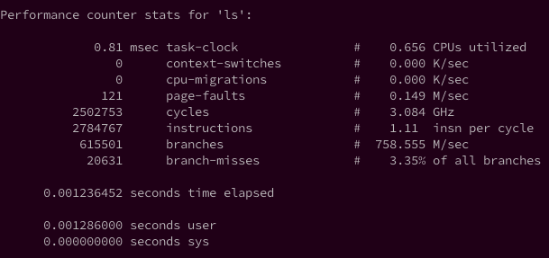

<!-- @import "[TOC]" {cmd="toc" depthFrom=1 depthTo=6 orderedList=false} -->

<!-- code_chunk_output -->

- [用途](#用途)
- [使用方法](#使用方法)

<!-- /code_chunk_output -->

# 用途

用来剖析一个**指定应用程序**的性能概况。

perf 除了可以采样(使用perf record)（包括call stack trace），还可以用于event计数。

perf stat就是用于**event计数**的，可以跟踪**指定命令**的event计数。

# 使用方法

查看帮助

```
./perf help stat
```


```
perf stat [-e <EVENT> | --event=EVENT] [-a] <command>
perf stat [-e <EVENT> | --event=EVENT] [-a] -- <command> [<options>]
```

比如查看ls程序的典型性能数据



从图上可以看到，perf stat 工具利用 8 个典型性能事件剖析了应用程序。

`task‐clock` 事件表示目标任务’ls’**真正占用处理器的时间**，单位是**毫秒**。我们将其称为任务执行时间。

如图所示，’ls’在处理器上执行了 0.81  毫秒。`“0.656 CPUs utilized”`表示目标任务的**处理器占用率**。处理器占用率表示**目标任务的执行时间**与**持续时间的比值**。持续时间是指从任务提交到执行结束之间的**总时间**。

对操作系统有过了解的读者应该知道，Linux 这种多任务分时操作系统中，一个任务不太可能在执行期间始终占据处理器。操作系统会根据调度策略(linux 目前使用 CFS 调度算法)合理安排各个任务轮流使用处理器，**每次调度**会产生**一次上下文切换**。在此期间操作系统还需处理大量中断。因此，一个任务的执行时间可能会很短，但是它的持续时间会远高于此(除非此任务是优先级最高的实时任务)。 

以图中的例子来说，’ls’的执行时间为 0.81 毫秒，而持续为 1.236 毫秒，处理器占用率为 `0.656`. 在此期间，系统共发生了 0 次上下文切换。平均每秒发生 0.011*106 次。上下文切换次数的均值是上下文切换次数与任务执行时间的比值。
