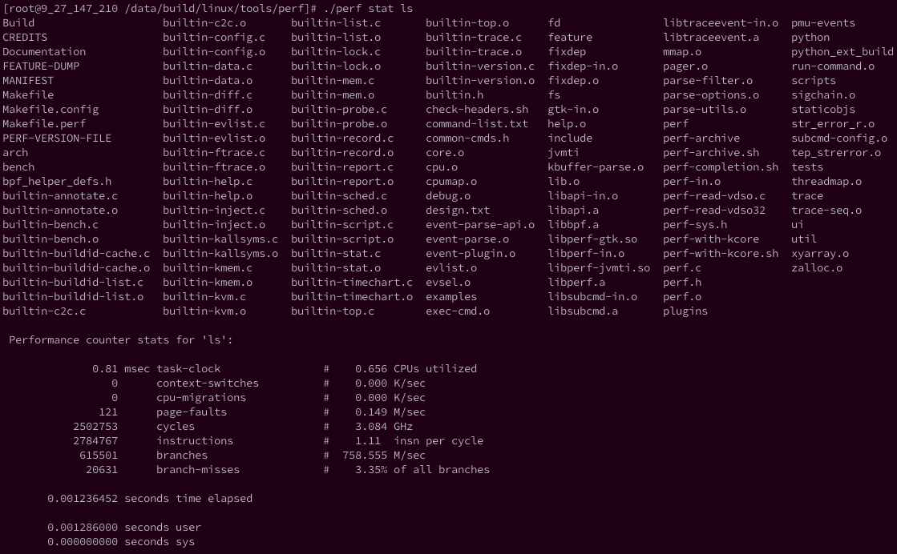

<!-- @import "[TOC]" {cmd="toc" depthFrom=1 depthTo=6 orderedList=false} -->

<!-- code_chunk_output -->

- [用途](#用途)
- [使用方法](#使用方法)

<!-- /code_chunk_output -->

# 用途

用来剖析一个**指定应用程序**的性能概况。

perf 除了可以采样(使用perf record)（包括call stack trace），还可以用于event计数。

perf stat就是用于**event计数**的，可以跟踪**指定命令**的event计数。

# 使用方法

查看帮助

```
./perf help stat
```


```
perf stat [-e <EVENT> | --event=EVENT] [-a] <command>
perf stat [-e <EVENT> | --event=EVENT] [-a] -- <command> [<options>]
```

比如查看ls程序的典型性能数据



