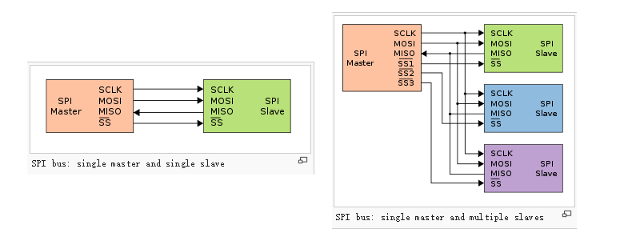
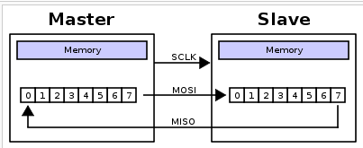
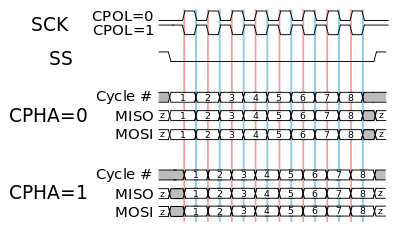
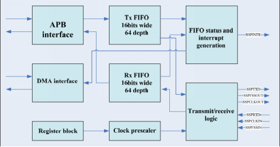
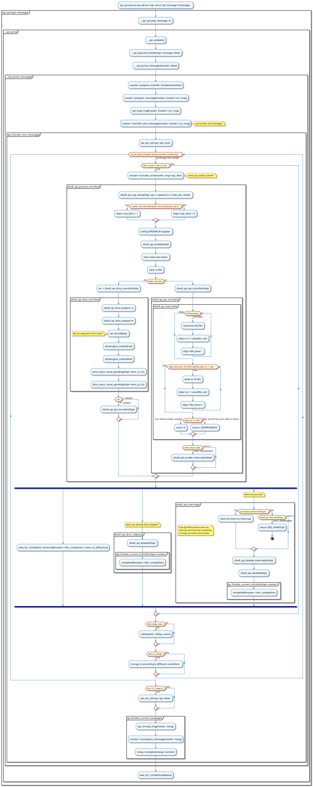

本文主要介绍Siflower的SPI驱动的流程

# 2. SPI介绍
SPI是串行外设接口(Serial Peripheral Interface)的缩写. SPI, 是一种高速, 全双工, 同步的通信总线, 并且在芯片的管脚上只占用四根线, 节约了芯片的管脚, 同时为PCB的布局上节省空间提供方便, 正是出于这种简单易用的特性, 如今越来越多的芯片集成了这种通信协议

SPI协议是一种同步串行通信协议, 主要用于短距离通信. SPI设备在全双工模式下通信, 并且是Master-slave 模式, 一个master可以有一个或多个slave. Master组织帧格式, 并且可通过slave select线控制所选slave. 所用的4根线分别记为data in( DI ) / data out( DO ) / slave select ( SS )/ clock( CLK ). 

  
图 1 SPI bus can operate with a single master device and with one or more slave devices

SPI总线定义了四个逻辑信号: 
- **SCLK**: 时钟信号, 由master输出
- **MOSI**: 主发从收(Master Output, Slave Input), 由master输出
- **MISO**: 从发主收(Master Input, Slave Output), 由slave输出
- **SS**: slave选择(active low), 由master输出

## 2.1. Operation

如果只有一个slave, 可以把SS pin电平固定为logic low(如果slave允许这么做. 有些slave会要求一个/CS(chip select)信号的下降沿来触发指令). 大部分slave设备在未被master选中的时候MISO会处于高阻抗的状态(逻辑上就是未连接), 也成为第三状态, 没有第三状态的设备就不能与其他slave设备共用SPI总线. 

## 2.2. Data Transmission

数据开始传输之前, master必须先设置clock信号, 然后用SS 线上的逻辑0来选中slave设备. 在每个时钟周期内, 数据传输都是全双工的. Master送1bit数据到MOSI线上, slave读到这个数据, 与此同时slave也发送了1bit数据到MISO线上, master也读到了一个数据. 通常情况下, 这可以通过两个移位寄存器来实现. 

  
图 2 A typical hardware setup using two shift registers to form an inter-chip circular buffer

如图2所示, 两个移位寄存器在逻辑上连成一个环, 每个移位寄存器的高位与另一个的低位相连, 这样每次数据的最高有效位(MSB)被发送出去, 新接收到的数据放在最低有效位(LSB), 当寄存器的数据发送完成后, master和slave就交换了各自寄存器中的数据. 然后重复这一过程, 就实现了主从之间的数据通信. 

## 2.3. Clock polarity and phase
Clock polarity (CPOL)表示clock的idle state是0还是1, CPOL=0表示clock的idle state为0, active state为1, CPOL=1时相反. 

Clock phase (CPHA)表示在clock的第几个边沿采集数据(一个时钟周期可以看成是idle->active->idle, 所以有两个边沿), CPHA=0表示在clock的idle state->active state边沿, 即第一个边沿采集数据, CPHA=1表示在第二个边沿采集数据. 

  
图 3 A timing diagram showing clock polarity and phase.  The red vertical line 
represents CPHA=0 and the blue vertical line represents CPHA=1

CPOL和CPHA相互组合可组成4种不同的模式, mode可记为(CPOL,CPHA), 这样(0,0)、(0,1)、(1,0)、(1,1)分别表示mode 0~3. 

## 2.4. Three Data Formats
目前所使用的芯片支持三种数据格式: Motorola SPI, Texas Instruments SSP, 和 National Microwire. 
### 2.4.1. Motorola’s SPI Format: 
- **Single transfer**:对 mode 0 和 mode 3来说, 数据在上升沿采样, 在下降沿送出, mode 1和2 与之相反
- **Back-to-Back transfer**: transmit-only/full-duplex when transmit-FIFO is not empty before the completion of the last character’s transfer or receive-only

### 2.4.2. TI Format
每帧数据传输之前SSI_CE拉高一个CLK周期, 然后master和slave在CLK上升沿发送数据, 下降沿采集数据. 数据可MSB在前或LSB在前. 传输完成后DT在接下来的idle期间保持送出的最后1bit数值

### 2.4.3. Microwire Format
 两种格式format 1和2.   
 - Format 1:  master和slave都在CLK下降沿发送数据, 上升沿采集数据. 
 - Format 2:  master 在下降沿采集和发送数据, slave在上升沿采集和发送数据. 

# 3. SSP
## 3.1. Overview
SF19A2890有3个独立的同步串行接口(SSP). SSP是一个用于同步串行通信, 支持Motorola SPI, Microwire 和TI三种数据格式的master或slave接口. 数据输入输出时会各自先进入一个缓冲区, 每个缓冲区最多可存放64个16 bit的数据. 数据通过SSPTXD输出SSP, 通过SSPRXD输入SSP. Clock prescaler 模块可以对时钟频率进行调节. 我们通常也直接称之为SPI. 

  
图 4: SSP block diagram

## 3.2. Data Transmit and Receive
在数据开始传输或接收之前, 需要对SSP进行初始化配置, 设定master/slave、data size、CPOL&PHA、frame format和clock rate, SSP CR1的第0位还会设置是否为LOOP back mode. 为了确保数据的正确性, 还要先把TX_FIFO和RX_FIFO清空.  

从CPU/DMA发过来的数据通过APB接口, 缓存到Tx FIFO中, 然后由Transmit logic发送出去; 从外部发过来的数据通过receive logic缓存到Rx FIFO中, 然后由CPU/DMA通过APB接口读出. CPU往SSP发送或读取数据可通过对SSPDR进行写/读操作来进行. 

SSP_enable是打开SSP接口, SSP开始把Tx FIFO中的数据往外发, 同时把数据接收到Rx FIFO中. 当帧格式为TI时, 主设备在发送完一帧数据的最后一位时, 不会对移位寄存器进行清空, 这样主设备在连续发送数据的时候, 接收到的数据会产生错误, 因此应先往FIFO里存好数据再enable SSP Operation. 数据收发完后, 再disable SSP Operation或reset, 为下次数据传输准备. 

# 4. SPI 驱动工作流程

spi驱动模块对外的主要接口是spi_sync()函数, 还有一个函数spi_write_then_read()在flash驱动中使用的比较多, 也可以用来了解spi_sync()的主要使用方法.   
该函数的主要工作流程如下图所示: 

# 5. FAQ
## 5.1. DATA_REG和Rx / Tx FIFO之间的关系是什么？

  DATA_REG就像停车场的入口一样, 当您向DATA_REG写入数据时, 数据由其他控制逻辑自动发送到Tx_FIFO, 当您从DATA_REG读取数据时, Rx_FIFO将智能发送数据.  这个实现隐藏了如何控制fifos的细节, 因此我们可以通过DATA_REG轻松使用fifos. 

## 5.2. SSP控制寄存器1中SSE的功能是什么？

它是SPI和其他外围设备之间的大门.  当它关闭(SSE禁用)时, SPI和外围设备之间不能传输数据.  一旦SSE使能, 发送逻辑就开始从Tx FIFO传输数据, 直到Tx_FIFO为空.  因此, 在启用SSP操作之前, 我们必须设置时钟/数据大小和其他必要参数. 

## 5.3. 全双工的重要性是什么？

数据传输由主时钟控制, 每当主设备发送数据时, 它也接收数据.  如果master想要从外围设备接收数据, 它必须发送一些东西来接收.  因此, 当SPI与norflash连接时, 我们必须小心使用Rx FIFO(它肯定会收到一些无用的数据). 

## 5.4. 如何清除slave的Tx FIFO？

我们无法直接清除slave的Tx FIFO.  整个传输由主机控制, 从机只能在主机发送时发送数据.  但是Tx FIFO的默认值是空的, 所以在正常情况下它不是问题. 
