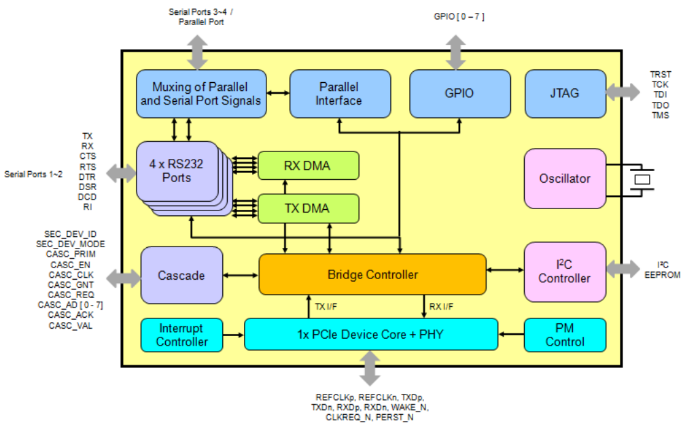

MCS9900 是一个 PCIe 转 多 I/O(4S, 2S+1P)的控制器. (PCI-E 转串口芯片)

MCS9900 是一个 **单通道**(single lane)**多功能**(multifunction)串行总线的 I/O 控制器(`single lane multifunction PCI express to I/O controller`)。

它支持两种操作模式, 通过**设备模式选择引脚**(device mode select pins) 来选择。**模式 1** 支持四个串行端口(4 serial ports, 4S)和GPIO, **模式2** 支持两个串行端口(2 serial ports, 2S), 一个并行端口(1 parallel, 1P)和 GPIO。

MCS9900 还通过专有级联接口提供外设扩展选项。通用级联接口允许与类似芯片（如 MCS9900、MCS9904、MCS9901CV-CC 和 MCS9922）互连，以进行端口扩展。

兼容RS232串行端口, RS422 & RS485标准和支持吞吐量从50个基点到16 mbps。并行端口与IEEE 1284兼容,支持Nibble, Byte, SPP, ECP, 和 EPP 模式。所有的针是可编程的,可以作为输入或输出。一个I2C接口提供了通过一个外部 EEPROM 配置 MCS9900 设备选项。

具有的特性:

* PCI Express
  - 带集成 PHY 的单通道 (X1) PCI Express 端点控制器
  - 符合 PCI Express 基本规范，修订版 1.1
  - 符合 PCI Express 卡规范
  - 支持四种 PCI Express 功能
  - 支持配置请求的自动完成
  - 支持内置流量控制
  - 支持消息 TLP（错误）生成
  - 支持非发布请求的集成超时处理
  - 支持传统和 MSI 中断
  - 支持 PCIe 电源管理
* 串行端口
  - 四个 16C450/550/扩展 550/650/增强模式兼容 UART
  - 支持 RS232、RS422 和 RS485 模式
  - 每端口双向速度从 50 bps 到 16 Mbps
  - 全串行调制解调器控制
  - 支持硬件、软件流量控制
  - 支持 5、6、7、8 位串行格式
  - 支持偶数、奇数、无、空格和标记奇偶校验
  - 支持自定义波特率通过编程内部 PLL 或外部时钟
  - 支持每个串行端口的发送、接收路径中的片上 256 字节深度 FIFO
  - 支持远程唤醒和电源管理功能
  - 串行端口收发器关机支持
  - 支持所有串行端口上的慢速 IrDA 模式（高达 115200bps）
* 并行端口
  - 与 IEEE 1284 兼容
  - Nibble 模式
  - 字节模式
  - 增强型并行端口（EPP 1.9）
  - 扩展功能端口（ECP）
  - FIFO 模式（缓冲 SPP 模式）
* 级联：MCS9900 支持 13 针专有接口，可连接到其他支持级联的 ASIX 设备以进行 IO 扩展。例如，MCS9900 可以与另一个 MCS9900 接口以获得以下产品配置
  - PCIe 至 8 个串行端口
  - PCIe 至 6 个串行端口和 1 个并行端口
  - PCIe 至 4 个串行端口和 2 个并行端口
* 一般设备特性
  - EEPROM 的 I2C 接口
  - 通过 PCIe 接口读取/写入 EEPROM
  - 最多 8 条双向多功能 GPIO 线
  - 片上振荡器
  - 电源：1.2V，3.3V
  - 封装：128 针 LQFP，RoHS
  - 工作温度：0 至 +70°C

MCS9900是一个PCI Express单通道（‌X1）‌的端点控制器，‌具有集成的物理层（‌PHY）‌。‌它通过外部EEPROM提供C接口来配置MCS9901CV-CC设备选项。‌这个控制器被设计用于实现PCI Express通信协议，‌支持单通道PCI Express端点设备的连接和通信。‌通过提供集成的PHY，‌MCS9900简化了PCI Express端点设备的物理层连接，‌减少了额外硬件的需求，‌从而降低了系统的整体成本和复杂性。‌此外，‌通过外部EEPROM的配置选项，‌用户可以根据具体的应用需求灵活地调整控制器的参数，‌以适应不同的工作环境和性能要求.

也就是一个办法就是, 将 MCS9900 作为 PCI 设备存在, 而 uart 是它的一部分 