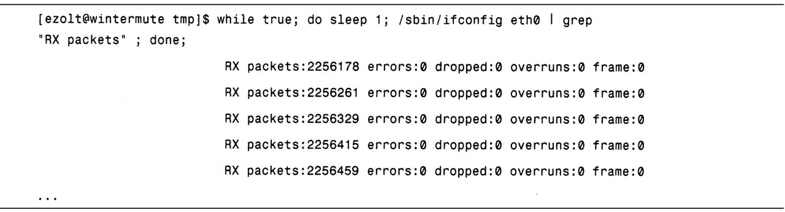

# bash

bash是默认的Linux命令行shell，在你每次与Linux命令行交互时，最有可能使用它。bash通常有一个功能强大的脚本语言来创建shell脚本。不过这个脚本语言也可以从命令行调用，从而使你在性能调查过程中，能轻松地将一些比较繁琐的任务进行自动化。

## 性能相关的选项

bash有一组命令可以一起使用，来周期性地运行特定命令。大多数Linux用户都把bash作为默认的shell，因此，只要登录到一台机器或打开一个终端就会出现bash提示。如果你没有使用bash，也可以键入bash来调用它。

有了bash命令提示符后，你可以输入一系列的bash脚本命令来自动连续地执行特定命令。在使用特定命令周期性提取性能统计数据的情况下，这个功能非常有用。表8-1给出了这些脚本选项。

表8-1 bash运行时脚本选项


bash极其灵活，它记录在bash手册中。虽然bash非常复杂，但是在使用它之前并不需要完全掌握它。

## 用法示例

虽然有些性能工具，如vmstat和sar，能周期性地更新性能统计信息，但是其他的命令，比如ps和ifconfig则不能。bash可以调用诸如ps或ifconfig命令来周期性地显示它们的统计数据。例如，在清单8.1中，我们要求bash在条件为true时执行while循环。由于true命令总是为真，因此这个while循环永远都不会结束。接着，在do命令后启动每次迭代之后都要执行的命令，这些命令要求bash休眠1秒钟，然后运行ifconfig来抽取eth0控制器的性能信息。不过，我们只关心接收数据包，因此，我们用grep搜索并显示字符串为“RX packets”的ifconfig输出。最后，执行done命令来告诉bash循环完成。由于true命令总是返回真，所以，该循环将一直执行直到用组合键`<Ctrl-C>`终止它。

清单8.1


利用清单8.1的bash脚本，可以查看到按秒更新的网络性能统计信息。同样的循环还可以用于监控其他的事件，只要将ifconfig命令修改为其他的命令即可，而通过修改休眠数值也能够改变更新时间间隔。这个简单的循环容易直接在命令行中键入，并且能够自动显示任何你感兴趣的性能统计数据。

# tee

tee是一个简单的命令，可以将命令的标准输出保存为文件并同时进行显示。在想要保存并同时查看性能工具输出的时候，tee是很有帮助的。比如，正在监控一个实时系统的性能统计信息的同时，保存这些数据以备将来对它们进行分析。

8.2.2.1 性能相关的选项

tee的调用命令行如下：


tee获取由<command>提供的输出，在将其保存到指定文件的同时也显示到标准输出设备。如果特别指定了-a选项，则tee会将输出添加到文件上，而不是覆盖文件。
8.2.2.2 用法示例
清单8.2展示了用tee来记录vmstat的输出。如你所见，tee显示了vmstat生成的输出，并同时将其保存到文件/tmp/vmstat_out。保存vmstat的输出能让我们在将来的时间里对性能数据进行分析或绘图。
清单8.2

tee命令很简单，但由于它能轻松地记录指定性能工具的输出，因此它的能力也是非常强大的。
8.2.3 script
script命令用于将一个shell会话过程中产生的全部输入和输出保存为文本文件。这个文本文件在将来既可以用来重现被执行的命令也可以用来查看结果。在调查性能问题时，准确记录被执行命令是很有用的，因为你可以在之后的时间里查看执行过的测试。拥有被执行命令的记录就意味着在调查不同的问题时，你还可以简单地对命令行进行剪切和粘贴。此外，记录性能结果也是很有帮助的，这样你就可以在将来查看这些记录以寻求发现和解决问题的新视角。
8.2.3.1 性能相关的选项
script是一个相对简单的命令。在执行的时候，它会启动一个新的shell，并记录下这个shell存续期间所有的键盘动作和输入，以及生成的输出，并将它们保存到文本文件。script的调用命令行如下所示：

默认情况下，script把所有的输出都放到名为typescript的文件中，除非你特别指定其他的文件。表8-2给出了一些script的命令行选项。

表8-2 script命令行选项
提醒：script字面上的意思是捕捉发送到屏幕的每一种类型的输出。但是，如果有彩色或加粗的输出，就会在输出文件中显示为esc字符。这些字符会明显让输出变得混乱，因此一般不怎么有用。不过，如果将TERM环境变量设置为dumb（在基于csh的shell中用setenv TERM dumb，在基于sh的shell中用export TERM=dumb），应用程序就不会输出转义字符。这就使得输出具有更好的可读性。
此外，script提供的计时信息也会扰乱输出。虽然自动生成计时信息是有用的，但是更方便的做法不是使用script的计时，而是直接用前面章节介绍的time命令来对重要命令进行计时。
8.2.3.2 用法示例
如前所述，如果将终端设置为dumb，会得到可读性更好的script输出。其实现方法是使用如下命令行：

然后，正式启动script命令。清单8.3显示的是用输出文件ps_output启动的script。script会持续记录会话，直到用exit命令或按下<Ctrl-D>组合键退出该shell。
清单8.3

接下来，在清单8.4中可以查看由script记录下的输出。如你所见，其中包含了所有的命令以及生成的全部输出。
清单8.4

script是一个非常有用的命令，用来记录会话过程中所有的交互。与现代硬盘容量相比，script产生的文件非常小。记录性能调查会话，并将其保存下来以备将来查看一直都是一个很棒的主意。往最坏的情况考虑，它会浪费一点点精力和磁盘空间来记录会话。往最好的情况考虑，被保存的会话可以在之后的时间查看，而不需要重新运行该会话被记录下的命令。
8.2.4 watch
默认情况下，watch命令会每秒运行一条命令并将其输出显示到屏幕上。与那些不能周期性地显示更新结果的性能工具一起工作时，watch能发挥其作用。比如，有些工具，如ifconfig和ps，显示的是当前性能统计数据，然后退出。由于watch能周期性的执行命令并显示其输出，因此，通过观看屏幕就可以发现哪些统计数据发生了变化，以及它们的变化速率。
8.2.4.1 性能相关的选项
watch用如下命令行调用：

如果调用的时候不带参数，watch只会按秒显示给定命令的输出，直到你中断这个过程。默认输出通常很难发现一屏信息与另一屏信息的差异，因此，watch提供了选项来突出显示每个输出之间的不同。这样更容易发现每个采样之间的输出差异。表8-3对watch可接受命令行选项进行了说明。
表8-3 watch命令行选项

watch是一种强大的工具，用于查看性能统计数据如何随时间变化。它并不复杂，但是却能很好地完成自己的工作。它真正填补了使用某些性能工具所造成的空白，这些工具无法周期性地显示已更新的输出。在使用这些工具时，你可以用窗口形式运行watch，通过定期查看该窗口来了解统计信息是如何变化的。
8.2.4.2 用法示例
清单8.5中的第一个例子展示了与ps命令一起使用的watch。我们要求ps给出每个进程产生的一般故障的数量。watch每10秒清除屏幕，并更新该信息。请注意，可能需要为你要求执行的命令加上引号，这样，watch就不会将你想要执行的命令的选项与它自身的选项搞混。
清单8.5

watch作为一种工具，其基本功能可以很容易地编写为简单的shell脚本。但是，watch比使用shell脚本更简单，因为它几乎总是可用的，并且能正确地工作。别忘了，有些性能工具，如ifconfig或ps只能一次性地显示统计数据，而watch却能很容易地跟踪（只需看上一眼）统计数据的变化。
8.2.5 gnumeric
在进行性能问题调查时，性能工具常常会生成庞大的性能统计数据。有些时候，梳理这些数据并从中找出能够表明系统运行情况的趋势与模式就成了一个问题。通常电子表格，尤其是gnumeric，能够从三个不同的方面使得这个任务变得容易实现。

首先，gnumeric提供了内置函数，比如求最大值、最小值、平均值和标准偏差，这就使你能对性能数据进行数值分析。其次，gnumeric提供了灵活的方式来导入许多性能工具常用输出的表格文本数据。最后，gnumeric还有一个强大的绘图工具，可以将性能工具生成的性能数据可视化。这不但对于探寻较长时间内的数据趋势是极有价值的，而且对于寻找不同类型数据之间的相关性（比如磁盘I/O与CPU使用量之间的相关性）也是相当有用的。通常，要从文本输出中找出模式是比较困难的，但对图形来说，系统行为就会显得更加清晰。其他的电子表格，如OpenOffice的oocalc，也可以使用，不过gnumeric强大的文本导入器和绘图工具使得它成为最容易被使用的工具。
8.2.5.1 性能相关的选项
使用电子表格帮助实现性能分析，只需完成以下步骤：
1．将性能数据保存到文本文件。
2．将文本文件导入到gnumeric。
3．分析数据或用数据绘图。
gnumeric可以生成多种不同类型的图形，并且提供了多种不同的函数实现数据分析。了解gnumeric的强大功能和灵活性的最好方法就是加载一些数据进行实验。
8.2.5.2 用法示例
要展示gnumeric的实用性，首先必须生成用于绘图和分析的性能数据。清单8.6要求vmstat生成100秒的输出，并将该信息保存到文本文件vmstat_output中。数据将会被加载到gnumeric。-n选项表示vmstat只显示头信息一次（而不是每屏信息都显示）。
清单8.6

接下来，用如下命令启动gnumeric：

这会打开一个空白电子表格用于导入vmstat数据。
在gnumeric中选择File>Open，弹出一个对话框（图中未显示）用于选择打开的文件及该文件的类型。我们选择Text Import（Configurable）作为文件类型，然后通过一系列的向导对话框来选择将vmstat_output文件的哪一列映射到电子表格的哪一列。对vmstat而言，最好从第二行文本开始导入，因为第二行包含了列名称以及每一列适合的大小。此外，为导入数据选择Fixed-Width也是很有用的，其原因是vmstat就是这样输出数据的。在成功导入数据后，我们就会看到如图8-1所示的电子表格。

图8-1
接下来，利用导入的数据绘图。在图8-2中，我们用不同的CPU使用情况（us、sys、id、wa）创建了一个叠式图。由于这些数据的总和始终为100%（或接近该值），因此，每次都能看出哪种状态处于主导地位。本例中，系统在大部分时间都是空闲的，不过在图中1/4的部分出现了大量的等待时间。

图8-2
图形是查看一个测试单次运行时，其性能统计数据随时间变化情况的有力手段。同时，对于发现不同运行的对比差异也是很有帮助的。用不同运行得到的数据绘图时，要确保每个图使用的比例是相同的，这能让数据的比较对照更加容易。
gnumeric是一种轻量级的应用程序，它使你能快速简便地导入、绘图/分析大量的性能数据。它是一种很棒的工具，通过处理性能数据来探寻是否出现了任何有趣的特性。
8.2.6 ldd
ldd可以被用来显示特定的二进制文件依赖的是哪个库。ldd有助于跟踪一个应用程序可能使用的库函数的位置。通过给出应用程序正在使用的所有库，就可以对它们进行搜索，找出包含给定函数的库。
8.2.6.1 性能相关的选项
ldd用如下命令行调用：

接着ldd会列出该二进制文件需要的所有库，以及系统中有哪些文件能实现这些需求。
8.2.6.2 用法示例

清单8.7展示的是ldd用在二进制文件ls上。在这个特定的例子中，我们可以发现ls使用了如下这些库：linux-gate.so.1, librt.so.1, libacl.so.1, libselinux.so.1, libc.so.6, libpthread.so.0, ld-linux.so.2和libattr.so.1。
清单8.7

ldd是一个相对简单的工具，但对于试图追踪应用程序使用了哪些库以及这些库在系统中的位置来说，它具有极大的价值。
8.2.7 objdump
对于分析二进制文件和库的各个方面来说，objdump是一种复杂而强大的工具。尽管它有许多其他的功能，它可以被用来确定给定的库提供了哪些函数。
8.2.7.1 性能相关的选项
objdump用如下命令行调用：

如果调用的时候使用了-T选项，则它将显示该库/二进制文件所依赖或提供的全部符号。这些符号可以是数据结构，也可以是函数。包含．text的每一行objdump输出都是该二进制文件提供的一个函数。
8.2.7.2 用法示例
清单8.8展示的是objdump用于分析库gtk。因为我们感兴趣的只有libgtk.so提供的符号，所以用fgrep对输出进行选择，仅输出那些包含．text的行。本例中，我们可以看到libgtk.so提供的一些函数，包括gtk_arg_values_equal、gtk_tooltips_set_colors和gtk_viewport_set_hadjustment。
清单8.8

在使用性能工具时，它们会显示一个应用程序调用的库函数（而不是库本身），objdump能帮助找到每个函数所在的共享库。
8.2.8 GNU调试器（gdb）
gdb是一个很棒的应用程序调试器，它可以帮助调查一个正在运行的应用程序的多个不同方面。gdb具备三个特性使得它对诊断性能问题来说非常有价值。第一，gdb可以附加到当前正在运行的进程。第二，gdb可以展示该进程的回溯，即显示当前源代码行和调用树。附加到进程并抽取其回溯可以迅速找出一些比较明显的性能问题。但是，如果应用程序不是卡在单点上，那么使用gdb就难以进行问题诊断，此时，系统级的分析器，如oprofile，将会是一个更好的选择。第三，gdb可以将虚拟地址映射回特定的函数。与性能工具相比，gdb更擅长计算虚拟地址的位置。例如，如果oprofile给出了事件发生的虚拟地址而非函数名，那么gdb就可以计算出该地址的函数。
8.2.8.1 性能相关的选项
gdb用如下命令行调用，其中，pid是指gdb将要附加的进程：

gdb附加到该进程后，它就进入到交互模式，这时就可以检查给定进程的当前执行位置和运行时变量。表8-4对其中的一条命令进行了说明，可用其检查正在运行的进程。
表8-4 gdb运行时选项

gdb还有很多命令行选项和运行时控件，它们更适合于调试而不是性能调查。获取更多信息请参见gdb手册页或在gdb提示中键入help。
8.2.8.2 用法示例
想要研究gdb是如何工作的，可以先在一个简单的测试应用程序上演示它。清单8.9中的程序在main中只调用了函数a()，并陷入了一个无限循环。这个程序不会结束，因此当我们将gdb附加上去后，它将会一直执行函数a()的无限循环。
清单8.9

清单8.10启动应用程序并用gdb附加到它的pid。我们要求gdb产生一个回溯，以便展示当前正在执行的究竟是哪条代码，以及哪组函数调用会导致当前的位置。如同预期的，gdb显示出正在执行的是无限循环a()，它是由main()调用的。
清单8.10

最后，在清单8.11中，我们要求gdb给出虚拟地址0x0804832F的位置，而gdb显示该地址是函数main的一部分。
清单8.11

gdb是一个极其强大的调试器，可以帮助调查性能问题。如果你想要知道特定代码路径发生的确切原因，那么gdb甚至在性能问题已经确定之后也能够发挥作用。
8.2.9 gcc（GNU编译器套件）
gcc是Linux系统中最流行的编译器。与所有的编译器一样，gcc需要源代码（如C、C++或Objective-C）生成二进制代码。它提供了多个选项不仅可以对得到的二进制代码进行优化，还能让应用程序的性能跟踪变得更容易。本书不涉及gcc性能优化的详细内容，但是如果想要提高应用程序的性能，你就应该研究一下这些内容。gcc提供的性能优化选项通过多种优化来调整已编译的二进制文件的性能，这些优化包括：架构通用优化（使用-01、-02、-03），特定架构优化（-march和-mcpu），以及基于反馈的优化（使用-fprofile-arcs和-fbranch -probabilities）。更多的优化选项详情请参阅gcc手册页。
8.2.9.1 性能相关的选项
gcc最基本的调用格式如下所示：

gcc有数量庞大的选项来影响它对应用程序的编译。如果你有勇气的话，可以到gcc手册页上查阅它们。表8-5给出了有助于性能调查的具体选项。
表8-5 gcc命令行选项

许多性能调查工具，如oprofile，需要用调试信息编译应用程序，以便将性能信息映射回特定的应用程序源代码行。如果没有调试信息，它们一般也还是可以工作，但是如果启动调试，那么它们将会提供更丰富的信息。应用程序分析的更多信息参见前面的章节。
8.2.9.2 用法示例
理解gcc可以提供的调试信息类型的最好方法可能就是看一个简单的例子。清单8.12中有一个C应用程序的源代码deep.c，该程序仅调用了一组函数，然后根据传递的数字输出一定数量的字符串“hi”。程序的main函数调用函数a()，函数a()调用函数b()，然后输出“hi”。
清单8.12

首先，如清单8.13所示，编译该程序时不带任何调试信息。在调试器中启动该程序，在函数b()上添加一个断点。当程序运行时，它会在函数b()处暂停，并请求回溯。gdb可以弄清楚回溯，但是它并不知道函数之间传递了什么样的值或者函数存在于原始源代码文件中的什么位置。
清单8.13

清单8.14启动调试信息对同样的应用程序进行编译。现在，当运行gdb并产生回溯时，我们可以看到每个函数调用传递的数值，以及特定代码行所驻留的准确的源代码行。
清单8.14

调试信息会显著增加gcc最终生成的可执行文件的大小。但是，在追踪性能问题时，由其提供的信息却是无价的。