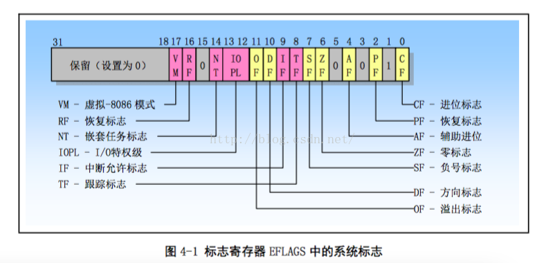

- 4.1 80x86 系统寄存器和系统指令
    - 4.1.1 标志寄存器
    - 4.1.2 内存管理寄存器
    - 4.1.3 控制寄存器
    - 4.1.4 系统指令

为协助处理器执行初始化和控制系统操作，80x86提供了一个标志寄存器EFLAGS和几个系统寄存器，除了一些通用状态标志外，EFLAGS中还包含几个系统标志。这些系统标志用于控制任务切换、中断处理、指令跟踪以及访问权限。系统寄存器用于内存管理和控制处理器操作，含有分段和分页处理机制系统表的基地址、控制处理器操作的位标志位。

## 1. 标志寄存器

标志寄存器EFLAGS中的系统标志和IOPL字段用于控制I/O访问、可屏蔽硬件中断、调试、任务切换以及虚拟8086模式，如图4-1。通常只允许操作系统修改。EFLAGS中其他标志也是一些通用标志（进位CF、奇偶PF、辅助进位AF、零标志ZF、负号SF、方向DF、溢出OF）。我们仅对EFLAGS的系统标志进行说明。

（1） TF：位8是跟踪标志（Trap Flag）。设置该位可用为调试操作启动单步执行方式；复位则禁止单步执行。单步执行方式中，处理器在每个指令执行后产生一个调试异常，这样就可以观察执行程序在执行每条指令后的状态。如果程序使用POPF、POPFD或IRET指令设置了TF，那么在随后指令之后处理器就会产生一个调试异常。

（2） IOPL：位12、13是I/O特权级（I/O Privilege Level）字段。该字段指明当前运行程序或任务的I/O特权级IOPL。当前运行程序或任务的CPL必须小于或等于这个IOPL才能访问I/O地址空间。只有当CPL为特权级0时候，程序才能使用POPE或IRET指令修改这个字段。IOPL也是控制对IF标志修改的机制之一。

（3） NT：bit 14 是嵌套任务标志（Nested Task）。 它控制着被终端任务和调用任务之间的链接关系。在使用CALL 指令， 中断或 异常执行任务调用时候，CPU 会设置该flag。 在通过使用IRET 指令从一个任务返回时候，CPU 会检查并修改这个NT flag。 使用POPF/ POPFD 指令也可以修改这个标志，但是在应用程序中改变这个flag的状态会产生不可意料的异常。

（4） RF：bit 16是恢复标志（Resume Flag）。 该flag 用于控制CPU 对断点指令的响应。当设置时，这个flag 会临时禁止断点指令产生的调式异常： 当该flag 复位时候，则断点指令讲会产生异常。RF 标志的蛀牙功能是运行在调式异常之后重新执行一条指令。当调试团结使用IRETD 指令返回被中断程序之前，需要设置堆栈上EFLAGS 内存中的RF flag，以防止指令断点造成另一个异常。CPU 会在返回之后自动地清除该flag， 从而再次允许指令断点异常。

（5） VM ：bit 17是虚拟-8086 方式（Virtual 8086 Mode）标志。当设置该标志时，就开启虚拟-8086方式： 当复位该标志时，则回到保护模式。

## 2. 内存管理寄存器

处理器提供4个内存管理寄存器（GDTR、LDTR、IDTR和TR），用于指定**内存分段管理**所用**系统表**的基地址，如图4-2。处理器为这些寄存器的加载和保存提供了特定指令。系统表作用参见“保护模式内存管理”。

GDTR,LDTR,IDTR和TR 都是段基址寄存器，这些段中含有分段机制的重要信息表。GDTR，IDTR和LDTR 用于寻址存放描述符表的段。**TR 用于寻址一个特殊的任务状态段TSS** （Task State Segment）。 **TSS 段包含着当前执行任务的重要信息**。

（1） 全局描述表寄存器 GDTR 

用于存放全局描述符表GDT 的32 bit 线性基地址 和 16 bit 表长度值。基地址指定 GDT 表中字节 0 在**线性地址空间**中的地址，表长度指明GDT 表的字节长度值。 指令LGDT 和SGDT 分别用于加载和保存GDTR 寄存器的内容。 在机器刚加电或CPU复位后，基地址被默认的设置为0，而长度值被设置成0xFFFF. 在保护模式初始化过程必须给GDTR加载一个新值。

（2） 中断描述符表寄存器IDTR 

与GDTR的 作用类似，IDTR 寄存器用于存放中断描述表IDT 的32 bit 线性基地址 和 16bit 表长度值。指令LIDT 和 SIDT 分别用于加载和保存IDTR 寄存器的内容。 在机器刚加电或CPU复位后， 基地址被默认的设置为0，而长度值设置为 0xFFFF。

（3） 局部描述符寄存器LDTR 

用于存放局部描述表LDT 的32 bit 线性基地址。 16 bit 段限长和描述符属性值。 指令LLDT 和SLDT 分别用于加载和保存LDTR 寄存器的段描述符部分。包含LDT 表的段必须在GDT 表中有一个段描述符项。 当使用LLDT 指令把还有LDT 表段的选择符加载进LDTR 时， LDT 段描述符的段基地址，段限长度以及描述符属性会被自动地加载到LDTR中，当进行任务切换时候，段选择符 和基地址被默认地设置为0 ，而长度被设置为0xffff。

（4） 任务寄存器TR 

用于存放当前任务TSS段的16 bit 段选择符，32 bit 基地址， 16bit 段长度和描述符属性值。它引用GDT 表中的一个TSS 类型的描述符。 指令LTR 和STR 分别用于加载和保存TR 寄存器的段选择符部分。 当使用LTR指令把选择符加载进任务寄存器时候，TSS 描述符中的段基地址，段限长度以及描述符属性会被自动地加载到任务寄存器中。当执行任务切换时，处理器会把新任务TSS的段选择符合段描述符自动地加载进任务寄存器TR 中。

