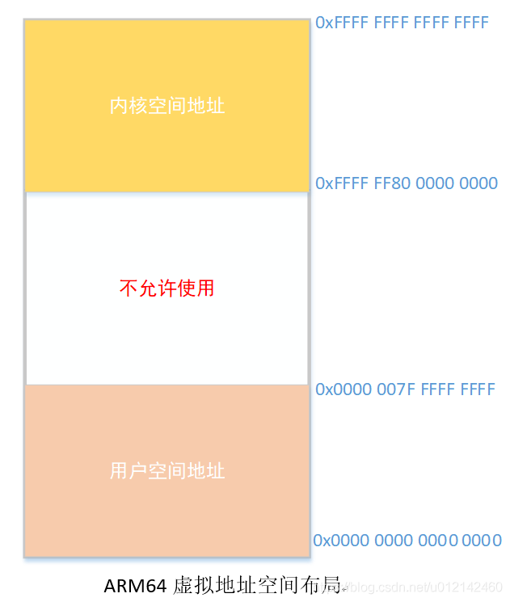

# Linux虚拟内存布局

在ARM64中，地址线由32bit变为64bit，但是64bit并不是全用到了，最大支持 48 位物理寻址，最大可寻找 256T 的**物理地址空间**，对于目前的应用来讲完全足够了。

虚拟地址的最大宽度可配置，最大为48bit，还可以有36bit，39bit，42bit，47bit

```cpp
1.	[arch/arm64/Kconfig]  
2.	   
3.	config ARM64_VA_BITS  
4.	        int  
5.	        default 36 if ARM64_VA_BITS_36  
6.	        default 39 if ARM64_VA_BITS_39  
7.	        default 42 if ARM64_VA_BITS_42  
8.	        default 47 if ARM64_VA_BITS_47  
9.	        default 48 if ARM64_VA_BITS_48
10.	
11.	[arch/arm64/configs/xj2_debug_defconfig]
12.	CONFIG_ARM64_VA_BITS_39=y
```

以39bit为例，。用户空间和内核空间大小均为512G。

用户空间范围：0x0000-0000-0000-0000 ---- 0x0000-007f-ffff-ffff
内核空间范围：0xffff-ff800-0000-0000—0xffff-ffff-ffff-ffff



除了虚拟地址宽度可配置外，页大小也是可以配置的，有4K,16K,64K三种页大小，我们使用4K页大小。

# 内核虚拟地址空间布局


1、线性映射区域，范围是[PAGE_OFFSET, 2的64次方-1]，PAGE_OFFSET = （0xFFFFFFFFFFFFFFFF << (VA_BITS - 1)）,长度是内核虚拟地址空间的一半。称为线性映射区域的原因是因为虚拟地址和物理地址是线性的关系：
虚拟地址 = （（物理地址 - PHYS_OFFSET） + PAGE_OFFSET）, 其中PHYS_OFFSET是内存的起始物理地址，在ARM中PHYS_OFFSET是0，所以虚拟地址= 物理地址 + PAGE_OFFSET

2、vmemmap 区域的范围是[VMEMMAP_START, PAGE_OFFSET],长度是VMEMMAP_SIZE = (线性映射区域的长度/也长度 * page结构体的长度上限)。内核使用page结构体描述一个物理页，内存的所有物理页对应一个page结构体数组。如果内存的物理地址空间不连续，存在很多漏洞，称为稀疏内存。vmemmap区域是稀疏内存的page结构体数组的虚拟地址空间。

3、PCI I/O区域长度16M，是PCI设备的I/O地址空间

4、固定映射区域是编译时的特殊虚拟地址，编译的时候是一个常量，在内核初始化的时候映射到物理地址，dtb上电映射就在这个区域中

5、vmalloc区域的范围是[VMALLOC_START,VMALLOC_END],起始地址是VMALLOC_START,等于内核模块区域的结束地址，结束地址VMALLOC_END = (PAGE_OFFSET - PUD_SIZE - VMEMMAP_SIZE- 64KB),其中PUD_SIZE是页上级目录表项映射的地址空间的长度。
vmalloc区域是函数vmalloc使用的虚拟地址空间，内核使用vmalloc分配虚拟地址空间连续但物理地址空间不连续的内存。
内核的镜像就存在于vmalloc区域当中，起始虚拟地址是KIMAGE_VADDR + TEXT_OFFSET,其中KIMAGE_VADDR是内核镜像的虚拟地址的基准值，等于内核区域的结束地址MODULES_END,TEXT_OFFSET是内存中的内核镜像相对于内存起始位置的偏移。

6、内核模块区域长度128M，是内核模块使用的虚拟地址空间

7、KASAN区域起始地址内核虚拟空间的起始地址，长度是内核虚拟地址空间长度1/8
