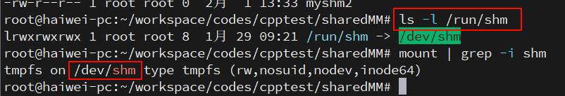

早期的共享内存，着重于强调把同一片内存，map 到多个进程的虚拟地址空间（在**相应进程**找到一个 **VMA 区域**），以便于 CPU 可以在各个进程访问到这片内存。


**现阶段**广泛应用于多媒体、Graphics领域的**共享内存方式**，某种意义上**不再强调**映射到**进程虚拟地址空间**的概念（那无非是**为了让 CPU 访问**），而更强调以某种 “**句柄**” 的形式，让大家知道某一片视频、图形图像数据的存在并可以借助此 “句柄” 来跨进程引用这片内存，让视频 encoder、decoder、GPU 等可以跨进程访问内存。所以不同进程用的加速硬件其实是不同的，他们更在乎的是可以通过一个 handle 拿到这片内存，而不再特别在乎 CPU 访问它的虚拟地址（当然仍然可以映射到进程的虚拟地址空间供 CPU 访问）。


只要内存的拷贝(memcpy)仍然是一个占据内存带宽、CPU利用率的消耗大户存在，共享内存作为Linux进程间通信、计算机系统里各个不同硬件组件通信的最高效方法，都将持续繁荣。关于内存拷贝会大多程度地占据CPU利用率，这个可以最简单地尝试拷贝 1080P，帧率每秒60的电影画面，我保证你的系统的CPU，蛋会疼地不行。

综述Linux里面各种共享内存方式, 共享内存的方式有很多种，目前主流的方式仍然有：

共享内存的方式

1.基于传统 SYS V 的共享内存；

2.基于 POSIX mmap 文件映射实现共享内存；

3.通过 memfd_create() 和 fd 跨进程共享实现共享内存；

4.多媒体、图形领域广泛使用的基于 dma-buf 的共享内存。

# SYS V共享内存

历史悠久、年代久远、API怪异，对应内核代码 `linux/ipc/shm.c`，当你编译内核的时候**不选择** `CONFIG_SYSVIPC`，则不再具备此能力。

你在 Linux 敲 ipcs 命令看到的 share memory 就是这种共享内存：


下面写一个最简单的程序来看共享内存的**写端** `sw.c`：

```cpp
#include <sys/shm.h>
#include <unistd.h>
#include <string.h>

int main(int argc, char **argv)
{
    key_t key = ftok("/dev/shm/myshm2", 0);
    int shm_id = shmget(key, 0x400000, IPC_CREAT | 0666);
    char *p = (char *)shmat(shm_id, NULL, 0);

    memset(p, 'A', 0x400000);
    shmdt(p);

    return 0;
}
```

以及共享内存的**读端** `sr.c`:

```cpp
#include <sys/shm.h>
#include <unistd.h>
#include <stdio.h>

int main(int argc, char **argv)
{
    key_t key = ftok("/dev/shm/myshm2", 0);
    int shm_id = shmget(key, 0x400000, 0666);
    char *p = (char *)shmat(shm_id, NULL, 0);

    printf("%c %c %c %c\n", p[0], p[1], p[2], p[3]);
    shmdt(p);

    return 0;
}
```

编译和准备运行:

```
gcc sw.c -o sw
gcc sr.c -o sr
touch /dev/shm/myshm2
```

在此之前我们看一下系统的 free:


下面运行sw和sr：

```
# ./sw
# ./sr
A A A A
```

我们再看下 free:


可以看到 **used** 显著增大了(1376548 -> 1380552), **shared** 显著地增大了(41808 -> 45904)，而 cached这一列也显著地增大(14721288 -> 14725436)。

我们都知道 cached 这一列统计的是 `file-backed` 的文件的 **page cache** 的大小。理论上，**共享内存**属于**匿名页**，但是由于这里面有个非常特殊的 `tmpfs`(`/run/shm` 指向 `/dev/shm`, `/dev/shm` 则 mount 为 **tmpfs**)：



所以可以看出 tmpfs 的东西其实真的是有点含混：我们可以理解它为 **file-backed** 的**匿名页**(`anonymous page`). 前面我们反复强调, **匿名页**是**没有文件背景**的，这样当进行**内存交换**的时候，是与 swap 分区交换。**磁盘文件系统**里面的东西在内存的副本是 file-backed 的页面，所以不存在与 swap 分区交换的问题。但是 tmpfs 里面的东西，真的是在统计意义上统计到 **page cache** 了，但是它**并没有真实的磁盘背景**，这又和你访问磁盘文件系统里面的文件产生的 page cache 有本质的区别。所以，它是真地有那么一点 misc 的感觉，凡事都没有绝对，唯有变化本身是不变的。

也可以通过 ipcs 找到新创建的 SYS V 共享内存：


`4194304 bytes` = `0x400000 bytes`

# POSIX 共享内存

我对POSIX shm_open()、mmap () API系列的共享内存的喜爱，远远超过SYS V 100倍。原谅我就是一个懒惰的人，我就是讨厌ftok、shmget、shmat、shmdt这样的API。

上面的程序如果用POSIX的写法，可以简化成**写端** psw.c：

```cpp
#include <sys/mman.h>
#include <sys/stat.h>   /* For mode constants */
#include <fcntl.h>      /* For O_* constants */
#include <stdlib.h>
#include <string.h>

#define SIZE 0x400000
int main(int argc, char **argv)
{
    int fd = shm_open("posixsm", O_CREAT | O_RDWR, 0666);
    ftruncate(fd, SIZE);

    char *p = mmap(NULL, SIZE, PROT_READ | PROT_WRITE, MAP_SHARED, fd, 0);
    memset(p, 'A', SIZE);
    munmap(p, SIZE);

    return 0;
}
```

**读端** psr.c

```cpp
#include <sys/mman.h>
#include <sys/stat.h>   /* For mode constants */
#include <fcntl.h>      /* For O_* constants */
#include <stdlib.h>
#include <stdio.h>

#define SIZE 0x400000
int main(int argc, char **argv)
{
        int fd = shm_open("posixsm", O_CREAT | O_RDWR, 0666);
        ftruncate(fd, SIZE);

        char *p = mmap(NULL, SIZE, PROT_READ, MAP_SHARED, fd, 0);

        printf("%c %c %c %c\n", p[0], p[1], p[2], p[3]);

        munmap(0, SIZE);

        return 0;
}
```

编译和执行:

```
# gcc psr.c -o psr -lrt
# gcc psw.c -o psw -lrt
# ./psw
# ./psr
A A A A
```

这样我们会在 `/dev/shm/`、`/run/shm` 下面看到一个文件：


当然，如果你不喜欢 `shm_open()` 这个 API，你也可以用常规的 open 来打开文件，然后进行 mmap。关键的是 mmap.

POSIX 的共享内存，仍然符合我们前面说的 tmpfs 的特点，在运行了 sw, sr 后，再运行 psw 和 psr，我们发现 free 命令再次戏剧性变化：


# memfd_create

如果说 POSIX 的 mmap 让我找到回家的感觉，那么 `memfd_create()` 则是万般惊艳.

在所有的所有开始之前，我们要先提一下跨进程分享fd（文件描述符，对应我们很多时候说的 “**句柄**”）这个重要的概念。

众所周知，Linux 的 fd 属于一个**进程级别**的东西。进入每个进程的 `/proc/pid/fd` 可以看到它的fd的列表：


这个进程的 0，1，2 和那个进程的 0，1，2 不是一回事。

某年某月的某一天，人们发现，**一个进程其实想访问另外一个进程的 fd**。当然，这只是目的不是手段。比如进程 A 有 2 个 fd 指向 2 片内存，如果进程 B 可以拿到这 2 个fd，其实就可以透过这 2 个fd访问到这2片内存。这个fd某种意义上充当了一个中间媒介的作用。有人说，那还不简单吗，如果进程A:

`fd = open();`

open() 如果返回 100，把这个 100 告诉进程 B 不就可以了吗，进程 B 访问这个 100 就可以了。这说明你还是没搞明白 **fd** 是一个**进程内部**的东西，是不能跨进程的概念。你的 100 和我的 100，不是一个东西。这些基本的东西你搞不明白，你搞别的都是白搭。

Linux 提供一个特殊的方法，可以把一个进程的 fd 分享给另外一个进程。

那么如何 (**分享**) fd呢？

Linux里面的分享需要借助 cmsg，用于在 socket 上传递控制消息（也称 Ancillary data），使用 **SCM_RIGHTS**，进程可以透过 UNIX Socket 把一个或者多个 fd(file descriptor) 传递给另外一个进程。

比如下面的这个函数，可以透过 socket 把 fds 指向的 n 个 fd 发送给另外一个进程：

```cpp
static void send_fd(int socket, int *fds, int n)
{
    struct msghdr msg = {0};
    struct cmsghdr *cmsg;
    char buf[CMSG_SPACE(n * sizeof(int))], data;
    memset(buf, '\0', sizeof(buf));
    struct iovec io = { .iov_base = &data, .iov_len = 1 };

    msg.msg_iov = &io;
    msg.msg_iovlen = 1;
    msg.msg_control = buf;
    msg.msg_controllen = sizeof(buf);

    cmsg = CMSG_FIRSTHDR(&msg);
    cmsg->cmsg_level = SOL_SOCKET;
    cmsg->cmsg_type = SCM_RIGHTS;
    cmsg->cmsg_len = CMSG_LEN(n * sizeof(int));

    memcpy((int *)CMSG_DATA(cmsg), fds, n * sizeof(int));

    if (sendmsg(socket, &msg, 0) < 0)
        handle_error("Failed to send message");
}
```

而另外一个进程，则可以透过如下函数接受这个fd：

```cpp
static int * recv_fd(int socket, int *fds, int n)
{
    int *fds = malloc(n * sizeof(int));
    struct msghdr msg = {0};
    struct cmsghdr *cmsg;
    char buf[CMSG_SPACE(n * sizeof(int))], data;
    memset(buf, '\0', sizeof(buf));
    struct iovec io = { .iov_base = &data, .iov_len = 1 };

    msg.msg_iov = &io;
    msg.msg_iovlen = 1;
    msg.msg_control = buf;
    msg.msg_controllen = sizeof(buf);

    if (recvmsg(socket, &msg, 0) < 0)
        handle_error("Failed to receive message");

    cmsg = CMSG_FIRSTHDR(&msg);

    memcpy((int *)CMSG_DATA(cmsg), fds, n * sizeof(int));

    return fds;
}
```

那么问题来了，如果在进程A中有一个文件的fd是100，发送给进程B后，它还是100吗？不能这么简单地理解，fd本身是一个进程级别的概念，每个进程有自己的fd的列表，比如进程B收到进程A的fd的时候，进程B自身fd空间里面自己的前面200个fd都已经被占用了，那么进程B接受到的fd就可能是201。数字本身在Linux的fd里面真地是一点都不重要，除了几个特殊的0,1,2这样的数字外。同样的，如果你把 `cat /proc/interrupts` 显示出的中断号就看成是硬件里面的中断偏移号码(比如ARM GIC里某号硬件中断)，你会发现，这个关系整个是一个瞎扯。


知道了甩锅API，那么重要的是，当它与 `memfd_create()` 结合的时候，我们准备甩出去的fd是怎么来？它是 `memfd_create()` 的返回值。

`memfd_create()` 这个函数的玄妙之处在于它会**返回一个“匿名”内存“文件”的 fd**，而它本身并没有实体的文件系统路径，其典型用法如下：

```cpp
int fd = memfd_create("shma", 0);
ftruncate(fd, size);

void *ptr = mmap(NULL, size, PROT_READ | PROT_WRITE, MAP_SHARED, fd, 0);
strcpy(ptr, "hello A");
munmap(ptr, size);
```

我们透过 `memfd_create()` 创建了一个“文件”，但是它**实际映射到一片内存**，而且在 `/xxx/yyy/zzz` 这样的文件系统下没有路径！没有路径！没有路径！

所以，当你在Linux里面编程的时候，碰到这样的场景：需要一个 fd，**当成文件一样操作**，但是又不需要真实地位于文件系统，那么，就请立即使用 `memfd_create()`.

那么，它和前面我们说的透过 UNIX Socket 甩锅 fd 又有什么关系呢？`memfd_create()` 得到了 fd，它在行为上类似规则的 fd，所以也可以透过 socket 来进行甩锅，这样 A 进程相当于把一片与 fd 对应的内存，分享给了进程 B。

下面的代码进程 A 通过 `memfd_create()` 创建了 **2 片 4MB 的内存**，并且透过 socket（路径 `/tmp/fd-pass.socket`）发送给进程 B 这 2 片内存对应的 fd：

```cpp
int main(int 
```


# reference

来自 宋宝华: https://cloud.tencent.com/developer/article/1551288