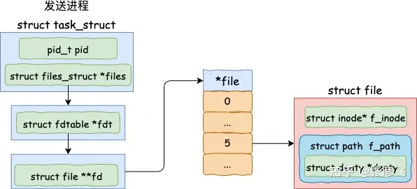
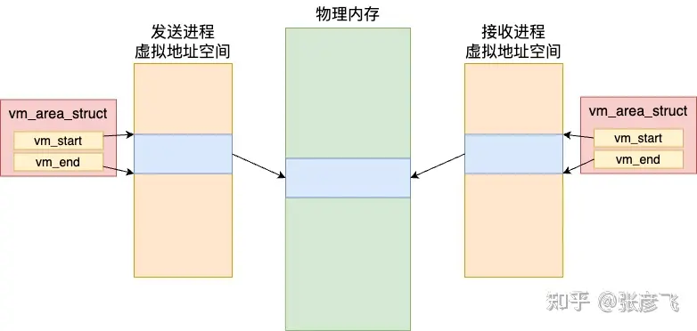

在 Linux 系统的进程虚拟内存中，一个重要的特性就是不同进程的地址空间是隔离的。A 进程的地址 0x4000 和 B 进程的 0x4000 之间没有任何关系。这样确确实实是让各个进程的运行时互相之间的影响降到了最低。某个进程有 bug 也只能自己崩溃，不会影响其它进程的运行。

但是有的时候我们是想要跨进程传递一些数据的。因为进程虚拟内存地址是隔离的。所以目前业界最常用的做法是让进程之间通过 127.0.0.1 或者是 Unix Domain Socket 等本机网络手段进行数据的传输。这个方案在传输的数据量较小的时候工作是很不错的。

但如果进程间想共享的数据特别大，比如说几个 GB，那如果使用网络 IO 方案的话，就会涉及到大量的内存拷贝的开销，导致比较低的程序性能。这是可以采用进程间共享内存的方法来在通信时避免内存拷贝。

那么问题来了，不同进程之间的虚拟地址是隔离的，共享内存又是如何突破这个限制的呢？我们今天就来深入地了解下共享内存的内部工作原理。

欢迎大家关注我的个人技术公众号「开发内功修炼」，另外应读者需要我规划了100多节视频体系，视频的方式能更容易让大家理解吸收。在这里我带大家把技术点从硬件到 Linux内核，再到编程语言运行时把知识串起来融汇贯通地理解，避免大家只会使用不懂原理。具体内容包括硬件原理、内存管理、进程管理、文件系统、网络管理、容器底层原理、Golang 语言运行时、性能观测和性能优化共计九大部分。


# 共享内存的使用方式

共享内存发送方进程的开发基本过程是调用 memfd_create 创建一个内存文件。然后通过 mmap 系统调用为这个内存文件申请一块共享内存。然后这个内存文件就可以写入数据了。最后把这个文件的句柄通过 Unix Domain Socket 的方式给接收方进程发送过去。

下面是发送方的核心代码。

```cpp
int main(int argc, char **argv) {
 // 创建内存文件
 fd = memfd_create("Server memfd", ...);

 // 为内存文件申请 MAP_SHARED 类型的内存
 shm = mmap(NULL, shm_size, PROT_READ | PROT_WRITE, MAP_SHARED, fd, 0);

 // 向共享内存中写入数据
 sprintf(shm, "这段内容是保存在共享内存里的，接收方和发送方都能根据自己的fd访问到这块内容");

 // 把共享内存文件的句柄给接收方进程发送过去
 struct msghdr msgh;
 *((int *) CMSG_DATA(CMSG_FIRSTHDR(&msgh))) = fd;
 sendmsg(conn, &msgh, 0);
 ......
}
```

共享内存接收方的工作过程是先用 Unix Domain Socket 连接上服务器，然后使用 recvmsg 就可以收到发送方发送过来的文件句柄。

```cpp
int main(int argc, char **argv) {
 // 通过 Unix Domain Socket 连接发送方
 connect(conn, (struct sockaddr *)&address, sizeof(struct sockaddr_un));

 // 通过连接取出发送方发送过来的内存文件句柄
 int size = recvmsg(conn, &msgh, 0);
 fd = *((int *) CMSG_DATA(cmsgh));

 // 读取共享文件中的内容
 shm = mmap(NULL, shm_size, PROT_READ, MAP_PRIVATE, fd, 0);
 printf("共享内存中的文件内容是: %s\n", shm);
 ......
}
```

这样这两个进程都各自有一个文件句柄，在底层上是指向同一个内存文件的。这样就实现了发送方和接收方之间的内存文件共享了。


但我们上面介绍的是开发基本过程。按照我们开发内功修炼公众号的风格，这还不算完，我们是要把它最底层的原理真正的弄通透才算的。所以接下来我们再深入地分析 memfd_create、 mmap、以及 Unix Domain socket sendmsg 和 recvmsg 的底层工作原理，来看看它们是如何配合来实现跨进程共享内存的。

# 共享内存文件原理

在发送方发送文件之前，需要先通过 memfd_create 来创建一个内存文件，然后再使用 mmap 为其分配内存。

## 创建内存文件

其中 memfd_create 函数是一个系统调用。内核中它的主要逻辑有两个，一是调用 get_unused_fd_flags 申请一个没使用过的文件句柄，二是调用 shmem_file_setup 创建一个共享内存文件。



来看 memfd_create 的源码.

```cpp
// file:mm/memfd.c
SYSCALL_DEFINE2(memfd_create,
  const char __user *, uname,
  unsigned int, flags)
{
 ...
 // 申请一个未使用过的文件句柄
 fd = get_unused_fd_flags((flags & MFD_CLOEXEC) ? O_CLOEXEC : 0);

 // 创建一个共享内存的文件
 file = shmem_file_setup(name, 0, VM_NORESERVE);

 fd_install(fd, file);
 return fd;
}
```

其中在 shmem_file_setup 函数中又调用了 __shmem_file_setup.

```cpp
// file:mm/shmem.c
static struct file *__shmem_file_setup(struct vfsmount *mnt, const char *name, ...)
{
 ...
 // 申请一个 inode
 inode = shmem_get_inode(mnt->mnt_sb, NULL, S_IFREG | S_IRWXUGO, 0,
    flags);
 inode->i_flags |= i_flags;
 inode->i_size = size;

 ...
 // 创建一个文件
 res = alloc_file_pseudo(inode, mnt, name, O_RDWR,
    &shmem_file_operations);
 return res;
}
```

我们都知道磁盘文件在内核的实现中是由 inode 和 struct file 对象一起组成的。其实共享内存文件也一样，__shmem_file_setup 中就是先申请了一个 inode，然后再调用 alloc_file_pseudo 创建一个文件。值得注意的是，这个文件并非是磁盘上的文件，而只是在内存里的.

## mmap申请内存

mmap 也是一个系统调用，注意我们在开篇处调用它的时候传入的第三个 flag 参数是 MAP_SHARED。这表示的是要通过 mmap 申请一块跨进程可共享的内存出来。mmap 的实现入口在 arch/x86/kernel/sys_x86_64.c

```cpp
//file:arch/x86/kernel/sys_x86_64.c
SYSCALL_DEFINE6(mmap, unsigned long, addr, ...)
{
 return ksys_mmap_pgoff(addr, len, prot, flags, fd, off >> PAGE_SHIFT);
}
```

接下来的这个函数的调用链路如下

```cpp
SYSCALL_DEFINE6(mmap
-> ksys_mmap_pgoff
---> vm_mmap_pgoff
------> do_mmap_pgoff
--------> do_mmap
```

在 do_mmap 函数中，对输入的 MAP_SHARED 进行了处理

```cpp
//file:mm/mmap.c
unsigned long do_mmap(struct file *file, unsigned long addr,
   unsigned long len, unsigned long prot,
   unsigned long flags, vm_flags_t vm_flags,
   unsigned long pgoff, unsigned long *populate,
   struct list_head *uf)
{
 struct mm_struct * mm = current->mm;
 ...

 // 如果包含 MAP_SHARED，则对要申请的虚拟内存设置一个 VM_SHARED
 switch (flags & MAP_TYPE) {
  case MAP_SHARED:
  case MAP_SHARED_VALIDATE:
   vm_flags |= VM_SHARED | VM_MAYSHARE; 
   ... 
 } 
 ... 

 addr = mmap_region(file, addr, len, vm_flags, pgoff, uf);
 ......
}
```

如果 flag 包含了 MAP_SHARED，则对要申请的虚拟内存设置一个 VM_SHARED。该标记指明的是要申请一个可以跨进程共享的内存块。接下来进入 mmap_region 中申请虚拟内存.

```cpp
//file:mm/mmap.c
unsigned long mmap_region(struct file *file, ...)
{
 struct mm_struct *mm = current->mm;
 ......

 // 申请虚拟内存vma
 vma = vm_area_alloc(mm);

 // vma初始化
 vma->vm_start = addr;
 vma->vm_end = addr + len;
 vma->vm_flags = vm_flags;
 vma->vm_page_prot = vm_get_page_prot(vm_flags);
 vma->vm_pgoff = pgoff;
 ......

 // 加入到进程的虚拟内存 vma 链表中来
 vma_link(mm, vma, prev, rb_link, rb_parent);
}
```

进程的虚拟内存地址空间在内核底层中就是由这样一个个的 vma 来组成的。每一个 vma 都声明的是进程虚拟地址中的某一段地址范围已经分配出去了。在 mmap_region 函数中申请了 vma，并在内核中将其管理了起来。

这里注意我们在申请共享内存的时候，给 vma 是带了 VM_SHARED 标记的。带了这个标记的 vma和普通的虚拟内存不一样。 后面在发生缺页中断申请物理内存的时候，在不同的进程间是可以对应到同一块物理内存的。所以可以实现进程间的共享。




# reference

跨进程共享内存memfd的内部工作原理: https://zhuanlan.zhihu.com/p/671507551
