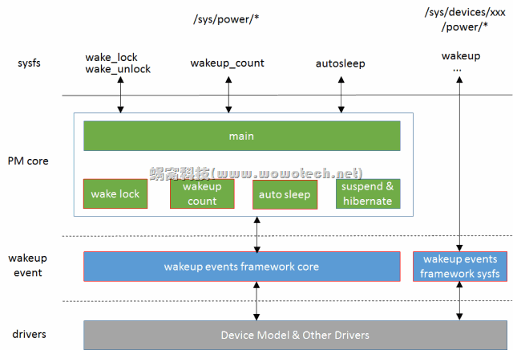

# 概述

wakeup events framework 包括 wake lock、wakeup count、autosleep等机制.

# wakeup events framework要解决的问题

我们知道, 系统处于 suspend 状态, 可通过 wakeup events 唤醒. 具体的 wakeup events 可以是**按键按下**, 可以是**充电器插入**, 等等. 但是, 如果在 **suspend** 的**过程中**, 产生了 **wakeup events**, 怎么办? 答案很肯定, "wakeup" 系统. 由于此时系统没有真正 suspend, 所以这的 "wakeup" 是个假动作, 实际上只是终止suspend.

但由于系统在 suspend 的过程中, 会进行 process freeze、 device suspend 等操作, 而这些操作可能导致**内核**或**用户空间**程序**不能及时获取 wakeup events**, 从而使系统**不能正确 wakeup**, 这就是 wakeup events framework 要解决的问题: **system suspend** 和 **system wakeup events** 之间的**同步**问题.

# wakeup events framework的功能总结

仔细推敲一下, 上面所讲的同步问题包括两种情况:

情况1: **内核空间**的同步

wakeup events 产生后, 通常是以**中断的形式**通知 **device driver**. driver 会处理 events, 处理的过程中, 系统不能 suspend.

注1: 同步问题**只存在**于**中断开启**的情况, 因为若**中断关闭**, 就**不会**产生 **wakeup events**, 也就**不存在同步**的概念.

情况2: **用户空间**的同步

一般情况下, driver 对 wakeup events **处理后**, 会交给**用户空间程序**继续处理, 处理的过程, 也不允许 suspend. 这又可以分为两种情况:

* 进行后续处理的**用户进程**, 根本**没有机会被调度**, 即该 wakeup events **无法上报到用户空间**.

* 进行后续处理的**用户进程被调度**, 处理的过程中(以及处理结束后, 决定终止suspend操作), 系统不能 suspend.

因此, wakeup events framework 就包括 **3 大功能**:

* 解决内核空间同步问题(**framework 的核心功能**);

* 解决用户空间同步问题的情景1(**wakeup count** 功能);

* 解决用户空间同步问题的情景2(**wake lock** 功能).

注2:

用户空间同步的两种情况, 咋一看, 非常合乎情理, kernel 你得好好处理！但事实上, 该同步问题牵涉到了另外一个比较有争议的话题: 日常的电源管理机制. 是否要基于 suspend 实现? 系统何时进入低功耗状态, 应该由谁决定? kernel 还是用户空间程序? 

这最终会决定是否存在用空间同步问题. 但是, 在当前这个时间点, 对这个话题, Linux kernel developers 和 Android developers 持相反的观点. 这也造成了 wakeup events framework 在实现上的撕裂. Kernel 的本意是不愿处理用户空间同步问题的, 但为了兼容 Android 平台, 不得不增加相关的功能(Wakeup count 和 Wake lock).

在下一篇文章和大家探讨该话题, 本文就先 focus 在 wakeup events framework 上.

# 架构

下面图片描述了 wakeup events framework 的 architecture:



图片中红色边框的 block 是 wakeup events 相关的 block:

1. wakeup events framework core, 在 drivers/base/power/wakeup.c 中实现, 提供了 wakeup events framework 的核心功能, 包括:

* 抽象 wakeup source 和 wakeup event 的概念;

* 向各个 device driver 提供 wakeup source 的注册、使能等接口;

* 向各个 device driver 提供 wakeup event 的上报、停止等接口;

* 向上层的 PM core(包括 wakeup count、auto sleep、suspend、hibernate 等模块)提供 wakeup event 的查询接口, 以判断是否可以 suspend、是否需要终止正在进行的 suspend.

2. wakeup events framework sysfs, 将设备的 wakeup 信息, 以 sysfs 的形式提供到用户空间, 供用户空间程序查询、配置. 在 `drivers/base/power/sysfs.c` 中实现.

3. wake lock/unlock, 为了兼容 Android 旧的 wakeup lock 机制而留下的一个后门, 扩展 `wakeup events framework` 的功能, 允许用户空间程序报告/停止 wakeup events. 换句话说, 该后门允许用户空间的任一程序决定系统是否可以休眠.

4. wakeup count, 基于 `wakeup events framework`, 解决用户空间同步的问题.

5. auto sleep, 允许系统在没有活动时(即一段时间内, 没有产生 wakeup event), 自动休眠.

注3: 在 Linux kernel 看来, power 是系统的核心资源, 不应开放给用户程序随意访问(wake lock 机制违背了这个原则). 而在运行时的电源管理过程中, 系统何时进入低功耗状态, 也不是用户空间程序能决定的(auto sleep 中枪了). 因此, kernel对上述功能的支持, 非常的不乐意, 我们可以从 `kernel/power/main.c` 中 sysfs attribute 文件窥见一斑(只要定义了 `PM_SLEEP`, 就一定支持 wakeup count 功能, 但 autosleep 和 wake lock 功能, 由另外的宏定义控制):

```cpp
static struct attribute * g[] = {
    &state_attr.attr,
#ifdef CONFIG_PM_TRACE
    &pm_trace_attr.attr,
    &pm_trace_dev_match_attr.attr,
#endif
#ifdef CONFIG_PM_SLEEP
    &pm_async_attr.attr,
    &wakeup_count_attr.attr,
#ifdef CONFIG_SUSPEND
    &mem_sleep_attr.attr,
    &sync_on_suspend_attr.attr,
#endif
#ifdef CONFIG_PM_AUTOSLEEP
    &autosleep_attr.attr,
#endif
#ifdef CONFIG_PM_WAKELOCKS
    &wake_lock_attr.attr,
    &wake_unlock_attr.attr,
#endif
#ifdef CONFIG_PM_SLEEP_DEBUG
    &pm_test_attr.attr,
    &pm_print_times_attr.attr,
    &pm_wakeup_irq_attr.attr,
    &pm_debug_messages_attr.attr,
#endif
#endif
#ifdef CONFIG_FREEZER
    &pm_freeze_timeout_attr.attr,
#endif
    NULL,
};
```

# 代码分析

## wakeup source和wakeup event

在 kernel 中, 可以唤醒系统的只有设备(struct device), 但并不是每个设备都具备唤醒功能, 那些具有唤醒功能的设备称作 wakeup source. 是时候回到这篇文章中了([Linux设备模型(5)_device和device driver](http://www.wowotech.net/linux_kenrel/device_and_driver.html)), 在那里, 介绍 struct device 结构时, 涉及到一个 `struct dev_pm_info` 类型的 power 变量, 待后面的专题讲解. 我们再回忆一下 struct device 结构:

```cpp
// include/linux/device.h
struct device {
    ...
    struct dev_pm_info power;
    ...
}
```

该结构中有一个 power 变量, 保存了和 wakeup event 相关的信息, 让我们接着看一下 struct dev_pm_info 数据结构(只保留和本文有关的内容):

```cpp
// include/linux/pm.h
struct dev_pm_info {
    ...
    unsigned int		can_wakeup:1;
    ...
#ifdef CONFIG_PM_SLEEP
    ...
    struct wakeup_source	*wakeup;
    ...
#else
    unsigned int		should_wakeup:1;
#endif
};
```

can_wakeup, 标识本设备是否具有唤醒能力. 只有具备唤醒能力的设备, 才会在 sysfs 中有一个 power 目录, 用于提供所有的 wakeup 信息, 这些信息是以 `struct wakeup_source` 的形式组织起来的. 也就是上面 wakeup 指针. 具体有哪些信息呢? 让我们看看 `struct wakeup_source` 的定义.

```cpp
// include/linux/pm_wakeup.h
struct wakeup_source {
    const char 		*name;
    int			id;
    struct list_head	entry;
    spinlock_t		lock;
    struct wake_irq		*wakeirq;
    struct timer_list	timer;
    unsigned long		timer_expires;
    ktime_t total_time;
    ktime_t max_time;
    ktime_t last_time;
    ktime_t start_prevent_time;
    ktime_t prevent_sleep_time;
    unsigned long		event_count;
    unsigned long		active_count;
    unsigned long		relax_count;
    unsigned long		expire_count;
    unsigned long		wakeup_count;
    struct device		*dev;
    bool			active:1;
    bool			autosleep_enabled:1;
};
```

因此, 一个 wakeup source 代表了一个具有唤醒能力的设备, 也称该设备为一个 wakeup source. 该结构中各个字段的意义如下:

* name, 该 wakeup source 的名称, 一般为对应的 device name(有个例外, 就是 wakelock);

* entery, 用于将所有的 wakeup source 挂在一个链表中;

* timer、timer_expires, 一个 wakeup source 产生了 wakeup event, 称作 wakeup source activate, wakeup event 处理完毕后(不再需要系统为此保持 active), 称作 deactivate. activate 和 deactivate 的操作可以由driver 亲自设置, 也可以在 activate 时, 指定一个 timeout 时间, 时间到达后, 由 wakeup events framework 自动将其设置为 deactivate 状态. 这里的 timer 以及 expires 时间, 就是用来实现该功能;

* `total_time`, 该 wakeup source 处于 activate 状态的总时间(可以指示该 wakeup source 对应的设备的繁忙程度、耗电等级);

* `max_time`, 该 wakeup source 持续处于 activate 状态的最大时间(越长越不合理);

* `last_time`, 该 wakeup source 上次 active 的开始时间;

* `start_prevent_time`, 该 wakeup source 开始阻止系统自动睡眠(auto sleep)的时间点;

* `prevent_sleep_time`, 该 wakeup source 阻止系统自动睡眠的总时间;

* `event_count`, wakeup source 上报的 event 个数;

* `active_count`, wakeup source activate 的次数;

* `relax_count`,  wakeup source deactivate 的次数;

* `expire_count`, wakeup source timeout 到达的次数;

* `wakeup_count`, wakeup source 终止 suspend 过程的次数;

* `active`, wakeup source 的 activate 状态;

* `autosleep_enabled`, 记录系统 auto sleep 的使能状态(每个 wakeup source 都重复记录这样一个状态, 这种设计真实不敢恭维！).

wakeup source 代表一个具有唤醒能力的设备, 该设备产生的可以唤醒系统的事件, 就称作 wakeup event. 当 wakeup source 产生 wakeup event 时, 需要将 wakeup source 切换为 activate 状态; 当 wakeup event 处理完毕后, 要切换为 deactivate 状态. 因此, 我们再来理解一下几个 wakeup source 比较混淆的变量: event_count, active_count 和 wakeup_count:

* event_count, wakeup source 产生的 wakeup event 的个数;

* active_count, 产生 wakeup event 时, wakeup source 需要切换到 activate 状态. 但并不是每次都要切换, 因此有可能已经处于 activate 状态了. 因此 active_count 可能小于 `event_count`, 换句话说, 很有可能在前一个 wakeup event 没被处理完时, 又产生了一个. 这从一定程度上反映了 wakeup source 所代表的设备的繁忙程度;

* wakeup_count, wakeup source 在 suspend 过程中产生 wakeup event 的话, 就会终止 suspend 过程, 该变量记录了 wakeup source 终止 suspend 过程的次数(如果发现系统总是 suspend 失败, 检查一下各个 wakeup source 的该变量, 就可以知道问题出在谁身上了).

## 几个counters

在 `drivers\base\power\wakeup.c` 中, 有几个比较重要的计数器, 是 wakeup events framework 的实现基础, 包括:

1. registered wakeup events 和 saved_count

记录了系统运行以来产生的所有 wakeup event 的个数, 在 wakeup source 上报 event 时加 1.

这个 counter 对解决用户空间同步问题很有帮助, 因为一般情况下(无论是用户程序主动 suspend, 还是 auto sleep), 由专门的进程(或线程)触发 suspend. 当这个进程判断系统满足 suspend 条件, 决定 suspend 时, 会记录一个 counter 值(`saved_count`). 在后面 suspend 的过程中, 如果系统发现 counter 有变, 则说明系统产生了新的 wakeup event, 这样就可以终止suspend.

该功能即是 wakeup count 功能, 会在后面更详细的说明.

2. wakeup events in progress

记录正在处理的 event 个数.

当 wakeup source 产生 wakeup event 时, 会通过 wakeup events framework 提供的接口将 wakeup source 设置为 activate 状态. 当该 event 处理结束后, 设置为 deactivate 状态. activate 到 deactivate 的区间, 表示该 event 正在被处理.

当系统中有任何正在被处理的 wakeup event 时, 则不允许 suspend. 如果 suspend 正在进行, 则要终止.


思考一个问题: registered wakeup events 在什么时候增加? 答案是在 wakeup events in progress 减小时, 因为已经完整的处理完一个 event 了, 可以记录在案了.

基于这种特性, kernel 将它俩合并成一个 32 位的整型数, 以原子操作的形式, 一起更新. 这种设计巧妙的让人叫绝, 值得我们学习. 具体如下:

```cpp
// drivers/base/power/wakeup.c
static atomic_t combined_event_count = ATOMIC_INIT(0);

#define IN_PROGRESS_BITS	(sizeof(int) * 4)
#define MAX_IN_PROGRESS		((1 << IN_PROGRESS_BITS) - 1)

static void split_counters(unsigned int *cnt, unsigned int *inpr)
{
    unsigned int comb = atomic_read(&combined_event_count);

    *cnt = (comb >> IN_PROGRESS_BITS);
    *inpr = comb & MAX_IN_PROGRESS;
}
```

定义和读取

```cpp
cec = atomic_add_return(MAX_IN_PROGRESS, &combined_event_count);
```

wakeup events in progress 减 1, registered wakeup events 加 1.

```cpp
cec = atomic_inc_return(&combined_event_count);
```

wakeup events in progress 加 1.

## wakeup events framework的核心功能

wakeup events framework 的核心功能体现在它向底层的设备驱动所提供的用于上报 wakeup event 的接口, 这些接口根据操作对象可分为两类, 具体如下.

类型一(操作对象为 wakeup source, 编写设备驱动时, 一般不会直接使用):

```cpp
//include/linux/pm_wakeup.h
extern void __pm_stay_awake(struct wakeup_source *ws);
extern void __pm_relax(struct wakeup_source *ws);
extern void pm_wakeup_ws_event(struct wakeup_source *ws, unsigned int msec, bool hard);
static inline void __pm_wakeup_event(struct wakeup_source *ws, unsigned int msec)
{
    return pm_wakeup_ws_event(ws, msec, false);
}
```

* `__pm_stay_awake`, 通知 PM core, ws 产生了 wakeup event, 且正在处理, 因此不允许系统 suspend(stay awake);

* `__pm_relax`, 通知 PM core, ws 没有正在处理的 wakeup event, 允许系统 suspend(relax);

* `__pm_wakeup_event`, 为上边两个接口的功能组合, 通知PM core, ws 产生了 wakeup event, 会在 msec 毫秒内处理结束(wakeup events framework 自动 relax).

注4: `__pm_stay_awake` 和 `__pm_relax` 应成对调用.

注5: 上面 3 个接口, 均可以在中断上下文调用.

类型二(操作对象为 device, 为设备驱动的常用接口):

```cpp
//include/linux/pm_wakeup.h
extern int device_wakeup_enable(struct device *dev);
extern int device_wakeup_disable(struct device *dev);
extern void device_set_wakeup_capable(struct device *dev, bool capable);
extern int device_set_wakeup_enable(struct device *dev, bool enable);
extern void pm_stay_awake(struct device *dev);
extern void pm_relax(struct device *dev);
extern void pm_wakeup_dev_event(struct device *dev, unsigned int msec, bool hard);
static inline int device_init_wakeup(struct device *dev, bool enable)
{
    if (enable) {
        device_set_wakeup_capable(dev, true);
        return device_wakeup_enable(dev);
    } else {
        device_wakeup_disable(dev);
        device_set_wakeup_capable(dev, false);
        return 0;
    }
}
```

* `device_set_wakeup_capable`, 设置 dev 的 can_wakeup 标志(enable或disable, 可参考5.1小节), 并增加或移除该设备在 sysfs 相关的 power文件;

* `device_wakeup_enable`/`device_wakeup_disable`/`device_set_wakeup_enable`, 对于 can_wakeup 的设备, 使能或者禁止 wakeup 功能. 主要是对 `struct wakeup_source` 结构的相关操作;

* `device_init_wakeup`, 设置 dev 的 can_wakeup 标志, 若是 enable, 同时调用 `device_wakeup_enable` 使能 wakeup 功能;

* `pm_stay_awake`、`pm_relax`、`pm_wakeup_event`, 直接调用上面的 wakeup source 操作接口, 操作 device 的 `struct wakeup_source` 变量, 处理 wakeup events.

### device_set_wakeup_capable

该接口位于在 `drivers/base/power/wakeup.c` 中, 代码如下:

```cpp
// drivers/base/power/wakeup.c
void device_set_wakeup_capable(struct device *dev, bool capable)
{
    if (!!dev->power.can_wakeup == !!capable)
        return;

    dev->power.can_wakeup = capable;
    if (device_is_registered(dev) && !list_empty(&dev->power.entry)) {
        if (capable) {
            int ret = wakeup_sysfs_add(dev);

            if (ret)
                dev_info(dev, "Wakeup sysfs attributes not added\n");
        } else {
            wakeup_sysfs_remove(dev);
        }
    }
}
EXPORT_SYMBOL_GPL(device_set_wakeup_capable);
```

该接口的实现很简单, 主要包括 sysfs 的 `add/remove` 和 `can_wakeup` 标志的设置两部分. 如果设置 `can_wakeup` 标志, 则调用 `wakeup_sysfs_add`, 向该设备的 sysfs 目录下添加 power 文件夹, 并注册相应的 attribute 文件. 如果清除 `can_wakeup` 标志, 执行 sysfs 的移除操作.

`wakeup_sysfs_add`/`wakeup_sysfs_remove` 位于`drivers/base/power/sysfs.c` 中, 对 wakeup events framework 来说, 主要包括如下的 attribute 文件:

```cpp
// drivers/base/power/sysfs.c
static struct attribute *wakeup_attrs[] = {
#ifdef CONFIG_PM_SLEEP
    &dev_attr_wakeup.attr,
    &dev_attr_wakeup_count.attr,
    &dev_attr_wakeup_active_count.attr,
    &dev_attr_wakeup_abort_count.attr,
    &dev_attr_wakeup_expire_count.attr,
    &dev_attr_wakeup_active.attr,
    &dev_attr_wakeup_total_time_ms.attr,
    &dev_attr_wakeup_max_time_ms.attr,
    &dev_attr_wakeup_last_time_ms.attr,
#ifdef CONFIG_PM_AUTOSLEEP
    &dev_attr_wakeup_prevent_sleep_time_ms.attr,
#endif
#endif
    NULL,
};
static const struct attribute_group pm_wakeup_attr_group = {
    .name	= power_group_name,
    .attrs	= wakeup_attrs,
};
```

1. wakeup

读, 获得设备 wakeup 功能的使能状态, 返回 "enabled" 或 "disabled" 字符串.

写, 更改设备 wakeup 功能的使能状态, 根据写入的字符串("enabled" 或 "disabled"), 调用 `device_set_wakeup_enable` 接口完成实际的状态切换.

设备 wakeup 功能是否使能, 取决于设备的 `can_wakeup` 标志, 以及设备是否注册有相应的 `struct wakeup_source` 指针. 即 `can_wakeup` 和 `may_wakeup`, 如下:

```cpp
// include/linux/pm_wakeup.h
static inline bool device_can_wakeup(struct device *dev)
{
    return dev->power.can_wakeup;
}

static inline bool device_may_wakeup(struct device *dev)
{
    return dev->power.can_wakeup && !!dev->power.wakeup;
}
```

2. wakeup_count

只读, 获取 `dev->power.wakeup->event_count` 值. 有关 `event_count` 的意义, 请参考5.1小节, 下同. 顺便抱怨一下, 这个 attribute 文件的命名简直糟糕透顶了！直接用 `event_count` 就是了, 用什么 `wakeup_count`, 会和 wakeup source 中的同名字段搞混淆的！

3. `wakeup_active_count`, 只读, 获取 `dev->power.wakeup->active_count` 值.

4. `wakeup_abort_count`, 只读, 获取 `dev->power.wakeup->wakeup_count` 值.

5. `wakeup_expire_count`, 只读, 获 `dev->power.wakeup->expire_count` 取值.

6. `wakeup_active`, 只读, 获取 `dev->power.wakeup->active` 值.

7. `wakeup_total_time_ms`, 只读, 获取 `dev->power.wakeup->total_time` 值, 单位为 ms.

8. `wakeup_max_time_ms`, 只读, 获 `dev->power.wakeup->max_time` 取值, 单位为 ms.

9. `wakeup_last_time_ms`, 只读, 获 `dev->power.wakeup->last_time` 取值, 单位为 ms.

10. `wakeup_prevent_sleep_time_ms`, 只读, 获取 `dev->power.wakeup->prevent_sleep_time` 值, 单位为ms.

注6: 阅读上述代码时, 我们可以看到很多类似 "`!!dev->power.can_wakeup == !!capable`" 的、带有两个"！"操作符的语句, 是为了保证最后的操作对象非0即1. 这从侧面反映了内核开发者的严谨程度, 值得我们学习.

### device_wakeup_enable/device_wakeup_disable/device_set_wakeup_enable

以 `device_wakeup_enable` 为例(其它类似):

```cpp
// drivers/base/power/wakeup.c
int device_wakeup_enable(struct device *dev)
{
    struct wakeup_source *ws;
    int ret;
    // 第一
    if (!dev || !dev->power.can_wakeup)
        return -EINVAL;

    if (pm_suspend_target_state != PM_SUSPEND_ON)
        dev_dbg(dev, "Suspicious %s() during system transition!\n", __func__);
    // 第二
    ws = wakeup_source_register(dev, dev_name(dev));
    if (!ws)
        return -ENOMEM;
    // 第三
    ret = device_wakeup_attach(dev, ws);
    if (ret)
        wakeup_source_unregister(ws);

    return ret;
}
EXPORT_SYMBOL_GPL(device_wakeup_enable);
```

第一. 若设备指针为空, 或者设备不具备 wakeup 能力, 免谈, 报错退出.

第二. 调用 `wakeup_source_register` 接口, 以设备名为参数, 创建并注册一个 wakeup source.

第三. 调用 `device_wakeup_attach` 接口, 将新建的 wakeup source 保存在 `dev->power.wakeup` 指针中.

`wakeup_source_register` 接口的实现也比较简单, 会先后调用 `wakeup_source_create`、`wakeup_source_prepare`、`wakeup_source_add` 等接口, 所做的工作包括分配 `struct wakeup_source` 变量所需的内存空间、初始化内部变量、将新建的 wakeup source 添加到名称为 `wakeup_sources` 的全局链表中、等等.

`device_wakeup_attach` 接口更为直观, 不过有一点我们要关注, 如果设备的 `dev->power.wakeup` 非空, 也就是说之前已经有一个 wakeup source 了, 是不允许再 enable 了的, 会报错返回.

### pm_stay_awake

当设备有 wakeup event 正在处理时, 需要调用该接口通知 PM core, 该接口的实现如下:

```cpp
// drivers/base/power/wakeup.c
void pm_stay_awake(struct device *dev)
{
    unsigned long flags;

    if (!dev)
        return;

    spin_lock_irqsave(&dev->power.lock, flags);
    __pm_stay_awake(dev->power.wakeup);
    spin_unlock_irqrestore(&dev->power.lock, flags);
}
```

直接调用 `__pm_stay_awake`

```cpp
// drivers/base/power/wakeup.c
void __pm_stay_awake(struct wakeup_source *ws)
{
    unsigned long flags;

    if (!ws)
        return;

    spin_lock_irqsave(&ws->lock, flags);

    wakeup_source_report_event(ws, false);
    del_timer(&ws->timer);
    ws->timer_expires = 0;

    spin_unlock_irqrestore(&ws->lock, flags);
}
```

由于 `pm_stay_awake` 报告的 event 需要经过 `pm_relax` 主动停止, 因此就不再需要 timer, 所以 `__pm_stay_awake` 实现是直接调用 `wakeup_source_report_event`, 然后停止 timer. 接着看代码:

```cpp
// drivers/base/power/wakeup.c
static void wakeup_source_report_event(struct wakeup_source *ws, bool hard)
{
    // 第一
    ws->event_count++;
    /* This is racy, but the counter is approximate anyway. */
    // 第二
    if (events_check_enabled)
        ws->wakeup_count++;
    // 第三
    if (!ws->active)
        wakeup_source_activate(ws);
    // 这里没调用
    if (hard)
        pm_system_wakeup();
}
```

第一. 增加 wakeup source 的 `event_count`, 表示该 source 又产生了一个 event.

第二. 根据 `events_check_enabled` 变量的状态, 决定是否增加 `wakeup_count`. 这和 wakeup count 的功能有关, 到时再详细描述.

第三. 如果 wakeup source 没有 active, 则调用 `wakeup_source_activate`, activate 之. 这也是5.1小节所描述的, `event_count` 和 `active_count` 的区别所在. `wakeup_source_activate` 的代码如下.

```cpp
// drivers/base/power/wakeup.c
static void wakeup_source_activate(struct wakeup_source *ws)
{
    unsigned int cec;

    if (WARN_ONCE(wakeup_source_not_registered(ws),
            "unregistered wakeup source\n"))
        return;

    ws->active = true;
    ws->active_count++;
    ws->last_time = ktime_get();
    if (ws->autosleep_enabled)
        ws->start_prevent_time = ws->last_time;

    /* Increment the counter of events in progress. */
    cec = atomic_inc_return(&combined_event_count);

    trace_wakeup_source_activate(ws->name, cec);
}
```

第一. 调用 `freeze_wake`, 将系统从 suspend to freeze 状态下唤醒. 有关 freeze 功能, 请参考相关的文章.

第二. 设置 active 标志, 增加 active_count, 更新 `last_time`.

第三. 如果使能了 autosleep, 更新 `start_prevent_time`, 因为此刻该 wakeup source 会开始阻止系统 auto sleep. 具体可参考 auto sleep 的功能描述.

第四. 增加 "wakeup events in progress" 计数(5.2小节有描述). 该操作是 wakeup events framework 的灵魂, 增加该计数, 意味着系统正在处理的 wakeup event 数目不为零, 则系统不能 suspend.

到此, `pm_stay_awake` 执行结束, 意味着系统至少正在处理一个wakeup event, 因此不能 suspend. 那处理完成后呢? driver要调用 `pm_relax` 通知 PM core.

### pm_relax

`pm_relax` 和 `pm_stay_awake` 成对出现, 用于在 event 处理结束后通知 PM core, 其实现如下:

```cpp
// drivers/base/power/wakeup.c
void pm_relax(struct device *dev)
{
    unsigned long flags;

    if (!dev)
        return;

    spin_lock_irqsave(&dev->power.lock, flags);
    __pm_relax(dev->power.wakeup);
    spin_unlock_irqrestore(&dev->power.lock, flags);
}
```

直接调用 `__pm_relax`,

```cpp
// drivers/base/power/wakeup.c
void __pm_relax(struct wakeup_source *ws)
{
    unsigned long flags;

    if (!ws)
        return;

    spin_lock_irqsave(&ws->lock, flags);
    if (ws->active)
        wakeup_source_deactivate(ws);
    spin_unlock_irqrestore(&ws->lock, flags);
}
```

如果该 wakeup source 处于 active 状态, 调用 wakeup_source_deactivate 接口, deactivate 之. deactivate 接口和 activate 接口一样, 是 wakeup events framework 的核心逻辑, 如下:

```cpp
// drivers/base/power/wakeup.c
static void wakeup_source_deactivate(struct wakeup_source *ws)
{
    unsigned int cnt, inpr, cec;
    ktime_t duration;
    ktime_t now;

    ws->relax_count++;
    /*
     * __pm_relax() may be called directly or from a timer function.
     * If it is called directly right after the timer function has been
     * started, but before the timer function calls __pm_relax(), it is
     * possible that __pm_stay_awake() will be called in the meantime and
     * will set ws->active.  Then, ws->active may be cleared immediately
     * by the __pm_relax() called from the timer function, but in such a
     * case ws->relax_count will be different from ws->active_count.
     */
    if (ws->relax_count != ws->active_count) {
        ws->relax_count--;
        return;
    }

    ws->active = false;

    now = ktime_get();
    duration = ktime_sub(now, ws->last_time);
    ws->total_time = ktime_add(ws->total_time, duration);
    if (ktime_to_ns(duration) > ktime_to_ns(ws->max_time))
        ws->max_time = duration;

    ws->last_time = now;
    del_timer(&ws->timer);
    ws->timer_expires = 0;

    if (ws->autosleep_enabled)
        update_prevent_sleep_time(ws, now);

    /*
     * Increment the counter of registered wakeup events and decrement the
     * counter of wakeup events in progress simultaneously.
     */
    cec = atomic_add_return(MAX_IN_PROGRESS, &combined_event_count);
    trace_wakeup_source_deactivate(ws->name, cec);

    split_counters(&cnt, &inpr);
    if (!inpr && waitqueue_active(&wakeup_count_wait_queue))
        wake_up(&wakeup_count_wait_queue);
}
```

第一. relax_count加1(如果relax_count和active_count不等, 则说明有重复调用, 要退出).

第二. 清除active标记.

第三. 更新total_time、max_time、last_time等变量.

第四. 如果使能auto sleep, 更新相关的变量(后面再详细描述).

第五. 再欣赏一下艺术, wakeup events in progress减1, registered wakeup events加1.

第六. wakeup count相关的处理, 后面再详细说明.

### pm_wakeup_event

pm_wakeup_event是pm_stay_awake和pm_relax的组合版, 在上报event时, 指定一个timeout时间, timeout后, 自动relax, 一般用于不知道何时能处理完成的场景. 该接口比较简单, 就不一一描述了.

### pm_wakeup_pending

drivers产生的wakeup events, 最终要上报到PM core, PM core会根据这些events, 决定是否要终止suspend过程. 这表现在suspend过程中频繁调用pm_wakeup_pending接口上(可参考"Linux电源管理(6)_Generic PM之Suspend功能"). 该接口的实现如下:

```cpp
// drivers/base/power/wakeup.c
bool pm_wakeup_pending(void)
{
    unsigned long flags;
    bool ret = false;

    raw_spin_lock_irqsave(&events_lock, flags);
    if (events_check_enabled) {
        unsigned int cnt, inpr;

        split_counters(&cnt, &inpr);
        ret = (cnt != saved_count || inpr > 0);
        events_check_enabled = !ret;
    }
    raw_spin_unlock_irqrestore(&events_lock, flags);

    if (ret) {
        pm_pr_dbg("Wakeup pending, aborting suspend\n");
        pm_print_active_wakeup_sources();
    }

    return ret || atomic_read(&pm_abort_suspend) > 0;
}
```

该接口的逻辑比较直观, 先抛开wakeup count的逻辑不谈(后面会重点说明), 只要正在处理的events不为0, 就返回true, 调用者就会终止suspend.

第一. 首先会判断events_check_enabled是否有效, 无效直接返回false. 有效的话:

第二. 获得cnt和inpr, 如果cnt不等于saved_count(说明这段时间内有events产生), 或者inpr不为0(说明有events正在被处理), 返回true(告诉调用者, 放弃吧, 时机不到). 同时清除events_check_enabled的状态.

第三. 否则, 返回false(放心睡吧), 同时保持events_check_enabled的置位状态(以免pm_wakeup_pending再次调用).

## wakeup count、wake lock和auto sleep

后面继续分析
