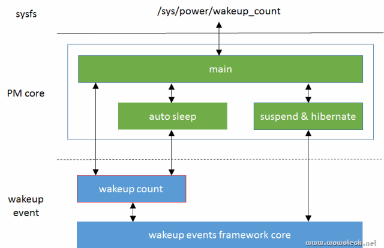

# 概述

Wakeup count 是 Wakeup events framework 的组成部分, 用于解决“system suspend 和 system wakeup events 之间的同步问题”. 本文将结合“Suspend”和“Wakeup events framework”两篇文章, 分析wakeup count的功能、实现逻辑、背后的思考, 同时也是对这两篇文章的复习和总结. 

# wakeup count在电源管理中的位置

wakeup count的实现位于wakeup events framework中(`drivers/base/power/wakeup.c`), 主要为两个模块提供接口: 通过 PM core 向用户空间提供 sysfs 接口；直接向 autosleep(请参考下一篇文章)提供接口. 



# wakeup count的功能

wakeup count 的功能是 suspend 同步, 实现思路是这样的: 

1)任何想发起电源状态切换的**实体**(可以是用户空间电源管理进程, 也可以是内核线程, 简称C), 在发起状态切换前, 读取系统的 wakeup counts(该值记录了当前的 wakeup event 总数), 并将读取的 counts 告知 wakeup events framework. 

2)wakeup events framework 记录该counts到一个全局变量中(saved_count). 

3)随后 C 发起电源状态切换(如STR), 执行 suspend 过程. 

4)在suspend的过程中, wakeup events framework照旧工作(直到系统中断被关闭), 上报 wakeup events, 增加 wakeup events counts. 

5)suspend执行的一些时间点(可参考“Linux电源管理(6)_Generic PM之Suspend功能”), 会调用wakeup  events framework提供的接口(pm_wakeup_pending), 检查是否有wakeup没有处理. 

6)检查逻辑很简单, 就是比较当前的wakeup counts和saved wakeup counts(C发起电源状态切换时的counts), 如果不同, 就要终止suspend过程. 

# wakeup count的实现逻辑

## 一个例子

在进行代码分析之前, 我们先用伪代码的形式, 写出一个利用 wakeup count 进行 suspend 操作的例子, 然后基于该例子, 分析相关的实现. 

```cpp
do {
    ret = read(&cnt, "/sys/power/wakeup_count");
    if (ret) {
        ret = write(cnt, "/sys/power/wakeup_count");
    } else {
        continue;
    }
} while (!ret);

write("mem", "/sys/power/state");

/* goto here after wakeup */
```

例子很简单: 

a)读取 wakeup count 值, 如果成功, 将读取的值回写. 否则说明有正在处理的wakeup events, continue. 

b)回写后, 判断返回值是否成功, 如果不成功(说明读、写的过程中产生了wakeup events), 继续读、写, 直到成功. 成功后, 可以触发电源状态切换. 

## /sys/power/wakeup_count

wakeup_count 文件是在 kernel/power/main.c 中, 利用 power_attr 注册的, 如下(大家可以仔细研读一下那一大段注释, 内核很多注释写的非常好): 

```cpp
#ifdef CONFIG_PM_SLEEP
/*
 * The 'wakeup_count' attribute, along with the functions defined in
 * drivers/base/power/wakeup.c, provides a means by which wakeup events can be
 * handled in a non-racy way.
 *
 * If a wakeup event occurs when the system is in a sleep state, it simply is
 * woken up.  In turn, if an event that would wake the system up from a sleep
 * state occurs when it is undergoing a transition to that sleep state, the
 * transition should be aborted.  Moreover, if such an event occurs when the
 * system is in the working state, an attempt to start a transition to the
 * given sleep state should fail during certain period after the detection of
 * the event.  Using the 'state' attribute alone is not sufficient to satisfy
 * these requirements, because a wakeup event may occur exactly when 'state'
 * is being written to and may be delivered to user space right before it is
 * frozen, so the event will remain only partially processed until the system is
 * woken up by another event.  In particular, it won't cause the transition to
 * a sleep state to be aborted.
 *
 * This difficulty may be overcome if user space uses 'wakeup_count' before
 * writing to 'state'.  It first should read from 'wakeup_count' and store
 * the read value.  Then, after carrying out its own preparations for the system
 * transition to a sleep state, it should write the stored value to
 * 'wakeup_count'.  If that fails, at least one wakeup event has occurred since
 * 'wakeup_count' was read and 'state' should not be written to.  Otherwise, it
 * is allowed to write to 'state', but the transition will be aborted if there
 * are any wakeup events detected after 'wakeup_count' was written to.
 */

static ssize_t wakeup_count_show(struct kobject *kobj,
				struct kobj_attribute *attr,
				char *buf)
{
	unsigned int val;

	return pm_get_wakeup_count(&val, true) ?
		sprintf(buf, "%u\n", val) : -EINTR;
}

static ssize_t wakeup_count_store(struct kobject *kobj,
				struct kobj_attribute *attr,
				const char *buf, size_t n)
{
	unsigned int val;
	int error;

	error = pm_autosleep_lock();
	if (error)
		return error;

	if (pm_autosleep_state() > PM_SUSPEND_ON) {
		error = -EBUSY;
		goto out;
	}

	error = -EINVAL;
	if (sscanf(buf, "%u", &val) == 1) {
		if (pm_save_wakeup_count(val))
			error = n;
		else
			pm_print_active_wakeup_sources();
	}

 out:
	pm_autosleep_unlock();
	return error;
}

power_attr(wakeup_count);
```

实现很简单: read时, 直接调用 `pm_get_wakeup_count`(注意第2个参数)；write 时, 直接调用 `pm_save_wakeup_count`(注意用户空间的 wakeup count 功能和 auto sleep 互斥, 会在下篇文章解释原因). 这两个接口均是wakeup events framework提供的接口, 跟着代码往下看吧. 

## pm_get_wakeup_count

该接口有两个参数, 一个是保存返回的count值得指针, 另一个指示是否block, 具体请参考代码逻辑

```cpp
bool pm_get_wakeup_count(unsigned int *count, bool block)
{
	unsigned int cnt, inpr;

	if (block) {
		DEFINE_WAIT(wait);

		for (;;) {
			prepare_to_wait(&wakeup_count_wait_queue, &wait,
					TASK_INTERRUPTIBLE);
			split_counters(&cnt, &inpr);
			if (inpr == 0 || signal_pending(current))
				break;
			pm_print_active_wakeup_sources();
			schedule();
		}
		finish_wait(&wakeup_count_wait_queue, &wait);
	}

	split_counters(&cnt, &inpr);
	*count = cnt;
	return !inpr;
}
```

第一. 如果block为false, 直接读取registered wakeup events和wakeup events in progress两个counter值, 将registered wakeup events交给第一个参数, 并返回wakeup events in progress的状态(若返回false, 说明当前有wakeup events正在处理, 不适合suspend). 

第二. 如果block为true, 定义一个等待队列, 等待wakeup events in progress为0, 再返回counter. 

注1: 由上面可知, sysfs发起的read动作, block为true, 所以如果有正在处理的wakeup events, read进程会阻塞. 其它模块(如auto sleep)发起的read, 则可能不需要阻塞. 

## pm_save_wakeup_count

pm_save_wakeup_count的实现如下: 

```cpp
// drivers/base/power/wakeup.c
bool pm_save_wakeup_count(unsigned int count)
{
	unsigned int cnt, inpr;
	unsigned long flags;

	events_check_enabled = false;
	raw_spin_lock_irqsave(&events_lock, flags);
	split_counters(&cnt, &inpr);
	if (cnt == count && inpr == 0) {
		saved_count = count;
		events_check_enabled = true;
	}
	raw_spin_unlock_irqrestore(&events_lock, flags);
	return events_check_enabled;
}
```

第一. 注意这个变量, events_check_enabled, 如果它不为真, pm_wakeup_pending接口直接返回false, 意味着如果不利用wakeup count功能, suspend过程中不会做任何wakeup events检查, 也就不会进行任何的同步. 

第二. 解除当前的registered wakeup events、wakeup events in progress, 保存在变量cnt和inpr中. 

第三. 如果写入的值和cnt不同(说明读、写的过程中产生events), 或者inpr不为零(说明有events正在被处理), 返回false(说明此时不宜suspend). 

第四. 否则, events_check_enabled 置位(后续的pm_wakeup_pending才会干活), 返回true(可以suspend), 并将当前的wakeup count保存在saved count变量中. 

## /sys/power/state

之前 suspend 的流程, 在 suspend_enter 接口中, suspend 前的最后一刻, 会调用 `pm_wakeup_pending` 接口, 代码如下

```cpp
// kernel/power/suspend.c
static int suspend_enter(suspend_state_t state, bool *wakeup)
{
    ...
	error = syscore_suspend();
	if (!error) {
		*wakeup = pm_wakeup_pending();
		if (!(suspend_test(TEST_CORE) || *wakeup)) {
			trace_suspend_resume(TPS("machine_suspend"),
				state, true);
			error = suspend_ops->enter(state);
			trace_suspend_resume(TPS("machine_suspend"),
				state, false);
		} else if (*wakeup) {
			error = -EBUSY;
		}
		syscore_resume();
	}
    ...
}
```

在write wakeup_count到调用pm_wakeup_pending这一段时间内, wakeup events framework会照常产生wakeup events, 因此如果pending返回true, 则不能“enter”, 终止suspend吧！

注2: wakeup后, 会清除events_check_enabled标记. 

"Wakeup events framework" 已经介绍过 pm_wakeup_pending 了, 让我们再看一遍吧

结束了, 等待 wakeup