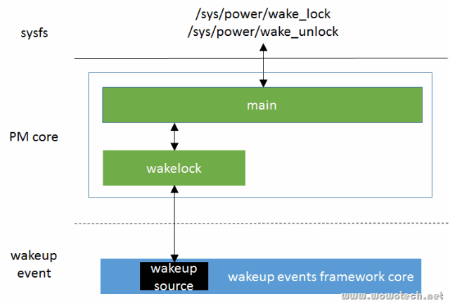

# 概述

wakelocks是一个有故事的功能。

wakelocks最初出现在Android为linux kernel打的一个补丁集上，该补丁集实现了一个名称为“wakelocks”的系统调用，该系统调用允许调用者阻止系统进入低功耗模式（如idle、suspend等）。同时，该补丁集更改了Linux kernel原生的电源管理执行过程（kernel/power/main.c中的state_show和state_store），转而执行自定义的state_show、state_store。

这种做法是相当不规范的，它是典型的只求实现功能，不择手段。就像国内很多的Linux开发团队，要实现某个功能，都不去弄清楚kernel现有的机制、框架，牛逼哄哄的猛干一番。最后功能是实现了，可都不知道重复造了多少轮子，浪费了多少资源。到此打住，Android的开发者不会这么草率，他们推出wakelocks机制一定有一些苦衷，我们就不评论了。

但是，虽然有苦衷，kernel的开发者可是有原则的，死活不让这种机制合并到kernel分支（换谁也不让啊），直到kernel自身的wakeup events framework成熟后，这种僵局才被打破。因为Android开发者想到了一个坏点子：不让合并就不让合并呗，我用你的机制（wakeup source），再实现一个就是了。至此，全新的wakelocks出现了。

所以wakelocks有两个，早期Android版本的wakelocks几乎已经销声匿迹了，不仔细找还真找不到它的source code（这里有一个链接，但愿读者看到时还有效，drivers/android/power.c）。本文不打算翻那本旧黄历，所以就focus在新的wakelocks上（kernel/power/wakelock.c，较新的kernel都支持）。

# Android wakelocks

提一下Android wakelocks的功能，这样才能知道kernel wakelocks要做什么。总的来说，Android wakelocks提供的功能包括：

1）一个sysfs文件：/sys/power/wake_lock，用户程序向文件写入一个字符串，即可创建一个wakelock，该字符串就是wakelock的名字。该wakelock可以阻止系统进入低功耗模式。

2）一个sysfs文件：：/sys/power/wake_unlock，用户程序向文件写入相同的字符串，即可注销一个wakelock。

3）当系统中所有的wakelock都注销后，系统可以自动进入低功耗状态。

4）向内核其它driver也提供了wakelock的创建和注销接口，允许driver创建wakelock以阻止睡眠、注销wakelock以允许睡眠。

有关Android wakelocks更为详细的描述，可以参考下面的一个链接：

http://elinux.org/Android_Power_Management

# Kernel wakelocks

## Kernel wakelocks的功能

对比Android wakelocks要实现的功能，Linux kernel的方案是：

1）允许driver创建wakelock以阻止睡眠、注销wakelock以允许睡眠：已经由“Linux电源管理(7)_Wakeup events framework”所描述的wakeup source取代。

2）当系统中所有的wakelock都注销后，系统可以自动进入低功耗状态：由autosleep实现（下一篇文章会分析）。

3）wake_lock和wake_unlock功能：由本文所描述的kernel wakelocks实现，其本质就是将wakeup source开发到用户空间访问。

## Kernel wakelocks在电源管理中的位置

相比Android wakelocks，Kernel wakelocks的实现非常简单（简单的才是最好的），就是在PM core中增加一个wakelock模块（kernel/power/wakelock.c），该模块依赖wakeup events framework提供的wakeup source机制，实现用户空间的wakeup source（就是wakelocks），并通过PM core main模块，向用户空间提供两个同名的sysfs文件，wake_lock和wake_unlock。



## /sys/power/wake_lock & /sys/power/wake_unlock

从字面意思上，新版的wake_lock和wake_unlock和旧版的一样，都是用于创建和注销wakelock。从应用开发者的角度，确实可以这样理解。但从底层实现的角度，却完全不是一回事。

Android的wakelock，真是一个lock，用户程序创建一个wakelock，就是在系统suspend的路径上加了一把锁，注销就是解开这把锁。直到suspend路径上所有的锁都解开时，系统才可以suspend。

而Kernel的wakelock，是基于wakeup source实现的，因此创建wakelock的本质是在指定的wakeup source上activate一个wakeup event，注销wakelock的本质是deactivate wakeup event。因此，/sys/power/wake_lock和/sys/power/wake_unlock两个sysfs文件的的功能就是：

写wake_lock（以wakelock name和timeout时间<可选>为参数），相当于以wakeup source为参数调用__pm_stay_awake（或者__pm_wakeup_event），即activate wakeup event；

写wake_unlock（以wakelock name为参数），相当于以wakeup source为参数，调用__pm_relax；

读wake_lock，获取系统中所有的处于active状态的wakelock列表（也即wakeup source列表）

读wake_unlock，返回系统中所有的处于非active状态的wakelock信息（也即wakeup source列表）。

注1：上面有关wakeup source的操作接口，可参考“Linux电源管理(7)_Wakeup events framework”。

这两个sysfs文件在kernel/power/main.c中实现，如下：

```cpp
// kernel/power/main.c
#ifdef CONFIG_PM_SLEEP
#ifdef CONFIG_PM_WAKELOCKS
static ssize_t wake_lock_show(struct kobject *kobj,
			      struct kobj_attribute *attr,
			      char *buf)
{
	return pm_show_wakelocks(buf, true);
}

static ssize_t wake_lock_store(struct kobject *kobj,
			       struct kobj_attribute *attr,
			       const char *buf, size_t n)
{
	int error = pm_wake_lock(buf);
	return error ? error : n;
}

power_attr(wake_lock);

static ssize_t wake_unlock_show(struct kobject *kobj,
				struct kobj_attribute *attr,
				char *buf)
{
	return pm_show_wakelocks(buf, false);
}

static ssize_t wake_unlock_store(struct kobject *kobj,
				 struct kobj_attribute *attr,
				 const char *buf, size_t n)
{
	int error = pm_wake_unlock(buf);
	return error ? error : n;
}

power_attr(wake_unlock);

#endif /* CONFIG_PM_WAKELOCKS */
#endif /* CONFIG_PM_SLEEP */
```

1. wakelocks功能不是linux kernel的必选功能，可以通过CONFIG_PM_WAKELOCKS开关。

2. wake_lock的写接口，直接调用pm_wake_lock；wake_unlock的写接口，直接调用pm_wake_unlock；它们的读接口，直接调用pm_show_wakelocks接口（参数不同）。这三个接口均在kernel/power/wakelock.c中实现。

# pm_wake_lock

`pm_wake_lock` 位于 `kernel/power/wakelock.c` 中，用于上报一个wakeup event（从另一个角度，就是阻止系统suspend），代码如下：

```cpp
int pm_wake_lock(const char *buf)
{
	const char *str = buf;
	struct wakelock *wl;
	u64 timeout_ns = 0;
	size_t len;
	int ret = 0;

	if (!capable(CAP_BLOCK_SUSPEND))
		return -EPERM;

	while (*str && !isspace(*str))
		str++;

	len = str - buf;
	if (!len)
		return -EINVAL;

	if (*str && *str != '\n') {
		/* Find out if there's a valid timeout string appended. */
		ret = kstrtou64(skip_spaces(str), 10, &timeout_ns);
		if (ret)
			return -EINVAL;
	}

	mutex_lock(&wakelocks_lock);

	wl = wakelock_lookup_add(buf, len, true);
	if (IS_ERR(wl)) {
		ret = PTR_ERR(wl);
		goto out;
	}
	if (timeout_ns) {
		u64 timeout_ms = timeout_ns + NSEC_PER_MSEC - 1;

		do_div(timeout_ms, NSEC_PER_MSEC);
		__pm_wakeup_event(wl->ws, timeout_ms);
	} else {
		__pm_stay_awake(wl->ws);
	}

	wakelocks_lru_most_recent(wl);

 out:
	mutex_unlock(&wakelocks_lock);
	return ret;
}
```

