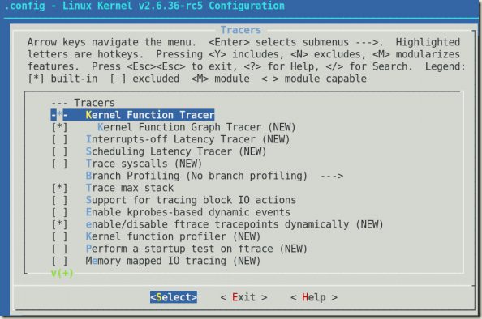
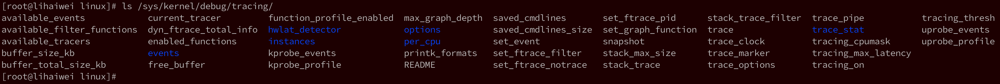

本文探索如何建立ftrace并能理解如何跟踪函数。ftrace对于内核开发者和设备驱动开发者在调试内核问题的时候应该很有用。

# 基本介绍

ftrace（函数跟踪）是内核跟踪的“瑞士军刀”。它是**内建**在**Linux内核**中的一种**跟踪机制**。它能深入内核去发现里面究竟发生了什么，并调试它。

ftrace**不只是一个函数跟踪工具**，它的跟踪能力之强大，还能调试和分析诸如延迟、意外代码路径、性能问题等一大堆问题。它也是一种很好的学习工具。

ftrace是由Steven Rostedy和Ingo Molnar在内核2.6.27版本中引入的。它有自己**存储跟踪数据**的**环形缓冲区**，并使用**GCC配置机制**。

# 预备知识

你需要一台有内核开发环境的32位或者64位Linux机器，内核版本越新越好（内核越新，跟踪选项就越多）。

# 设置ftrace

## 配置debugfs

使用ftrace要求你的机器上配置有debugfs。

debugfs应该被挂载在/sys/kernel/debugfs，如果跟踪选项已启用，你应该能够在debugfs下面看到一个叫tracing的目录。

如果没有挂载debugfs，请按以下操作：

```
# mount -t debugfs nodev /sys/kernel/debug
```

## 

如果你看不到tracing子目录的话，你应该在内核配置上启用相关选项，然后重编译内核。

请在你的内核配置中找到如图所示的选项，启用它们：

Kernel Hacking -> Tracers:

1. Kernel Function Tracer (FUNCTION_TRACER) 
2. Kernel Function Graph Tracer (FUNCTION_GRAPH_TRACER) 
3. Enable/disable ftrace dynamically (DYNAMIC_FTRACE) 
4. Trace max stack (STACK_TRACER)



根据你的架构，在选择上面的选项时，一些其他的选项根据依赖关系可能也会自动被启用。上面所列的选项主要是用于跟踪所用。内核编译完成之后，你只需要重启机器，tracing功能就可以用了。

# 跟踪

tracing目录（`/sys/kernel/debug/tracing`）中的文件（如图2所示）控制着跟踪的能力。根据你在内核配置时的选项的不同，这里列的文件可能稍有差异。你可以在内核源代码目录下/Documentation/trace[1]目录中找到这些文件的信息。



# 参考

https://www.cnblogs.com/jefree/p/4439007.html