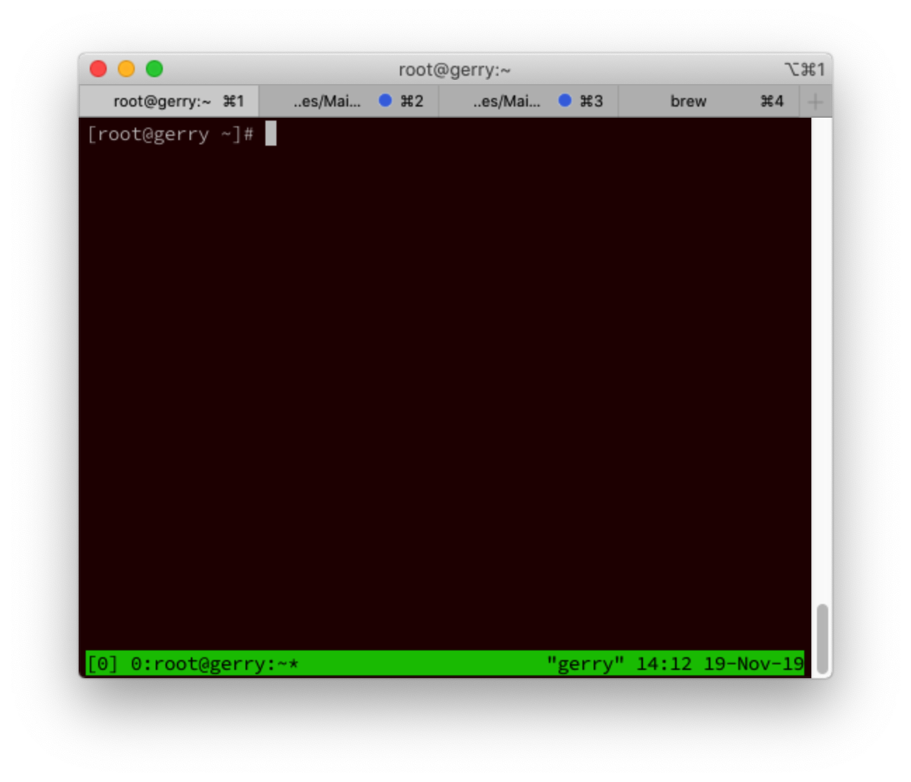

<!-- @import "[TOC]" {cmd="toc" depthFrom=1 depthTo=6 orderedList=false} -->

<!-- code_chunk_output -->

- [1. Tmux 是什么](#1-tmux-是什么)
  - [1.1. 会话与进程](#11-会话与进程)
  - [1.2. Tmux 的作用](#12-tmux-的作用)
- [2. 基本用法](#2-基本用法)
  - [2.1. 安装](#21-安装)
  - [2.2. 启动与退出](#22-启动与退出)
  - [2.3. 前缀键](#23-前缀键)
- [3. 会话管理](#3-会话管理)
  - [3.1. 新建会话](#31-新建会话)
  - [3.2. 分离会话](#32-分离会话)
  - [3.3. 查看会话](#33-查看会话)
  - [3.4. 接入会话](#34-接入会话)
  - [3.5. 杀死会话](#35-杀死会话)
  - [3.6. 切换会话](#36-切换会话)
  - [3.7. 重命名会话](#37-重命名会话)
  - [3.8. 会话快捷键](#38-会话快捷键)
- [4. 最简操作流程](#4-最简操作流程)
- [5. 窗格操作](#5-窗格操作)
  - [5.1. 划分窗格](#51-划分窗格)
  - [5.2. 移动光标](#52-移动光标)
  - [5.3. 交换窗格位置](#53-交换窗格位置)
  - [5.4. 窗格快捷键](#54-窗格快捷键)
- [6. 窗口管理](#6-窗口管理)
  - [6.1. 新建窗口](#61-新建窗口)
  - [6.2. 切换窗口](#62-切换窗口)
  - [6.3. 重命名窗口](#63-重命名窗口)
  - [6.4. 窗口快捷键](#64-窗口快捷键)
- [7. 其他命令](#7-其他命令)
- [插件管理系统](#插件管理系统)
  - [下载和安装](#下载和安装)
- [会话保存功能](#会话保存功能)
- [8. 参考](#8-参考)

<!-- /code_chunk_output -->

# 1. Tmux 是什么

## 1.1. 会话与进程

命令行的典型使用方式是，打开一个终端窗口（terminal window，以下简称"窗口"），在里面输入命令。用户与计算机的这种临时的交互，称为一次"会话"（session） 。

会话的一个重要特点是，**窗口**与**其中启动的进程**是**连在一起**的。

* 打开窗口，会话开始；
* 关闭窗口，会话结束，会话内部的进程也会随之终止，不管有没有运行完。

一个典型的例子就是，SSH 登录远程计算机，打开一个远程窗口执行命令。这时，网络突然断线，再次登录的时候，是找不回上一次执行的命令的。因为上一次 SSH 会话已经终止了，里面的进程也随之消失了。

为了解决这个问题，**会话**与**窗口**可以"**解绑**"：窗口关闭时，会话并不终止，而是继续运行，等到以后需要的时候，再让会话"绑定"其他窗口。

## 1.2. Tmux 的作用

Tmux 就是会话与窗口的"解绑"工具，将它们彻底分离。

（1）它允许在**单个窗口**中，同时访问**多个会话**。这对于同时运行多个命令行程序很有用。

（2） 它可以让**新窗口**"接入"**已经存在的会话**。

（3）它允许**每个会话**有**多个连接窗口**，因此可以多人**实时共享会话**。

（4）它还支持**窗口任意的垂直和水平拆分**。

类似的终端复用器还有 **GNU Screen**。Tmux 与它功能相似，但是更易用，也更强大。

# 2. 基本用法

## 2.1. 安装

Tmux 一般需要自己安装。

```
# Ubuntu 或 Debian
$ sudo apt-get install tmux

# CentOS 或 Fedora
$ sudo yum install tmux

# Mac
$ brew install tmux
```

## 2.2. 启动与退出

安装完成后，键入tmux命令，就进入了 Tmux 窗口。

```
$ tmux
```

上面命令会启动 Tmux 窗口，**底部有一个状态栏**。

状态栏的**左侧**是**窗口信息**（编号和名称），**右侧**是**系统信息**。



按下Ctrl+d或者显式输入exit命令，就可以退出 Tmux 窗口。

## 2.3. 前缀键

Tmux 窗口有大量的快捷键。所有快捷键都要通过前缀键唤起。**默认的前缀键**是**Ctrl+b**，即先按下Ctrl+b，快捷键才会生效。

举例来说，帮助命令的快捷键是Ctrl+b ?。它的用法是，在 Tmux 窗口中，先按下Ctrl+b，再按下?，就会显示帮助信息。

然后，按下 ESC 键或q键，就可以退出帮助。

# 3. 会话管理

## 3.1. 新建会话

第一个启动的 Tmux 窗口，编号是0，第二个窗口的编号是1，以此类推。这些窗口对应的会话，就是 0 号会话、1 号会话。

使用编号区分会话，不太直观，更好的方法是为会话起名。

```
$ tmux new -s <session-name>
```

上面命令新建一个指定名称的会话。

## 3.2. 分离会话

在 Tmux 窗口中，按下Ctrl+b d或者输入tmux detach命令，就会将当前会话与窗口分离。

```
$ tmux detach
```

上面命令执行后，就会退出当前 Tmux 窗口，但是会话和里面的进程仍然在后台运行。

## 3.3. 查看会话

tmux ls命令可以查看当前所有的 Tmux 会话。

```
$ tmux ls
# or
$ tmux list-session
```

## 3.4. 接入会话

tmux attach命令用于重新接入某个已存在的会话。

```
# 使用会话编号
$ tmux attach -t 0

# 使用会话名称
$ tmux attach -t <session-name>
```

## 3.5. 杀死会话

tmux kill-session命令用于杀死某个会话。

```
# 使用会话编号
$ tmux kill-session -t 0

# 使用会话名称
$ tmux kill-session -t <session-name>
```

## 3.6. 切换会话

tmux switch命令用于切换会话。

```
# 使用会话编号
$ tmux switch -t 0

# 使用会话名称
$ tmux switch -t <session-name>
```

## 3.7. 重命名会话
tmux rename-session命令用于重命名会话。

```
$ tmux rename-session -t 0 <new-name>
```

上面命令将0号会话重命名。

## 3.8. 会话快捷键

下面是一些会话相关的快捷键。

```
Ctrl+b d：分离当前会话。
Ctrl+b s：列出所有会话。
Ctrl+b $：重命名当前会话。
```

# 4. 最简操作流程

综上所述，以下是 Tmux 的最简操作流程。

1. 新建会话tmux new -s my_session。
2. 在 Tmux 窗口运行所需的程序。
3. 按下快捷键Ctrl+b d将会话分离。
4. 下次使用时，重新连接到会话tmux attach-session -t my_session。

# 5. 窗格操作

Tmux 可以将窗口分成多个窗格（pane），每个窗格运行不同的命令。

以下命令都是在 **Tmux 窗口**中执行。

## 5.1. 划分窗格

tmux split-window命令用来划分窗格。

```
# 划分上下两个窗格
$ tmux split-window

# 划分左右两个窗格
$ tmux split-window -h
```

## 5.2. 移动光标

tmux select\-pane命令用来移动光标位置。

```
# 光标切换到上方窗格
$ tmux select-pane -U

# 光标切换到下方窗格
$ tmux select-pane -D

# 光标切换到左边窗格
$ tmux select-pane -L

# 光标切换到右边窗格
$ tmux select-pane -R
```

## 5.3. 交换窗格位置

tmux swap\-pane命令用来交换窗格位置。

```
# 当前窗格上移
$ tmux swap-pane -U

# 当前窗格下移
$ tmux swap-pane -D
```

## 5.4. 窗格快捷键

下面是一些窗格操作的快捷键。

```
Ctrl+b %：划分左右两个窗格。
Ctrl+b "：划分上下两个窗格。
Ctrl+b <arrow key>：光标切换到其他窗格。<arrow key>是指向要切换到的窗格的方向键，比如切换到下方窗格，就按方向键↓。
Ctrl+b ;：光标切换到上一个窗格。
Ctrl+b o：光标切换到下一个窗格。
Ctrl+b {：当前窗格左移。
Ctrl+b }：当前窗格右移。
Ctrl+b Ctrl+o：当前窗格上移。
Ctrl+b Alt+o：当前窗格下移。
Ctrl+b x：关闭当前窗格。
Ctrl+b !：将当前窗格拆分为一个独立窗口。
Ctrl+b z：当前窗格全屏显示，再使用一次会变回原来大小。
Ctrl+b Ctrl+<arrow key>：按箭头方向调整窗格大小。
Ctrl+b q：显示窗格编号。
```

# 6. 窗口管理

除了将一个窗口划分成多个窗格，Tmux 也允许新建多个窗口。

## 6.1. 新建窗口

tmux new\-window命令用来创建新窗口。

```
$ tmux new-window

# 新建一个指定名称的窗口
$ tmux new-window -n <window-name>
```

## 6.2. 切换窗口

tmux select\-window命令用来切换窗口。

```
# 切换到指定编号的窗口
$ tmux select-window -t <window-number>

# 切换到指定名称的窗口
$ tmux select-window -t <window-name>
```

## 6.3. 重命名窗口

tmux rename\-window命令用于为当前窗口起名（或重命名）。

```
$ tmux rename-window <new-name>
```

## 6.4. 窗口快捷键

下面是一些窗口操作的快捷键。

```
Ctrl+b c：创建一个新窗口，状态栏会显示多个窗口的信息。
Ctrl+b p：切换到上一个窗口（按照状态栏上的顺序）。
Ctrl+b n：切换到下一个窗口。
Ctrl+b <number>：切换到指定编号的窗口，其中的<number>是状态栏上的窗口编号。
Ctrl+b w：从列表中选择窗口。
Ctrl+b ,：窗口重命名。
```

# 7. 其他命令
下面是一些其他命令。

```
# 列出所有快捷键，及其对应的 Tmux 命令
$ tmux list-keys

# 列出所有 Tmux 命令及其参数
$ tmux list-commands

# 列出当前所有 Tmux 会话的信息
$ tmux info

# 重新加载当前的 Tmux 配置
$ tmux source-file ~/.tmux.conf
```

# 插件管理系统

Tmux 也有一个插件管理系统，名字就叫做 `Tmux Plugin Manager`。

## 下载和安装

`Tmux Plugin Manager`托管在GitHub上, 地址: https://github.com/tmux-plugins/tpm .

```

```

# 会话保存功能

Tmux一个缺点, Tmux 会话无法在系统重启之后比较容易地恢复。

为了解决这个问题，我们需要用到 Tmux 的插件系统，并安装名为 `tmux-resurrect` 的插件。


# 8. 参考

* 阮一峰分享: https://www.ruanyifeng.com/blog/2019/10/tmux.html
* [A Quick and Easy Guide to tmux](https://www.hamvocke.com/blog/a-quick-and-easy-guide-to-tmux/)
* [Tactical tmux: The 10 Most Important Commands](https://danielmiessler.com/study/tmux/)
* [Getting started with Tmux](https://linuxize.com/post/getting-started-with-tmux/)