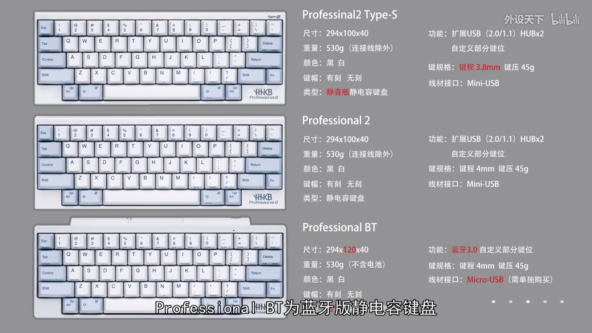

<!-- @import "[TOC]" {cmd="toc" depthFrom=1 depthTo=6 orderedList=false} -->

<!-- code_chunk_output -->

- [0 概述](#0-概述)
- [1 HHKB Professional 2](#1-hhkb-professional-2)
- [2 HHKB Professional 2 Type\-S](#2-hhkb-professional-2-type-s)
- [3 HHKB Professional BT](#3-hhkb-professional-bt)
- [4 参考](#4-参考)

<!-- /code_chunk_output -->

# 0 概述

HHKB 全称 Happy Hacking Keyboard ，于 1996 年 12 月 20 日诞生于日本，由和田英一教授和株式会社 PFU 共同开发。

HHKB键盘大体分为HHKB 、 HHKB Lite 、HKKB Lite 2 、 HHKB Lite 2 for Mac 、 HHKB Professional 、 HHKB Professional 2 、 HHKB Professional JP 、 HHKB Professional 2 Type-s 、HHKB Professional BT九大系列; 具体到系列内，有的键帽有刻印，有的键帽无刻印; 有的键盘是白色，有的键盘是黑色; 有的是日本版，有的是北美版。目前在国行市面上销售的主要有三款，分别是HHKB Professional 2、HHKB Professional 2 Type-S、HHKB Professional BT。

注意: 只有Type\-S是静电版本的

# 1 HHKB Professional 2

HHKB Professional 2是HHKB最为经典的型号，独特紧凑的60%布局，灰白+灰蓝的配色看起来小巧精悍。

HHKB Professional 2的键帽为PBT材质，此种材质寿命长久且不易打油，寿命与手感兼备。印刷字符采用的是现在最为先进的热升华浸染工艺，字符不脱落，表面平整干爽，搭配静电容无触点结构、超短键程、轻盈手感、寿命长等特点，对于经常码字的用户绝对是天大的福音。HHKB的强大，还在于它的灵活性，键盘还提供6个DIP开关，通过这些开关的组合，你可以交换键盘上一些键的位置，或者是改变某些键的功能，让其可以适应与不同的操作系统。通过DIP开关的组合设置，可以让HHKB工作在Windows/Linux/Mac OS下，这也是一般的键盘所不具备的功能。

# 2 HHKB Professional 2 Type\-S

HHKB Professional 2 Type-S可以说是HHKB Professional 2的静音版，在外观上几乎没有改变，仅在右上角多了Type-S的LOGO。

手感方面HHKB Professional 2 Type-S更加轻盈，触发也更快。键程从4mm压缩3.8mm，而且官方号称静音效果能减弱30%的敲击声响。通过官方介绍，HHKB Professional 2 Type-S是通关缓冲胶垫来达到静音和缩短键程效果，所以在手感上可能没有那么的原汁原味，但是对于效率的提升以及拥有显著的静音功能致使它是目前最为热销的系列。

# 3 HHKB Professional BT

HHKB Professional BT是HHKB第一款无线产品，并且同样兼容全平台，可以说这把键盘是工匠精神与现代科技的结合。值得一提的是，也许是为了证明HHKB Professional BT蓝牙无线静电电容键盘划时代的意义，HHKB在Professional BT蓝牙无线静电电容键盘上启用了全新的包装风格。

HHKB Professional BT外观依旧是延续其经典的按键布局，共推出了黑有刻、黑无刻、白有刻、白无刻四种不同配色，用户可以根据个人需求进行选择。

与以往系列的静电容键盘不同的是HHKB Professional BT在上边缘位置设计了圆柱形的电池仓，采用AA电池进行供电，虽然看起来有点落伍，但与内置锂电池的设计相比，续航时间大幅延长，即便偶尔遇到电池没电也可以通过更换电池来快速解决。

HHKB Professional BT的按键行程同HHKB Professional 2，为4.0mm，手感也相同。可以说HHKB Professional BT就是蓝牙版的HHKB Professional 2。

# 4 参考

https://www.wstx.com/p-24109